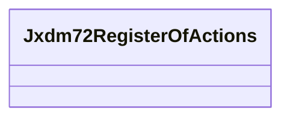

# Class: No class name specified (jxdm72_RegisterOfActions)


_No class (type) description specified_


URI: [jxdm72:RegisterOfActions](http://release.niem.gov/niem/domains/jxdm/7.2/#RegisterOfActions)





<!-- no inheritance hierarchy -->


## Slots

| Name | Cardinality and Range | Description | Inheritance |
| ---  | --- | --- | --- |


## Usages

| used by | used in | type | used |
| ---  | --- | --- | --- |
| [Jxdm72Case](../classes/Jxdm72Case.md) | [Jxdm72RegisterOfActions](../classes/Jxdm72RegisterOfActions.md) | any_of[range] | [Jxdm72RegisterOfActions](../classes/Jxdm72RegisterOfActions.md) |
| [ScalesCase](../classes/ScalesCase.md) | [Jxdm72RegisterOfActions](../classes/Jxdm72RegisterOfActions.md) | any_of[range] | [Jxdm72RegisterOfActions](../classes/Jxdm72RegisterOfActions.md) |


## Examples

| Value |
| --- |
| scales/DocketTable/DocketTable/ga-fulton-01-100271 |


## Identifier and Mapping Information


## Mappings

| Mapping Type | Mapped Value |
| ---  | ---  |
| self | jxdm72:RegisterOfActions |
| native | scales-kg-new/:Jxdm72RegisterOfActions |


## LinkML Source

<!-- TODO: investigate https://stackoverflow.com/questions/37606292/how-to-create-tabbed-code-blocks-in-mkdocs-or-sphinx -->

### Direct

<details>

```yaml
name: jxdm72_RegisterOfActions
conforms_to: No schema conformance document specified
description: No class (type) description specified
title: No class name specified
notes:
- Class with 94929 occurrences.
examples:
- value: scales/DocketTable/DocketTable/ga-fulton-01-100271
rank: 1000
class_uri: jxdm72:RegisterOfActions

```
</details>

### Induced

<details>

```yaml
name: jxdm72_RegisterOfActions
conforms_to: No schema conformance document specified
description: No class (type) description specified
title: No class name specified
notes:
- Class with 94929 occurrences.
examples:
- value: scales/DocketTable/DocketTable/ga-fulton-01-100271
rank: 1000
class_uri: jxdm72:RegisterOfActions

```
</details>