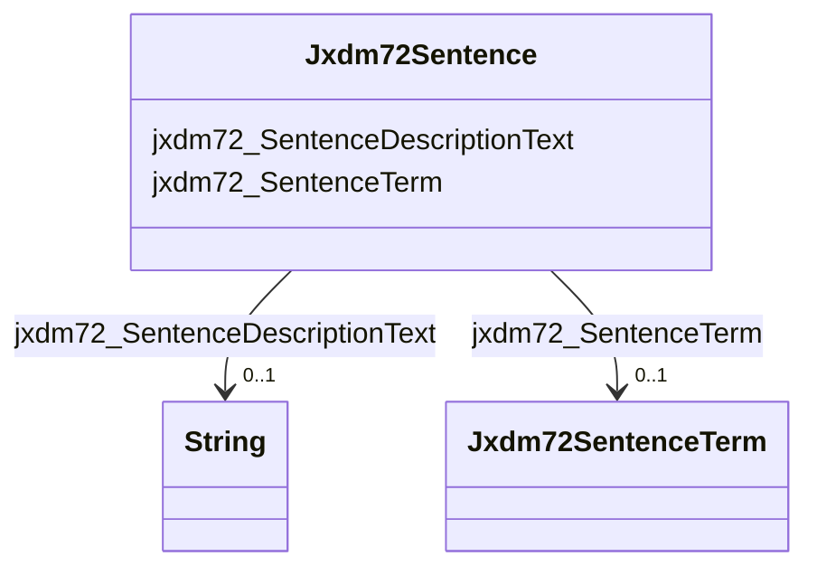

# Class: Jxdm72Sentence


This class occurs 356094 times.


URI: [jxdm72:Sentence](http://release.niem.gov/niem/domains/jxdm/7.2/Sentence)





<!-- no inheritance hierarchy -->


## Slots

| Name | Cardinality and Range | Description | Inheritance | Occurrences |
| ---  | --- | --- | --- | --- |
| [jxdm72_SentenceDescriptionText](../slots/jxdm72_SentenceDescriptionText.md) | 0..1 <br/> [xsd:string](http://www.w3.org/2001/XMLSchema#string) |  <br/>  | direct | 356094 |
| [jxdm72_SentenceTerm](../slots/jxdm72_SentenceTerm.md) | 0..1 <br/> [Jxdm72SentenceTerm](../classes/Jxdm72SentenceTerm.md) |  <br/>  | direct | 356094 |


## Usages

| used by | used in | type | used |
| ---  | --- | --- | --- |
| [Jxdm72Charge](../classes/Jxdm72Charge.md) | [jxdm72_ChargeSentence](../slots/jxdm72_ChargeSentence.md) | range | [Jxdm72Sentence](../classes/Jxdm72Sentence.md) |
| [Jxdm72RegisterAction](../classes/Jxdm72RegisterAction.md) | [Jxdm72Sentence](../classes/Jxdm72Sentence.md) | range | [Jxdm72Sentence](../classes/Jxdm72Sentence.md) |
| [ScalesParty](../classes/ScalesParty.md) | [Jxdm72Sentence](../classes/Jxdm72Sentence.md) | range | [Jxdm72Sentence](../classes/Jxdm72Sentence.md) |


## LinkML Source

<!-- TODO: investigate https://stackoverflow.com/questions/37606292/how-to-create-tabbed-code-blocks-in-mkdocs-or-sphinx -->

### Direct

<details>

```yaml
name: jxdm72_Sentence
from_schema: okns:scales-kg
rank: 1000
slots:
- jxdm72_SentenceDescriptionText
- jxdm72_SentenceTerm
class_uri: jxdm72:Sentence

```
</details>

### Induced

<details>

```yaml
name: jxdm72_Sentence
from_schema: okns:scales-kg
rank: 1000
attributes:
  jxdm72_SentenceDescriptionText:
    name: jxdm72_SentenceDescriptionText
    from_schema: okns:scales-kg
    rank: 1000
    slot_uri: jxdm72:SentenceDescriptionText
    alias: jxdm72_SentenceDescriptionText
    owner: jxdm72_Sentence
    domain_of:
    - jxdm72_Sentence
    range: string
  jxdm72_SentenceTerm:
    name: jxdm72_SentenceTerm
    from_schema: okns:scales-kg
    rank: 1000
    slot_uri: jxdm72:SentenceTerm
    alias: jxdm72_SentenceTerm
    owner: jxdm72_Sentence
    domain_of:
    - jxdm72_Sentence
    range: jxdm72_SentenceTerm
class_uri: jxdm72:Sentence

```
</details>