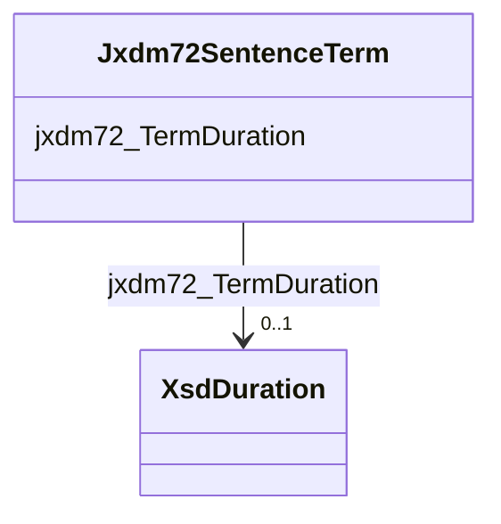

# Class: Jxdm72SentenceTerm


This class occurs 462 times.


URI: [jxdm72:SentenceTerm](http://release.niem.gov/niem/domains/jxdm/7.2/SentenceTerm)





<!-- no inheritance hierarchy -->


## Slots

| Name | Cardinality and Range | Description | Inheritance | Occurrences |
| ---  | --- | --- | --- | --- |
| [jxdm72_TermDuration](../slots/jxdm72_TermDuration.md) | 0..1 <br/> [XsdDuration](../classes/XsdDuration.md) |  <br/>  | direct | 462 |


## Usages

| used by | used in | type | used |
| ---  | --- | --- | --- |
| [Jxdm72Sentence](../classes/Jxdm72Sentence.md) | [Jxdm72SentenceTerm](../classes/Jxdm72SentenceTerm.md) | range | [Jxdm72SentenceTerm](../classes/Jxdm72SentenceTerm.md) |


## LinkML Source

<!-- TODO: investigate https://stackoverflow.com/questions/37606292/how-to-create-tabbed-code-blocks-in-mkdocs-or-sphinx -->

### Direct

<details>

```yaml
name: jxdm72_SentenceTerm
from_schema: okns:scales-kg
rank: 1000
slots:
- jxdm72_TermDuration
class_uri: jxdm72:SentenceTerm

```
</details>

### Induced

<details>

```yaml
name: jxdm72_SentenceTerm
from_schema: okns:scales-kg
rank: 1000
attributes:
  jxdm72_TermDuration:
    name: jxdm72_TermDuration
    from_schema: okns:scales-kg
    rank: 1000
    slot_uri: jxdm72:TermDuration
    alias: jxdm72_TermDuration
    owner: jxdm72_SentenceTerm
    domain_of:
    - jxdm72_SentenceTerm
    range: xsd_duration
class_uri: jxdm72:SentenceTerm

```
</details>