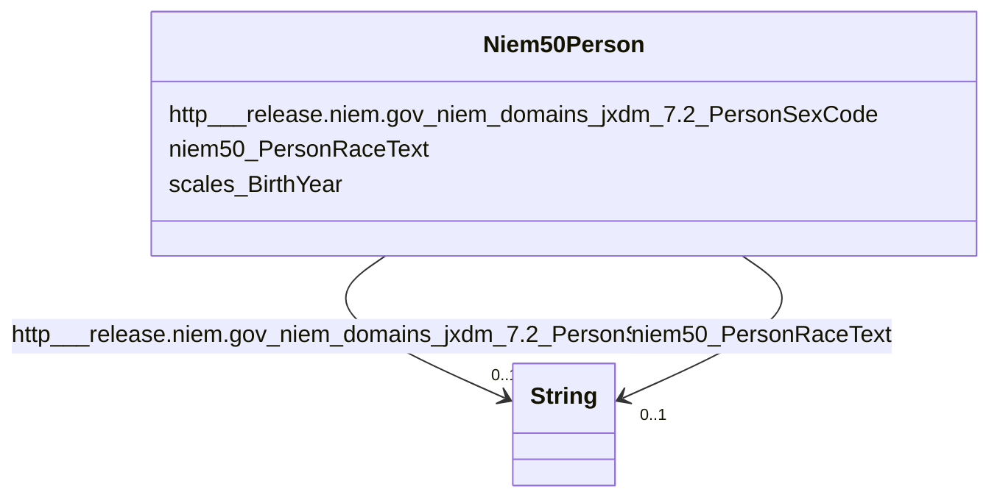

# Class: No class (type) name specified (niem50_Person)


_No class (type) description specified_


This class occurs 83347 times.


URI: [niem50:Person](http://release.niem.gov/niem/niem-core/5.0/Person)





<!-- no inheritance hierarchy -->


## Slots

| Name | Cardinality and Range | Description | Inheritance | Occurrences |
| ---  | --- | --- | --- | --- |
| [niem50_PersonRaceText](../slots/niem50_PersonRaceText.md) | 0..1 <br/> [xsd:string](http://www.w3.org/2001/XMLSchema#string) | No slot (predicate) description specified <br/>  | direct | 83436 |
| [scales_BirthYear](../slots/scales_BirthYear.md) | 0..1 <br/> [XsdGYear](../types/XsdGYear.md) | No slot (predicate) description specified <br/>  | direct | 91623 |
| [http___release.niem.gov_niem_domains_jxdm_7.2_PersonSexCode](../slots/http___release.niem.gov_niem_domains_jxdm_7.2_PersonSexCode.md) | 0..1 <br/> [xsd:string](http://www.w3.org/2001/XMLSchema#string) | No slot (predicate) description specified <br/>  | direct | 85487 |


## Usages

| used by | used in | type | used |
| ---  | --- | --- | --- |
| [HttpRelease.niem.govNiemDomainsJxdm7.2Arrest](../classes/HttpRelease.niem.govNiemDomainsJxdm7.2Arrest.md) | [http___release.niem.gov_niem_domains_jxdm_7.2_ArrestSubject](../slots/http___release.niem.gov_niem_domains_jxdm_7.2_ArrestSubject.md) | range | [Niem50Person](../classes/Niem50Person.md) |


## LinkML Source

<!-- TODO: investigate https://stackoverflow.com/questions/37606292/how-to-create-tabbed-code-blocks-in-mkdocs-or-sphinx -->

### Direct

<details>

```yaml
name: niem50_Person
conforms_to: No schema conformance document specified
annotations:
  count:
    tag: count
    value: 83347
description: No class (type) description specified
title: No class (type) name specified
from_schema: scales-kg
rank: 1000
slots:
- niem50_PersonRaceText
- scales_BirthYear
- http___release.niem.gov_niem_domains_jxdm_7.2_PersonSexCode
slot_usage:
  http___release.niem.gov_niem_domains_jxdm_7.2_PersonSexCode:
    name: http___release.niem.gov_niem_domains_jxdm_7.2_PersonSexCode
    annotations:
      string:
        tag: string
        value: 85487
  niem50_PersonRaceText:
    name: niem50_PersonRaceText
    annotations:
      string:
        tag: string
        value: 83436
  scales_BirthYear:
    name: scales_BirthYear
    annotations:
      xsd_gYear:
        tag: xsd_gYear
        value: 91623
class_uri: niem50:Person

```
</details>

### Induced

<details>

```yaml
name: niem50_Person
conforms_to: No schema conformance document specified
annotations:
  count:
    tag: count
    value: 83347
description: No class (type) description specified
title: No class (type) name specified
from_schema: scales-kg
rank: 1000
slot_usage:
  http___release.niem.gov_niem_domains_jxdm_7.2_PersonSexCode:
    name: http___release.niem.gov_niem_domains_jxdm_7.2_PersonSexCode
    annotations:
      string:
        tag: string
        value: 85487
  niem50_PersonRaceText:
    name: niem50_PersonRaceText
    annotations:
      string:
        tag: string
        value: 83436
  scales_BirthYear:
    name: scales_BirthYear
    annotations:
      xsd_gYear:
        tag: xsd_gYear
        value: 91623
attributes:
  niem50_PersonRaceText:
    name: niem50_PersonRaceText
    annotations:
      string:
        tag: string
        value: 83436
    description: No slot (predicate) description specified
    examples:
    - object:
        example_object: White
        example_object_type: string
        example_predicate: niem50:PersonRaceText
        example_subject: scales:/JudgeEntity/SJ000002
        example_subject_type: http___release.niem.gov_niem_domains_jxdm_7.2_Judge
    - object:
        example_object: B
        example_object_type: string
        example_predicate: niem50:PersonRaceText
        example_subject: scales:Agent/ga-fulton-01/10000019
        example_subject_type: http___release.niem.gov_niem_domains_jxdm_7.2_CaseDefendantParty
    - object:
        example_object: B
        example_object_type: string
        example_predicate: niem50:PersonRaceText
        example_subject: scales:ArrestSubject/ga-atlanta-pd-100720495
        example_subject_type: niem50_Person
    from_schema: scales-kg
    rank: 1000
    slot_uri: niem50:PersonRaceText
    alias: niem50_PersonRaceText
    owner: niem50_Person
    domain_of:
    - http___release.niem.gov_niem_domains_jxdm_7.2_CaseDefendantParty
    - http___release.niem.gov_niem_domains_jxdm_7.2_Judge
    - niem50_Person
    range: string
  scales_BirthYear:
    name: scales_BirthYear
    annotations:
      xsd_gYear:
        tag: xsd_gYear
        value: 91623
    description: No slot (predicate) description specified
    examples:
    - object:
        example_object: '1975'
        example_object_type: xsd_gYear
        example_predicate: scales:BirthYear
        example_subject: scales:ArrestSubject/ga-atlanta-pd-100720495
        example_subject_type: niem50_Person
    from_schema: scales-kg
    rank: 1000
    slot_uri: scales:BirthYear
    alias: scales_BirthYear
    owner: niem50_Person
    domain_of:
    - niem50_Person
    range: xsd_gYear
  http___release.niem.gov_niem_domains_jxdm_7.2_PersonSexCode:
    name: http___release.niem.gov_niem_domains_jxdm_7.2_PersonSexCode
    annotations:
      string:
        tag: string
        value: 85487
    description: No slot (predicate) description specified
    examples:
    - object:
        example_object: 'M '
        example_object_type: string
        example_predicate: http://release.niem.gov/niem/domains/jxdm/7.2/PersonSexCode
        example_subject: scales:Agent/ga-fulton-01/10000019
        example_subject_type: http___release.niem.gov_niem_domains_jxdm_7.2_CaseDefendantParty
    - object:
        example_object: M
        example_object_type: string
        example_predicate: http://release.niem.gov/niem/domains/jxdm/7.2/PersonSexCode
        example_subject: scales:ArrestSubject/ga-atlanta-pd-100720495
        example_subject_type: niem50_Person
    from_schema: scales-kg
    rank: 1000
    slot_uri: http://release.niem.gov/niem/domains/jxdm/7.2/PersonSexCode
    alias: http___release.niem.gov_niem_domains_jxdm_7.2_PersonSexCode
    owner: niem50_Person
    domain_of:
    - http___release.niem.gov_niem_domains_jxdm_7.2_CaseDefendantParty
    - niem50_Person
    range: string
class_uri: niem50:Person

```
</details>