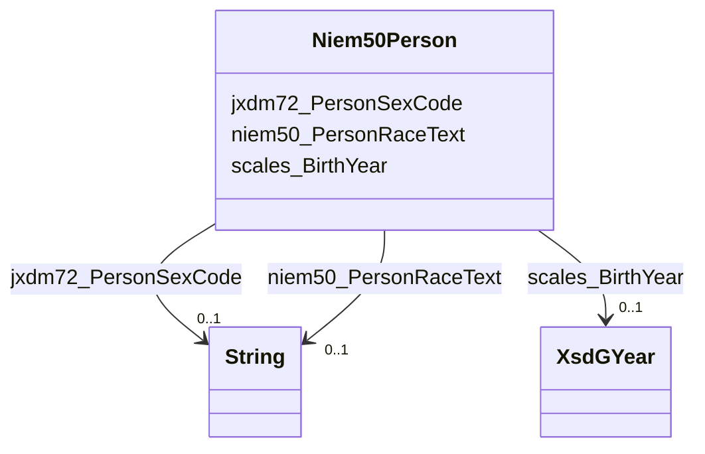

# Class: Niem50Person


This class occurs 137904 times.


URI: [niem50:Person](http://release.niem.gov/niem/niem-core/5.0/Person)





<!-- no inheritance hierarchy -->


## Slots

| Name | Cardinality and Range | Description | Inheritance | Occurrences |
| ---  | --- | --- | --- | --- |
| [niem50_PersonRaceText](../slots/niem50_PersonRaceText.md) | 0..1 <br/> [xsd:string](http://www.w3.org/2001/XMLSchema#string) |  <br/>  | direct | 137021 |
| [scales_BirthYear](../slots/scales_BirthYear.md) | 0..1 <br/> [XsdGYear](../classes/XsdGYear.md) |  <br/>  | direct | 137257 |
| [jxdm72_PersonSexCode](../slots/jxdm72_PersonSexCode.md) | 0..1 <br/> [xsd:string](http://www.w3.org/2001/XMLSchema#string) |  <br/>  | direct | 137002 |


## LinkML Source

<!-- TODO: investigate https://stackoverflow.com/questions/37606292/how-to-create-tabbed-code-blocks-in-mkdocs-or-sphinx -->

### Direct

<details>

```yaml
name: niem50_Person
from_schema: okns:scales-kg
rank: 1000
slots:
- niem50_PersonRaceText
- scales_BirthYear
- jxdm72_PersonSexCode
class_uri: niem50:Person

```
</details>

### Induced

<details>

```yaml
name: niem50_Person
from_schema: okns:scales-kg
rank: 1000
attributes:
  niem50_PersonRaceText:
    name: niem50_PersonRaceText
    from_schema: okns:scales-kg
    rank: 1000
    slot_uri: niem50:PersonRaceText
    alias: niem50_PersonRaceText
    owner: niem50_Person
    domain_of:
    - jxdm72_CaseDefendantParty
    - jxdm72_Judge
    - niem50_Person
    range: string
  scales_BirthYear:
    name: scales_BirthYear
    from_schema: okns:scales-kg
    rank: 1000
    slot_uri: scales:BirthYear
    alias: scales_BirthYear
    owner: niem50_Person
    domain_of:
    - niem50_Person
    range: xsd_gYear
  jxdm72_PersonSexCode:
    name: jxdm72_PersonSexCode
    from_schema: okns:scales-kg
    rank: 1000
    slot_uri: jxdm72:PersonSexCode
    alias: jxdm72_PersonSexCode
    owner: niem50_Person
    domain_of:
    - jxdm72_CaseDefendantParty
    - niem50_Person
    range: string
class_uri: niem50:Person

```
</details>