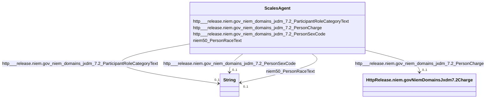

# Class: No class (type) name specified (scales_Agent)


_No class (type) description specified_


This class occurs 363466 times.


URI: [scales:Agent](http://schemas.scales-okn.org/rdf/scales#Agent)





<!-- no inheritance hierarchy -->


## Slots

| Name | Cardinality and Range | Description | Inheritance | Occurrences |
| ---  | --- | --- | --- | --- |
| [http___release.niem.gov_niem_domains_jxdm_7.2_PersonCharge](../slots/http___release.niem.gov_niem_domains_jxdm_7.2_PersonCharge.md) | 0..1 <br/> [HttpRelease.niem.govNiemDomainsJxdm7.2Charge](../classes/HttpRelease.niem.govNiemDomainsJxdm7.2Charge.md) | No slot (predicate) description specified <br/>  | direct | 363466 |
| [http___release.niem.gov_niem_domains_jxdm_7.2_PersonSexCode](../slots/http___release.niem.gov_niem_domains_jxdm_7.2_PersonSexCode.md) | 0..1 <br/> [xsd:string](http://www.w3.org/2001/XMLSchema#string) | No slot (predicate) description specified <br/>  | direct | 363445 |
| [niem50_PersonRaceText](../slots/niem50_PersonRaceText.md) | 0..1 <br/> [xsd:string](http://www.w3.org/2001/XMLSchema#string) | No slot (predicate) description specified <br/>  | direct | 363414 |
| [http___release.niem.gov_niem_domains_jxdm_7.2_ParticipantRoleCategoryText](../slots/http___release.niem.gov_niem_domains_jxdm_7.2_ParticipantRoleCategoryText.md) | 0..1 <br/> [xsd:string](http://www.w3.org/2001/XMLSchema#string) | No slot (predicate) description specified <br/>  | direct | 363466 |


## LinkML Source

<!-- TODO: investigate https://stackoverflow.com/questions/37606292/how-to-create-tabbed-code-blocks-in-mkdocs-or-sphinx -->

### Direct

<details>

```yaml
name: scales_Agent
conforms_to: No schema conformance document specified
annotations:
  count:
    tag: count
    value: 363466
description: No class (type) description specified
title: No class (type) name specified
from_schema: scales-kg
rank: 1000
slots:
- http___release.niem.gov_niem_domains_jxdm_7.2_PersonCharge
- http___release.niem.gov_niem_domains_jxdm_7.2_PersonSexCode
- niem50_PersonRaceText
- http___release.niem.gov_niem_domains_jxdm_7.2_ParticipantRoleCategoryText
slot_usage:
  http___release.niem.gov_niem_domains_jxdm_7.2_ParticipantRoleCategoryText:
    name: http___release.niem.gov_niem_domains_jxdm_7.2_ParticipantRoleCategoryText
    annotations:
      string:
        tag: string
        value: 363466
  http___release.niem.gov_niem_domains_jxdm_7.2_PersonCharge:
    name: http___release.niem.gov_niem_domains_jxdm_7.2_PersonCharge
    annotations:
      http___release.niem.gov_niem_domains_jxdm_7.2_Charge:
        tag: http___release.niem.gov_niem_domains_jxdm_7.2_Charge
        value: 363466
  http___release.niem.gov_niem_domains_jxdm_7.2_PersonSexCode:
    name: http___release.niem.gov_niem_domains_jxdm_7.2_PersonSexCode
    annotations:
      string:
        tag: string
        value: 363445
  niem50_PersonRaceText:
    name: niem50_PersonRaceText
    annotations:
      string:
        tag: string
        value: 363414
class_uri: scales:Agent

```
</details>

### Induced

<details>

```yaml
name: scales_Agent
conforms_to: No schema conformance document specified
annotations:
  count:
    tag: count
    value: 363466
description: No class (type) description specified
title: No class (type) name specified
from_schema: scales-kg
rank: 1000
slot_usage:
  http___release.niem.gov_niem_domains_jxdm_7.2_ParticipantRoleCategoryText:
    name: http___release.niem.gov_niem_domains_jxdm_7.2_ParticipantRoleCategoryText
    annotations:
      string:
        tag: string
        value: 363466
  http___release.niem.gov_niem_domains_jxdm_7.2_PersonCharge:
    name: http___release.niem.gov_niem_domains_jxdm_7.2_PersonCharge
    annotations:
      http___release.niem.gov_niem_domains_jxdm_7.2_Charge:
        tag: http___release.niem.gov_niem_domains_jxdm_7.2_Charge
        value: 363466
  http___release.niem.gov_niem_domains_jxdm_7.2_PersonSexCode:
    name: http___release.niem.gov_niem_domains_jxdm_7.2_PersonSexCode
    annotations:
      string:
        tag: string
        value: 363445
  niem50_PersonRaceText:
    name: niem50_PersonRaceText
    annotations:
      string:
        tag: string
        value: 363414
attributes:
  http___release.niem.gov_niem_domains_jxdm_7.2_PersonCharge:
    name: http___release.niem.gov_niem_domains_jxdm_7.2_PersonCharge
    annotations:
      http___release.niem.gov_niem_domains_jxdm_7.2_Charge:
        tag: http___release.niem.gov_niem_domains_jxdm_7.2_Charge
        value: 363466
    description: No slot (predicate) description specified
    examples:
    - object:
        example_object: scales:Charge/akd;;1:16-cr-00001_c0-1-3
        example_object_type: http___release.niem.gov_niem_domains_jxdm_7.2_Charge
        example_predicate: http://release.niem.gov/niem/domains/jxdm/7.2/PersonCharge
        example_subject: scales:Agent/akd;;1:16-cr-00001_a0
        example_subject_type: http___release.niem.gov_niem_domains_jxdm_7.2_CaseDefendantParty
    - object:
        example_object: scales:Charge/ga-clayton-magistrate;;0:00-bc-00001_c0
        example_object_type: http___release.niem.gov_niem_domains_jxdm_7.2_Charge
        example_predicate: http://release.niem.gov/niem/domains/jxdm/7.2/PersonCharge
        example_subject: scales:Agent/ga-clayton-magistrate;;0:00-bc-00001_a0
        example_subject_type: scales_Party
    - object:
        example_object: scales:Charge/fulton-01-10000019
        example_object_type: http___release.niem.gov_niem_domains_jxdm_7.2_Charge
        example_predicate: http://release.niem.gov/niem/domains/jxdm/7.2/PersonCharge
        example_subject: scales:Agent/10000019_0
        example_subject_type: scales_Agent
    from_schema: scales-kg
    rank: 1000
    slot_uri: http://release.niem.gov/niem/domains/jxdm/7.2/PersonCharge
    alias: http___release.niem.gov_niem_domains_jxdm_7.2_PersonCharge
    owner: scales_Agent
    domain_of:
    - http___release.niem.gov_niem_domains_jxdm_7.2_CaseDefendantParty
    - scales_Agent
    - scales_Party
    range: http___release.niem.gov_niem_domains_jxdm_7.2_Charge
  http___release.niem.gov_niem_domains_jxdm_7.2_PersonSexCode:
    name: http___release.niem.gov_niem_domains_jxdm_7.2_PersonSexCode
    annotations:
      string:
        tag: string
        value: 363445
    description: No slot (predicate) description specified
    examples:
    - object:
        example_object: M
        example_object_type: string
        example_predicate: http://release.niem.gov/niem/domains/jxdm/7.2/PersonSexCode
        example_subject: scales:Agent/10000019_0
        example_subject_type: scales_Agent
    from_schema: scales-kg
    rank: 1000
    slot_uri: http://release.niem.gov/niem/domains/jxdm/7.2/PersonSexCode
    alias: http___release.niem.gov_niem_domains_jxdm_7.2_PersonSexCode
    owner: scales_Agent
    domain_of:
    - scales_Agent
    range: string
  niem50_PersonRaceText:
    name: niem50_PersonRaceText
    annotations:
      string:
        tag: string
        value: 363414
    description: No slot (predicate) description specified
    examples:
    - object:
        example_object: White
        example_object_type: string
        example_predicate: niem50:PersonRaceText
        example_subject: scales:JudgeEntity/SJ000002
        example_subject_type: http___release.niem.gov_niem_domains_jxdm_7.2_Judge
    - object:
        example_object: B
        example_object_type: string
        example_predicate: niem50:PersonRaceText
        example_subject: scales:Agent/10000019_0
        example_subject_type: scales_Agent
    from_schema: scales-kg
    rank: 1000
    slot_uri: niem50:PersonRaceText
    alias: niem50_PersonRaceText
    owner: scales_Agent
    domain_of:
    - http___release.niem.gov_niem_domains_jxdm_7.2_Judge
    - scales_Agent
    range: string
  http___release.niem.gov_niem_domains_jxdm_7.2_ParticipantRoleCategoryText:
    name: http___release.niem.gov_niem_domains_jxdm_7.2_ParticipantRoleCategoryText
    annotations:
      string:
        tag: string
        value: 363466
    description: No slot (predicate) description specified
    examples:
    - object:
        example_object: Defendant
        example_object_type: string
        example_predicate: http://release.niem.gov/niem/domains/jxdm/7.2/ParticipantRoleCategoryText
        example_subject: scales:Agent/akd;;1:16-cr-00001_a0
        example_subject_type: http___release.niem.gov_niem_domains_jxdm_7.2_CaseDefendantParty
    - object:
        example_object: Plaintiff
        example_object_type: string
        example_predicate: http://release.niem.gov/niem/domains/jxdm/7.2/ParticipantRoleCategoryText
        example_subject: scales:Agent/akd;;1:16-cr-00001_a1
        example_subject_type: http___release.niem.gov_niem_domains_jxdm_7.2_CaseInitiatingParty
    - object:
        example_object: Amicus
        example_object_type: string
        example_predicate: http://release.niem.gov/niem/domains/jxdm/7.2/ParticipantRoleCategoryText
        example_subject: scales:Agent/akd;;1:16-cv-00008_a7
        example_subject_type: scales_Party
    - object:
        example_object: defendant
        example_object_type: string
        example_predicate: http://release.niem.gov/niem/domains/jxdm/7.2/ParticipantRoleCategoryText
        example_subject: scales:Agent/10000019_0
        example_subject_type: scales_Agent
    from_schema: scales-kg
    rank: 1000
    slot_uri: http://release.niem.gov/niem/domains/jxdm/7.2/ParticipantRoleCategoryText
    alias: http___release.niem.gov_niem_domains_jxdm_7.2_ParticipantRoleCategoryText
    owner: scales_Agent
    domain_of:
    - http___release.niem.gov_niem_domains_jxdm_7.2_CaseDefendantParty
    - http___release.niem.gov_niem_domains_jxdm_7.2_CaseInitiatingParty
    - scales_Agent
    - scales_Party
    range: string
class_uri: scales:Agent

```
</details>