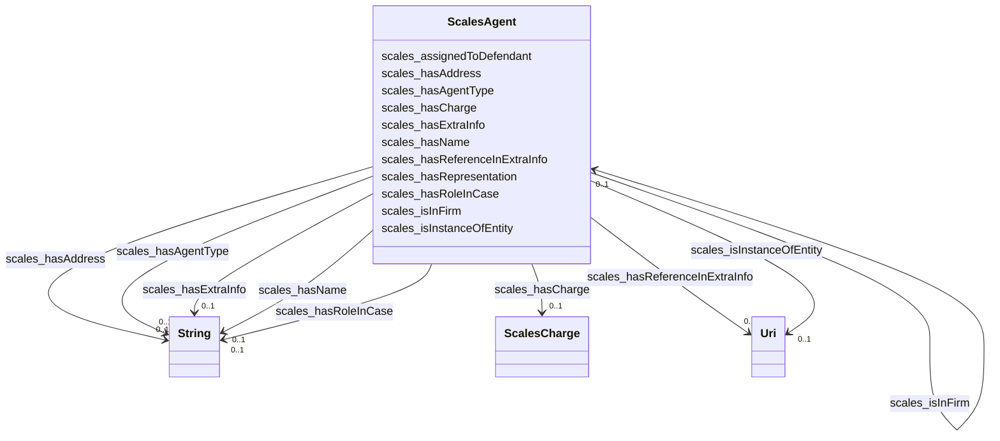

# Class: TODO -- what's a good name for this class (type)? (scales_Agent)


_No type description provided_


URI: [scales:Agent](http://schemas.scales-okn.org/rdf/scales#Agent)





<!-- no inheritance hierarchy -->


## Slots

| Name | Cardinality and Range | Description | Inheritance |
| ---  | --- | --- | --- |
| [scales_hasExtraInfo](../slots/scales_hasExtraInfo.md) | 0..1 <br/> [xsd:string](http://www.w3.org/2001/XMLSchema#string) | No slot description provided | direct |
| [scales_hasName](../slots/scales_hasName.md) | 0..1 <br/> [xsd:string](http://www.w3.org/2001/XMLSchema#string) | No slot description provided | direct |
| [scales_hasAgentType](../slots/scales_hasAgentType.md) | 0..1 <br/> [xsd:string](http://www.w3.org/2001/XMLSchema#string) | No slot description provided | direct |
| [scales_hasReferenceInExtraInfo](../slots/scales_hasReferenceInExtraInfo.md) | 0..1 <br/> [xsd:anyURI](http://www.w3.org/2001/XMLSchema#anyURI) | No slot description provided | direct |
| [scales_isInFirm](../slots/scales_isInFirm.md) | 0..1 <br/> [ScalesAgent](../classes/ScalesAgent.md) | No slot description provided | direct |
| [scales_assignedToDefendant](../slots/scales_assignedToDefendant.md) | 0..1 <br/> [ScalesAgent](../classes/ScalesAgent.md) | No slot description provided | direct |
| [scales_hasCharge](../slots/scales_hasCharge.md) | 0..1 <br/> [ScalesCharge](../classes/ScalesCharge.md) | No slot description provided | direct |
| [scales_isInstanceOfEntity](../slots/scales_isInstanceOfEntity.md) | 0..1 <br/> [xsd:anyURI](http://www.w3.org/2001/XMLSchema#anyURI) | No slot description provided | direct |
| [scales_hasRoleInCase](../slots/scales_hasRoleInCase.md) | 0..1 <br/> [xsd:string](http://www.w3.org/2001/XMLSchema#string) | No slot description provided | direct |
| [scales_hasRepresentation](../slots/scales_hasRepresentation.md) | 0..1 <br/> [ScalesAgent](../classes/ScalesAgent.md) | No slot description provided | direct |
| [scales_hasAddress](../slots/scales_hasAddress.md) | 0..1 <br/> [xsd:string](http://www.w3.org/2001/XMLSchema#string) | No slot description provided | direct |


## Usages

| used by | used in | type | used |
| ---  | --- | --- | --- |
| [ScalesAgent](../classes/ScalesAgent.md) | [scales_isInFirm](../slots/scales_isInFirm.md) | range | [ScalesAgent](../classes/ScalesAgent.md) |
| [ScalesAgent](../classes/ScalesAgent.md) | [scales_assignedToDefendant](../slots/scales_assignedToDefendant.md) | range | [ScalesAgent](../classes/ScalesAgent.md) |
| [ScalesAgent](../classes/ScalesAgent.md) | [scales_hasRepresentation](../slots/scales_hasRepresentation.md) | range | [ScalesAgent](../classes/ScalesAgent.md) |
| [ScalesCaseCivil](../classes/ScalesCaseCivil.md) | [scales_hasAgent](../slots/scales_hasAgent.md) | range | [ScalesAgent](../classes/ScalesAgent.md) |
| [ScalesCaseCriminal](../classes/ScalesCaseCriminal.md) | [scales_hasAgent](../slots/scales_hasAgent.md) | range | [ScalesAgent](../classes/ScalesAgent.md) |


## TODOs

* TODO -- Todos for this class go here
* or you can delete the todos
* if you think the class is perfect.

## Identifier and Mapping Information


### Schema Source


* from schema: scales-kg


## Mappings

| Mapping Type | Mapped Value |
| ---  | ---  |
| self | scales:Agent |
| native | scales-kg/:ScalesAgent |


## LinkML Source

<!-- TODO: investigate https://stackoverflow.com/questions/37606292/how-to-create-tabbed-code-blocks-in-mkdocs-or-sphinx -->

### Direct

<details>
```yaml
name: scales_Agent
description: No type description provided
title: TODO -- what's a good name for this class (type)?
todos:
- TODO -- Todos for this class go here
- or you can delete the todos
- if you think the class is perfect.
notes:
- Class with 11020149 occurences.
from_schema: scales-kg
rank: 1000
slots:
- scales_hasExtraInfo
- scales_hasName
- scales_hasAgentType
- scales_hasReferenceInExtraInfo
- scales_isInFirm
- scales_assignedToDefendant
- scales_hasCharge
- scales_isInstanceOfEntity
- scales_hasRoleInCase
- scales_hasRepresentation
- scales_hasAddress
class_uri: scales:Agent

```
</details>

### Induced

<details>
```yaml
name: scales_Agent
description: No type description provided
title: TODO -- what's a good name for this class (type)?
todos:
- TODO -- Todos for this class go here
- or you can delete the todos
- if you think the class is perfect.
notes:
- Class with 11020149 occurences.
from_schema: scales-kg
rank: 1000
attributes:
  scales_hasExtraInfo:
    name: scales_hasExtraInfo
    description: No slot description provided
    todos:
    - TODO -- Todos for this slot go here
    - or you can delete the todos
    - if you think the class is perfect.
    comments:
    - 658845 occurrences with subject type scales_Agent and object type string.
    examples:
    - value: 'scales:Agent/akd;;1:16-cr-00004_a0 scales:hasExtraInfo doing business
        as

        Northstar Gift Shop'
    from_schema: scales-kg
    rank: 1000
    slot_uri: scales:hasExtraInfo
    alias: scales_hasExtraInfo
    owner: scales_Agent
    domain_of:
    - scales_Agent
    range: string
  scales_hasName:
    name: scales_hasName
    description: No slot description provided
    todos:
    - TODO -- Todos for this slot go here
    - or you can delete the todos
    - if you think the class is perfect.
    comments:
    - 11020147 occurrences with subject type scales_Agent and object type string.
    - 94 occurrences with subject type scales_Court and object type string.
    - 5385 occurrences with untyped subjects and object type string.
    examples:
    - value: scales:Agent/akd;;1:16-cr-00001_a0 scales:hasName SCALES-Party-Hash-01169B980BF3557176ECC743C5841A32
    - value: scales:Court/akd scales:hasName District Court, D. Alaska
    - value: scales:JudgeEntity/SJ000000 scales:hasName Cj Williams
    from_schema: scales-kg
    rank: 1000
    slot_uri: scales:hasName
    alias: scales_hasName
    owner: scales_Agent
    domain_of:
    - scales_Agent
    - scales_Court
    range: string
  scales_hasAgentType:
    name: scales_hasAgentType
    description: No slot description provided
    todos:
    - TODO -- Todos for this slot go here
    - or you can delete the todos
    - if you think the class is perfect.
    comments:
    - 11020149 occurrences with subject type scales_Agent and object type string.
    examples:
    - value: scales:Agent/akd;;1:16-cr-00001_a0 scales:hasAgentType party
    from_schema: scales-kg
    rank: 1000
    slot_uri: scales:hasAgentType
    alias: scales_hasAgentType
    owner: scales_Agent
    domain_of:
    - scales_Agent
    range: string
  scales_hasReferenceInExtraInfo:
    name: scales_hasReferenceInExtraInfo
    description: No slot description provided
    todos:
    - TODO -- Todos for this slot go here
    - or you can delete the todos
    - if you think the class is perfect.
    comments:
    - 126205 occurrences with subject type scales_Agent and object type uri.
    examples:
    - value: scales:Agent/akd;;1:16-cr-00006_a1 scales:hasReferenceInExtraInfo scales:PartyEntity/SPID-INDUSTRY-ST-018-000001790
    from_schema: scales-kg
    rank: 1000
    slot_uri: scales:hasReferenceInExtraInfo
    alias: scales_hasReferenceInExtraInfo
    owner: scales_Agent
    domain_of:
    - scales_Agent
    range: uri
  scales_isInFirm:
    name: scales_isInFirm
    description: No slot description provided
    todos:
    - TODO -- Todos for this slot go here
    - or you can delete the todos
    - if you think the class is perfect.
    comments:
    - 2192349 occurrences with subject type scales_Agent and object type scales_Agent.
    examples:
    - value: scales:Agent/wyd;;6:17-cr-00033_a4 scales:isInFirm scales:Agent/wyd;;6:17-cr-00033_a5
    from_schema: scales-kg
    rank: 1000
    slot_uri: scales:isInFirm
    alias: scales_isInFirm
    owner: scales_Agent
    domain_of:
    - scales_Agent
    range: scales_Agent
  scales_assignedToDefendant:
    name: scales_assignedToDefendant
    description: No slot description provided
    todos:
    - TODO -- Todos for this slot go here
    - or you can delete the todos
    - if you think the class is perfect.
    comments:
    - 45461 occurrences with subject type scales_Agent and object type scales_Agent.
    examples:
    - value: scales:Agent/wyd;;2:17-cr-00211_a9 scales:assignedToDefendant scales:Agent/wyd;;2:17-cr-00211_a3
    from_schema: scales-kg
    rank: 1000
    slot_uri: scales:assignedToDefendant
    alias: scales_assignedToDefendant
    owner: scales_Agent
    domain_of:
    - scales_Agent
    range: scales_Agent
  scales_hasCharge:
    name: scales_hasCharge
    description: No slot description provided
    todos:
    - TODO -- Todos for this slot go here
    - or you can delete the todos
    - if you think the class is perfect.
    comments:
    - 340575 occurrences with subject type scales_Agent and object type scales_Charge.
    - 262292 occurrences with subject type scales_CaseCriminal and object type scales_Charge.
    examples:
    - value: scales:Agent/wyd;;6:17-cr-00033_a0 scales:hasCharge scales:Charge/wyd;;6:17-cr-00033_c1
    - value: scales:CaseCriminal/wyd;;6:17-cr-00033 scales:hasCharge scales:Charge/wyd;;6:17-cr-00033_c1
    from_schema: scales-kg
    rank: 1000
    slot_uri: scales:hasCharge
    alias: scales_hasCharge
    owner: scales_Agent
    domain_of:
    - scales_Agent
    - scales_CaseCriminal
    range: scales_Charge
  scales_isInstanceOfEntity:
    name: scales_isInstanceOfEntity
    description: No slot description provided
    todos:
    - TODO -- Todos for this slot go here
    - or you can delete the todos
    - if you think the class is perfect.
    comments:
    - 8605777 occurrences with subject type scales_Agent and object type uri.
    examples:
    - value: scales:Agent/akd;;1:16-cr-00001_a1 scales:isInstanceOfEntity scales:PartyEntity/SPID-GOVERNMENT-ST-025-000001969
    from_schema: scales-kg
    rank: 1000
    slot_uri: scales:isInstanceOfEntity
    alias: scales_isInstanceOfEntity
    owner: scales_Agent
    domain_of:
    - scales_Agent
    range: uri
  scales_hasRoleInCase:
    name: scales_hasRoleInCase
    description: No slot description provided
    todos:
    - TODO -- Todos for this slot go here
    - or you can delete the todos
    - if you think the class is perfect.
    comments:
    - 4717239 occurrences with subject type scales_Agent and object type string.
    examples:
    - value: scales:Agent/akd;;1:16-cr-00001_a0 scales:hasRoleInCase Defendant
    from_schema: scales-kg
    rank: 1000
    slot_uri: scales:hasRoleInCase
    alias: scales_hasRoleInCase
    owner: scales_Agent
    domain_of:
    - scales_Agent
    range: string
  scales_hasRepresentation:
    name: scales_hasRepresentation
    description: No slot description provided
    todos:
    - TODO -- Todos for this slot go here
    - or you can delete the todos
    - if you think the class is perfect.
    comments:
    - 4547814 occurrences with subject type scales_Agent and object type scales_Agent.
    examples:
    - value: scales:Agent/wyd;;6:17-cr-00033_a1 scales:hasRepresentation scales:Agent/wyd;;6:17-cr-00033_a4
    from_schema: scales-kg
    rank: 1000
    slot_uri: scales:hasRepresentation
    alias: scales_hasRepresentation
    owner: scales_Agent
    domain_of:
    - scales_Agent
    range: scales_Agent
  scales_hasAddress:
    name: scales_hasAddress
    description: No slot description provided
    todos:
    - TODO -- Todos for this slot go here
    - or you can delete the todos
    - if you think the class is perfect.
    comments:
    - 2319706 occurrences with subject type scales_Agent and object type string.
    examples:
    - value: 'scales:Agent/akd;;1:16-cr-00001_a3 scales:hasAddress 425 G Street, Suite
        800

        Anchorage, AK 99501'
    from_schema: scales-kg
    rank: 1000
    slot_uri: scales:hasAddress
    alias: scales_hasAddress
    owner: scales_Agent
    domain_of:
    - scales_Agent
    range: string
class_uri: scales:Agent

```
</details>