# Class: No class (type) name specified (scales_Case)


_No class (type) description specified_


URI: [scales:Case](http://schemas.scales-okn.org/rdf/scales#Case)

```mermaid
 classDiagram
    class ScalesCase
    click ScalesCase href "../ScalesCase"
      ScalesCase : jxdm72_CaseCharge
        
          
    
    
    ScalesCase --> "0..1" Uri : jxdm72_CaseCharge
    click Uri href "../Uri"

        
      ScalesCase : jxdm72_CaseCourt
        
          
    
    
    ScalesCase --> "0..1" Jxdm72Court : jxdm72_CaseCourt
    click Jxdm72Court href "../Jxdm72Court"

        
      ScalesCase : jxdm72_CaseDefendantParty
        
          
    
    
    ScalesCase --> "0..1" Uri : jxdm72_CaseDefendantParty
    click Uri href "../Uri"

        
      ScalesCase : jxdm72_CaseInitiatingParty
        
          
    
    
    ScalesCase --> "0..1" Uri : jxdm72_CaseInitiatingParty
    click Uri href "../Uri"

        
      ScalesCase : jxdm72_CaseJudge
        
          
    
    
    ScalesCase --> "0..1" Uri : jxdm72_CaseJudge
    click Uri href "../Uri"

        
      ScalesCase : jxdm72_RegisterOfActions
        
          
    
    
    ScalesCase --> "0..1" Any : jxdm72_RegisterOfActions
    click Any href "../Any"

        
      ScalesCase : jxdm72_StatuteKeywordText
        
          
    
    
    ScalesCase --> "0..1" String : jxdm72_StatuteKeywordText
    click String href "../String"

        
      ScalesCase : niem50_CaseDocketID
        
          
    
    
    ScalesCase --> "0..1" Any : niem50_CaseDocketID
    click Any href "../Any"

        
      ScalesCase : niem50_CaseGeneralCategoryText
        
          
    
    
    ScalesCase --> "0..1" String : niem50_CaseGeneralCategoryText
    click String href "../String"

        
      ScalesCase : niem50_CaseSubCategoryText
        
          
    
    
    ScalesCase --> "0..1" String : niem50_CaseSubCategoryText
    click String href "../String"

        
      ScalesCase : niem50_EndDate
        
          
    
    
    ScalesCase --> "0..1" Date : niem50_EndDate
    click Date href "../Date"

        
      ScalesCase : niem50_JurisdictionText
        
          
    
    
    ScalesCase --> "0..1" String : niem50_JurisdictionText
    click String href "../String"

        
      ScalesCase : niem50_StartDate
        
          
    
    
    ScalesCase --> "0..1" Date : niem50_StartDate
    click Date href "../Date"

        
      ScalesCase : niem50_StatusDescriptionText
        
          
    
    
    ScalesCase --> "0..1" String : niem50_StatusDescriptionText
    click String href "../String"

        
      ScalesCase : rdf_Type
        
          
    
    
    ScalesCase --> "0..1" Uri : rdf_Type
    click Uri href "../Uri"

        
      ScalesCase : scales_hasMemberCase
        
          
    
    
    ScalesCase --> "0..1" ScalesCase : scales_hasMemberCase
    click ScalesCase href "../ScalesCase"

        
      ScalesCase : scales_hasRelatedCase
        
          
    
    
    ScalesCase --> "0..1" Any : scales_hasRelatedCase
    click Any href "../Any"

        
      ScalesCase : scales_Party
        
          
    
    
    ScalesCase --> "0..1" Uri : scales_Party
    click Uri href "../Uri"

        
      
```





<!-- no inheritance hierarchy -->


## Slots

| Name | Cardinality and Range | Description | Inheritance |
| ---  | --- | --- | --- |
| [niem50_CaseSubCategoryText](../slots/niem50_CaseSubCategoryText.md) | 0..1 <br/> [xsd:string](http://www.w3.org/2001/XMLSchema#string) | No slot (predicate) description specified <br/> 104 occurrences with subject type scales_Case and object type string. | direct |
| [jxdm72_CaseCourt](../slots/jxdm72_CaseCourt.md) | 0..1 <br/> [Jxdm72Court](../classes/Jxdm72Court.md) | No slot (predicate) description specified <br/> 143 occurrences with subject type scales_Case and object type jxdm72_Court. | direct |
| [niem50_EndDate](../slots/niem50_EndDate.md) | 0..1 <br/> [xsd:date](http://www.w3.org/2001/XMLSchema#date) | No slot (predicate) description specified <br/> 9629 occurrences with subject type scales_Case and object type date. | direct |
| [scales_hasMemberCase](../slots/scales_hasMemberCase.md) | 0..1 <br/> [ScalesCase](../classes/ScalesCase.md) | No slot (predicate) description specified <br/> 2 occurrences with subject type scales_Case and object type scales_Case.<br/>1 occurrences with untyped subjects and object type scales_Case. | direct |
| [rdf_Type](../slots/rdf_Type.md) | 0..1 <br/> [xsd:anyURI](http://www.w3.org/2001/XMLSchema#anyURI) | No slot (predicate) description specified <br/> 10426705 occurrences with untyped subjects and object type uri.<br/>2 occurrences with subject type scales_Case and object type uri. | direct |
| [niem50_CaseGeneralCategoryText](../slots/niem50_CaseGeneralCategoryText.md) | 0..1 <br/> [xsd:string](http://www.w3.org/2001/XMLSchema#string) | No slot (predicate) description specified <br/> 2 occurrences with subject type scales_Case and object type string. | direct |
| [niem50_JurisdictionText](../slots/niem50_JurisdictionText.md) | 0..1 <br/> [xsd:string](http://www.w3.org/2001/XMLSchema#string) | No slot (predicate) description specified <br/> 32 occurrences with subject type scales_Case and object type string. | direct |
| [jxdm72_CaseCharge](../slots/jxdm72_CaseCharge.md) | 0..1 <br/> [xsd:anyURI](http://www.w3.org/2001/XMLSchema#anyURI) | No slot (predicate) description specified <br/> 213743 occurrences with subject type scales_Case and object type uri. | direct |
| [jxdm72_CaseDefendantParty](../slots/jxdm72_CaseDefendantParty.md) | 0..1 <br/> [xsd:anyURI](http://www.w3.org/2001/XMLSchema#anyURI) | No slot (predicate) description specified <br/> 1852839 occurrences with subject type scales_Case and object type uri. | direct |
| [jxdm72_StatuteKeywordText](../slots/jxdm72_StatuteKeywordText.md) | 0..1 <br/> [xsd:string](http://www.w3.org/2001/XMLSchema#string) | No slot (predicate) description specified <br/> 2680 occurrences with subject type scales_Case and object type string. | direct |
| [jxdm72_RegisterOfActions](../slots/jxdm72_RegisterOfActions.md) | 0..1 <br/> [Jxdm72RegisterOfActions](../classes/Jxdm72RegisterOfActions.md)&nbsp;or&nbsp;<br />[xsd:anyURI](http://www.w3.org/2001/XMLSchema#anyURI) | No slot (predicate) description specified <br/> 581243 occurrences with subject type scales_Case and object type uri.<br/>94929 occurrences with subject type jxdm72_Case and object type jxdm72_RegisterOfActions. | direct |
| [niem50_StatusDescriptionText](../slots/niem50_StatusDescriptionText.md) | 0..1 <br/> [xsd:string](http://www.w3.org/2001/XMLSchema#string) | No slot (predicate) description specified <br/> 4 occurrences with subject type scales_Case and object type string. | direct |
| [niem50_StartDate](../slots/niem50_StartDate.md) | 0..1 <br/> [xsd:date](http://www.w3.org/2001/XMLSchema#date) | No slot (predicate) description specified <br/> 6852 occurrences with subject type scales_Case and object type date. | direct |
| [jxdm72_CaseInitiatingParty](../slots/jxdm72_CaseInitiatingParty.md) | 0..1 <br/> [xsd:anyURI](http://www.w3.org/2001/XMLSchema#anyURI) | No slot (predicate) description specified <br/> 920509 occurrences with subject type scales_Case and object type uri. | direct |
| [scales_Party](../slots/scales_Party.md) | 0..1 <br/> [xsd:anyURI](http://www.w3.org/2001/XMLSchema#anyURI) | No slot (predicate) description specified <br/> 231186 occurrences with subject type scales_Case and object type uri. | direct |
| [scales_hasRelatedCase](../slots/scales_hasRelatedCase.md) | 0..1 <br/> [ScalesCase](../classes/ScalesCase.md)&nbsp;or&nbsp;<br />[xsd:anyURI](http://www.w3.org/2001/XMLSchema#anyURI) | No slot (predicate) description specified <br/> 4 occurrences with subject type scales_Case and object type scales_Case.<br/>1 occurrences with subject type scales_Case and object type uri. | direct |
| [niem50_CaseDocketID](../slots/niem50_CaseDocketID.md) | 0..1 <br/> [xsd:integer](http://www.w3.org/2001/XMLSchema#integer)&nbsp;or&nbsp;<br />[xsd:string](http://www.w3.org/2001/XMLSchema#string) | No slot (predicate) description specified <br/> 272547 occurrences with subject type scales_Case and object type string.<br/>96011 occurrences with subject type jxdm72_Case and object type integer. | direct |
| [jxdm72_CaseJudge](../slots/jxdm72_CaseJudge.md) | 0..1 <br/> [xsd:anyURI](http://www.w3.org/2001/XMLSchema#anyURI) | No slot (predicate) description specified <br/> 837266 occurrences with subject type scales_Case and object type uri. | direct |


## Usages

| used by | used in | type | used |
| ---  | --- | --- | --- |
| [ScalesCase](../classes/ScalesCase.md) | [scales_hasMemberCase](../slots/scales_hasMemberCase.md) | range | [ScalesCase](../classes/ScalesCase.md) |
| [ScalesCase](../classes/ScalesCase.md) | [scales_hasRelatedCase](../slots/scales_hasRelatedCase.md) | any_of[range] | [ScalesCase](../classes/ScalesCase.md) |


## Identifier and Mapping Information


### Schema Source


* from schema: scales-kg-new


## Mappings

| Mapping Type | Mapped Value |
| ---  | ---  |
| self | scales:Case |
| native | scales-kg-new/:ScalesCase |


## LinkML Source

<!-- TODO: investigate https://stackoverflow.com/questions/37606292/how-to-create-tabbed-code-blocks-in-mkdocs-or-sphinx -->

### Direct

<details>

```yaml
name: scales_Case
conforms_to: No schema conformance document specified
description: No class (type) description specified
title: No class (type) name specified
notes:
- Class with 2 occurrences.
from_schema: scales-kg-new
rank: 1000
slots:
- niem50_CaseSubCategoryText
- jxdm72_CaseCourt
- niem50_EndDate
- scales_hasMemberCase
- rdf_Type
- niem50_CaseGeneralCategoryText
- niem50_JurisdictionText
- jxdm72_CaseCharge
- jxdm72_CaseDefendantParty
- jxdm72_StatuteKeywordText
- jxdm72_RegisterOfActions
- niem50_StatusDescriptionText
- niem50_StartDate
- jxdm72_CaseInitiatingParty
- scales_Party
- scales_hasRelatedCase
- niem50_CaseDocketID
- jxdm72_CaseJudge
class_uri: scales:Case

```
</details>

### Induced

<details>

```yaml
name: scales_Case
conforms_to: No schema conformance document specified
description: No class (type) description specified
title: No class (type) name specified
notes:
- Class with 2 occurrences.
from_schema: scales-kg-new
rank: 1000
attributes:
  niem50_CaseSubCategoryText:
    name: niem50_CaseSubCategoryText
    description: No slot (predicate) description specified
    comments:
    - 104 occurrences with subject type scales_Case and object type string.
    examples:
    - description: scales_Case → string
      object:
        example_object: 110 Insurance
        example_object_type: string
        example_predicate: niem50:CaseSubCategoryText
        example_subject: scales/CaseCivil
        example_subject_type: scales_Case
    from_schema: scales-kg-new
    rank: 1000
    slot_uri: niem50:CaseSubCategoryText
    alias: niem50_CaseSubCategoryText
    owner: scales_Case
    domain_of:
    - scales_Case
    range: string
  jxdm72_CaseCourt:
    name: jxdm72_CaseCourt
    description: No slot (predicate) description specified
    comments:
    - 143 occurrences with subject type scales_Case and object type jxdm72_Court.
    examples:
    - description: scales_Case → jxdm72_Court
      object:
        example_object: scales/Court/wyd
        example_object_type: jxdm72_Court
        example_predicate: jxdm72:CaseCourt
        example_subject: scales/CaseCriminal
        example_subject_type: scales_Case
    from_schema: scales-kg-new
    rank: 1000
    slot_uri: jxdm72:CaseCourt
    alias: jxdm72_CaseCourt
    owner: scales_Case
    domain_of:
    - scales_Case
    range: jxdm72_Court
  niem50_EndDate:
    name: niem50_EndDate
    description: No slot (predicate) description specified
    comments:
    - 9629 occurrences with subject type scales_Case and object type date.
    examples:
    - description: scales_Case → date
      object:
        example_object: '1968-03-14'
        example_object_type: date
        example_predicate: niem50:EndDate
        example_subject: scales/CaseCivil
        example_subject_type: scales_Case
    from_schema: scales-kg-new
    rank: 1000
    slot_uri: niem50:EndDate
    alias: niem50_EndDate
    owner: scales_Case
    domain_of:
    - scales_Case
    range: date
  scales_hasMemberCase:
    name: scales_hasMemberCase
    description: No slot (predicate) description specified
    comments:
    - 2 occurrences with subject type scales_Case and object type scales_Case.
    - 1 occurrences with untyped subjects and object type scales_Case.
    examples:
    - description: scales_Case → scales_Case
      object:
        example_object: scales/CaseCivil
        example_object_type: scales_Case
        example_predicate: scales:hasMemberCase
        example_subject: scales/CaseCriminal
        example_subject_type: scales_Case
    - description: None → scales_Case
      object:
        example_object: scales/CaseCivil
        example_object_type: scales_Case
        example_predicate: scales:hasMemberCase
        example_subject: scales/CaseOther
        example_subject_type: None
    from_schema: scales-kg-new
    rank: 1000
    slot_uri: scales:hasMemberCase
    alias: scales_hasMemberCase
    owner: scales_Case
    domain_of:
    - scales_Case
    range: scales_Case
  rdf_Type:
    name: rdf_Type
    description: No slot (predicate) description specified
    comments:
    - 10426705 occurrences with untyped subjects and object type uri.
    - 2 occurrences with subject type scales_Case and object type uri.
    examples:
    - description: None → uri
      object:
        example_object: jxdm72:CaseDefendantParty
        example_object_type: uri
        example_predicate: rdf:Type
        example_subject: scales/Agent/almd;;1:16-cr-00020_a0
        example_subject_type: None
    - description: scales_Case → uri
      object:
        example_object: jxdm72:Case
        example_object_type: uri
        example_predicate: rdf:Type
        example_subject: scales/CaseCivil
        example_subject_type: scales_Case
    from_schema: scales-kg-new
    rank: 1000
    slot_uri: rdf:Type
    alias: rdf_Type
    owner: scales_Case
    domain_of:
    - scales_Case
    range: uri
  niem50_CaseGeneralCategoryText:
    name: niem50_CaseGeneralCategoryText
    description: No slot (predicate) description specified
    comments:
    - 2 occurrences with subject type scales_Case and object type string.
    examples:
    - description: scales_Case → string
      object:
        example_object: civil
        example_object_type: string
        example_predicate: niem50:CaseGeneralCategoryText
        example_subject: scales/CaseCivil
        example_subject_type: scales_Case
    from_schema: scales-kg-new
    rank: 1000
    slot_uri: niem50:CaseGeneralCategoryText
    alias: niem50_CaseGeneralCategoryText
    owner: scales_Case
    domain_of:
    - scales_Case
    range: string
  niem50_JurisdictionText:
    name: niem50_JurisdictionText
    description: No slot (predicate) description specified
    comments:
    - 32 occurrences with subject type scales_Case and object type string.
    examples:
    - description: scales_Case → string
      object:
        example_object: Diversity
        example_object_type: string
        example_predicate: niem50:JurisdictionText
        example_subject: scales/CaseCivil
        example_subject_type: scales_Case
    from_schema: scales-kg-new
    rank: 1000
    slot_uri: niem50:JurisdictionText
    alias: niem50_JurisdictionText
    owner: scales_Case
    domain_of:
    - scales_Case
    range: string
  jxdm72_CaseCharge:
    name: jxdm72_CaseCharge
    description: No slot (predicate) description specified
    comments:
    - 213743 occurrences with subject type scales_Case and object type uri.
    examples:
    - description: scales_Case → uri
      object:
        example_object: scales/Charge/almd;;1:16-cr-00020_c0-1
        example_object_type: uri
        example_predicate: jxdm72:CaseCharge
        example_subject: scales/CaseCriminal
        example_subject_type: scales_Case
    from_schema: scales-kg-new
    rank: 1000
    slot_uri: jxdm72:CaseCharge
    alias: jxdm72_CaseCharge
    owner: scales_Case
    domain_of:
    - scales_Case
    range: uri
  jxdm72_CaseDefendantParty:
    name: jxdm72_CaseDefendantParty
    description: No slot (predicate) description specified
    comments:
    - 1852839 occurrences with subject type scales_Case and object type uri.
    examples:
    - description: scales_Case → uri
      object:
        example_object: scales/Agent/almd;;1:16-cv-00016_a1
        example_object_type: uri
        example_predicate: jxdm72:CaseDefendantParty
        example_subject: scales/CaseCivil
        example_subject_type: scales_Case
    from_schema: scales-kg-new
    rank: 1000
    slot_uri: jxdm72:CaseDefendantParty
    alias: jxdm72_CaseDefendantParty
    owner: scales_Case
    domain_of:
    - scales_Case
    range: uri
  jxdm72_StatuteKeywordText:
    name: jxdm72_StatuteKeywordText
    description: No slot (predicate) description specified
    comments:
    - 2680 occurrences with subject type scales_Case and object type string.
    examples:
    - description: scales_Case → string
      object:
        example_object: ' 28:1332sh Diversity-Sexual Harassment'
        example_object_type: string
        example_predicate: jxdm72:StatuteKeywordText
        example_subject: scales/CaseCivil
        example_subject_type: scales_Case
    from_schema: scales-kg-new
    rank: 1000
    slot_uri: jxdm72:StatuteKeywordText
    alias: jxdm72_StatuteKeywordText
    owner: scales_Case
    domain_of:
    - scales_Case
    range: string
  jxdm72_RegisterOfActions:
    name: jxdm72_RegisterOfActions
    description: No slot (predicate) description specified
    comments:
    - 581243 occurrences with subject type scales_Case and object type uri.
    - 94929 occurrences with subject type jxdm72_Case and object type jxdm72_RegisterOfActions.
    examples:
    - description: scales_Case → uri
      object:
        example_object: scales/DocketTable/almd;;1:16-cv-00016
        example_object_type: uri
        example_predicate: jxdm72:RegisterOfActions
        example_subject: scales/CaseCivil
        example_subject_type: scales_Case
    - description: jxdm72_Case → jxdm72_RegisterOfActions
      object:
        example_object: scales/DocketTable/DocketTable/ga-fulton-01-99233
        example_object_type: jxdm72_RegisterOfActions
        example_predicate: jxdm72:RegisterOfActions
        example_subject: scales/CaseCriminal/ga/fulton/01/99233
        example_subject_type: jxdm72_Case
    from_schema: scales-kg-new
    rank: 1000
    slot_uri: jxdm72:RegisterOfActions
    alias: jxdm72_RegisterOfActions
    owner: scales_Case
    domain_of:
    - jxdm72_Case
    - scales_Case
    range: Any
    any_of:
    - range: jxdm72_RegisterOfActions
    - range: uri
  niem50_StatusDescriptionText:
    name: niem50_StatusDescriptionText
    description: No slot (predicate) description specified
    comments:
    - 4 occurrences with subject type scales_Case and object type string.
    examples:
    - description: scales_Case → string
      object:
        example_object: closed
        example_object_type: string
        example_predicate: niem50:StatusDescriptionText
        example_subject: scales/CaseCivil
        example_subject_type: scales_Case
    from_schema: scales-kg-new
    rank: 1000
    slot_uri: niem50:StatusDescriptionText
    alias: niem50_StatusDescriptionText
    owner: scales_Case
    domain_of:
    - scales_Case
    range: string
  niem50_StartDate:
    name: niem50_StartDate
    description: No slot (predicate) description specified
    comments:
    - 6852 occurrences with subject type scales_Case and object type date.
    examples:
    - description: scales_Case → date
      object:
        example_object: '2002-01-02'
        example_object_type: date
        example_predicate: niem50:StartDate
        example_subject: scales/CaseCivil
        example_subject_type: scales_Case
    from_schema: scales-kg-new
    rank: 1000
    slot_uri: niem50:StartDate
    alias: niem50_StartDate
    owner: scales_Case
    domain_of:
    - scales_Case
    range: date
  jxdm72_CaseInitiatingParty:
    name: jxdm72_CaseInitiatingParty
    description: No slot (predicate) description specified
    comments:
    - 920509 occurrences with subject type scales_Case and object type uri.
    examples:
    - description: scales_Case → uri
      object:
        example_object: scales/Agent/almd;;1:16-cv-00016_a0
        example_object_type: uri
        example_predicate: jxdm72:CaseInitiatingParty
        example_subject: scales/CaseCivil
        example_subject_type: scales_Case
    from_schema: scales-kg-new
    rank: 1000
    slot_uri: jxdm72:CaseInitiatingParty
    alias: jxdm72_CaseInitiatingParty
    owner: scales_Case
    domain_of:
    - scales_Case
    range: uri
  scales_Party:
    name: scales_Party
    description: No slot (predicate) description specified
    comments:
    - 231186 occurrences with subject type scales_Case and object type uri.
    examples:
    - description: scales_Case → uri
      object:
        example_object: scales/Agent/almd;;1:16-cv-00082_a5
        example_object_type: uri
        example_predicate: scales:Party
        example_subject: scales/CaseCivil
        example_subject_type: scales_Case
    from_schema: scales-kg-new
    rank: 1000
    slot_uri: scales:Party
    alias: scales_Party
    owner: scales_Case
    domain_of:
    - scales_Case
    range: uri
  scales_hasRelatedCase:
    name: scales_hasRelatedCase
    description: No slot (predicate) description specified
    comments:
    - 4 occurrences with subject type scales_Case and object type scales_Case.
    - 1 occurrences with subject type scales_Case and object type uri.
    examples:
    - description: scales_Case → scales_Case
      object:
        example_object: scales/CaseCriminal
        example_object_type: scales_Case
        example_predicate: scales:hasRelatedCase
        example_subject: scales/CaseCriminal
        example_subject_type: scales_Case
    - description: scales_Case → uri
      object:
        example_object: scales/CaseOther
        example_object_type: uri
        example_predicate: scales:hasRelatedCase
        example_subject: scales/CaseCivil
        example_subject_type: scales_Case
    from_schema: scales-kg-new
    rank: 1000
    slot_uri: scales:hasRelatedCase
    alias: scales_hasRelatedCase
    owner: scales_Case
    domain_of:
    - scales_Case
    range: Any
    any_of:
    - range: scales_Case
    - range: uri
  niem50_CaseDocketID:
    name: niem50_CaseDocketID
    description: No slot (predicate) description specified
    comments:
    - 272547 occurrences with subject type scales_Case and object type string.
    - 96011 occurrences with subject type jxdm72_Case and object type integer.
    examples:
    - description: scales_Case → string
      object:
        example_object: 0:15-cv-04235
        example_object_type: string
        example_predicate: niem50:CaseDocketID
        example_subject: scales/CaseCivil
        example_subject_type: scales_Case
    - description: jxdm72_Case → integer
      object:
        example_object: '100271'
        example_object_type: integer
        example_predicate: niem50:CaseDocketID
        example_subject: scales/CaseCriminal/ga/fulton/01/100271
        example_subject_type: jxdm72_Case
    from_schema: scales-kg-new
    rank: 1000
    slot_uri: niem50:CaseDocketID
    alias: niem50_CaseDocketID
    owner: scales_Case
    domain_of:
    - jxdm72_Case
    - scales_Case
    range: Any
    any_of:
    - range: integer
    - range: string
  jxdm72_CaseJudge:
    name: jxdm72_CaseJudge
    description: No slot (predicate) description specified
    comments:
    - 837266 occurrences with subject type scales_Case and object type uri.
    examples:
    - description: scales_Case → uri
      object:
        example_object: scales/Agent/almd;;1:16-cv-00016_a4
        example_object_type: uri
        example_predicate: jxdm72:CaseJudge
        example_subject: scales/CaseCivil
        example_subject_type: scales_Case
    from_schema: scales-kg-new
    rank: 1000
    slot_uri: jxdm72:CaseJudge
    alias: jxdm72_CaseJudge
    owner: scales_Case
    domain_of:
    - scales_Case
    range: uri
class_uri: scales:Case

```
</details>