# Class: TODO -- what's a good name for this class (type)? (scales_CaseCivil)


_TODO -- tell the world what this class (type) describes._


URI: [scales:CaseCivil](http://schemas.scales-okn.org/rdf/scales#CaseCivil)

```mermaid
 classDiagram
    class ScalesCaseCivil
    click ScalesCaseCivil href "../ScalesCaseCivil"
      ScalesCaseCivil : scales_hasAgent
        
          
    
    
    ScalesCaseCivil --> "0..1" ScalesAgent : scales_hasAgent
    click ScalesAgent href "../ScalesAgent"

        
      ScalesCaseCivil : scales_hasCause
        
          
    
    
    ScalesCaseCivil --> "0..1" String : scales_hasCause
    click String href "../String"

        
      ScalesCaseCivil : scales_hasDocketTable
        
          
    
    
    ScalesCaseCivil --> "0..1" ScalesDocketTable : scales_hasDocketTable
    click ScalesDocketTable href "../ScalesDocketTable"

        
      ScalesCaseCivil : scales_hasFilingDate
        
          
    
    
    ScalesCaseCivil --> "0..1" Any : scales_hasFilingDate
    click Any href "../Any"

        
      ScalesCaseCivil : scales_hasIdbAmtrec
        
          
    
    
    ScalesCaseCivil --> "0..1" Double : scales_hasIdbAmtrec
    click Double href "../Double"

        
      ScalesCaseCivil : scales_hasIdbArbit
        
          
    
    
    ScalesCaseCivil --> "0..1" String : scales_hasIdbArbit
    click String href "../String"

        
      ScalesCaseCivil : scales_hasIdbCircuit
        
          
    
    
    ScalesCaseCivil --> "0..1" Double : scales_hasIdbCircuit
    click Double href "../Double"

        
      ScalesCaseCivil : scales_hasIdbClassact
        
          
    
    
    ScalesCaseCivil --> "0..1" Double : scales_hasIdbClassact
    click Double href "../Double"

        
      ScalesCaseCivil : scales_hasIdbCounty
        
          
    
    
    ScalesCaseCivil --> "0..1" Double : scales_hasIdbCounty
    click Double href "../Double"

        
      ScalesCaseCivil : scales_hasIdbDef
        
          
    
    
    ScalesCaseCivil --> "0..1" String : scales_hasIdbDef
    click String href "../String"

        
      ScalesCaseCivil : scales_hasIdbDemanded
        
          
    
    
    ScalesCaseCivil --> "0..1" Double : scales_hasIdbDemanded
    click Double href "../Double"

        
      ScalesCaseCivil : scales_hasIdbDisp
        
          
    
    
    ScalesCaseCivil --> "0..1" Double : scales_hasIdbDisp
    click Double href "../Double"

        
      ScalesCaseCivil : scales_hasIdbDistrict
        
          
    
    
    ScalesCaseCivil --> "0..1" String : scales_hasIdbDistrict
    click String href "../String"

        
      ScalesCaseCivil : scales_hasIdbDjoined
        
          
    
    
    ScalesCaseCivil --> "0..1" String : scales_hasIdbDjoined
    click String href "../String"

        
      ScalesCaseCivil : scales_hasIdbDocket
        
          
    
    
    ScalesCaseCivil --> "0..1" String : scales_hasIdbDocket
    click String href "../String"

        
      ScalesCaseCivil : scales_hasIdbFdateuse
        
          
    
    
    ScalesCaseCivil --> "0..1" String : scales_hasIdbFdateuse
    click String href "../String"

        
      ScalesCaseCivil : scales_hasIdbFiledate
        
          
    
    
    ScalesCaseCivil --> "0..1" Datetime : scales_hasIdbFiledate
    click Datetime href "../Datetime"

        
      ScalesCaseCivil : scales_hasIdbIfp
        
          
    
    
    ScalesCaseCivil --> "0..1" String : scales_hasIdbIfp
    click String href "../String"

        
      ScalesCaseCivil : scales_hasIdbIs_stub
        
          
    
    
    ScalesCaseCivil --> "0..1" Boolean : scales_hasIdbIs_stub
    click Boolean href "../Boolean"

        
      ScalesCaseCivil : scales_hasIdbJudgment
        
          
    
    
    ScalesCaseCivil --> "0..1" Double : scales_hasIdbJudgment
    click Double href "../Double"

        
      ScalesCaseCivil : scales_hasIdbJuris
        
          
    
    
    ScalesCaseCivil --> "0..1" Double : scales_hasIdbJuris
    click Double href "../Double"

        
      ScalesCaseCivil : scales_hasIdbJury
        
          
    
    
    ScalesCaseCivil --> "0..1" String : scales_hasIdbJury
    click String href "../String"

        
      ScalesCaseCivil : scales_hasIdbMdldock
        
          
    
    
    ScalesCaseCivil --> "0..1" String : scales_hasIdbMdldock
    click String href "../String"

        
      ScalesCaseCivil : scales_hasIdbNoj
        
          
    
    
    ScalesCaseCivil --> "0..1" Double : scales_hasIdbNoj
    click Double href "../Double"

        
      ScalesCaseCivil : scales_hasIdbNos
        
          
    
    
    ScalesCaseCivil --> "0..1" String : scales_hasIdbNos
    click String href "../String"

        
      ScalesCaseCivil : scales_hasIdbOffice
        
          
    
    
    ScalesCaseCivil --> "0..1" String : scales_hasIdbOffice
    click String href "../String"

        
      ScalesCaseCivil : scales_hasIdbOrigin
        
          
    
    
    ScalesCaseCivil --> "0..1" Double : scales_hasIdbOrigin
    click Double href "../Double"

        
      ScalesCaseCivil : scales_hasIdbPlt
        
          
    
    
    ScalesCaseCivil --> "0..1" String : scales_hasIdbPlt
    click String href "../String"

        
      ScalesCaseCivil : scales_hasIdbPretrial
        
          
    
    
    ScalesCaseCivil --> "0..1" String : scales_hasIdbPretrial
    click String href "../String"

        
      ScalesCaseCivil : scales_hasIdbProcprog
        
          
    
    
    ScalesCaseCivil --> "0..1" Double : scales_hasIdbProcprog
    click Double href "../Double"

        
      ScalesCaseCivil : scales_hasIdbProse
        
          
    
    
    ScalesCaseCivil --> "0..1" Double : scales_hasIdbProse
    click Double href "../Double"

        
      ScalesCaseCivil : scales_hasIdbResidenc
        
          
    
    
    ScalesCaseCivil --> "0..1" Double : scales_hasIdbResidenc
    click Double href "../Double"

        
      ScalesCaseCivil : scales_hasIdbSection
        
          
    
    
    ScalesCaseCivil --> "0..1" String : scales_hasIdbSection
    click String href "../String"

        
      ScalesCaseCivil : scales_hasIdbStatuscd
        
          
    
    
    ScalesCaseCivil --> "0..1" String : scales_hasIdbStatuscd
    click String href "../String"

        
      ScalesCaseCivil : scales_hasIdbSubsect
        
          
    
    
    ScalesCaseCivil --> "0..1" String : scales_hasIdbSubsect
    click String href "../String"

        
      ScalesCaseCivil : scales_hasIdbTapeyear
        
          
    
    
    ScalesCaseCivil --> "0..1" Double : scales_hasIdbTapeyear
    click Double href "../Double"

        
      ScalesCaseCivil : scales_hasIdbTdateuse
        
          
    
    
    ScalesCaseCivil --> "0..1" String : scales_hasIdbTdateuse
    click String href "../String"

        
      ScalesCaseCivil : scales_hasIdbTermdate
        
          
    
    
    ScalesCaseCivil --> "0..1" Datetime : scales_hasIdbTermdate
    click Datetime href "../Datetime"

        
      ScalesCaseCivil : scales_hasIdbTitl
        
          
    
    
    ScalesCaseCivil --> "0..1" String : scales_hasIdbTitl
    click String href "../String"

        
      ScalesCaseCivil : scales_hasIdbTransdat
        
          
    
    
    ScalesCaseCivil --> "0..1" String : scales_hasIdbTransdat
    click String href "../String"

        
      ScalesCaseCivil : scales_hasIdbTransdoc
        
          
    
    
    ScalesCaseCivil --> "0..1" Double : scales_hasIdbTransdoc
    click Double href "../Double"

        
      ScalesCaseCivil : scales_hasIdbTransoff
        
          
    
    
    ScalesCaseCivil --> "0..1" String : scales_hasIdbTransoff
    click String href "../String"

        
      ScalesCaseCivil : scales_hasIdbTransorg
        
          
    
    
    ScalesCaseCivil --> "0..1" String : scales_hasIdbTransorg
    click String href "../String"

        
      ScalesCaseCivil : scales_hasIdbTrclact
        
          
    
    
    ScalesCaseCivil --> "0..1" Double : scales_hasIdbTrclact
    click Double href "../Double"

        
      ScalesCaseCivil : scales_hasIdbTrialend
        
          
    
    
    ScalesCaseCivil --> "0..1" String : scales_hasIdbTrialend
    click String href "../String"

        
      ScalesCaseCivil : scales_hasIdbTribegan
        
          
    
    
    ScalesCaseCivil --> "0..1" String : scales_hasIdbTribegan
    click String href "../String"

        
      ScalesCaseCivil : scales_hasIdbTrmarb
        
          
    
    
    ScalesCaseCivil --> "0..1" String : scales_hasIdbTrmarb
    click String href "../String"

        
      ScalesCaseCivil : scales_hasJurisdiction
        
          
    
    
    ScalesCaseCivil --> "0..1" String : scales_hasJurisdiction
    click String href "../String"

        
      ScalesCaseCivil : scales_hasMemberCase
        
          
    
    
    ScalesCaseCivil --> "0..1" ScalesCaseCivil : scales_hasMemberCase
    click ScalesCaseCivil href "../ScalesCaseCivil"

        
      ScalesCaseCivil : scales_hasNatureSuit
        
          
    
    
    ScalesCaseCivil --> "0..1" String : scales_hasNatureSuit
    click String href "../String"

        
      ScalesCaseCivil : scales_hasPacerID
        
          
    
    
    ScalesCaseCivil --> "0..1" String : scales_hasPacerID
    click String href "../String"

        
      ScalesCaseCivil : scales_hasRelatedCase
        
          
    
    
    ScalesCaseCivil --> "0..1" Any : scales_hasRelatedCase
    click Any href "../Any"

        
      ScalesCaseCivil : scales_hasStatus
        
          
    
    
    ScalesCaseCivil --> "0..1" String : scales_hasStatus
    click String href "../String"

        
      ScalesCaseCivil : scales_hasTerminatingDate
        
          
    
    
    ScalesCaseCivil --> "0..1" Any : scales_hasTerminatingDate
    click Any href "../Any"

        
      ScalesCaseCivil : scales_isInCourt
        
          
    
    
    ScalesCaseCivil --> "0..1" ScalesCourt : scales_isInCourt
    click ScalesCourt href "../ScalesCourt"

        
      
```





<!-- no inheritance hierarchy -->


## Slots

| Name | Cardinality and Range | Description | Inheritance |
| ---  | --- | --- | --- |
| [scales_hasFilingDate](../slots/scales_hasFilingDate.md) | 0..1 <br/> [Any](../classes/Any.md)&nbsp;or&nbsp;<br />[xsd:date](http://www.w3.org/2001/XMLSchema#date)&nbsp;or&nbsp;<br />[xsd:string](http://www.w3.org/2001/XMLSchema#string) | TODO -- tell the world what this slot (predicate) describes | direct |
| [scales_hasIdbAmtrec](../slots/scales_hasIdbAmtrec.md) | 0..1 <br/> [xsd:double](http://www.w3.org/2001/XMLSchema#double) | TODO -- tell the world what this slot (predicate) describes | direct |
| [scales_hasCause](../slots/scales_hasCause.md) | 0..1 <br/> [xsd:string](http://www.w3.org/2001/XMLSchema#string) | TODO -- tell the world what this slot (predicate) describes | direct |
| [scales_hasPacerID](../slots/scales_hasPacerID.md) | 0..1 <br/> [xsd:string](http://www.w3.org/2001/XMLSchema#string) | TODO -- tell the world what this slot (predicate) describes | direct |
| [scales_hasIdbOrigin](../slots/scales_hasIdbOrigin.md) | 0..1 <br/> [xsd:double](http://www.w3.org/2001/XMLSchema#double) | TODO -- tell the world what this slot (predicate) describes | direct |
| [scales_hasIdbJudgment](../slots/scales_hasIdbJudgment.md) | 0..1 <br/> [xsd:double](http://www.w3.org/2001/XMLSchema#double) | TODO -- tell the world what this slot (predicate) describes | direct |
| [scales_hasIdbTapeyear](../slots/scales_hasIdbTapeyear.md) | 0..1 <br/> [xsd:double](http://www.w3.org/2001/XMLSchema#double) | TODO -- tell the world what this slot (predicate) describes | direct |
| [scales_hasIdbArbit](../slots/scales_hasIdbArbit.md) | 0..1 <br/> [xsd:string](http://www.w3.org/2001/XMLSchema#string) | TODO -- tell the world what this slot (predicate) describes | direct |
| [scales_hasIdbMdldock](../slots/scales_hasIdbMdldock.md) | 0..1 <br/> [xsd:string](http://www.w3.org/2001/XMLSchema#string) | TODO -- tell the world what this slot (predicate) describes | direct |
| [scales_hasIdbTransorg](../slots/scales_hasIdbTransorg.md) | 0..1 <br/> [xsd:string](http://www.w3.org/2001/XMLSchema#string) | TODO -- tell the world what this slot (predicate) describes | direct |
| [scales_hasIdbTrmarb](../slots/scales_hasIdbTrmarb.md) | 0..1 <br/> [xsd:string](http://www.w3.org/2001/XMLSchema#string) | TODO -- tell the world what this slot (predicate) describes | direct |
| [scales_hasIdbFdateuse](../slots/scales_hasIdbFdateuse.md) | 0..1 <br/> [xsd:string](http://www.w3.org/2001/XMLSchema#string) | TODO -- tell the world what this slot (predicate) describes | direct |
| [scales_hasIdbNoj](../slots/scales_hasIdbNoj.md) | 0..1 <br/> [xsd:double](http://www.w3.org/2001/XMLSchema#double) | TODO -- tell the world what this slot (predicate) describes | direct |
| [scales_hasRelatedCase](../slots/scales_hasRelatedCase.md) | 0..1 <br/> [Any](../classes/Any.md)&nbsp;or&nbsp;<br />[xsd:anyURI](http://www.w3.org/2001/XMLSchema#anyURI)&nbsp;or&nbsp;<br />[ScalesCaseCivil](../classes/ScalesCaseCivil.md)&nbsp;or&nbsp;<br />[ScalesCaseCriminal](../classes/ScalesCaseCriminal.md) | TODO -- tell the world what this slot (predicate) describes | direct |
| [scales_hasIdbProse](../slots/scales_hasIdbProse.md) | 0..1 <br/> [xsd:double](http://www.w3.org/2001/XMLSchema#double) | TODO -- tell the world what this slot (predicate) describes | direct |
| [scales_hasIdbSection](../slots/scales_hasIdbSection.md) | 0..1 <br/> [xsd:string](http://www.w3.org/2001/XMLSchema#string) | TODO -- tell the world what this slot (predicate) describes | direct |
| [scales_hasIdbTransdat](../slots/scales_hasIdbTransdat.md) | 0..1 <br/> [xsd:string](http://www.w3.org/2001/XMLSchema#string) | TODO -- tell the world what this slot (predicate) describes | direct |
| [scales_hasIdbProcprog](../slots/scales_hasIdbProcprog.md) | 0..1 <br/> [xsd:double](http://www.w3.org/2001/XMLSchema#double) | TODO -- tell the world what this slot (predicate) describes | direct |
| [scales_hasIdbSubsect](../slots/scales_hasIdbSubsect.md) | 0..1 <br/> [xsd:string](http://www.w3.org/2001/XMLSchema#string) | TODO -- tell the world what this slot (predicate) describes | direct |
| [scales_hasIdbTransdoc](../slots/scales_hasIdbTransdoc.md) | 0..1 <br/> [xsd:double](http://www.w3.org/2001/XMLSchema#double) | TODO -- tell the world what this slot (predicate) describes | direct |
| [scales_hasIdbDemanded](../slots/scales_hasIdbDemanded.md) | 0..1 <br/> [xsd:double](http://www.w3.org/2001/XMLSchema#double) | TODO -- tell the world what this slot (predicate) describes | direct |
| [scales_hasIdbOffice](../slots/scales_hasIdbOffice.md) | 0..1 <br/> [xsd:string](http://www.w3.org/2001/XMLSchema#string) | TODO -- tell the world what this slot (predicate) describes | direct |
| [scales_hasIdbDistrict](../slots/scales_hasIdbDistrict.md) | 0..1 <br/> [xsd:string](http://www.w3.org/2001/XMLSchema#string) | TODO -- tell the world what this slot (predicate) describes | direct |
| [scales_hasAgent](../slots/scales_hasAgent.md) | 0..1 <br/> [ScalesAgent](../classes/ScalesAgent.md) | TODO -- tell the world what this slot (predicate) describes | direct |
| [scales_hasIdbTribegan](../slots/scales_hasIdbTribegan.md) | 0..1 <br/> [xsd:string](http://www.w3.org/2001/XMLSchema#string) | TODO -- tell the world what this slot (predicate) describes | direct |
| [scales_hasIdbDocket](../slots/scales_hasIdbDocket.md) | 0..1 <br/> [xsd:string](http://www.w3.org/2001/XMLSchema#string) | TODO -- tell the world what this slot (predicate) describes | direct |
| [scales_hasStatus](../slots/scales_hasStatus.md) | 0..1 <br/> [xsd:string](http://www.w3.org/2001/XMLSchema#string) | TODO -- tell the world what this slot (predicate) describes | direct |
| [scales_hasIdbClassact](../slots/scales_hasIdbClassact.md) | 0..1 <br/> [xsd:double](http://www.w3.org/2001/XMLSchema#double) | TODO -- tell the world what this slot (predicate) describes | direct |
| [scales_hasIdbIs_stub](../slots/scales_hasIdbIs_stub.md) | 0..1 <br/> [xsd:boolean](http://www.w3.org/2001/XMLSchema#boolean) | TODO -- tell the world what this slot (predicate) describes | direct |
| [scales_hasIdbDisp](../slots/scales_hasIdbDisp.md) | 0..1 <br/> [xsd:double](http://www.w3.org/2001/XMLSchema#double) | TODO -- tell the world what this slot (predicate) describes | direct |
| [scales_hasTerminatingDate](../slots/scales_hasTerminatingDate.md) | 0..1 <br/> [Any](../classes/Any.md)&nbsp;or&nbsp;<br />[xsd:date](http://www.w3.org/2001/XMLSchema#date)&nbsp;or&nbsp;<br />[xsd:string](http://www.w3.org/2001/XMLSchema#string) | TODO -- tell the world what this slot (predicate) describes | direct |
| [scales_hasIdbPretrial](../slots/scales_hasIdbPretrial.md) | 0..1 <br/> [xsd:string](http://www.w3.org/2001/XMLSchema#string) | TODO -- tell the world what this slot (predicate) describes | direct |
| [scales_hasIdbTitl](../slots/scales_hasIdbTitl.md) | 0..1 <br/> [xsd:string](http://www.w3.org/2001/XMLSchema#string) | TODO -- tell the world what this slot (predicate) describes | direct |
| [scales_hasMemberCase](../slots/scales_hasMemberCase.md) | 0..1 <br/> [ScalesCaseCivil](../classes/ScalesCaseCivil.md) | TODO -- tell the world what this slot (predicate) describes | direct |
| [scales_hasIdbJury](../slots/scales_hasIdbJury.md) | 0..1 <br/> [xsd:string](http://www.w3.org/2001/XMLSchema#string) | TODO -- tell the world what this slot (predicate) describes | direct |
| [scales_hasIdbPlt](../slots/scales_hasIdbPlt.md) | 0..1 <br/> [xsd:string](http://www.w3.org/2001/XMLSchema#string) | TODO -- tell the world what this slot (predicate) describes | direct |
| [scales_hasIdbResidenc](../slots/scales_hasIdbResidenc.md) | 0..1 <br/> [xsd:double](http://www.w3.org/2001/XMLSchema#double) | TODO -- tell the world what this slot (predicate) describes | direct |
| [scales_hasIdbJuris](../slots/scales_hasIdbJuris.md) | 0..1 <br/> [xsd:double](http://www.w3.org/2001/XMLSchema#double) | TODO -- tell the world what this slot (predicate) describes | direct |
| [scales_hasIdbCircuit](../slots/scales_hasIdbCircuit.md) | 0..1 <br/> [xsd:double](http://www.w3.org/2001/XMLSchema#double) | TODO -- tell the world what this slot (predicate) describes | direct |
| [scales_hasJurisdiction](../slots/scales_hasJurisdiction.md) | 0..1 <br/> [xsd:string](http://www.w3.org/2001/XMLSchema#string) | TODO -- tell the world what this slot (predicate) describes | direct |
| [scales_hasIdbStatuscd](../slots/scales_hasIdbStatuscd.md) | 0..1 <br/> [xsd:string](http://www.w3.org/2001/XMLSchema#string) | TODO -- tell the world what this slot (predicate) describes | direct |
| [scales_hasIdbTrialend](../slots/scales_hasIdbTrialend.md) | 0..1 <br/> [xsd:string](http://www.w3.org/2001/XMLSchema#string) | TODO -- tell the world what this slot (predicate) describes | direct |
| [scales_hasIdbDef](../slots/scales_hasIdbDef.md) | 0..1 <br/> [xsd:string](http://www.w3.org/2001/XMLSchema#string) | TODO -- tell the world what this slot (predicate) describes | direct |
| [scales_hasIdbFiledate](../slots/scales_hasIdbFiledate.md) | 0..1 <br/> [xsd:dateTime](http://www.w3.org/2001/XMLSchema#dateTime) | TODO -- tell the world what this slot (predicate) describes | direct |
| [scales_hasIdbTrclact](../slots/scales_hasIdbTrclact.md) | 0..1 <br/> [xsd:double](http://www.w3.org/2001/XMLSchema#double) | TODO -- tell the world what this slot (predicate) describes | direct |
| [scales_hasIdbTransoff](../slots/scales_hasIdbTransoff.md) | 0..1 <br/> [xsd:string](http://www.w3.org/2001/XMLSchema#string) | TODO -- tell the world what this slot (predicate) describes | direct |
| [scales_isInCourt](../slots/scales_isInCourt.md) | 0..1 <br/> [ScalesCourt](../classes/ScalesCourt.md) | TODO -- tell the world what this slot (predicate) describes | direct |
| [scales_hasIdbCounty](../slots/scales_hasIdbCounty.md) | 0..1 <br/> [xsd:double](http://www.w3.org/2001/XMLSchema#double) | TODO -- tell the world what this slot (predicate) describes | direct |
| [scales_hasIdbTdateuse](../slots/scales_hasIdbTdateuse.md) | 0..1 <br/> [xsd:string](http://www.w3.org/2001/XMLSchema#string) | TODO -- tell the world what this slot (predicate) describes | direct |
| [scales_hasIdbIfp](../slots/scales_hasIdbIfp.md) | 0..1 <br/> [xsd:string](http://www.w3.org/2001/XMLSchema#string) | TODO -- tell the world what this slot (predicate) describes | direct |
| [scales_hasIdbDjoined](../slots/scales_hasIdbDjoined.md) | 0..1 <br/> [xsd:string](http://www.w3.org/2001/XMLSchema#string) | TODO -- tell the world what this slot (predicate) describes | direct |
| [scales_hasDocketTable](../slots/scales_hasDocketTable.md) | 0..1 <br/> [ScalesDocketTable](../classes/ScalesDocketTable.md) | TODO -- tell the world what this slot (predicate) describes | direct |
| [scales_hasIdbNos](../slots/scales_hasIdbNos.md) | 0..1 <br/> [xsd:string](http://www.w3.org/2001/XMLSchema#string) | TODO -- tell the world what this slot (predicate) describes | direct |
| [scales_hasNatureSuit](../slots/scales_hasNatureSuit.md) | 0..1 <br/> [xsd:string](http://www.w3.org/2001/XMLSchema#string) | TODO -- tell the world what this slot (predicate) describes | direct |
| [scales_hasIdbTermdate](../slots/scales_hasIdbTermdate.md) | 0..1 <br/> [xsd:dateTime](http://www.w3.org/2001/XMLSchema#dateTime) | TODO -- tell the world what this slot (predicate) describes | direct |


## Usages

| used by | used in | type | used |
| ---  | --- | --- | --- |
| [ScalesCaseCivil](../classes/ScalesCaseCivil.md) | [scales_hasRelatedCase](../slots/scales_hasRelatedCase.md) | any_of[range] | [ScalesCaseCivil](../classes/ScalesCaseCivil.md) |
| [ScalesCaseCivil](../classes/ScalesCaseCivil.md) | [scales_hasMemberCase](../slots/scales_hasMemberCase.md) | range | [ScalesCaseCivil](../classes/ScalesCaseCivil.md) |
| [ScalesCaseCriminal](../classes/ScalesCaseCriminal.md) | [scales_hasRelatedCase](../slots/scales_hasRelatedCase.md) | any_of[range] | [ScalesCaseCivil](../classes/ScalesCaseCivil.md) |
| [ScalesCaseCriminal](../classes/ScalesCaseCriminal.md) | [scales_hasMemberCase](../slots/scales_hasMemberCase.md) | range | [ScalesCaseCivil](../classes/ScalesCaseCivil.md) |


## TODOs

* TODO -- Todos for this class go here
* or you can delete the todos
* if you think the class is perfect.

## Identifier and Mapping Information


### Schema Source


* from schema: scales-kg


## Mappings

| Mapping Type | Mapped Value |
| ---  | ---  |
| self | scales:CaseCivil |
| native | scales-kg/:ScalesCaseCivil |


## LinkML Source

<!-- TODO: investigate https://stackoverflow.com/questions/37606292/how-to-create-tabbed-code-blocks-in-mkdocs-or-sphinx -->

### Direct

<details>
```yaml
name: scales_CaseCivil
description: TODO -- tell the world what this class (type) describes.
title: TODO -- what's a good name for this class (type)?
todos:
- TODO -- Todos for this class go here
- or you can delete the todos
- if you think the class is perfect.
notes:
- Class with 561182 occurences.
from_schema: scales-kg
slots:
- scales_hasFilingDate
- scales_hasIdbAmtrec
- scales_hasCause
- scales_hasPacerID
- scales_hasIdbOrigin
- scales_hasIdbJudgment
- scales_hasIdbTapeyear
- scales_hasIdbArbit
- scales_hasIdbMdldock
- scales_hasIdbTransorg
- scales_hasIdbTrmarb
- scales_hasIdbFdateuse
- scales_hasIdbNoj
- scales_hasRelatedCase
- scales_hasIdbProse
- scales_hasIdbSection
- scales_hasIdbTransdat
- scales_hasIdbProcprog
- scales_hasIdbSubsect
- scales_hasIdbTransdoc
- scales_hasIdbDemanded
- scales_hasIdbOffice
- scales_hasIdbDistrict
- scales_hasAgent
- scales_hasIdbTribegan
- scales_hasIdbDocket
- scales_hasStatus
- scales_hasIdbClassact
- scales_hasIdbIs_stub
- scales_hasIdbDisp
- scales_hasTerminatingDate
- scales_hasIdbPretrial
- scales_hasIdbTitl
- scales_hasMemberCase
- scales_hasIdbJury
- scales_hasIdbPlt
- scales_hasIdbResidenc
- scales_hasIdbJuris
- scales_hasIdbCircuit
- scales_hasJurisdiction
- scales_hasIdbStatuscd
- scales_hasIdbTrialend
- scales_hasIdbDef
- scales_hasIdbFiledate
- scales_hasIdbTrclact
- scales_hasIdbTransoff
- scales_isInCourt
- scales_hasIdbCounty
- scales_hasIdbTdateuse
- scales_hasIdbIfp
- scales_hasIdbDjoined
- scales_hasDocketTable
- scales_hasIdbNos
- scales_hasNatureSuit
- scales_hasIdbTermdate
class_uri: scales:CaseCivil

```
</details>

### Induced

<details>
```yaml
name: scales_CaseCivil
description: TODO -- tell the world what this class (type) describes.
title: TODO -- what's a good name for this class (type)?
todos:
- TODO -- Todos for this class go here
- or you can delete the todos
- if you think the class is perfect.
notes:
- Class with 561182 occurences.
from_schema: scales-kg
attributes:
  scales_hasFilingDate:
    name: scales_hasFilingDate
    description: TODO -- tell the world what this slot (predicate) describes.
    todos:
    - TODO -- Todos for this slot go here
    - or you can delete the todos
    - if you think the class is perfect.
    comments:
    - 550105 occurrences with subject type scales_CaseCivil and object type date.
    - 11077 occurrences with subject type scales_CaseCivil and object type string.
    - 126369 occurrences with subject type scales_CaseCriminal and object type date.
    - 23203350 occurrences with subject type scales_DocketEntry and object type date.
    - 457921 occurrences with subject type scales_DocketEntry and object type string.
    - 1250 occurrences with subject type scales_CaseCriminal and object type string.
    examples:
    - value: scales:CaseCivil/akd;;1:16-cv-00009 scales:hasFilingDate 2016-04-15
    - value: scales:CaseCivil/ctd;;3:15-cv-01889 scales:hasFilingDate 12/31/2015
    - value: scales:CaseCriminal/iand;;1:17-cr-00012 scales:hasFilingDate 2017-03-02
    - value: scales:DocketEntry/akd;;1:16-cr-00001_de0 scales:hasFilingDate 2016-02-03
    - value: scales:DocketEntry/akd;;3:15-cv-00265_de0 scales:hasFilingDate 12/31/2015
    - value: scales:CaseCriminal/casd;;3:12-cr-03082 scales:hasFilingDate 07/26/2012
    from_schema: scales-kg
    rank: 1000
    slot_uri: scales:hasFilingDate
    alias: scales_hasFilingDate
    owner: scales_CaseCivil
    domain_of:
    - scales_CaseCivil
    - scales_CaseCriminal
    - scales_DocketEntry
    range: Any
    any_of:
    - range: date
    - range: string
  scales_hasIdbAmtrec:
    name: scales_hasIdbAmtrec
    description: TODO -- tell the world what this slot (predicate) describes.
    todos:
    - TODO -- Todos for this slot go here
    - or you can delete the todos
    - if you think the class is perfect.
    comments:
    - 551088 occurrences with subject type scales_CaseCivil and object type double.
    examples:
    - value: scales:CaseCivil/akd;;1:16-cv-00009 scales:hasIdbAmtrec 0.0
    from_schema: scales-kg
    rank: 1000
    slot_uri: scales:hasIdbAmtrec
    alias: scales_hasIdbAmtrec
    owner: scales_CaseCivil
    domain_of:
    - scales_CaseCivil
    range: double
  scales_hasCause:
    name: scales_hasCause
    description: TODO -- tell the world what this slot (predicate) describes.
    todos:
    - TODO -- Todos for this slot go here
    - or you can delete the todos
    - if you think the class is perfect.
    comments:
    - 561125 occurrences with subject type scales_CaseCivil and object type string.
    examples:
    - value: scales:CaseCivil/akd;;1:16-cv-00009 scales:hasCause 33:1319 Clean Water
        Act
    from_schema: scales-kg
    rank: 1000
    slot_uri: scales:hasCause
    alias: scales_hasCause
    owner: scales_CaseCivil
    domain_of:
    - scales_CaseCivil
    range: string
  scales_hasPacerID:
    name: scales_hasPacerID
    description: TODO -- tell the world what this slot (predicate) describes.
    todos:
    - TODO -- Todos for this slot go here
    - or you can delete the todos
    - if you think the class is perfect.
    comments:
    - 561182 occurrences with subject type scales_CaseCivil and object type string.
    - 127619 occurrences with subject type scales_CaseCriminal and object type string.
    - 262292 occurrences with subject type scales_Charge and object type string.
    - 23661271 occurrences with subject type scales_DocketEntry and object type string.
    examples:
    - value: scales:CaseCivil/akd;;1:16-cv-00009 scales:hasPacerID 1:16-cv-00009
    - value: scales:CaseCriminal/iand;;1:17-cr-00012 scales:hasPacerID 1:17-cr-00012
    - value: scales:Charge/akd;;1:16-cr-00001_c1-3 scales:hasPacerID 1-3
    - value: scales:DocketEntry/akd;;1:16-cr-00001_de0 scales:hasPacerID 1
    from_schema: scales-kg
    rank: 1000
    slot_uri: scales:hasPacerID
    alias: scales_hasPacerID
    owner: scales_CaseCivil
    domain_of:
    - scales_CaseCivil
    - scales_CaseCriminal
    - scales_Charge
    - scales_DocketEntry
    range: string
  scales_hasIdbOrigin:
    name: scales_hasIdbOrigin
    description: TODO -- tell the world what this slot (predicate) describes.
    todos:
    - TODO -- Todos for this slot go here
    - or you can delete the todos
    - if you think the class is perfect.
    comments:
    - 551088 occurrences with subject type scales_CaseCivil and object type double.
    examples:
    - value: scales:CaseCivil/akd;;1:16-cv-00009 scales:hasIdbOrigin 1.0
    from_schema: scales-kg
    rank: 1000
    slot_uri: scales:hasIdbOrigin
    alias: scales_hasIdbOrigin
    owner: scales_CaseCivil
    domain_of:
    - scales_CaseCivil
    range: double
  scales_hasIdbJudgment:
    name: scales_hasIdbJudgment
    description: TODO -- tell the world what this slot (predicate) describes.
    todos:
    - TODO -- Todos for this slot go here
    - or you can delete the todos
    - if you think the class is perfect.
    comments:
    - 551088 occurrences with subject type scales_CaseCivil and object type double.
    examples:
    - value: scales:CaseCivil/akd;;1:16-cv-00009 scales:hasIdbJudgment 0.0
    from_schema: scales-kg
    rank: 1000
    slot_uri: scales:hasIdbJudgment
    alias: scales_hasIdbJudgment
    owner: scales_CaseCivil
    domain_of:
    - scales_CaseCivil
    range: double
  scales_hasIdbTapeyear:
    name: scales_hasIdbTapeyear
    description: TODO -- tell the world what this slot (predicate) describes.
    todos:
    - TODO -- Todos for this slot go here
    - or you can delete the todos
    - if you think the class is perfect.
    comments:
    - 551088 occurrences with subject type scales_CaseCivil and object type double.
    - 111582 occurrences with subject type scales_CaseCriminal and object type double.
    examples:
    - value: scales:CaseCivil/akd;;1:16-cv-00009 scales:hasIdbTapeyear 2019.0
    - value: scales:CaseCriminal/iand;;1:17-cr-00012 scales:hasIdbTapeyear 2099.0
    from_schema: scales-kg
    rank: 1000
    slot_uri: scales:hasIdbTapeyear
    alias: scales_hasIdbTapeyear
    owner: scales_CaseCivil
    domain_of:
    - scales_CaseCivil
    - scales_CaseCriminal
    range: double
  scales_hasIdbArbit:
    name: scales_hasIdbArbit
    description: TODO -- tell the world what this slot (predicate) describes.
    todos:
    - TODO -- Todos for this slot go here
    - or you can delete the todos
    - if you think the class is perfect.
    comments:
    - 551088 occurrences with subject type scales_CaseCivil and object type string.
    examples:
    - value: scales:CaseCivil/akd;;1:16-cv-00009 scales:hasIdbArbit -8
    from_schema: scales-kg
    rank: 1000
    slot_uri: scales:hasIdbArbit
    alias: scales_hasIdbArbit
    owner: scales_CaseCivil
    domain_of:
    - scales_CaseCivil
    range: string
  scales_hasIdbMdldock:
    name: scales_hasIdbMdldock
    description: TODO -- tell the world what this slot (predicate) describes.
    todos:
    - TODO -- Todos for this slot go here
    - or you can delete the todos
    - if you think the class is perfect.
    comments:
    - 551088 occurrences with subject type scales_CaseCivil and object type string.
    examples:
    - value: scales:CaseCivil/akd;;1:16-cv-00009 scales:hasIdbMdldock -8
    from_schema: scales-kg
    rank: 1000
    slot_uri: scales:hasIdbMdldock
    alias: scales_hasIdbMdldock
    owner: scales_CaseCivil
    domain_of:
    - scales_CaseCivil
    range: string
  scales_hasIdbTransorg:
    name: scales_hasIdbTransorg
    description: TODO -- tell the world what this slot (predicate) describes.
    todos:
    - TODO -- Todos for this slot go here
    - or you can delete the todos
    - if you think the class is perfect.
    comments:
    - 551088 occurrences with subject type scales_CaseCivil and object type string.
    examples:
    - value: scales:CaseCivil/akd;;1:16-cv-00009 scales:hasIdbTransorg -8
    from_schema: scales-kg
    rank: 1000
    slot_uri: scales:hasIdbTransorg
    alias: scales_hasIdbTransorg
    owner: scales_CaseCivil
    domain_of:
    - scales_CaseCivil
    range: string
  scales_hasIdbTrmarb:
    name: scales_hasIdbTrmarb
    description: TODO -- tell the world what this slot (predicate) describes.
    todos:
    - TODO -- Todos for this slot go here
    - or you can delete the todos
    - if you think the class is perfect.
    comments:
    - 551088 occurrences with subject type scales_CaseCivil and object type string.
    examples:
    - value: scales:CaseCivil/akd;;1:16-cv-00009 scales:hasIdbTrmarb -8
    from_schema: scales-kg
    rank: 1000
    slot_uri: scales:hasIdbTrmarb
    alias: scales_hasIdbTrmarb
    owner: scales_CaseCivil
    domain_of:
    - scales_CaseCivil
    range: string
  scales_hasIdbFdateuse:
    name: scales_hasIdbFdateuse
    description: TODO -- tell the world what this slot (predicate) describes.
    todos:
    - TODO -- Todos for this slot go here
    - or you can delete the todos
    - if you think the class is perfect.
    comments:
    - 551088 occurrences with subject type scales_CaseCivil and object type string.
    examples:
    - value: scales:CaseCivil/akd;;1:16-cv-00009 scales:hasIdbFdateuse 04/01/2016
    from_schema: scales-kg
    rank: 1000
    slot_uri: scales:hasIdbFdateuse
    alias: scales_hasIdbFdateuse
    owner: scales_CaseCivil
    domain_of:
    - scales_CaseCivil
    range: string
  scales_hasIdbNoj:
    name: scales_hasIdbNoj
    description: TODO -- tell the world what this slot (predicate) describes.
    todos:
    - TODO -- Todos for this slot go here
    - or you can delete the todos
    - if you think the class is perfect.
    comments:
    - 551088 occurrences with subject type scales_CaseCivil and object type double.
    examples:
    - value: scales:CaseCivil/akd;;1:16-cv-00009 scales:hasIdbNoj 0.0
    from_schema: scales-kg
    rank: 1000
    slot_uri: scales:hasIdbNoj
    alias: scales_hasIdbNoj
    owner: scales_CaseCivil
    domain_of:
    - scales_CaseCivil
    range: double
  scales_hasRelatedCase:
    name: scales_hasRelatedCase
    description: TODO -- tell the world what this slot (predicate) describes.
    todos:
    - TODO -- Todos for this slot go here
    - or you can delete the todos
    - if you think the class is perfect.
    comments:
    - 64461 occurrences with subject type scales_CaseCivil and object type scales_CaseCivil.
    - 54514 occurrences with subject type scales_CaseCivil and object type uri.
    - 1 occurrences with subject type scales_CaseCivil and object type scales_CaseCriminal.
    - 3203 occurrences with subject type scales_CaseCriminal and object type uri.
    - 337 occurrences with subject type scales_CaseCriminal and object type scales_CaseCivil.
    examples:
    - value: scales:CaseCivil/wyd;;2:17-cv-00025 scales:hasRelatedCase scales:CaseCivil/wyd;;1:16-cv-00148
    - value: scales:CaseCivil/akd;;3:16-cv-00293 scales:hasRelatedCase scales:CaseCivil/akd;;3:18-cv-00303
    - value: scales:CaseCivil/iand;;1:17-cv-00106 scales:hasRelatedCase scales:CaseCriminal/iand;;1:17-cr-00012
    - value: scales:CaseCriminal/alsd;;1:16-cr-00008 scales:hasRelatedCase scales:CaseCivil/alsd;;1:18-cv-00296
    - value: scales:CaseCriminal/wvnd;;3:16-cr-00010 scales:hasRelatedCase scales:CaseCivil/wvnd;;3:17-cv-00111
    from_schema: scales-kg
    rank: 1000
    slot_uri: scales:hasRelatedCase
    alias: scales_hasRelatedCase
    owner: scales_CaseCivil
    domain_of:
    - scales_CaseCivil
    - scales_CaseCriminal
    range: Any
    any_of:
    - range: uri
    - range: scales_CaseCivil
    - range: scales_CaseCriminal
  scales_hasIdbProse:
    name: scales_hasIdbProse
    description: TODO -- tell the world what this slot (predicate) describes.
    todos:
    - TODO -- Todos for this slot go here
    - or you can delete the todos
    - if you think the class is perfect.
    comments:
    - 551088 occurrences with subject type scales_CaseCivil and object type double.
    examples:
    - value: scales:CaseCivil/akd;;1:16-cv-00009 scales:hasIdbProse 0.0
    from_schema: scales-kg
    rank: 1000
    slot_uri: scales:hasIdbProse
    alias: scales_hasIdbProse
    owner: scales_CaseCivil
    domain_of:
    - scales_CaseCivil
    range: double
  scales_hasIdbSection:
    name: scales_hasIdbSection
    description: TODO -- tell the world what this slot (predicate) describes.
    todos:
    - TODO -- Todos for this slot go here
    - or you can delete the todos
    - if you think the class is perfect.
    comments:
    - 551088 occurrences with subject type scales_CaseCivil and object type string.
    examples:
    - value: scales:CaseCivil/akd;;1:16-cv-00009 scales:hasIdbSection 1319
    from_schema: scales-kg
    rank: 1000
    slot_uri: scales:hasIdbSection
    alias: scales_hasIdbSection
    owner: scales_CaseCivil
    domain_of:
    - scales_CaseCivil
    range: string
  scales_hasIdbTransdat:
    name: scales_hasIdbTransdat
    description: TODO -- tell the world what this slot (predicate) describes.
    todos:
    - TODO -- Todos for this slot go here
    - or you can delete the todos
    - if you think the class is perfect.
    comments:
    - 5994 occurrences with subject type scales_CaseCivil and object type string.
    examples:
    - value: scales:CaseCivil/almd;;3:16-cv-00897 scales:hasIdbTransdat 11/17/2016
    from_schema: scales-kg
    rank: 1000
    slot_uri: scales:hasIdbTransdat
    alias: scales_hasIdbTransdat
    owner: scales_CaseCivil
    domain_of:
    - scales_CaseCivil
    range: string
  scales_hasIdbProcprog:
    name: scales_hasIdbProcprog
    description: TODO -- tell the world what this slot (predicate) describes.
    todos:
    - TODO -- Todos for this slot go here
    - or you can delete the todos
    - if you think the class is perfect.
    comments:
    - 551088 occurrences with subject type scales_CaseCivil and object type double.
    examples:
    - value: scales:CaseCivil/akd;;1:16-cv-00009 scales:hasIdbProcprog 1.0
    from_schema: scales-kg
    rank: 1000
    slot_uri: scales:hasIdbProcprog
    alias: scales_hasIdbProcprog
    owner: scales_CaseCivil
    domain_of:
    - scales_CaseCivil
    range: double
  scales_hasIdbSubsect:
    name: scales_hasIdbSubsect
    description: TODO -- tell the world what this slot (predicate) describes.
    todos:
    - TODO -- Todos for this slot go here
    - or you can delete the todos
    - if you think the class is perfect.
    comments:
    - 551088 occurrences with subject type scales_CaseCivil and object type string.
    examples:
    - value: scales:CaseCivil/akd;;1:16-cv-00009 scales:hasIdbSubsect CW
    from_schema: scales-kg
    rank: 1000
    slot_uri: scales:hasIdbSubsect
    alias: scales_hasIdbSubsect
    owner: scales_CaseCivil
    domain_of:
    - scales_CaseCivil
    range: string
  scales_hasIdbTransdoc:
    name: scales_hasIdbTransdoc
    description: TODO -- tell the world what this slot (predicate) describes.
    todos:
    - TODO -- Todos for this slot go here
    - or you can delete the todos
    - if you think the class is perfect.
    comments:
    - 551088 occurrences with subject type scales_CaseCivil and object type double.
    examples:
    - value: scales:CaseCivil/akd;;1:16-cv-00009 scales:hasIdbTransdoc -8.0
    from_schema: scales-kg
    rank: 1000
    slot_uri: scales:hasIdbTransdoc
    alias: scales_hasIdbTransdoc
    owner: scales_CaseCivil
    domain_of:
    - scales_CaseCivil
    range: double
  scales_hasIdbDemanded:
    name: scales_hasIdbDemanded
    description: TODO -- tell the world what this slot (predicate) describes.
    todos:
    - TODO -- Todos for this slot go here
    - or you can delete the todos
    - if you think the class is perfect.
    comments:
    - 551088 occurrences with subject type scales_CaseCivil and object type double.
    examples:
    - value: scales:CaseCivil/akd;;1:16-cv-00009 scales:hasIdbDemanded 0.0
    from_schema: scales-kg
    rank: 1000
    slot_uri: scales:hasIdbDemanded
    alias: scales_hasIdbDemanded
    owner: scales_CaseCivil
    domain_of:
    - scales_CaseCivil
    range: double
  scales_hasIdbOffice:
    name: scales_hasIdbOffice
    description: TODO -- tell the world what this slot (predicate) describes.
    todos:
    - TODO -- Todos for this slot go here
    - or you can delete the todos
    - if you think the class is perfect.
    comments:
    - 551088 occurrences with subject type scales_CaseCivil and object type string.
    - 111582 occurrences with subject type scales_CaseCriminal and object type string.
    examples:
    - value: scales:CaseCivil/akd;;1:16-cv-00009 scales:hasIdbOffice 1
    - value: scales:CaseCriminal/iand;;1:17-cr-00012 scales:hasIdbOffice 1
    from_schema: scales-kg
    rank: 1000
    slot_uri: scales:hasIdbOffice
    alias: scales_hasIdbOffice
    owner: scales_CaseCivil
    domain_of:
    - scales_CaseCivil
    - scales_CaseCriminal
    range: string
  scales_hasIdbDistrict:
    name: scales_hasIdbDistrict
    description: TODO -- tell the world what this slot (predicate) describes.
    todos:
    - TODO -- Todos for this slot go here
    - or you can delete the todos
    - if you think the class is perfect.
    comments:
    - 551088 occurrences with subject type scales_CaseCivil and object type string.
    - 111582 occurrences with subject type scales_CaseCriminal and object type string.
    examples:
    - value: scales:CaseCivil/akd;;1:16-cv-00009 scales:hasIdbDistrict akd
    - value: scales:CaseCriminal/iand;;1:17-cr-00012 scales:hasIdbDistrict iand
    from_schema: scales-kg
    rank: 1000
    slot_uri: scales:hasIdbDistrict
    alias: scales_hasIdbDistrict
    owner: scales_CaseCivil
    domain_of:
    - scales_CaseCivil
    - scales_CaseCriminal
    range: string
  scales_hasAgent:
    name: scales_hasAgent
    description: TODO -- tell the world what this slot (predicate) describes.
    todos:
    - TODO -- Todos for this slot go here
    - or you can delete the todos
    - if you think the class is perfect.
    comments:
    - 9582250 occurrences with subject type scales_CaseCivil and object type scales_Agent.
    - 1437899 occurrences with subject type scales_CaseCriminal and object type scales_Agent.
    examples:
    - value: scales:CaseCivil/wyd;;2:17-cv-00211 scales:hasAgent scales:Agent/wyd;;2:17-cv-00211_a9
    - value: scales:CaseCriminal/wyd;;6:17-cr-00033 scales:hasAgent scales:Agent/wyd;;6:17-cr-00033_a5
    from_schema: scales-kg
    rank: 1000
    slot_uri: scales:hasAgent
    alias: scales_hasAgent
    owner: scales_CaseCivil
    domain_of:
    - scales_CaseCivil
    - scales_CaseCriminal
    range: scales_Agent
  scales_hasIdbTribegan:
    name: scales_hasIdbTribegan
    description: TODO -- tell the world what this slot (predicate) describes.
    todos:
    - TODO -- Todos for this slot go here
    - or you can delete the todos
    - if you think the class is perfect.
    comments:
    - 2710 occurrences with subject type scales_CaseCivil and object type string.
    examples:
    - value: scales:CaseCivil/azd;;2:16-cv-00474 scales:hasIdbTribegan 03/14/2018
    from_schema: scales-kg
    rank: 1000
    slot_uri: scales:hasIdbTribegan
    alias: scales_hasIdbTribegan
    owner: scales_CaseCivil
    domain_of:
    - scales_CaseCivil
    range: string
  scales_hasIdbDocket:
    name: scales_hasIdbDocket
    description: TODO -- tell the world what this slot (predicate) describes.
    todos:
    - TODO -- Todos for this slot go here
    - or you can delete the todos
    - if you think the class is perfect.
    comments:
    - 551088 occurrences with subject type scales_CaseCivil and object type string.
    - 111582 occurrences with subject type scales_CaseCriminal and object type string.
    examples:
    - value: scales:CaseCivil/akd;;1:16-cv-00009 scales:hasIdbDocket 1600009
    - value: scales:CaseCriminal/iand;;1:17-cr-00012 scales:hasIdbDocket 1700012
    from_schema: scales-kg
    rank: 1000
    slot_uri: scales:hasIdbDocket
    alias: scales_hasIdbDocket
    owner: scales_CaseCivil
    domain_of:
    - scales_CaseCivil
    - scales_CaseCriminal
    range: string
  scales_hasStatus:
    name: scales_hasStatus
    description: TODO -- tell the world what this slot (predicate) describes.
    todos:
    - TODO -- Todos for this slot go here
    - or you can delete the todos
    - if you think the class is perfect.
    comments:
    - 561182 occurrences with subject type scales_CaseCivil and object type string.
    - 127619 occurrences with subject type scales_CaseCriminal and object type string.
    examples:
    - value: scales:CaseCivil/akd;;1:16-cv-00009 scales:hasStatus closed
    - value: scales:CaseCriminal/iand;;1:17-cr-00012 scales:hasStatus closed
    from_schema: scales-kg
    rank: 1000
    slot_uri: scales:hasStatus
    alias: scales_hasStatus
    owner: scales_CaseCivil
    domain_of:
    - scales_CaseCivil
    - scales_CaseCriminal
    range: string
  scales_hasIdbClassact:
    name: scales_hasIdbClassact
    description: TODO -- tell the world what this slot (predicate) describes.
    todos:
    - TODO -- Todos for this slot go here
    - or you can delete the todos
    - if you think the class is perfect.
    comments:
    - 551088 occurrences with subject type scales_CaseCivil and object type double.
    examples:
    - value: scales:CaseCivil/akd;;1:16-cv-00009 scales:hasIdbClassact -8.0
    from_schema: scales-kg
    rank: 1000
    slot_uri: scales:hasIdbClassact
    alias: scales_hasIdbClassact
    owner: scales_CaseCivil
    domain_of:
    - scales_CaseCivil
    range: double
  scales_hasIdbIs_stub:
    name: scales_hasIdbIs_stub
    description: TODO -- tell the world what this slot (predicate) describes.
    todos:
    - TODO -- Todos for this slot go here
    - or you can delete the todos
    - if you think the class is perfect.
    comments:
    - 551088 occurrences with subject type scales_CaseCivil and object type boolean.
    - 111582 occurrences with subject type scales_CaseCriminal and object type boolean.
    examples:
    - value: scales:CaseCivil/akd;;1:16-cv-00009 scales:hasIdbIs_stub false
    - value: scales:CaseCriminal/iand;;1:17-cr-00012 scales:hasIdbIs_stub false
    from_schema: scales-kg
    rank: 1000
    slot_uri: scales:hasIdbIs_stub
    alias: scales_hasIdbIs_stub
    owner: scales_CaseCivil
    domain_of:
    - scales_CaseCivil
    - scales_CaseCriminal
    range: boolean
  scales_hasIdbDisp:
    name: scales_hasIdbDisp
    description: TODO -- tell the world what this slot (predicate) describes.
    todos:
    - TODO -- Todos for this slot go here
    - or you can delete the todos
    - if you think the class is perfect.
    comments:
    - 551088 occurrences with subject type scales_CaseCivil and object type double.
    examples:
    - value: scales:CaseCivil/akd;;1:16-cv-00009 scales:hasIdbDisp 0.0
    from_schema: scales-kg
    rank: 1000
    slot_uri: scales:hasIdbDisp
    alias: scales_hasIdbDisp
    owner: scales_CaseCivil
    domain_of:
    - scales_CaseCivil
    range: double
  scales_hasTerminatingDate:
    name: scales_hasTerminatingDate
    description: TODO -- tell the world what this slot (predicate) describes.
    todos:
    - TODO -- Todos for this slot go here
    - or you can delete the todos
    - if you think the class is perfect.
    comments:
    - 512691 occurrences with subject type scales_CaseCivil and object type date.
    - 10827 occurrences with subject type scales_CaseCivil and object type string.
    - 121860 occurrences with subject type scales_CaseCriminal and object type date.
    - 1198 occurrences with subject type scales_CaseCriminal and object type string.
    examples:
    - value: scales:CaseCivil/akd;;1:16-cv-00009 scales:hasTerminatingDate 2019-01-15
    - value: scales:CaseCivil/ctd;;3:15-cv-01889 scales:hasTerminatingDate 02/17/2016
    - value: scales:CaseCriminal/iand;;1:17-cr-00012 scales:hasTerminatingDate 2019-03-01
    - value: scales:CaseCriminal/casd;;3:12-cr-03082 scales:hasTerminatingDate 09/18/2012
    from_schema: scales-kg
    rank: 1000
    slot_uri: scales:hasTerminatingDate
    alias: scales_hasTerminatingDate
    owner: scales_CaseCivil
    domain_of:
    - scales_CaseCivil
    - scales_CaseCriminal
    range: Any
    any_of:
    - range: date
    - range: string
  scales_hasIdbPretrial:
    name: scales_hasIdbPretrial
    description: TODO -- tell the world what this slot (predicate) describes.
    todos:
    - TODO -- Todos for this slot go here
    - or you can delete the todos
    - if you think the class is perfect.
    comments:
    - 37538 occurrences with subject type scales_CaseCivil and object type string.
    examples:
    - value: scales:CaseCivil/almd;;2:17-cv-00096 scales:hasIdbPretrial 09/26/2019
    from_schema: scales-kg
    rank: 1000
    slot_uri: scales:hasIdbPretrial
    alias: scales_hasIdbPretrial
    owner: scales_CaseCivil
    domain_of:
    - scales_CaseCivil
    range: string
  scales_hasIdbTitl:
    name: scales_hasIdbTitl
    description: TODO -- tell the world what this slot (predicate) describes.
    todos:
    - TODO -- Todos for this slot go here
    - or you can delete the todos
    - if you think the class is perfect.
    comments:
    - 292796 occurrences with subject type scales_CaseCivil and object type string.
    examples:
    - value: scales:CaseCivil/akd;;1:16-cv-00009 scales:hasIdbTitl 33
    from_schema: scales-kg
    rank: 1000
    slot_uri: scales:hasIdbTitl
    alias: scales_hasIdbTitl
    owner: scales_CaseCivil
    domain_of:
    - scales_CaseCivil
    range: string
  scales_hasMemberCase:
    name: scales_hasMemberCase
    description: TODO -- tell the world what this slot (predicate) describes.
    todos:
    - TODO -- Todos for this slot go here
    - or you can delete the todos
    - if you think the class is perfect.
    comments:
    - 72187 occurrences with untyped subjects and object type http://schemas.scales-okn.org/rdf/scales#CaseCivil.
    - 3609 occurrences with subject type scales_CaseCivil and object type scales_CaseCivil.
    - 1 occurrences with subject type scales_CaseCriminal and object type scales_CaseCivil.
    examples:
    - value: scales:CaseOther/wvsd;;2:13-md-02440 scales:hasMemberCase scales:CaseCivil/wvsd;;2:16-cv-10447
    - value: scales:CaseCivil/wyd;;2:17-cv-00014 scales:hasMemberCase scales:CaseCivil/wyd;;2:17-cv-00023
    - value: scales:CaseCriminal/ohsd;;1:16-cr-00004 scales:hasMemberCase scales:CaseCivil/ohsd;;1:16-cv-00014
    from_schema: scales-kg
    rank: 1000
    slot_uri: scales:hasMemberCase
    alias: scales_hasMemberCase
    owner: scales_CaseCivil
    domain_of:
    - scales_CaseCivil
    - scales_CaseCriminal
    range: scales_CaseCivil
  scales_hasIdbJury:
    name: scales_hasIdbJury
    description: TODO -- tell the world what this slot (predicate) describes.
    todos:
    - TODO -- Todos for this slot go here
    - or you can delete the todos
    - if you think the class is perfect.
    comments:
    - 551088 occurrences with subject type scales_CaseCivil and object type string.
    examples:
    - value: scales:CaseCivil/akd;;1:16-cv-00009 scales:hasIdbJury N
    from_schema: scales-kg
    rank: 1000
    slot_uri: scales:hasIdbJury
    alias: scales_hasIdbJury
    owner: scales_CaseCivil
    domain_of:
    - scales_CaseCivil
    range: string
  scales_hasIdbPlt:
    name: scales_hasIdbPlt
    description: TODO -- tell the world what this slot (predicate) describes.
    todos:
    - TODO -- Todos for this slot go here
    - or you can delete the todos
    - if you think the class is perfect.
    comments:
    - 551080 occurrences with subject type scales_CaseCivil and object type string.
    examples:
    - value: scales:CaseCivil/akd;;1:16-cv-00009 scales:hasIdbPlt GREATER SOUTHEAST
        ALASK, ET AL
    from_schema: scales-kg
    rank: 1000
    slot_uri: scales:hasIdbPlt
    alias: scales_hasIdbPlt
    owner: scales_CaseCivil
    domain_of:
    - scales_CaseCivil
    range: string
  scales_hasIdbResidenc:
    name: scales_hasIdbResidenc
    description: TODO -- tell the world what this slot (predicate) describes.
    todos:
    - TODO -- Todos for this slot go here
    - or you can delete the todos
    - if you think the class is perfect.
    comments:
    - 551088 occurrences with subject type scales_CaseCivil and object type double.
    examples:
    - value: scales:CaseCivil/akd;;1:16-cv-00009 scales:hasIdbResidenc -8.0
    from_schema: scales-kg
    rank: 1000
    slot_uri: scales:hasIdbResidenc
    alias: scales_hasIdbResidenc
    owner: scales_CaseCivil
    domain_of:
    - scales_CaseCivil
    range: double
  scales_hasIdbJuris:
    name: scales_hasIdbJuris
    description: TODO -- tell the world what this slot (predicate) describes.
    todos:
    - TODO -- Todos for this slot go here
    - or you can delete the todos
    - if you think the class is perfect.
    comments:
    - 551088 occurrences with subject type scales_CaseCivil and object type double.
    examples:
    - value: scales:CaseCivil/akd;;1:16-cv-00009 scales:hasIdbJuris 2.0
    from_schema: scales-kg
    rank: 1000
    slot_uri: scales:hasIdbJuris
    alias: scales_hasIdbJuris
    owner: scales_CaseCivil
    domain_of:
    - scales_CaseCivil
    range: double
  scales_hasIdbCircuit:
    name: scales_hasIdbCircuit
    description: TODO -- tell the world what this slot (predicate) describes.
    todos:
    - TODO -- Todos for this slot go here
    - or you can delete the todos
    - if you think the class is perfect.
    comments:
    - 551088 occurrences with subject type scales_CaseCivil and object type double.
    - 111582 occurrences with subject type scales_CaseCriminal and object type double.
    examples:
    - value: scales:CaseCivil/akd;;1:16-cv-00009 scales:hasIdbCircuit 9.0
    - value: scales:CaseCriminal/iand;;1:17-cr-00012 scales:hasIdbCircuit 8.0
    from_schema: scales-kg
    rank: 1000
    slot_uri: scales:hasIdbCircuit
    alias: scales_hasIdbCircuit
    owner: scales_CaseCivil
    domain_of:
    - scales_CaseCivil
    - scales_CaseCriminal
    range: double
  scales_hasJurisdiction:
    name: scales_hasJurisdiction
    description: TODO -- tell the world what this slot (predicate) describes.
    todos:
    - TODO -- Todos for this slot go here
    - or you can delete the todos
    - if you think the class is perfect.
    comments:
    - 561174 occurrences with subject type scales_CaseCivil and object type string.
    - 31 occurrences with subject type scales_CaseCriminal and object type string.
    examples:
    - value: scales:CaseCivil/akd;;1:16-cv-00009 scales:hasJurisdiction U.S. Government
        Defendant
    - value: scales:CaseCriminal/txed;;4:17-cr-00092 scales:hasJurisdiction Ct. 1s
    from_schema: scales-kg
    rank: 1000
    slot_uri: scales:hasJurisdiction
    alias: scales_hasJurisdiction
    owner: scales_CaseCivil
    domain_of:
    - scales_CaseCivil
    - scales_CaseCriminal
    range: string
  scales_hasIdbStatuscd:
    name: scales_hasIdbStatuscd
    description: TODO -- tell the world what this slot (predicate) describes.
    todos:
    - TODO -- Todos for this slot go here
    - or you can delete the todos
    - if you think the class is perfect.
    comments:
    - 551088 occurrences with subject type scales_CaseCivil and object type string.
    - 111582 occurrences with subject type scales_CaseCriminal and object type string.
    examples:
    - value: scales:CaseCivil/akd;;1:16-cv-00009 scales:hasIdbStatuscd L
    - value: scales:CaseCriminal/iand;;1:17-cr-00012 scales:hasIdbStatuscd E
    from_schema: scales-kg
    rank: 1000
    slot_uri: scales:hasIdbStatuscd
    alias: scales_hasIdbStatuscd
    owner: scales_CaseCivil
    domain_of:
    - scales_CaseCivil
    - scales_CaseCriminal
    range: string
  scales_hasIdbTrialend:
    name: scales_hasIdbTrialend
    description: TODO -- tell the world what this slot (predicate) describes.
    todos:
    - TODO -- Todos for this slot go here
    - or you can delete the todos
    - if you think the class is perfect.
    comments:
    - 3094 occurrences with subject type scales_CaseCivil and object type string.
    examples:
    - value: scales:CaseCivil/azd;;2:16-cv-00474 scales:hasIdbTrialend 03/30/2018
    from_schema: scales-kg
    rank: 1000
    slot_uri: scales:hasIdbTrialend
    alias: scales_hasIdbTrialend
    owner: scales_CaseCivil
    domain_of:
    - scales_CaseCivil
    range: string
  scales_hasIdbDef:
    name: scales_hasIdbDef
    description: TODO -- tell the world what this slot (predicate) describes.
    todos:
    - TODO -- Todos for this slot go here
    - or you can delete the todos
    - if you think the class is perfect.
    comments:
    - 551088 occurrences with subject type scales_CaseCivil and object type string.
    examples:
    - value: scales:CaseCivil/akd;;1:16-cv-00009 scales:hasIdbDef STEWART, ET AL
    from_schema: scales-kg
    rank: 1000
    slot_uri: scales:hasIdbDef
    alias: scales_hasIdbDef
    owner: scales_CaseCivil
    domain_of:
    - scales_CaseCivil
    range: string
  scales_hasIdbFiledate:
    name: scales_hasIdbFiledate
    description: TODO -- tell the world what this slot (predicate) describes.
    todos:
    - TODO -- Todos for this slot go here
    - or you can delete the todos
    - if you think the class is perfect.
    comments:
    - 551088 occurrences with subject type scales_CaseCivil and object type datetime.
    - 111582 occurrences with subject type scales_CaseCriminal and object type datetime.
    examples:
    - value: scales:CaseCivil/akd;;1:16-cv-00009 scales:hasIdbFiledate 2016-04-15T00:00:00
    - value: scales:CaseCriminal/iand;;1:17-cr-00012 scales:hasIdbFiledate 2017-03-02T00:00:00
    from_schema: scales-kg
    rank: 1000
    slot_uri: scales:hasIdbFiledate
    alias: scales_hasIdbFiledate
    owner: scales_CaseCivil
    domain_of:
    - scales_CaseCivil
    - scales_CaseCriminal
    range: datetime
  scales_hasIdbTrclact:
    name: scales_hasIdbTrclact
    description: TODO -- tell the world what this slot (predicate) describes.
    todos:
    - TODO -- Todos for this slot go here
    - or you can delete the todos
    - if you think the class is perfect.
    comments:
    - 551088 occurrences with subject type scales_CaseCivil and object type double.
    examples:
    - value: scales:CaseCivil/akd;;1:16-cv-00009 scales:hasIdbTrclact -8.0
    from_schema: scales-kg
    rank: 1000
    slot_uri: scales:hasIdbTrclact
    alias: scales_hasIdbTrclact
    owner: scales_CaseCivil
    domain_of:
    - scales_CaseCivil
    range: double
  scales_hasIdbTransoff:
    name: scales_hasIdbTransoff
    description: TODO -- tell the world what this slot (predicate) describes.
    todos:
    - TODO -- Todos for this slot go here
    - or you can delete the todos
    - if you think the class is perfect.
    comments:
    - 551088 occurrences with subject type scales_CaseCivil and object type string.
    examples:
    - value: scales:CaseCivil/akd;;1:16-cv-00009 scales:hasIdbTransoff -8
    from_schema: scales-kg
    rank: 1000
    slot_uri: scales:hasIdbTransoff
    alias: scales_hasIdbTransoff
    owner: scales_CaseCivil
    domain_of:
    - scales_CaseCivil
    range: string
  scales_isInCourt:
    name: scales_isInCourt
    description: TODO -- tell the world what this slot (predicate) describes.
    todos:
    - TODO -- Todos for this slot go here
    - or you can delete the todos
    - if you think the class is perfect.
    comments:
    - 561182 occurrences with subject type scales_CaseCivil and object type scales_Court.
    - 127619 occurrences with subject type scales_CaseCriminal and object type scales_Court.
    examples:
    - value: scales:CaseOther/txsd;;3:16-mc-00016 scales:isInCourt scales:Court/txsd
    - value: scales:CaseCriminal/wyd;;6:17-cr-00033 scales:isInCourt scales:Court/wyd
    from_schema: scales-kg
    rank: 1000
    slot_uri: scales:isInCourt
    alias: scales_isInCourt
    owner: scales_CaseCivil
    domain_of:
    - scales_CaseCivil
    - scales_CaseCriminal
    range: scales_Court
  scales_hasIdbCounty:
    name: scales_hasIdbCounty
    description: TODO -- tell the world what this slot (predicate) describes.
    todos:
    - TODO -- Todos for this slot go here
    - or you can delete the todos
    - if you think the class is perfect.
    comments:
    - 551088 occurrences with subject type scales_CaseCivil and object type double.
    - 111582 occurrences with subject type scales_CaseCriminal and object type double.
    examples:
    - value: scales:CaseCivil/akd;;1:16-cv-00009 scales:hasIdbCounty 2110.0
    - value: scales:CaseCriminal/iand;;1:17-cr-00012 scales:hasIdbCounty 19113.0
    from_schema: scales-kg
    rank: 1000
    slot_uri: scales:hasIdbCounty
    alias: scales_hasIdbCounty
    owner: scales_CaseCivil
    domain_of:
    - scales_CaseCivil
    - scales_CaseCriminal
    range: double
  scales_hasIdbTdateuse:
    name: scales_hasIdbTdateuse
    description: TODO -- tell the world what this slot (predicate) describes.
    todos:
    - TODO -- Todos for this slot go here
    - or you can delete the todos
    - if you think the class is perfect.
    comments:
    - 517964 occurrences with subject type scales_CaseCivil and object type string.
    examples:
    - value: scales:CaseCivil/akd;;1:16-cv-00009 scales:hasIdbTdateuse 01/01/2019
    from_schema: scales-kg
    rank: 1000
    slot_uri: scales:hasIdbTdateuse
    alias: scales_hasIdbTdateuse
    owner: scales_CaseCivil
    domain_of:
    - scales_CaseCivil
    range: string
  scales_hasIdbIfp:
    name: scales_hasIdbIfp
    description: TODO -- tell the world what this slot (predicate) describes.
    todos:
    - TODO -- Todos for this slot go here
    - or you can delete the todos
    - if you think the class is perfect.
    comments:
    - 551088 occurrences with subject type scales_CaseCivil and object type string.
    examples:
    - value: scales:CaseCivil/akd;;1:16-cv-00009 scales:hasIdbIfp -8
    from_schema: scales-kg
    rank: 1000
    slot_uri: scales:hasIdbIfp
    alias: scales_hasIdbIfp
    owner: scales_CaseCivil
    domain_of:
    - scales_CaseCivil
    range: string
  scales_hasIdbDjoined:
    name: scales_hasIdbDjoined
    description: TODO -- tell the world what this slot (predicate) describes.
    todos:
    - TODO -- Todos for this slot go here
    - or you can delete the todos
    - if you think the class is perfect.
    comments:
    - 216895 occurrences with subject type scales_CaseCivil and object type string.
    examples:
    - value: scales:CaseCivil/akd;;1:16-cv-00009 scales:hasIdbDjoined 09/01/2016
    from_schema: scales-kg
    rank: 1000
    slot_uri: scales:hasIdbDjoined
    alias: scales_hasIdbDjoined
    owner: scales_CaseCivil
    domain_of:
    - scales_CaseCivil
    range: string
  scales_hasDocketTable:
    name: scales_hasDocketTable
    description: TODO -- tell the world what this slot (predicate) describes.
    todos:
    - TODO -- Todos for this slot go here
    - or you can delete the todos
    - if you think the class is perfect.
    comments:
    - 561182 occurrences with subject type scales_CaseCivil and object type scales_DocketTable.
    - 127619 occurrences with subject type scales_CaseCriminal and object type scales_DocketTable.
    examples:
    - value: scales:CaseOther/txsd;;3:16-mc-00016 scales:hasDocketTable scales:DocketTable/txsd;;3:16-mc-00016
    - value: scales:CaseCriminal/wyd;;6:17-cr-00033 scales:hasDocketTable scales:DocketTable/wyd;;6:17-cr-00033
    from_schema: scales-kg
    rank: 1000
    slot_uri: scales:hasDocketTable
    alias: scales_hasDocketTable
    owner: scales_CaseCivil
    domain_of:
    - scales_CaseCivil
    - scales_CaseCriminal
    range: scales_DocketTable
  scales_hasIdbNos:
    name: scales_hasIdbNos
    description: TODO -- tell the world what this slot (predicate) describes.
    todos:
    - TODO -- Todos for this slot go here
    - or you can delete the todos
    - if you think the class is perfect.
    comments:
    - 551088 occurrences with subject type scales_CaseCivil and object type string.
    examples:
    - value: scales:CaseCivil/akd;;1:16-cv-00009 scales:hasIdbNos 893
    from_schema: scales-kg
    rank: 1000
    slot_uri: scales:hasIdbNos
    alias: scales_hasIdbNos
    owner: scales_CaseCivil
    domain_of:
    - scales_CaseCivil
    range: string
  scales_hasNatureSuit:
    name: scales_hasNatureSuit
    description: TODO -- tell the world what this slot (predicate) describes.
    todos:
    - TODO -- Todos for this slot go here
    - or you can delete the todos
    - if you think the class is perfect.
    comments:
    - 561168 occurrences with subject type scales_CaseCivil and object type string.
    examples:
    - value: scales:CaseCivil/akd;;1:16-cv-00009 scales:hasNatureSuit 893 Environmental
        Matters
    from_schema: scales-kg
    rank: 1000
    slot_uri: scales:hasNatureSuit
    alias: scales_hasNatureSuit
    owner: scales_CaseCivil
    domain_of:
    - scales_CaseCivil
    range: string
  scales_hasIdbTermdate:
    name: scales_hasIdbTermdate
    description: TODO -- tell the world what this slot (predicate) describes.
    todos:
    - TODO -- Todos for this slot go here
    - or you can delete the todos
    - if you think the class is perfect.
    comments:
    - 517964 occurrences with subject type scales_CaseCivil and object type datetime.
    - 48652 occurrences with subject type scales_CaseCriminal and object type datetime.
    examples:
    - value: scales:CaseCivil/akd;;1:16-cv-00009 scales:hasIdbTermdate 2019-01-15T00:00:00
    - value: scales:CaseCriminal/akd;;1:16-cr-00001 scales:hasIdbTermdate 2016-08-01T00:00:00
    from_schema: scales-kg
    rank: 1000
    slot_uri: scales:hasIdbTermdate
    alias: scales_hasIdbTermdate
    owner: scales_CaseCivil
    domain_of:
    - scales_CaseCivil
    - scales_CaseCriminal
    range: datetime
class_uri: scales:CaseCivil

```
</details>