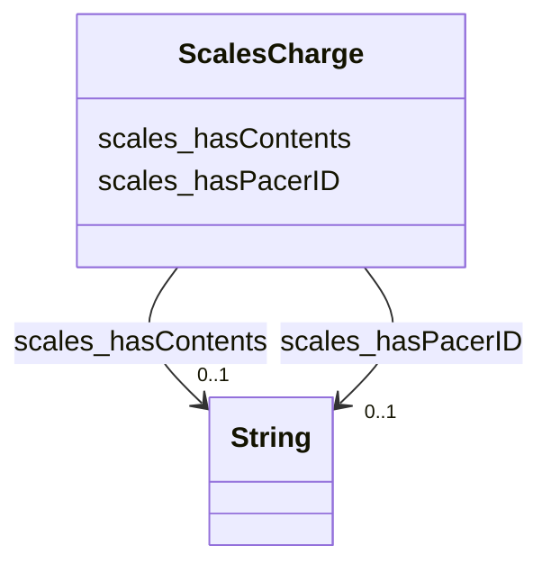

# Class: TODO -- what's a good name for this class (type)? (scales_Charge)


_TODO -- tell the world what this class (type) describes._


URI: [scales:Charge](http://schemas.scales-okn.org/rdf/scales#Charge)





<!-- no inheritance hierarchy -->


## Slots

| Name | Cardinality and Range | Description | Inheritance |
| ---  | --- | --- | --- |
| [scales_hasPacerID](../slots/scales_hasPacerID.md) | 0..1 <br/> [xsd:string](http://www.w3.org/2001/XMLSchema#string) | TODO -- tell the world what this slot (predicate) describes | direct |
| [scales_hasContents](../slots/scales_hasContents.md) | 0..1 <br/> [xsd:string](http://www.w3.org/2001/XMLSchema#string) | TODO -- tell the world what this slot (predicate) describes | direct |


## Usages

| used by | used in | type | used |
| ---  | --- | --- | --- |
| [ScalesAgent](../classes/ScalesAgent.md) | [scales_hasCharge](../slots/scales_hasCharge.md) | range | [ScalesCharge](../classes/ScalesCharge.md) |
| [ScalesCaseCriminal](../classes/ScalesCaseCriminal.md) | [scales_hasCharge](../slots/scales_hasCharge.md) | range | [ScalesCharge](../classes/ScalesCharge.md) |


## TODOs

* TODO -- Todos for this class go here
* or you can delete the todos
* if you think the class is perfect.

## Identifier and Mapping Information


### Schema Source


* from schema: scales-kg


## Mappings

| Mapping Type | Mapped Value |
| ---  | ---  |
| self | scales:Charge |
| native | scales-kg/:ScalesCharge |


## LinkML Source

<!-- TODO: investigate https://stackoverflow.com/questions/37606292/how-to-create-tabbed-code-blocks-in-mkdocs-or-sphinx -->

### Direct

<details>
```yaml
name: scales_Charge
description: TODO -- tell the world what this class (type) describes.
title: TODO -- what's a good name for this class (type)?
todos:
- TODO -- Todos for this class go here
- or you can delete the todos
- if you think the class is perfect.
notes:
- Class with 262292 occurences.
from_schema: scales-kg
slots:
- scales_hasPacerID
- scales_hasContents
class_uri: scales:Charge

```
</details>

### Induced

<details>
```yaml
name: scales_Charge
description: TODO -- tell the world what this class (type) describes.
title: TODO -- what's a good name for this class (type)?
todos:
- TODO -- Todos for this class go here
- or you can delete the todos
- if you think the class is perfect.
notes:
- Class with 262292 occurences.
from_schema: scales-kg
attributes:
  scales_hasPacerID:
    name: scales_hasPacerID
    description: TODO -- tell the world what this slot (predicate) describes.
    todos:
    - TODO -- Todos for this slot go here
    - or you can delete the todos
    - if you think the class is perfect.
    comments:
    - 561182 occurrences with subject type scales_CaseCivil and object type string.
    - 127619 occurrences with subject type scales_CaseCriminal and object type string.
    - 262292 occurrences with subject type scales_Charge and object type string.
    - 23661271 occurrences with subject type scales_DocketEntry and object type string.
    examples:
    - value: scales:CaseCivil/akd;;1:16-cv-00009 scales:hasPacerID 1:16-cv-00009
    - value: scales:CaseCriminal/iand;;1:17-cr-00012 scales:hasPacerID 1:17-cr-00012
    - value: scales:Charge/akd;;1:16-cr-00001_c1-3 scales:hasPacerID 1-3
    - value: scales:DocketEntry/akd;;1:16-cr-00001_de0 scales:hasPacerID 1
    from_schema: scales-kg
    rank: 1000
    slot_uri: scales:hasPacerID
    alias: scales_hasPacerID
    owner: scales_Charge
    domain_of:
    - scales_CaseCivil
    - scales_CaseCriminal
    - scales_Charge
    - scales_DocketEntry
    range: string
  scales_hasContents:
    name: scales_hasContents
    description: TODO -- tell the world what this slot (predicate) describes.
    todos:
    - TODO -- Todos for this slot go here
    - or you can delete the todos
    - if you think the class is perfect.
    comments:
    - 262292 occurrences with subject type scales_Charge and object type string.
    - 23661234 occurrences with subject type scales_DocketEntry and object type string.
    examples:
    - value: scales:Charge/akd;;1:16-cr-00001_c1-3 scales:hasContents 26:7203 WILLFUL
        FAILURE TO FILE INCOME TAX RETURNS
    - value: 'scales:DocketEntry/akd;;1:16-cr-00001_de0 scales:hasContents MISDEMEANOR
        INFORMATION as to 01169B9 (1) count(s) 1-4. (Attachments: # 1 Criminal Cover
        Sheet re Defendant 01169B9) (CLW, COURT STAFF) (Entered: 02/03/2016)'
    from_schema: scales-kg
    rank: 1000
    slot_uri: scales:hasContents
    alias: scales_hasContents
    owner: scales_Charge
    domain_of:
    - scales_Charge
    - scales_DocketEntry
    range: string
class_uri: scales:Charge

```
</details>