# Class: ScalesCivilCase


This class occurs 1795343 times.


URI: [scales:CivilCase](http://schemas.scales-okn.org/rdf/scales#CivilCase)

```mermaid
 classDiagram
    class ScalesCivilCase
    click ScalesCivilCase href "../ScalesCivilCase"
      ScalesCivilCase : jxdm72_CaseCourt
        
          
    
    
    ScalesCivilCase --> "0..1" Any : jxdm72_CaseCourt
    click Any href "../Any"

        
      ScalesCivilCase : jxdm72_CaseDefendantParty
        
          
    
    
    ScalesCivilCase --> "0..1" Any : jxdm72_CaseDefendantParty
    click Any href "../Any"

        
      ScalesCivilCase : jxdm72_CaseInitiatingParty
        
          
    
    
    ScalesCivilCase --> "0..1" Any : jxdm72_CaseInitiatingParty
    click Any href "../Any"

        
      ScalesCivilCase : jxdm72_CaseJudge
        
          
    
    
    ScalesCivilCase --> "0..1" Any : jxdm72_CaseJudge
    click Any href "../Any"

        
      ScalesCivilCase : jxdm72_StatuteKeywordText
        
          
    
    
    ScalesCivilCase --> "0..1" String : jxdm72_StatuteKeywordText
    click String href "../String"

        
      ScalesCivilCase : niem50_CaseDocketID
        
          
    
    
    ScalesCivilCase --> "0..1" String : niem50_CaseDocketID
    click String href "../String"

        
      ScalesCivilCase : niem50_CaseGeneralCategoryText
        
          
    
    
    ScalesCivilCase --> "0..1" String : niem50_CaseGeneralCategoryText
    click String href "../String"

        
      ScalesCivilCase : niem50_CaseSubCategoryText
        
          
    
    
    ScalesCivilCase --> "0..1" String : niem50_CaseSubCategoryText
    click String href "../String"

        
      ScalesCivilCase : niem50_EndDate
        
          
    
    
    ScalesCivilCase --> "0..1" Date : niem50_EndDate
    click Date href "../Date"

        
      ScalesCivilCase : niem50_JurisdictionText
        
          
    
    
    ScalesCivilCase --> "0..1" String : niem50_JurisdictionText
    click String href "../String"

        
      ScalesCivilCase : niem50_StartDate
        
          
    
    
    ScalesCivilCase --> "0..1" Date : niem50_StartDate
    click Date href "../Date"

        
      ScalesCivilCase : niem50_StatusDescriptionText
        
          
    
    
    ScalesCivilCase --> "0..1" String : niem50_StatusDescriptionText
    click String href "../String"

        
      ScalesCivilCase : scales_DocketTable
        
          
    
    
    ScalesCivilCase --> "0..1" Any : scales_DocketTable
    click Any href "../Any"

        
      ScalesCivilCase : scales_hasIdbAmtrec
        
          
    
    
    ScalesCivilCase --> "0..1" Double : scales_hasIdbAmtrec
    click Double href "../Double"

        
      ScalesCivilCase : scales_hasIdbArbit
        
          
    
    
    ScalesCivilCase --> "0..1" String : scales_hasIdbArbit
    click String href "../String"

        
      ScalesCivilCase : scales_hasIdbCircuit
        
          
    
    
    ScalesCivilCase --> "0..1" Double : scales_hasIdbCircuit
    click Double href "../Double"

        
      ScalesCivilCase : scales_hasIdbClassact
        
          
    
    
    ScalesCivilCase --> "0..1" Double : scales_hasIdbClassact
    click Double href "../Double"

        
      ScalesCivilCase : scales_hasIdbCounty
        
          
    
    
    ScalesCivilCase --> "0..1" Double : scales_hasIdbCounty
    click Double href "../Double"

        
      ScalesCivilCase : scales_hasIdbDef
        
          
    
    
    ScalesCivilCase --> "0..1" String : scales_hasIdbDef
    click String href "../String"

        
      ScalesCivilCase : scales_hasIdbDemanded
        
          
    
    
    ScalesCivilCase --> "0..1" Double : scales_hasIdbDemanded
    click Double href "../Double"

        
      ScalesCivilCase : scales_hasIdbDisp
        
          
    
    
    ScalesCivilCase --> "0..1" Double : scales_hasIdbDisp
    click Double href "../Double"

        
      ScalesCivilCase : scales_hasIdbDistrict
        
          
    
    
    ScalesCivilCase --> "0..1" String : scales_hasIdbDistrict
    click String href "../String"

        
      ScalesCivilCase : scales_hasIdbDjoined
        
          
    
    
    ScalesCivilCase --> "0..1" String : scales_hasIdbDjoined
    click String href "../String"

        
      ScalesCivilCase : scales_hasIdbDocket
        
          
    
    
    ScalesCivilCase --> "0..1" String : scales_hasIdbDocket
    click String href "../String"

        
      ScalesCivilCase : scales_hasIdbFdateuse
        
          
    
    
    ScalesCivilCase --> "0..1" String : scales_hasIdbFdateuse
    click String href "../String"

        
      ScalesCivilCase : scales_hasIdbFiledate
        
          
    
    
    ScalesCivilCase --> "0..1" Datetime : scales_hasIdbFiledate
    click Datetime href "../Datetime"

        
      ScalesCivilCase : scales_hasIdbIfp
        
          
    
    
    ScalesCivilCase --> "0..1" String : scales_hasIdbIfp
    click String href "../String"

        
      ScalesCivilCase : scales_hasIdbIs_stub
        
          
    
    
    ScalesCivilCase --> "0..1" Boolean : scales_hasIdbIs_stub
    click Boolean href "../Boolean"

        
      ScalesCivilCase : scales_hasIdbJudgment
        
          
    
    
    ScalesCivilCase --> "0..1" Double : scales_hasIdbJudgment
    click Double href "../Double"

        
      ScalesCivilCase : scales_hasIdbJuris
        
          
    
    
    ScalesCivilCase --> "0..1" Double : scales_hasIdbJuris
    click Double href "../Double"

        
      ScalesCivilCase : scales_hasIdbJury
        
          
    
    
    ScalesCivilCase --> "0..1" Any : scales_hasIdbJury
    click Any href "../Any"

        
      ScalesCivilCase : scales_hasIdbMdldock
        
          
    
    
    ScalesCivilCase --> "0..1" String : scales_hasIdbMdldock
    click String href "../String"

        
      ScalesCivilCase : scales_hasIdbNoj
        
          
    
    
    ScalesCivilCase --> "0..1" Double : scales_hasIdbNoj
    click Double href "../Double"

        
      ScalesCivilCase : scales_hasIdbNos
        
          
    
    
    ScalesCivilCase --> "0..1" String : scales_hasIdbNos
    click String href "../String"

        
      ScalesCivilCase : scales_hasIdbOffice
        
          
    
    
    ScalesCivilCase --> "0..1" String : scales_hasIdbOffice
    click String href "../String"

        
      ScalesCivilCase : scales_hasIdbOrigin
        
          
    
    
    ScalesCivilCase --> "0..1" Double : scales_hasIdbOrigin
    click Double href "../Double"

        
      ScalesCivilCase : scales_hasIdbPlt
        
          
    
    
    ScalesCivilCase --> "0..1" String : scales_hasIdbPlt
    click String href "../String"

        
      ScalesCivilCase : scales_hasIdbPretrial
        
          
    
    
    ScalesCivilCase --> "0..1" String : scales_hasIdbPretrial
    click String href "../String"

        
      ScalesCivilCase : scales_hasIdbProcprog
        
          
    
    
    ScalesCivilCase --> "0..1" Double : scales_hasIdbProcprog
    click Double href "../Double"

        
      ScalesCivilCase : scales_hasIdbProse
        
          
    
    
    ScalesCivilCase --> "0..1" Double : scales_hasIdbProse
    click Double href "../Double"

        
      ScalesCivilCase : scales_hasIdbResidenc
        
          
    
    
    ScalesCivilCase --> "0..1" Double : scales_hasIdbResidenc
    click Double href "../Double"

        
      ScalesCivilCase : scales_hasIdbSection
        
          
    
    
    ScalesCivilCase --> "0..1" String : scales_hasIdbSection
    click String href "../String"

        
      ScalesCivilCase : scales_hasIdbStatuscd
        
          
    
    
    ScalesCivilCase --> "0..1" String : scales_hasIdbStatuscd
    click String href "../String"

        
      ScalesCivilCase : scales_hasIdbSubsect
        
          
    
    
    ScalesCivilCase --> "0..1" String : scales_hasIdbSubsect
    click String href "../String"

        
      ScalesCivilCase : scales_hasIdbTapeyear
        
          
    
    
    ScalesCivilCase --> "0..1" Double : scales_hasIdbTapeyear
    click Double href "../Double"

        
      ScalesCivilCase : scales_hasIdbTdateuse
        
          
    
    
    ScalesCivilCase --> "0..1" String : scales_hasIdbTdateuse
    click String href "../String"

        
      ScalesCivilCase : scales_hasIdbTermdate
        
          
    
    
    ScalesCivilCase --> "0..1" Datetime : scales_hasIdbTermdate
    click Datetime href "../Datetime"

        
      ScalesCivilCase : scales_hasIdbTitl
        
          
    
    
    ScalesCivilCase --> "0..1" String : scales_hasIdbTitl
    click String href "../String"

        
      ScalesCivilCase : scales_hasIdbTransdat
        
          
    
    
    ScalesCivilCase --> "0..1" String : scales_hasIdbTransdat
    click String href "../String"

        
      ScalesCivilCase : scales_hasIdbTransdoc
        
          
    
    
    ScalesCivilCase --> "0..1" Double : scales_hasIdbTransdoc
    click Double href "../Double"

        
      ScalesCivilCase : scales_hasIdbTransoff
        
          
    
    
    ScalesCivilCase --> "0..1" String : scales_hasIdbTransoff
    click String href "../String"

        
      ScalesCivilCase : scales_hasIdbTransorg
        
          
    
    
    ScalesCivilCase --> "0..1" String : scales_hasIdbTransorg
    click String href "../String"

        
      ScalesCivilCase : scales_hasIdbTrclact
        
          
    
    
    ScalesCivilCase --> "0..1" Double : scales_hasIdbTrclact
    click Double href "../Double"

        
      ScalesCivilCase : scales_hasIdbTrialend
        
          
    
    
    ScalesCivilCase --> "0..1" String : scales_hasIdbTrialend
    click String href "../String"

        
      ScalesCivilCase : scales_hasIdbTribegan
        
          
    
    
    ScalesCivilCase --> "0..1" String : scales_hasIdbTribegan
    click String href "../String"

        
      ScalesCivilCase : scales_hasIdbTrmarb
        
          
    
    
    ScalesCivilCase --> "0..1" String : scales_hasIdbTrmarb
    click String href "../String"

        
      ScalesCivilCase : scales_hasMemberCase
        
          
    
    
    ScalesCivilCase --> "0..1" ScalesCivilCase : scales_hasMemberCase
    click ScalesCivilCase href "../ScalesCivilCase"

        
      ScalesCivilCase : scales_hasRelatedCase
        
          
    
    
    ScalesCivilCase --> "0..1" Any : scales_hasRelatedCase
    click Any href "../Any"

        
      ScalesCivilCase : scales_Party
        
          
    
    
    ScalesCivilCase --> "0..1" ScalesParty : scales_Party
    click ScalesParty href "../ScalesParty"

        
      
```





<!-- no inheritance hierarchy -->


## Slots

| Name | Cardinality and Range | Description | Inheritance | Occurrences |
| ---  | --- | --- | --- | --- |
| [niem50_JurisdictionText](../slots/niem50_JurisdictionText.md) | 0..1 <br/> [xsd:string](http://www.w3.org/2001/XMLSchema#string) |  <br/>  | direct | 1795338 |
| [scales_hasIdbDocket](../slots/scales_hasIdbDocket.md) | 0..1 <br/> [xsd:string](http://www.w3.org/2001/XMLSchema#string) |  <br/>  | direct | 702501 |
| [scales_hasIdbJudgment](../slots/scales_hasIdbJudgment.md) | 0..1 <br/> [xsd:double](http://www.w3.org/2001/XMLSchema#double) |  <br/>  | direct | 702501 |
| [scales_hasIdbTapeyear](../slots/scales_hasIdbTapeyear.md) | 0..1 <br/> [xsd:double](http://www.w3.org/2001/XMLSchema#double) |  <br/>  | direct | 702501 |
| [niem50_StartDate](../slots/niem50_StartDate.md) | 0..1 <br/> [xsd:date](http://www.w3.org/2001/XMLSchema#date) |  <br/>  | direct | 1795343 |
| [scales_hasIdbCircuit](../slots/scales_hasIdbCircuit.md) | 0..1 <br/> [xsd:double](http://www.w3.org/2001/XMLSchema#double) |  <br/>  | direct | 702501 |
| [scales_hasIdbNos](../slots/scales_hasIdbNos.md) | 0..1 <br/> [xsd:string](http://www.w3.org/2001/XMLSchema#string) |  <br/>  | direct | 702501 |
| [scales_hasIdbDistrict](../slots/scales_hasIdbDistrict.md) | 0..1 <br/> [xsd:string](http://www.w3.org/2001/XMLSchema#string) |  <br/>  | direct | 702501 |
| [scales_hasMemberCase](../slots/scales_hasMemberCase.md) | 0..1 <br/> [ScalesCivilCase](../classes/ScalesCivilCase.md) |  <br/>  | direct | 15136 |
| [scales_hasIdbResidenc](../slots/scales_hasIdbResidenc.md) | 0..1 <br/> [xsd:double](http://www.w3.org/2001/XMLSchema#double) |  <br/>  | direct | 702501 |
| [scales_hasIdbPretrial](../slots/scales_hasIdbPretrial.md) | 0..1 <br/> [xsd:string](http://www.w3.org/2001/XMLSchema#string) |  <br/>  | direct | 41491 |
| [scales_hasIdbDef](../slots/scales_hasIdbDef.md) | 0..1 <br/> [xsd:string](http://www.w3.org/2001/XMLSchema#string) |  <br/>  | direct | 702501 |
| [scales_hasIdbDemanded](../slots/scales_hasIdbDemanded.md) | 0..1 <br/> [xsd:double](http://www.w3.org/2001/XMLSchema#double) |  <br/>  | direct | 702501 |
| [scales_hasIdbIs_stub](../slots/scales_hasIdbIs_stub.md) | 0..1 <br/> [xsd:boolean](http://www.w3.org/2001/XMLSchema#boolean) |  <br/>  | direct | 702501 |
| [scales_hasIdbMdldock](../slots/scales_hasIdbMdldock.md) | 0..1 <br/> [xsd:string](http://www.w3.org/2001/XMLSchema#string) |  <br/>  | direct | 702501 |
| [scales_hasIdbFiledate](../slots/scales_hasIdbFiledate.md) | 0..1 <br/> [xsd:dateTime](http://www.w3.org/2001/XMLSchema#dateTime) |  <br/>  | direct | 702501 |
| [scales_hasIdbTrialend](../slots/scales_hasIdbTrialend.md) | 0..1 <br/> [xsd:string](http://www.w3.org/2001/XMLSchema#string) |  <br/>  | direct | 4417 |
| [scales_hasIdbTermdate](../slots/scales_hasIdbTermdate.md) | 0..1 <br/> [xsd:dateTime](http://www.w3.org/2001/XMLSchema#dateTime) |  <br/>  | direct | 662201 |
| [niem50_CaseSubCategoryText](../slots/niem50_CaseSubCategoryText.md) | 0..1 <br/> [xsd:string](http://www.w3.org/2001/XMLSchema#string) |  <br/>  | direct | 1863523 |
| [scales_hasIdbSection](../slots/scales_hasIdbSection.md) | 0..1 <br/> [xsd:string](http://www.w3.org/2001/XMLSchema#string) |  <br/>  | direct | 702501 |
| [jxdm72_StatuteKeywordText](../slots/jxdm72_StatuteKeywordText.md) | 0..1 <br/> [xsd:string](http://www.w3.org/2001/XMLSchema#string) |  <br/>  | direct | 718593 |
| [scales_hasIdbJury](../slots/scales_hasIdbJury.md) | 0..1 <br/> [xsd:integer](http://www.w3.org/2001/XMLSchema#integer)&nbsp;or&nbsp;<br />[xsd:string](http://www.w3.org/2001/XMLSchema#string) |  <br/>  | direct | 702501 |
| [jxdm72_CaseInitiatingParty](../slots/jxdm72_CaseInitiatingParty.md) | 0..1 <br/> [Jxdm72CaseInitiatingParty](../classes/Jxdm72CaseInitiatingParty.md)&nbsp;or&nbsp;<br />[ScalesParty](../classes/ScalesParty.md) |  <br/>  | direct | 2679702 |
| [niem50_EndDate](../slots/niem50_EndDate.md) | 0..1 <br/> [xsd:date](http://www.w3.org/2001/XMLSchema#date) |  <br/>  | direct | 1624005 |
| [jxdm72_CaseJudge](../slots/jxdm72_CaseJudge.md) | 0..1 <br/> [Jxdm72CaseJudge](../classes/Jxdm72CaseJudge.md)&nbsp;or&nbsp;<br />[xsd:anyURI](http://www.w3.org/2001/XMLSchema#anyURI) |  <br/>  | direct | 2061004 |
| [scales_hasIdbJuris](../slots/scales_hasIdbJuris.md) | 0..1 <br/> [xsd:double](http://www.w3.org/2001/XMLSchema#double) |  <br/>  | direct | 702501 |
| [scales_DocketTable](../slots/scales_DocketTable.md) | 0..1 <br/> [Jxdm72RegisterOfActions](../classes/Jxdm72RegisterOfActions.md)&nbsp;or&nbsp;<br />[Jxdm72RegisterAction](../classes/Jxdm72RegisterAction.md) |  <br/>  | direct | 2506239 |
| [scales_hasIdbDisp](../slots/scales_hasIdbDisp.md) | 0..1 <br/> [xsd:double](http://www.w3.org/2001/XMLSchema#double) |  <br/>  | direct | 702501 |
| [scales_hasIdbIfp](../slots/scales_hasIdbIfp.md) | 0..1 <br/> [xsd:string](http://www.w3.org/2001/XMLSchema#string) |  <br/>  | direct | 702500 |
| [scales_hasIdbTrmarb](../slots/scales_hasIdbTrmarb.md) | 0..1 <br/> [xsd:string](http://www.w3.org/2001/XMLSchema#string) |  <br/>  | direct | 702501 |
| [scales_hasIdbStatuscd](../slots/scales_hasIdbStatuscd.md) | 0..1 <br/> [xsd:string](http://www.w3.org/2001/XMLSchema#string) |  <br/>  | direct | 702500 |
| [scales_hasIdbProse](../slots/scales_hasIdbProse.md) | 0..1 <br/> [xsd:double](http://www.w3.org/2001/XMLSchema#double) |  <br/>  | direct | 702501 |
| [scales_hasIdbOffice](../slots/scales_hasIdbOffice.md) | 0..1 <br/> [xsd:string](http://www.w3.org/2001/XMLSchema#string) |  <br/>  | direct | 702501 |
| [scales_hasIdbTrclact](../slots/scales_hasIdbTrclact.md) | 0..1 <br/> [xsd:double](http://www.w3.org/2001/XMLSchema#double) |  <br/>  | direct | 702501 |
| [scales_Party](../slots/scales_Party.md) | 0..1 <br/> [ScalesParty](../classes/ScalesParty.md) |  <br/>  | direct | 360933 |
| [scales_hasIdbOrigin](../slots/scales_hasIdbOrigin.md) | 0..1 <br/> [xsd:double](http://www.w3.org/2001/XMLSchema#double) |  <br/>  | direct | 702501 |
| [scales_hasIdbTransdoc](../slots/scales_hasIdbTransdoc.md) | 0..1 <br/> [xsd:double](http://www.w3.org/2001/XMLSchema#double) |  <br/>  | direct | 702501 |
| [niem50_CaseGeneralCategoryText](../slots/niem50_CaseGeneralCategoryText.md) | 0..1 <br/> [xsd:string](http://www.w3.org/2001/XMLSchema#string) |  <br/>  | direct | 1795343 |
| [scales_hasIdbTransorg](../slots/scales_hasIdbTransorg.md) | 0..1 <br/> [xsd:string](http://www.w3.org/2001/XMLSchema#string) |  <br/>  | direct | 702501 |
| [scales_hasRelatedCase](../slots/scales_hasRelatedCase.md) | 0..1 <br/> [ScalesCivilCase](../classes/ScalesCivilCase.md)&nbsp;or&nbsp;<br />[ScalesCriminalCase](../classes/ScalesCriminalCase.md)&nbsp;or&nbsp;<br />[xsd:anyURI](http://www.w3.org/2001/XMLSchema#anyURI) |  <br/>  | direct | 121657 |
| [niem50_CaseDocketID](../slots/niem50_CaseDocketID.md) | 0..1 <br/> [xsd:string](http://www.w3.org/2001/XMLSchema#string) |  <br/>  | direct | 1795343 |
| [scales_hasIdbCounty](../slots/scales_hasIdbCounty.md) | 0..1 <br/> [xsd:double](http://www.w3.org/2001/XMLSchema#double) |  <br/>  | direct | 702501 |
| [scales_hasIdbAmtrec](../slots/scales_hasIdbAmtrec.md) | 0..1 <br/> [xsd:double](http://www.w3.org/2001/XMLSchema#double) |  <br/>  | direct | 702501 |
| [scales_hasIdbProcprog](../slots/scales_hasIdbProcprog.md) | 0..1 <br/> [xsd:double](http://www.w3.org/2001/XMLSchema#double) |  <br/>  | direct | 702501 |
| [jxdm72_CaseDefendantParty](../slots/jxdm72_CaseDefendantParty.md) | 0..1 <br/> [Jxdm72CaseDefendantParty](../classes/Jxdm72CaseDefendantParty.md)&nbsp;or&nbsp;<br />[ScalesParty](../classes/ScalesParty.md) |  <br/>  | direct | 3669437 |
| [scales_hasIdbNoj](../slots/scales_hasIdbNoj.md) | 0..1 <br/> [xsd:double](http://www.w3.org/2001/XMLSchema#double) |  <br/>  | direct | 702501 |
| [scales_hasIdbTitl](../slots/scales_hasIdbTitl.md) | 0..1 <br/> [xsd:string](http://www.w3.org/2001/XMLSchema#string) |  <br/>  | direct | 325292 |
| [scales_hasIdbArbit](../slots/scales_hasIdbArbit.md) | 0..1 <br/> [xsd:string](http://www.w3.org/2001/XMLSchema#string) |  <br/>  | direct | 702501 |
| [scales_hasIdbSubsect](../slots/scales_hasIdbSubsect.md) | 0..1 <br/> [xsd:string](http://www.w3.org/2001/XMLSchema#string) |  <br/>  | direct | 702501 |
| [scales_hasIdbDjoined](../slots/scales_hasIdbDjoined.md) | 0..1 <br/> [xsd:string](http://www.w3.org/2001/XMLSchema#string) |  <br/>  | direct | 275529 |
| [scales_hasIdbTransoff](../slots/scales_hasIdbTransoff.md) | 0..1 <br/> [xsd:string](http://www.w3.org/2001/XMLSchema#string) |  <br/>  | direct | 702501 |
| [scales_hasIdbFdateuse](../slots/scales_hasIdbFdateuse.md) | 0..1 <br/> [xsd:string](http://www.w3.org/2001/XMLSchema#string) |  <br/>  | direct | 702501 |
| [scales_hasIdbClassact](../slots/scales_hasIdbClassact.md) | 0..1 <br/> [xsd:double](http://www.w3.org/2001/XMLSchema#double) |  <br/>  | direct | 702501 |
| [scales_hasIdbTribegan](../slots/scales_hasIdbTribegan.md) | 0..1 <br/> [xsd:string](http://www.w3.org/2001/XMLSchema#string) |  <br/>  | direct | 3565 |
| [scales_hasIdbTdateuse](../slots/scales_hasIdbTdateuse.md) | 0..1 <br/> [xsd:string](http://www.w3.org/2001/XMLSchema#string) |  <br/>  | direct | 662201 |
| [niem50_StatusDescriptionText](../slots/niem50_StatusDescriptionText.md) | 0..1 <br/> [xsd:string](http://www.w3.org/2001/XMLSchema#string) |  <br/>  | direct | 1795343 |
| [jxdm72_CaseCourt](../slots/jxdm72_CaseCourt.md) | 0..1 <br/> [Jxdm72Court](../classes/Jxdm72Court.md)&nbsp;or&nbsp;<br />[xsd:string](http://www.w3.org/2001/XMLSchema#string) |  <br/>  | direct | 1795343 |
| [scales_hasIdbTransdat](../slots/scales_hasIdbTransdat.md) | 0..1 <br/> [xsd:string](http://www.w3.org/2001/XMLSchema#string) |  <br/>  | direct | 6137 |
| [scales_hasIdbPlt](../slots/scales_hasIdbPlt.md) | 0..1 <br/> [xsd:string](http://www.w3.org/2001/XMLSchema#string) |  <br/>  | direct | 702493 |


## Usages

| used by | used in | type | used |
| ---  | --- | --- | --- |
| [ScalesCivilCase](../classes/ScalesCivilCase.md) | [scales_hasMemberCase](../slots/scales_hasMemberCase.md) | range | [ScalesCivilCase](../classes/ScalesCivilCase.md) |
| [ScalesCivilCase](../classes/ScalesCivilCase.md) | [scales_hasRelatedCase](../slots/scales_hasRelatedCase.md) | any_of[range] | [ScalesCivilCase](../classes/ScalesCivilCase.md) |
| [ScalesCriminalCase](../classes/ScalesCriminalCase.md) | [scales_hasRelatedCase](../slots/scales_hasRelatedCase.md) | any_of[range] | [ScalesCivilCase](../classes/ScalesCivilCase.md) |
| [ScalesCriminalCase](../classes/ScalesCriminalCase.md) | [scales_hasMemberCase](../slots/scales_hasMemberCase.md) | range | [ScalesCivilCase](../classes/ScalesCivilCase.md) |


## LinkML Source

<!-- TODO: investigate https://stackoverflow.com/questions/37606292/how-to-create-tabbed-code-blocks-in-mkdocs-or-sphinx -->

### Direct

<details>

```yaml
name: scales_CivilCase
from_schema: okns:scales-kg
rank: 1000
slots:
- niem50_JurisdictionText
- scales_hasIdbDocket
- scales_hasIdbJudgment
- scales_hasIdbTapeyear
- niem50_StartDate
- scales_hasIdbCircuit
- scales_hasIdbNos
- scales_hasIdbDistrict
- scales_hasMemberCase
- scales_hasIdbResidenc
- scales_hasIdbPretrial
- scales_hasIdbDef
- scales_hasIdbDemanded
- scales_hasIdbIs_stub
- scales_hasIdbMdldock
- scales_hasIdbFiledate
- scales_hasIdbTrialend
- scales_hasIdbTermdate
- niem50_CaseSubCategoryText
- scales_hasIdbSection
- jxdm72_StatuteKeywordText
- scales_hasIdbJury
- jxdm72_CaseInitiatingParty
- niem50_EndDate
- jxdm72_CaseJudge
- scales_hasIdbJuris
- scales_DocketTable
- scales_hasIdbDisp
- scales_hasIdbIfp
- scales_hasIdbTrmarb
- scales_hasIdbStatuscd
- scales_hasIdbProse
- scales_hasIdbOffice
- scales_hasIdbTrclact
- scales_Party
- scales_hasIdbOrigin
- scales_hasIdbTransdoc
- niem50_CaseGeneralCategoryText
- scales_hasIdbTransorg
- scales_hasRelatedCase
- niem50_CaseDocketID
- scales_hasIdbCounty
- scales_hasIdbAmtrec
- scales_hasIdbProcprog
- jxdm72_CaseDefendantParty
- scales_hasIdbNoj
- scales_hasIdbTitl
- scales_hasIdbArbit
- scales_hasIdbSubsect
- scales_hasIdbDjoined
- scales_hasIdbTransoff
- scales_hasIdbFdateuse
- scales_hasIdbClassact
- scales_hasIdbTribegan
- scales_hasIdbTdateuse
- niem50_StatusDescriptionText
- jxdm72_CaseCourt
- scales_hasIdbTransdat
- scales_hasIdbPlt
class_uri: scales:CivilCase

```
</details>

### Induced

<details>

```yaml
name: scales_CivilCase
from_schema: okns:scales-kg
rank: 1000
attributes:
  niem50_JurisdictionText:
    name: niem50_JurisdictionText
    from_schema: okns:scales-kg
    rank: 1000
    slot_uri: niem50:JurisdictionText
    alias: niem50_JurisdictionText
    owner: scales_CivilCase
    domain_of:
    - scales_CivilCase
    - scales_CriminalCase
    range: string
  scales_hasIdbDocket:
    name: scales_hasIdbDocket
    from_schema: okns:scales-kg
    rank: 1000
    slot_uri: scales:hasIdbDocket
    alias: scales_hasIdbDocket
    owner: scales_CivilCase
    domain_of:
    - scales_CivilCase
    - scales_CriminalCase
    range: string
  scales_hasIdbJudgment:
    name: scales_hasIdbJudgment
    from_schema: okns:scales-kg
    rank: 1000
    slot_uri: scales:hasIdbJudgment
    alias: scales_hasIdbJudgment
    owner: scales_CivilCase
    domain_of:
    - scales_CivilCase
    range: double
  scales_hasIdbTapeyear:
    name: scales_hasIdbTapeyear
    from_schema: okns:scales-kg
    rank: 1000
    slot_uri: scales:hasIdbTapeyear
    alias: scales_hasIdbTapeyear
    owner: scales_CivilCase
    domain_of:
    - scales_CivilCase
    - scales_CriminalCase
    range: double
  niem50_StartDate:
    name: niem50_StartDate
    from_schema: okns:scales-kg
    rank: 1000
    slot_uri: niem50:StartDate
    alias: niem50_StartDate
    owner: scales_CivilCase
    domain_of:
    - scales_CivilCase
    - scales_CriminalCase
    range: date
  scales_hasIdbCircuit:
    name: scales_hasIdbCircuit
    from_schema: okns:scales-kg
    rank: 1000
    slot_uri: scales:hasIdbCircuit
    alias: scales_hasIdbCircuit
    owner: scales_CivilCase
    domain_of:
    - scales_CivilCase
    - scales_CriminalCase
    range: double
  scales_hasIdbNos:
    name: scales_hasIdbNos
    from_schema: okns:scales-kg
    rank: 1000
    slot_uri: scales:hasIdbNos
    alias: scales_hasIdbNos
    owner: scales_CivilCase
    domain_of:
    - scales_CivilCase
    range: string
  scales_hasIdbDistrict:
    name: scales_hasIdbDistrict
    from_schema: okns:scales-kg
    rank: 1000
    slot_uri: scales:hasIdbDistrict
    alias: scales_hasIdbDistrict
    owner: scales_CivilCase
    domain_of:
    - scales_CivilCase
    - scales_CriminalCase
    range: string
  scales_hasMemberCase:
    name: scales_hasMemberCase
    from_schema: okns:scales-kg
    rank: 1000
    slot_uri: scales:hasMemberCase
    alias: scales_hasMemberCase
    owner: scales_CivilCase
    domain_of:
    - scales_CivilCase
    - scales_CriminalCase
    range: scales_CivilCase
  scales_hasIdbResidenc:
    name: scales_hasIdbResidenc
    from_schema: okns:scales-kg
    rank: 1000
    slot_uri: scales:hasIdbResidenc
    alias: scales_hasIdbResidenc
    owner: scales_CivilCase
    domain_of:
    - scales_CivilCase
    range: double
  scales_hasIdbPretrial:
    name: scales_hasIdbPretrial
    from_schema: okns:scales-kg
    rank: 1000
    slot_uri: scales:hasIdbPretrial
    alias: scales_hasIdbPretrial
    owner: scales_CivilCase
    domain_of:
    - scales_CivilCase
    range: string
  scales_hasIdbDef:
    name: scales_hasIdbDef
    from_schema: okns:scales-kg
    rank: 1000
    slot_uri: scales:hasIdbDef
    alias: scales_hasIdbDef
    owner: scales_CivilCase
    domain_of:
    - scales_CivilCase
    range: string
  scales_hasIdbDemanded:
    name: scales_hasIdbDemanded
    from_schema: okns:scales-kg
    rank: 1000
    slot_uri: scales:hasIdbDemanded
    alias: scales_hasIdbDemanded
    owner: scales_CivilCase
    domain_of:
    - scales_CivilCase
    range: double
  scales_hasIdbIs_stub:
    name: scales_hasIdbIs_stub
    from_schema: okns:scales-kg
    rank: 1000
    slot_uri: scales:hasIdbIs_stub
    alias: scales_hasIdbIs_stub
    owner: scales_CivilCase
    domain_of:
    - scales_CivilCase
    - scales_CriminalCase
    range: boolean
  scales_hasIdbMdldock:
    name: scales_hasIdbMdldock
    from_schema: okns:scales-kg
    rank: 1000
    slot_uri: scales:hasIdbMdldock
    alias: scales_hasIdbMdldock
    owner: scales_CivilCase
    domain_of:
    - scales_CivilCase
    range: string
  scales_hasIdbFiledate:
    name: scales_hasIdbFiledate
    from_schema: okns:scales-kg
    rank: 1000
    slot_uri: scales:hasIdbFiledate
    alias: scales_hasIdbFiledate
    owner: scales_CivilCase
    domain_of:
    - scales_CivilCase
    - scales_CriminalCase
    range: datetime
  scales_hasIdbTrialend:
    name: scales_hasIdbTrialend
    from_schema: okns:scales-kg
    rank: 1000
    slot_uri: scales:hasIdbTrialend
    alias: scales_hasIdbTrialend
    owner: scales_CivilCase
    domain_of:
    - scales_CivilCase
    range: string
  scales_hasIdbTermdate:
    name: scales_hasIdbTermdate
    from_schema: okns:scales-kg
    rank: 1000
    slot_uri: scales:hasIdbTermdate
    alias: scales_hasIdbTermdate
    owner: scales_CivilCase
    domain_of:
    - scales_CivilCase
    - scales_CriminalCase
    range: datetime
  niem50_CaseSubCategoryText:
    name: niem50_CaseSubCategoryText
    from_schema: okns:scales-kg
    rank: 1000
    slot_uri: niem50:CaseSubCategoryText
    alias: niem50_CaseSubCategoryText
    owner: scales_CivilCase
    domain_of:
    - scales_CivilCase
    range: string
  scales_hasIdbSection:
    name: scales_hasIdbSection
    from_schema: okns:scales-kg
    rank: 1000
    slot_uri: scales:hasIdbSection
    alias: scales_hasIdbSection
    owner: scales_CivilCase
    domain_of:
    - scales_CivilCase
    range: string
  jxdm72_StatuteKeywordText:
    name: jxdm72_StatuteKeywordText
    from_schema: okns:scales-kg
    rank: 1000
    slot_uri: jxdm72:StatuteKeywordText
    alias: jxdm72_StatuteKeywordText
    owner: scales_CivilCase
    domain_of:
    - scales_CivilCase
    range: string
  scales_hasIdbJury:
    name: scales_hasIdbJury
    from_schema: okns:scales-kg
    rank: 1000
    slot_uri: scales:hasIdbJury
    alias: scales_hasIdbJury
    owner: scales_CivilCase
    domain_of:
    - scales_CivilCase
    range: Any
    any_of:
    - range: integer
    - range: string
  jxdm72_CaseInitiatingParty:
    name: jxdm72_CaseInitiatingParty
    from_schema: okns:scales-kg
    rank: 1000
    slot_uri: jxdm72:CaseInitiatingParty
    alias: jxdm72_CaseInitiatingParty
    owner: scales_CivilCase
    domain_of:
    - scales_CivilCase
    - scales_CriminalCase
    range: Any
    any_of:
    - range: jxdm72_CaseInitiatingParty
    - range: scales_Party
  niem50_EndDate:
    name: niem50_EndDate
    from_schema: okns:scales-kg
    rank: 1000
    slot_uri: niem50:EndDate
    alias: niem50_EndDate
    owner: scales_CivilCase
    domain_of:
    - scales_CivilCase
    - scales_CriminalCase
    range: date
  jxdm72_CaseJudge:
    name: jxdm72_CaseJudge
    from_schema: okns:scales-kg
    rank: 1000
    slot_uri: jxdm72:CaseJudge
    alias: jxdm72_CaseJudge
    owner: scales_CivilCase
    domain_of:
    - scales_CivilCase
    - scales_CriminalCase
    range: Any
    any_of:
    - range: jxdm72_CaseJudge
    - range: uri
  scales_hasIdbJuris:
    name: scales_hasIdbJuris
    from_schema: okns:scales-kg
    rank: 1000
    slot_uri: scales:hasIdbJuris
    alias: scales_hasIdbJuris
    owner: scales_CivilCase
    domain_of:
    - scales_CivilCase
    range: double
  scales_DocketTable:
    name: scales_DocketTable
    from_schema: okns:scales-kg
    rank: 1000
    slot_uri: scales:DocketTable
    alias: scales_DocketTable
    owner: scales_CivilCase
    domain_of:
    - scales_CivilCase
    - scales_CriminalCase
    range: Any
    any_of:
    - range: jxdm72_RegisterOfActions
    - range: jxdm72_RegisterAction
  scales_hasIdbDisp:
    name: scales_hasIdbDisp
    from_schema: okns:scales-kg
    rank: 1000
    slot_uri: scales:hasIdbDisp
    alias: scales_hasIdbDisp
    owner: scales_CivilCase
    domain_of:
    - scales_CivilCase
    range: double
  scales_hasIdbIfp:
    name: scales_hasIdbIfp
    from_schema: okns:scales-kg
    rank: 1000
    slot_uri: scales:hasIdbIfp
    alias: scales_hasIdbIfp
    owner: scales_CivilCase
    domain_of:
    - scales_CivilCase
    range: string
  scales_hasIdbTrmarb:
    name: scales_hasIdbTrmarb
    from_schema: okns:scales-kg
    rank: 1000
    slot_uri: scales:hasIdbTrmarb
    alias: scales_hasIdbTrmarb
    owner: scales_CivilCase
    domain_of:
    - scales_CivilCase
    range: string
  scales_hasIdbStatuscd:
    name: scales_hasIdbStatuscd
    from_schema: okns:scales-kg
    rank: 1000
    slot_uri: scales:hasIdbStatuscd
    alias: scales_hasIdbStatuscd
    owner: scales_CivilCase
    domain_of:
    - scales_CivilCase
    - scales_CriminalCase
    range: string
  scales_hasIdbProse:
    name: scales_hasIdbProse
    from_schema: okns:scales-kg
    rank: 1000
    slot_uri: scales:hasIdbProse
    alias: scales_hasIdbProse
    owner: scales_CivilCase
    domain_of:
    - scales_CivilCase
    range: double
  scales_hasIdbOffice:
    name: scales_hasIdbOffice
    from_schema: okns:scales-kg
    rank: 1000
    slot_uri: scales:hasIdbOffice
    alias: scales_hasIdbOffice
    owner: scales_CivilCase
    domain_of:
    - scales_CivilCase
    - scales_CriminalCase
    range: string
  scales_hasIdbTrclact:
    name: scales_hasIdbTrclact
    from_schema: okns:scales-kg
    rank: 1000
    slot_uri: scales:hasIdbTrclact
    alias: scales_hasIdbTrclact
    owner: scales_CivilCase
    domain_of:
    - scales_CivilCase
    range: double
  scales_Party:
    name: scales_Party
    from_schema: okns:scales-kg
    rank: 1000
    slot_uri: scales:Party
    alias: scales_Party
    owner: scales_CivilCase
    domain_of:
    - scales_CivilCase
    - scales_CriminalCase
    range: scales_Party
  scales_hasIdbOrigin:
    name: scales_hasIdbOrigin
    from_schema: okns:scales-kg
    rank: 1000
    slot_uri: scales:hasIdbOrigin
    alias: scales_hasIdbOrigin
    owner: scales_CivilCase
    domain_of:
    - scales_CivilCase
    range: double
  scales_hasIdbTransdoc:
    name: scales_hasIdbTransdoc
    from_schema: okns:scales-kg
    rank: 1000
    slot_uri: scales:hasIdbTransdoc
    alias: scales_hasIdbTransdoc
    owner: scales_CivilCase
    domain_of:
    - scales_CivilCase
    range: double
  niem50_CaseGeneralCategoryText:
    name: niem50_CaseGeneralCategoryText
    from_schema: okns:scales-kg
    rank: 1000
    slot_uri: niem50:CaseGeneralCategoryText
    alias: niem50_CaseGeneralCategoryText
    owner: scales_CivilCase
    domain_of:
    - scales_CivilCase
    - scales_CriminalCase
    range: string
  scales_hasIdbTransorg:
    name: scales_hasIdbTransorg
    from_schema: okns:scales-kg
    rank: 1000
    slot_uri: scales:hasIdbTransorg
    alias: scales_hasIdbTransorg
    owner: scales_CivilCase
    domain_of:
    - scales_CivilCase
    range: string
  scales_hasRelatedCase:
    name: scales_hasRelatedCase
    from_schema: okns:scales-kg
    rank: 1000
    slot_uri: scales:hasRelatedCase
    alias: scales_hasRelatedCase
    owner: scales_CivilCase
    domain_of:
    - scales_CivilCase
    - scales_CriminalCase
    range: Any
    any_of:
    - range: scales_CivilCase
    - range: scales_CriminalCase
    - range: uri
  niem50_CaseDocketID:
    name: niem50_CaseDocketID
    from_schema: okns:scales-kg
    rank: 1000
    slot_uri: niem50:CaseDocketID
    alias: niem50_CaseDocketID
    owner: scales_CivilCase
    domain_of:
    - scales_CivilCase
    - scales_CriminalCase
    range: string
  scales_hasIdbCounty:
    name: scales_hasIdbCounty
    from_schema: okns:scales-kg
    rank: 1000
    slot_uri: scales:hasIdbCounty
    alias: scales_hasIdbCounty
    owner: scales_CivilCase
    domain_of:
    - scales_CivilCase
    - scales_CriminalCase
    range: double
  scales_hasIdbAmtrec:
    name: scales_hasIdbAmtrec
    from_schema: okns:scales-kg
    rank: 1000
    slot_uri: scales:hasIdbAmtrec
    alias: scales_hasIdbAmtrec
    owner: scales_CivilCase
    domain_of:
    - scales_CivilCase
    range: double
  scales_hasIdbProcprog:
    name: scales_hasIdbProcprog
    from_schema: okns:scales-kg
    rank: 1000
    slot_uri: scales:hasIdbProcprog
    alias: scales_hasIdbProcprog
    owner: scales_CivilCase
    domain_of:
    - scales_CivilCase
    range: double
  jxdm72_CaseDefendantParty:
    name: jxdm72_CaseDefendantParty
    from_schema: okns:scales-kg
    rank: 1000
    slot_uri: jxdm72:CaseDefendantParty
    alias: jxdm72_CaseDefendantParty
    owner: scales_CivilCase
    domain_of:
    - scales_CivilCase
    - scales_CriminalCase
    range: Any
    any_of:
    - range: jxdm72_CaseDefendantParty
    - range: scales_Party
  scales_hasIdbNoj:
    name: scales_hasIdbNoj
    from_schema: okns:scales-kg
    rank: 1000
    slot_uri: scales:hasIdbNoj
    alias: scales_hasIdbNoj
    owner: scales_CivilCase
    domain_of:
    - scales_CivilCase
    range: double
  scales_hasIdbTitl:
    name: scales_hasIdbTitl
    from_schema: okns:scales-kg
    rank: 1000
    slot_uri: scales:hasIdbTitl
    alias: scales_hasIdbTitl
    owner: scales_CivilCase
    domain_of:
    - scales_CivilCase
    range: string
  scales_hasIdbArbit:
    name: scales_hasIdbArbit
    from_schema: okns:scales-kg
    rank: 1000
    slot_uri: scales:hasIdbArbit
    alias: scales_hasIdbArbit
    owner: scales_CivilCase
    domain_of:
    - scales_CivilCase
    range: string
  scales_hasIdbSubsect:
    name: scales_hasIdbSubsect
    from_schema: okns:scales-kg
    rank: 1000
    slot_uri: scales:hasIdbSubsect
    alias: scales_hasIdbSubsect
    owner: scales_CivilCase
    domain_of:
    - scales_CivilCase
    range: string
  scales_hasIdbDjoined:
    name: scales_hasIdbDjoined
    from_schema: okns:scales-kg
    rank: 1000
    slot_uri: scales:hasIdbDjoined
    alias: scales_hasIdbDjoined
    owner: scales_CivilCase
    domain_of:
    - scales_CivilCase
    range: string
  scales_hasIdbTransoff:
    name: scales_hasIdbTransoff
    from_schema: okns:scales-kg
    rank: 1000
    slot_uri: scales:hasIdbTransoff
    alias: scales_hasIdbTransoff
    owner: scales_CivilCase
    domain_of:
    - scales_CivilCase
    range: string
  scales_hasIdbFdateuse:
    name: scales_hasIdbFdateuse
    from_schema: okns:scales-kg
    rank: 1000
    slot_uri: scales:hasIdbFdateuse
    alias: scales_hasIdbFdateuse
    owner: scales_CivilCase
    domain_of:
    - scales_CivilCase
    range: string
  scales_hasIdbClassact:
    name: scales_hasIdbClassact
    from_schema: okns:scales-kg
    rank: 1000
    slot_uri: scales:hasIdbClassact
    alias: scales_hasIdbClassact
    owner: scales_CivilCase
    domain_of:
    - scales_CivilCase
    range: double
  scales_hasIdbTribegan:
    name: scales_hasIdbTribegan
    from_schema: okns:scales-kg
    rank: 1000
    slot_uri: scales:hasIdbTribegan
    alias: scales_hasIdbTribegan
    owner: scales_CivilCase
    domain_of:
    - scales_CivilCase
    range: string
  scales_hasIdbTdateuse:
    name: scales_hasIdbTdateuse
    from_schema: okns:scales-kg
    rank: 1000
    slot_uri: scales:hasIdbTdateuse
    alias: scales_hasIdbTdateuse
    owner: scales_CivilCase
    domain_of:
    - scales_CivilCase
    range: string
  niem50_StatusDescriptionText:
    name: niem50_StatusDescriptionText
    from_schema: okns:scales-kg
    rank: 1000
    slot_uri: niem50:StatusDescriptionText
    alias: niem50_StatusDescriptionText
    owner: scales_CivilCase
    domain_of:
    - scales_CivilCase
    - scales_CriminalCase
    range: string
  jxdm72_CaseCourt:
    name: jxdm72_CaseCourt
    from_schema: okns:scales-kg
    rank: 1000
    slot_uri: jxdm72:CaseCourt
    alias: jxdm72_CaseCourt
    owner: scales_CivilCase
    domain_of:
    - scales_CivilCase
    - scales_CriminalCase
    range: Any
    any_of:
    - range: jxdm72_Court
    - range: string
  scales_hasIdbTransdat:
    name: scales_hasIdbTransdat
    from_schema: okns:scales-kg
    rank: 1000
    slot_uri: scales:hasIdbTransdat
    alias: scales_hasIdbTransdat
    owner: scales_CivilCase
    domain_of:
    - scales_CivilCase
    range: string
  scales_hasIdbPlt:
    name: scales_hasIdbPlt
    from_schema: okns:scales-kg
    rank: 1000
    slot_uri: scales:hasIdbPlt
    alias: scales_hasIdbPlt
    owner: scales_CivilCase
    domain_of:
    - scales_CivilCase
    range: string
class_uri: scales:CivilCase

```
</details>