# Class: No class (type) name specified (scales_CivilCase)


_No class (type) description specified_


This class occurs 1795343 times.


URI: [scales:CivilCase](http://schemas.scales-okn.org/rdf/scales#CivilCase)

```mermaid
 classDiagram
    class ScalesCivilCase
    click ScalesCivilCase href "../ScalesCivilCase"
      ScalesCivilCase : http___release.niem.gov_niem_domains_jxdm_7.2_CaseCourt
        
          
    
    
    ScalesCivilCase --> "0..1" Any : http___release.niem.gov_niem_domains_jxdm_7.2_CaseCourt
    click Any href "../Any"

        
      ScalesCivilCase : http___release.niem.gov_niem_domains_jxdm_7.2_CaseDefendantParty
        
          
    
    
    ScalesCivilCase --> "0..1" Any : http___release.niem.gov_niem_domains_jxdm_7.2_CaseDefendantParty
    click Any href "../Any"

        
      ScalesCivilCase : http___release.niem.gov_niem_domains_jxdm_7.2_CaseInitiatingParty
        
          
    
    
    ScalesCivilCase --> "0..1" Any : http___release.niem.gov_niem_domains_jxdm_7.2_CaseInitiatingParty
    click Any href "../Any"

        
      ScalesCivilCase : http___release.niem.gov_niem_domains_jxdm_7.2_CaseJudge
        
          
    
    
    ScalesCivilCase --> "0..1" Any : http___release.niem.gov_niem_domains_jxdm_7.2_CaseJudge
    click Any href "../Any"

        
      ScalesCivilCase : http___release.niem.gov_niem_domains_jxdm_7.2_StatuteKeywordText
        
          
    
    
    ScalesCivilCase --> "0..1" String : http___release.niem.gov_niem_domains_jxdm_7.2_StatuteKeywordText
    click String href "../String"

        
      ScalesCivilCase : niem50_CaseDocketID
        
          
    
    
    ScalesCivilCase --> "0..1" String : niem50_CaseDocketID
    click String href "../String"

        
      ScalesCivilCase : niem50_CaseGeneralCategoryText
        
          
    
    
    ScalesCivilCase --> "0..1" String : niem50_CaseGeneralCategoryText
    click String href "../String"

        
      ScalesCivilCase : niem50_CaseSubCategoryText
        
          
    
    
    ScalesCivilCase --> "0..1" String : niem50_CaseSubCategoryText
    click String href "../String"

        
      ScalesCivilCase : niem50_EndDate
        
          
    
    
    ScalesCivilCase --> "0..1" Date : niem50_EndDate
    click Date href "../Date"

        
      ScalesCivilCase : niem50_JurisdictionText
        
          
    
    
    ScalesCivilCase --> "0..1" String : niem50_JurisdictionText
    click String href "../String"

        
      ScalesCivilCase : niem50_StartDate
        
          
    
    
    ScalesCivilCase --> "0..1" Date : niem50_StartDate
    click Date href "../Date"

        
      ScalesCivilCase : niem50_StatusDescriptionText
        
          
    
    
    ScalesCivilCase --> "0..1" String : niem50_StatusDescriptionText
    click String href "../String"

        
      ScalesCivilCase : scales_DocketTable
        
          
    
    
    ScalesCivilCase --> "0..1" Any : scales_DocketTable
    click Any href "../Any"

        
      ScalesCivilCase : scales_hasIdbAmtrec
        
          
    
    
    ScalesCivilCase --> "0..1" Double : scales_hasIdbAmtrec
    click Double href "../Double"

        
      ScalesCivilCase : scales_hasIdbArbit
        
          
    
    
    ScalesCivilCase --> "0..1" String : scales_hasIdbArbit
    click String href "../String"

        
      ScalesCivilCase : scales_hasIdbCircuit
        
          
    
    
    ScalesCivilCase --> "0..1" Double : scales_hasIdbCircuit
    click Double href "../Double"

        
      ScalesCivilCase : scales_hasIdbClassact
        
          
    
    
    ScalesCivilCase --> "0..1" Double : scales_hasIdbClassact
    click Double href "../Double"

        
      ScalesCivilCase : scales_hasIdbCounty
        
          
    
    
    ScalesCivilCase --> "0..1" Double : scales_hasIdbCounty
    click Double href "../Double"

        
      ScalesCivilCase : scales_hasIdbDef
        
          
    
    
    ScalesCivilCase --> "0..1" String : scales_hasIdbDef
    click String href "../String"

        
      ScalesCivilCase : scales_hasIdbDemanded
        
          
    
    
    ScalesCivilCase --> "0..1" Double : scales_hasIdbDemanded
    click Double href "../Double"

        
      ScalesCivilCase : scales_hasIdbDisp
        
          
    
    
    ScalesCivilCase --> "0..1" Double : scales_hasIdbDisp
    click Double href "../Double"

        
      ScalesCivilCase : scales_hasIdbDistrict
        
          
    
    
    ScalesCivilCase --> "0..1" String : scales_hasIdbDistrict
    click String href "../String"

        
      ScalesCivilCase : scales_hasIdbDjoined
        
          
    
    
    ScalesCivilCase --> "0..1" String : scales_hasIdbDjoined
    click String href "../String"

        
      ScalesCivilCase : scales_hasIdbDocket
        
          
    
    
    ScalesCivilCase --> "0..1" String : scales_hasIdbDocket
    click String href "../String"

        
      ScalesCivilCase : scales_hasIdbFdateuse
        
          
    
    
    ScalesCivilCase --> "0..1" String : scales_hasIdbFdateuse
    click String href "../String"

        
      ScalesCivilCase : scales_hasIdbFiledate
        
          
    
    
    ScalesCivilCase --> "0..1" Datetime : scales_hasIdbFiledate
    click Datetime href "../Datetime"

        
      ScalesCivilCase : scales_hasIdbIfp
        
          
    
    
    ScalesCivilCase --> "0..1" String : scales_hasIdbIfp
    click String href "../String"

        
      ScalesCivilCase : scales_hasIdbIs_stub
        
          
    
    
    ScalesCivilCase --> "0..1" Boolean : scales_hasIdbIs_stub
    click Boolean href "../Boolean"

        
      ScalesCivilCase : scales_hasIdbJudgment
        
          
    
    
    ScalesCivilCase --> "0..1" Double : scales_hasIdbJudgment
    click Double href "../Double"

        
      ScalesCivilCase : scales_hasIdbJuris
        
          
    
    
    ScalesCivilCase --> "0..1" Double : scales_hasIdbJuris
    click Double href "../Double"

        
      ScalesCivilCase : scales_hasIdbJury
        
          
    
    
    ScalesCivilCase --> "0..1" Any : scales_hasIdbJury
    click Any href "../Any"

        
      ScalesCivilCase : scales_hasIdbMdldock
        
          
    
    
    ScalesCivilCase --> "0..1" String : scales_hasIdbMdldock
    click String href "../String"

        
      ScalesCivilCase : scales_hasIdbNoj
        
          
    
    
    ScalesCivilCase --> "0..1" Double : scales_hasIdbNoj
    click Double href "../Double"

        
      ScalesCivilCase : scales_hasIdbNos
        
          
    
    
    ScalesCivilCase --> "0..1" String : scales_hasIdbNos
    click String href "../String"

        
      ScalesCivilCase : scales_hasIdbOffice
        
          
    
    
    ScalesCivilCase --> "0..1" String : scales_hasIdbOffice
    click String href "../String"

        
      ScalesCivilCase : scales_hasIdbOrigin
        
          
    
    
    ScalesCivilCase --> "0..1" Double : scales_hasIdbOrigin
    click Double href "../Double"

        
      ScalesCivilCase : scales_hasIdbPlt
        
          
    
    
    ScalesCivilCase --> "0..1" String : scales_hasIdbPlt
    click String href "../String"

        
      ScalesCivilCase : scales_hasIdbPretrial
        
          
    
    
    ScalesCivilCase --> "0..1" String : scales_hasIdbPretrial
    click String href "../String"

        
      ScalesCivilCase : scales_hasIdbProcprog
        
          
    
    
    ScalesCivilCase --> "0..1" Double : scales_hasIdbProcprog
    click Double href "../Double"

        
      ScalesCivilCase : scales_hasIdbProse
        
          
    
    
    ScalesCivilCase --> "0..1" Double : scales_hasIdbProse
    click Double href "../Double"

        
      ScalesCivilCase : scales_hasIdbResidenc
        
          
    
    
    ScalesCivilCase --> "0..1" Double : scales_hasIdbResidenc
    click Double href "../Double"

        
      ScalesCivilCase : scales_hasIdbSection
        
          
    
    
    ScalesCivilCase --> "0..1" String : scales_hasIdbSection
    click String href "../String"

        
      ScalesCivilCase : scales_hasIdbStatuscd
        
          
    
    
    ScalesCivilCase --> "0..1" String : scales_hasIdbStatuscd
    click String href "../String"

        
      ScalesCivilCase : scales_hasIdbSubsect
        
          
    
    
    ScalesCivilCase --> "0..1" String : scales_hasIdbSubsect
    click String href "../String"

        
      ScalesCivilCase : scales_hasIdbTapeyear
        
          
    
    
    ScalesCivilCase --> "0..1" Double : scales_hasIdbTapeyear
    click Double href "../Double"

        
      ScalesCivilCase : scales_hasIdbTdateuse
        
          
    
    
    ScalesCivilCase --> "0..1" String : scales_hasIdbTdateuse
    click String href "../String"

        
      ScalesCivilCase : scales_hasIdbTermdate
        
          
    
    
    ScalesCivilCase --> "0..1" Datetime : scales_hasIdbTermdate
    click Datetime href "../Datetime"

        
      ScalesCivilCase : scales_hasIdbTitl
        
          
    
    
    ScalesCivilCase --> "0..1" String : scales_hasIdbTitl
    click String href "../String"

        
      ScalesCivilCase : scales_hasIdbTransdat
        
          
    
    
    ScalesCivilCase --> "0..1" String : scales_hasIdbTransdat
    click String href "../String"

        
      ScalesCivilCase : scales_hasIdbTransdoc
        
          
    
    
    ScalesCivilCase --> "0..1" Double : scales_hasIdbTransdoc
    click Double href "../Double"

        
      ScalesCivilCase : scales_hasIdbTransoff
        
          
    
    
    ScalesCivilCase --> "0..1" String : scales_hasIdbTransoff
    click String href "../String"

        
      ScalesCivilCase : scales_hasIdbTransorg
        
          
    
    
    ScalesCivilCase --> "0..1" String : scales_hasIdbTransorg
    click String href "../String"

        
      ScalesCivilCase : scales_hasIdbTrclact
        
          
    
    
    ScalesCivilCase --> "0..1" Double : scales_hasIdbTrclact
    click Double href "../Double"

        
      ScalesCivilCase : scales_hasIdbTrialend
        
          
    
    
    ScalesCivilCase --> "0..1" String : scales_hasIdbTrialend
    click String href "../String"

        
      ScalesCivilCase : scales_hasIdbTribegan
        
          
    
    
    ScalesCivilCase --> "0..1" String : scales_hasIdbTribegan
    click String href "../String"

        
      ScalesCivilCase : scales_hasIdbTrmarb
        
          
    
    
    ScalesCivilCase --> "0..1" String : scales_hasIdbTrmarb
    click String href "../String"

        
      ScalesCivilCase : scales_hasMemberCase
        
          
    
    
    ScalesCivilCase --> "0..1" ScalesCivilCase : scales_hasMemberCase
    click ScalesCivilCase href "../ScalesCivilCase"

        
      ScalesCivilCase : scales_hasRelatedCase
        
          
    
    
    ScalesCivilCase --> "0..1" Any : scales_hasRelatedCase
    click Any href "../Any"

        
      ScalesCivilCase : scales_Party
        
          
    
    
    ScalesCivilCase --> "0..1" ScalesParty : scales_Party
    click ScalesParty href "../ScalesParty"

        
      
```





<!-- no inheritance hierarchy -->


## Slots

| Name | Cardinality and Range | Description | Inheritance | Occurrences |
| ---  | --- | --- | --- | --- |
| [scales_hasIdbTdateuse](../slots/scales_hasIdbTdateuse.md) | 0..1 <br/> [xsd:string](http://www.w3.org/2001/XMLSchema#string) | No slot (predicate) description specified <br/>  | direct | 662201 |
| [scales_Party](../slots/scales_Party.md) | 0..1 <br/> [ScalesParty](../classes/ScalesParty.md) | No slot (predicate) description specified <br/>  | direct | 360933 |
| [niem50_StartDate](../slots/niem50_StartDate.md) | 0..1 <br/> [xsd:date](http://www.w3.org/2001/XMLSchema#date) | No slot (predicate) description specified <br/>  | direct | 1795343 |
| [http___release.niem.gov_niem_domains_jxdm_7.2_StatuteKeywordText](../slots/http___release.niem.gov_niem_domains_jxdm_7.2_StatuteKeywordText.md) | 0..1 <br/> [xsd:string](http://www.w3.org/2001/XMLSchema#string) | No slot (predicate) description specified <br/>  | direct | 718593 |
| [scales_hasIdbStatuscd](../slots/scales_hasIdbStatuscd.md) | 0..1 <br/> [xsd:string](http://www.w3.org/2001/XMLSchema#string) | No slot (predicate) description specified <br/>  | direct | 702500 |
| [scales_hasIdbDistrict](../slots/scales_hasIdbDistrict.md) | 0..1 <br/> [xsd:string](http://www.w3.org/2001/XMLSchema#string) | No slot (predicate) description specified <br/>  | direct | 702501 |
| [scales_hasIdbDocket](../slots/scales_hasIdbDocket.md) | 0..1 <br/> [xsd:string](http://www.w3.org/2001/XMLSchema#string) | No slot (predicate) description specified <br/>  | direct | 702501 |
| [scales_hasIdbJudgment](../slots/scales_hasIdbJudgment.md) | 0..1 <br/> [xsd:double](http://www.w3.org/2001/XMLSchema#double) | No slot (predicate) description specified <br/>  | direct | 702501 |
| [scales_hasIdbTapeyear](../slots/scales_hasIdbTapeyear.md) | 0..1 <br/> [xsd:double](http://www.w3.org/2001/XMLSchema#double) | No slot (predicate) description specified <br/>  | direct | 702501 |
| [scales_hasIdbSubsect](../slots/scales_hasIdbSubsect.md) | 0..1 <br/> [xsd:string](http://www.w3.org/2001/XMLSchema#string) | No slot (predicate) description specified <br/>  | direct | 702501 |
| [scales_hasIdbDjoined](../slots/scales_hasIdbDjoined.md) | 0..1 <br/> [xsd:string](http://www.w3.org/2001/XMLSchema#string) | No slot (predicate) description specified <br/>  | direct | 275529 |
| [scales_hasIdbTrmarb](../slots/scales_hasIdbTrmarb.md) | 0..1 <br/> [xsd:string](http://www.w3.org/2001/XMLSchema#string) | No slot (predicate) description specified <br/>  | direct | 702501 |
| [scales_hasIdbTribegan](../slots/scales_hasIdbTribegan.md) | 0..1 <br/> [xsd:string](http://www.w3.org/2001/XMLSchema#string) | No slot (predicate) description specified <br/>  | direct | 3565 |
| [scales_hasIdbTrialend](../slots/scales_hasIdbTrialend.md) | 0..1 <br/> [xsd:string](http://www.w3.org/2001/XMLSchema#string) | No slot (predicate) description specified <br/>  | direct | 4417 |
| [niem50_CaseDocketID](../slots/niem50_CaseDocketID.md) | 0..1 <br/> [xsd:string](http://www.w3.org/2001/XMLSchema#string) | No slot (predicate) description specified <br/>  | direct | 1795343 |
| [scales_hasIdbMdldock](../slots/scales_hasIdbMdldock.md) | 0..1 <br/> [xsd:string](http://www.w3.org/2001/XMLSchema#string) | No slot (predicate) description specified <br/>  | direct | 702501 |
| [http___release.niem.gov_niem_domains_jxdm_7.2_CaseInitiatingParty](../slots/http___release.niem.gov_niem_domains_jxdm_7.2_CaseInitiatingParty.md) | 0..1 <br/> [HttpRelease.niem.govNiemDomainsJxdm7.2CaseInitiatingParty](../classes/HttpRelease.niem.govNiemDomainsJxdm7.2CaseInitiatingParty.md)&nbsp;or&nbsp;<br />[ScalesParty](../classes/ScalesParty.md) | No slot (predicate) description specified <br/>  | direct | 2679702 |
| [scales_hasIdbDemanded](../slots/scales_hasIdbDemanded.md) | 0..1 <br/> [xsd:double](http://www.w3.org/2001/XMLSchema#double) | No slot (predicate) description specified <br/>  | direct | 702501 |
| [scales_hasIdbNos](../slots/scales_hasIdbNos.md) | 0..1 <br/> [xsd:string](http://www.w3.org/2001/XMLSchema#string) | No slot (predicate) description specified <br/>  | direct | 702501 |
| [scales_hasIdbOrigin](../slots/scales_hasIdbOrigin.md) | 0..1 <br/> [xsd:double](http://www.w3.org/2001/XMLSchema#double) | No slot (predicate) description specified <br/>  | direct | 702501 |
| [scales_hasIdbTrclact](../slots/scales_hasIdbTrclact.md) | 0..1 <br/> [xsd:double](http://www.w3.org/2001/XMLSchema#double) | No slot (predicate) description specified <br/>  | direct | 702501 |
| [scales_hasIdbCounty](../slots/scales_hasIdbCounty.md) | 0..1 <br/> [xsd:double](http://www.w3.org/2001/XMLSchema#double) | No slot (predicate) description specified <br/>  | direct | 702501 |
| [scales_hasMemberCase](../slots/scales_hasMemberCase.md) | 0..1 <br/> [ScalesCivilCase](../classes/ScalesCivilCase.md) | No slot (predicate) description specified <br/>  | direct | 15136 |
| [scales_hasIdbOffice](../slots/scales_hasIdbOffice.md) | 0..1 <br/> [xsd:string](http://www.w3.org/2001/XMLSchema#string) | No slot (predicate) description specified <br/>  | direct | 702501 |
| [scales_hasIdbSection](../slots/scales_hasIdbSection.md) | 0..1 <br/> [xsd:string](http://www.w3.org/2001/XMLSchema#string) | No slot (predicate) description specified <br/>  | direct | 702501 |
| [scales_hasIdbTransoff](../slots/scales_hasIdbTransoff.md) | 0..1 <br/> [xsd:string](http://www.w3.org/2001/XMLSchema#string) | No slot (predicate) description specified <br/>  | direct | 702501 |
| [niem50_CaseSubCategoryText](../slots/niem50_CaseSubCategoryText.md) | 0..1 <br/> [xsd:string](http://www.w3.org/2001/XMLSchema#string) | No slot (predicate) description specified <br/>  | direct | 1863523 |
| [scales_hasIdbFdateuse](../slots/scales_hasIdbFdateuse.md) | 0..1 <br/> [xsd:string](http://www.w3.org/2001/XMLSchema#string) | No slot (predicate) description specified <br/>  | direct | 702501 |
| [scales_DocketTable](../slots/scales_DocketTable.md) | 0..1 <br/> [HttpRelease.niem.govNiemDomainsJxdm7.2RegisterOfActions](../classes/HttpRelease.niem.govNiemDomainsJxdm7.2RegisterOfActions.md)&nbsp;or&nbsp;<br />[HttpRelease.niem.govNiemDomainsJxdm7.2RegisterAction](../classes/HttpRelease.niem.govNiemDomainsJxdm7.2RegisterAction.md) | No slot (predicate) description specified <br/>  | direct | 2506239 |
| [scales_hasIdbJury](../slots/scales_hasIdbJury.md) | 0..1 <br/> [xsd:string](http://www.w3.org/2001/XMLSchema#string)&nbsp;or&nbsp;<br />[xsd:integer](http://www.w3.org/2001/XMLSchema#integer) | No slot (predicate) description specified <br/>  | direct | 702501 |
| [scales_hasIdbResidenc](../slots/scales_hasIdbResidenc.md) | 0..1 <br/> [xsd:double](http://www.w3.org/2001/XMLSchema#double) | No slot (predicate) description specified <br/>  | direct | 702501 |
| [scales_hasIdbTransdoc](../slots/scales_hasIdbTransdoc.md) | 0..1 <br/> [xsd:double](http://www.w3.org/2001/XMLSchema#double) | No slot (predicate) description specified <br/>  | direct | 702501 |
| [scales_hasRelatedCase](../slots/scales_hasRelatedCase.md) | 0..1 <br/> [xsd:anyURI](http://www.w3.org/2001/XMLSchema#anyURI)&nbsp;or&nbsp;<br />[ScalesCivilCase](../classes/ScalesCivilCase.md)&nbsp;or&nbsp;<br />[ScalesCriminalCase](../classes/ScalesCriminalCase.md) | No slot (predicate) description specified <br/>  | direct | 121657 |
| [scales_hasIdbDef](../slots/scales_hasIdbDef.md) | 0..1 <br/> [xsd:string](http://www.w3.org/2001/XMLSchema#string) | No slot (predicate) description specified <br/>  | direct | 702501 |
| [scales_hasIdbFiledate](../slots/scales_hasIdbFiledate.md) | 0..1 <br/> [xsd:dateTime](http://www.w3.org/2001/XMLSchema#dateTime) | No slot (predicate) description specified <br/>  | direct | 702501 |
| [scales_hasIdbTransorg](../slots/scales_hasIdbTransorg.md) | 0..1 <br/> [xsd:string](http://www.w3.org/2001/XMLSchema#string) | No slot (predicate) description specified <br/>  | direct | 702501 |
| [http___release.niem.gov_niem_domains_jxdm_7.2_CaseDefendantParty](../slots/http___release.niem.gov_niem_domains_jxdm_7.2_CaseDefendantParty.md) | 0..1 <br/> [HttpRelease.niem.govNiemDomainsJxdm7.2CaseDefendantParty](../classes/HttpRelease.niem.govNiemDomainsJxdm7.2CaseDefendantParty.md)&nbsp;or&nbsp;<br />[ScalesParty](../classes/ScalesParty.md) | No slot (predicate) description specified <br/>  | direct | 3669437 |
| [scales_hasIdbPlt](../slots/scales_hasIdbPlt.md) | 0..1 <br/> [xsd:string](http://www.w3.org/2001/XMLSchema#string) | No slot (predicate) description specified <br/>  | direct | 702493 |
| [scales_hasIdbArbit](../slots/scales_hasIdbArbit.md) | 0..1 <br/> [xsd:string](http://www.w3.org/2001/XMLSchema#string) | No slot (predicate) description specified <br/>  | direct | 702501 |
| [scales_hasIdbAmtrec](../slots/scales_hasIdbAmtrec.md) | 0..1 <br/> [xsd:double](http://www.w3.org/2001/XMLSchema#double) | No slot (predicate) description specified <br/>  | direct | 702501 |
| [http___release.niem.gov_niem_domains_jxdm_7.2_CaseJudge](../slots/http___release.niem.gov_niem_domains_jxdm_7.2_CaseJudge.md) | 0..1 <br/> [xsd:anyURI](http://www.w3.org/2001/XMLSchema#anyURI)&nbsp;or&nbsp;<br />[HttpRelease.niem.govNiemDomainsJxdm7.2CaseJudge](../classes/HttpRelease.niem.govNiemDomainsJxdm7.2CaseJudge.md) | No slot (predicate) description specified <br/>  | direct | 2061004 |
| [niem50_StatusDescriptionText](../slots/niem50_StatusDescriptionText.md) | 0..1 <br/> [xsd:string](http://www.w3.org/2001/XMLSchema#string) | No slot (predicate) description specified <br/>  | direct | 1795343 |
| [scales_hasIdbIs_stub](../slots/scales_hasIdbIs_stub.md) | 0..1 <br/> [xsd:boolean](http://www.w3.org/2001/XMLSchema#boolean) | No slot (predicate) description specified <br/>  | direct | 702501 |
| [scales_hasIdbJuris](../slots/scales_hasIdbJuris.md) | 0..1 <br/> [xsd:double](http://www.w3.org/2001/XMLSchema#double) | No slot (predicate) description specified <br/>  | direct | 702501 |
| [scales_hasIdbCircuit](../slots/scales_hasIdbCircuit.md) | 0..1 <br/> [xsd:double](http://www.w3.org/2001/XMLSchema#double) | No slot (predicate) description specified <br/>  | direct | 702501 |
| [scales_hasIdbProcprog](../slots/scales_hasIdbProcprog.md) | 0..1 <br/> [xsd:double](http://www.w3.org/2001/XMLSchema#double) | No slot (predicate) description specified <br/>  | direct | 702501 |
| [scales_hasIdbIfp](../slots/scales_hasIdbIfp.md) | 0..1 <br/> [xsd:string](http://www.w3.org/2001/XMLSchema#string) | No slot (predicate) description specified <br/>  | direct | 702500 |
| [niem50_EndDate](../slots/niem50_EndDate.md) | 0..1 <br/> [xsd:date](http://www.w3.org/2001/XMLSchema#date) | No slot (predicate) description specified <br/>  | direct | 1624005 |
| [niem50_CaseGeneralCategoryText](../slots/niem50_CaseGeneralCategoryText.md) | 0..1 <br/> [xsd:string](http://www.w3.org/2001/XMLSchema#string) | No slot (predicate) description specified <br/>  | direct | 1795343 |
| [niem50_JurisdictionText](../slots/niem50_JurisdictionText.md) | 0..1 <br/> [xsd:string](http://www.w3.org/2001/XMLSchema#string) | No slot (predicate) description specified <br/>  | direct | 1795338 |
| [scales_hasIdbProse](../slots/scales_hasIdbProse.md) | 0..1 <br/> [xsd:double](http://www.w3.org/2001/XMLSchema#double) | No slot (predicate) description specified <br/>  | direct | 702501 |
| [scales_hasIdbTermdate](../slots/scales_hasIdbTermdate.md) | 0..1 <br/> [xsd:dateTime](http://www.w3.org/2001/XMLSchema#dateTime) | No slot (predicate) description specified <br/>  | direct | 662201 |
| [scales_hasIdbTitl](../slots/scales_hasIdbTitl.md) | 0..1 <br/> [xsd:string](http://www.w3.org/2001/XMLSchema#string) | No slot (predicate) description specified <br/>  | direct | 325292 |
| [http___release.niem.gov_niem_domains_jxdm_7.2_CaseCourt](../slots/http___release.niem.gov_niem_domains_jxdm_7.2_CaseCourt.md) | 0..1 <br/> [xsd:string](http://www.w3.org/2001/XMLSchema#string)&nbsp;or&nbsp;<br />[HttpRelease.niem.govNiemDomainsJxdm7.2Court](../classes/HttpRelease.niem.govNiemDomainsJxdm7.2Court.md) | No slot (predicate) description specified <br/>  | direct | 1795343 |
| [scales_hasIdbNoj](../slots/scales_hasIdbNoj.md) | 0..1 <br/> [xsd:double](http://www.w3.org/2001/XMLSchema#double) | No slot (predicate) description specified <br/>  | direct | 702501 |
| [scales_hasIdbTransdat](../slots/scales_hasIdbTransdat.md) | 0..1 <br/> [xsd:string](http://www.w3.org/2001/XMLSchema#string) | No slot (predicate) description specified <br/>  | direct | 6137 |
| [scales_hasIdbClassact](../slots/scales_hasIdbClassact.md) | 0..1 <br/> [xsd:double](http://www.w3.org/2001/XMLSchema#double) | No slot (predicate) description specified <br/>  | direct | 702501 |
| [scales_hasIdbDisp](../slots/scales_hasIdbDisp.md) | 0..1 <br/> [xsd:double](http://www.w3.org/2001/XMLSchema#double) | No slot (predicate) description specified <br/>  | direct | 702501 |
| [scales_hasIdbPretrial](../slots/scales_hasIdbPretrial.md) | 0..1 <br/> [xsd:string](http://www.w3.org/2001/XMLSchema#string) | No slot (predicate) description specified <br/>  | direct | 41491 |


## Usages

| used by | used in | type | used |
| ---  | --- | --- | --- |
| [ScalesCivilCase](../classes/ScalesCivilCase.md) | [scales_hasMemberCase](../slots/scales_hasMemberCase.md) | range | [ScalesCivilCase](../classes/ScalesCivilCase.md) |
| [ScalesCivilCase](../classes/ScalesCivilCase.md) | [scales_hasRelatedCase](../slots/scales_hasRelatedCase.md) | any_of[range] | [ScalesCivilCase](../classes/ScalesCivilCase.md) |
| [ScalesCriminalCase](../classes/ScalesCriminalCase.md) | [scales_hasMemberCase](../slots/scales_hasMemberCase.md) | range | [ScalesCivilCase](../classes/ScalesCivilCase.md) |
| [ScalesCriminalCase](../classes/ScalesCriminalCase.md) | [scales_hasRelatedCase](../slots/scales_hasRelatedCase.md) | any_of[range] | [ScalesCivilCase](../classes/ScalesCivilCase.md) |


## LinkML Source

<!-- TODO: investigate https://stackoverflow.com/questions/37606292/how-to-create-tabbed-code-blocks-in-mkdocs-or-sphinx -->

### Direct

<details>

```yaml
name: scales_CivilCase
conforms_to: No schema conformance document specified
annotations:
  count:
    tag: count
    value: 1795343
description: No class (type) description specified
title: No class (type) name specified
from_schema: scales-kg
rank: 1000
slots:
- scales_hasIdbTdateuse
- scales_Party
- niem50_StartDate
- http___release.niem.gov_niem_domains_jxdm_7.2_StatuteKeywordText
- scales_hasIdbStatuscd
- scales_hasIdbDistrict
- scales_hasIdbDocket
- scales_hasIdbJudgment
- scales_hasIdbTapeyear
- scales_hasIdbSubsect
- scales_hasIdbDjoined
- scales_hasIdbTrmarb
- scales_hasIdbTribegan
- scales_hasIdbTrialend
- niem50_CaseDocketID
- scales_hasIdbMdldock
- http___release.niem.gov_niem_domains_jxdm_7.2_CaseInitiatingParty
- scales_hasIdbDemanded
- scales_hasIdbNos
- scales_hasIdbOrigin
- scales_hasIdbTrclact
- scales_hasIdbCounty
- scales_hasMemberCase
- scales_hasIdbOffice
- scales_hasIdbSection
- scales_hasIdbTransoff
- niem50_CaseSubCategoryText
- scales_hasIdbFdateuse
- scales_DocketTable
- scales_hasIdbJury
- scales_hasIdbResidenc
- scales_hasIdbTransdoc
- scales_hasRelatedCase
- scales_hasIdbDef
- scales_hasIdbFiledate
- scales_hasIdbTransorg
- http___release.niem.gov_niem_domains_jxdm_7.2_CaseDefendantParty
- scales_hasIdbPlt
- scales_hasIdbArbit
- scales_hasIdbAmtrec
- http___release.niem.gov_niem_domains_jxdm_7.2_CaseJudge
- niem50_StatusDescriptionText
- scales_hasIdbIs_stub
- scales_hasIdbJuris
- scales_hasIdbCircuit
- scales_hasIdbProcprog
- scales_hasIdbIfp
- niem50_EndDate
- niem50_CaseGeneralCategoryText
- niem50_JurisdictionText
- scales_hasIdbProse
- scales_hasIdbTermdate
- scales_hasIdbTitl
- http___release.niem.gov_niem_domains_jxdm_7.2_CaseCourt
- scales_hasIdbNoj
- scales_hasIdbTransdat
- scales_hasIdbClassact
- scales_hasIdbDisp
- scales_hasIdbPretrial
slot_usage:
  http___release.niem.gov_niem_domains_jxdm_7.2_CaseCourt:
    name: http___release.niem.gov_niem_domains_jxdm_7.2_CaseCourt
    annotations:
      http___release.niem.gov_niem_domains_jxdm_7.2_Court:
        tag: http___release.niem.gov_niem_domains_jxdm_7.2_Court
        value: 718739
      string:
        tag: string
        value: 1076604
  http___release.niem.gov_niem_domains_jxdm_7.2_CaseDefendantParty:
    name: http___release.niem.gov_niem_domains_jxdm_7.2_CaseDefendantParty
    annotations:
      http___release.niem.gov_niem_domains_jxdm_7.2_CaseDefendantParty:
        tag: http___release.niem.gov_niem_domains_jxdm_7.2_CaseDefendantParty
        value: 2398285
      scales_Party:
        tag: scales_Party
        value: 1271152
  http___release.niem.gov_niem_domains_jxdm_7.2_CaseInitiatingParty:
    name: http___release.niem.gov_niem_domains_jxdm_7.2_CaseInitiatingParty
    annotations:
      http___release.niem.gov_niem_domains_jxdm_7.2_CaseInitiatingParty:
        tag: http___release.niem.gov_niem_domains_jxdm_7.2_CaseInitiatingParty
        value: 1191370
      scales_Party:
        tag: scales_Party
        value: 1488332
  http___release.niem.gov_niem_domains_jxdm_7.2_CaseJudge:
    name: http___release.niem.gov_niem_domains_jxdm_7.2_CaseJudge
    annotations:
      http___release.niem.gov_niem_domains_jxdm_7.2_CaseJudge:
        tag: http___release.niem.gov_niem_domains_jxdm_7.2_CaseJudge
        value: 1076604
      uri:
        tag: uri
        value: 984400
  http___release.niem.gov_niem_domains_jxdm_7.2_StatuteKeywordText:
    name: http___release.niem.gov_niem_domains_jxdm_7.2_StatuteKeywordText
    annotations:
      string:
        tag: string
        value: 718593
  niem50_CaseDocketID:
    name: niem50_CaseDocketID
    annotations:
      string:
        tag: string
        value: 1795343
  niem50_CaseGeneralCategoryText:
    name: niem50_CaseGeneralCategoryText
    annotations:
      string:
        tag: string
        value: 1795343
  niem50_CaseSubCategoryText:
    name: niem50_CaseSubCategoryText
    annotations:
      string:
        tag: string
        value: 1863523
  niem50_EndDate:
    name: niem50_EndDate
    annotations:
      date:
        tag: date
        value: 1624005
  niem50_JurisdictionText:
    name: niem50_JurisdictionText
    annotations:
      string:
        tag: string
        value: 1795338
  niem50_StartDate:
    name: niem50_StartDate
    annotations:
      date:
        tag: date
        value: 1795343
  niem50_StatusDescriptionText:
    name: niem50_StatusDescriptionText
    annotations:
      string:
        tag: string
        value: 1795343
  scales_DocketTable:
    name: scales_DocketTable
    annotations:
      http___release.niem.gov_niem_domains_jxdm_7.2_RegisterAction:
        tag: http___release.niem.gov_niem_domains_jxdm_7.2_RegisterAction
        value: 710901
      http___release.niem.gov_niem_domains_jxdm_7.2_RegisterOfActions:
        tag: http___release.niem.gov_niem_domains_jxdm_7.2_RegisterOfActions
        value: 1795338
  scales_Party:
    name: scales_Party
    annotations:
      scales_Party:
        tag: scales_Party
        value: 360933
  scales_hasIdbAmtrec:
    name: scales_hasIdbAmtrec
    annotations:
      double:
        tag: double
        value: 702501
  scales_hasIdbArbit:
    name: scales_hasIdbArbit
    annotations:
      string:
        tag: string
        value: 702501
  scales_hasIdbCircuit:
    name: scales_hasIdbCircuit
    annotations:
      double:
        tag: double
        value: 702501
  scales_hasIdbClassact:
    name: scales_hasIdbClassact
    annotations:
      double:
        tag: double
        value: 702501
  scales_hasIdbCounty:
    name: scales_hasIdbCounty
    annotations:
      double:
        tag: double
        value: 702501
  scales_hasIdbDef:
    name: scales_hasIdbDef
    annotations:
      string:
        tag: string
        value: 702501
  scales_hasIdbDemanded:
    name: scales_hasIdbDemanded
    annotations:
      double:
        tag: double
        value: 702501
  scales_hasIdbDisp:
    name: scales_hasIdbDisp
    annotations:
      double:
        tag: double
        value: 702501
  scales_hasIdbDistrict:
    name: scales_hasIdbDistrict
    annotations:
      string:
        tag: string
        value: 702501
  scales_hasIdbDjoined:
    name: scales_hasIdbDjoined
    annotations:
      string:
        tag: string
        value: 275529
  scales_hasIdbDocket:
    name: scales_hasIdbDocket
    annotations:
      string:
        tag: string
        value: 702501
  scales_hasIdbFdateuse:
    name: scales_hasIdbFdateuse
    annotations:
      string:
        tag: string
        value: 702501
  scales_hasIdbFiledate:
    name: scales_hasIdbFiledate
    annotations:
      datetime:
        tag: datetime
        value: 702501
  scales_hasIdbIfp:
    name: scales_hasIdbIfp
    annotations:
      string:
        tag: string
        value: 702500
  scales_hasIdbIs_stub:
    name: scales_hasIdbIs_stub
    annotations:
      boolean:
        tag: boolean
        value: 702501
  scales_hasIdbJudgment:
    name: scales_hasIdbJudgment
    annotations:
      double:
        tag: double
        value: 702501
  scales_hasIdbJuris:
    name: scales_hasIdbJuris
    annotations:
      double:
        tag: double
        value: 702501
  scales_hasIdbJury:
    name: scales_hasIdbJury
    annotations:
      integer:
        tag: integer
        value: 16915
      string:
        tag: string
        value: 685586
  scales_hasIdbMdldock:
    name: scales_hasIdbMdldock
    annotations:
      string:
        tag: string
        value: 702501
  scales_hasIdbNoj:
    name: scales_hasIdbNoj
    annotations:
      double:
        tag: double
        value: 702501
  scales_hasIdbNos:
    name: scales_hasIdbNos
    annotations:
      string:
        tag: string
        value: 702501
  scales_hasIdbOffice:
    name: scales_hasIdbOffice
    annotations:
      string:
        tag: string
        value: 702501
  scales_hasIdbOrigin:
    name: scales_hasIdbOrigin
    annotations:
      double:
        tag: double
        value: 702501
  scales_hasIdbPlt:
    name: scales_hasIdbPlt
    annotations:
      string:
        tag: string
        value: 702493
  scales_hasIdbPretrial:
    name: scales_hasIdbPretrial
    annotations:
      string:
        tag: string
        value: 41491
  scales_hasIdbProcprog:
    name: scales_hasIdbProcprog
    annotations:
      double:
        tag: double
        value: 702501
  scales_hasIdbProse:
    name: scales_hasIdbProse
    annotations:
      double:
        tag: double
        value: 702501
  scales_hasIdbResidenc:
    name: scales_hasIdbResidenc
    annotations:
      double:
        tag: double
        value: 702501
  scales_hasIdbSection:
    name: scales_hasIdbSection
    annotations:
      string:
        tag: string
        value: 702501
  scales_hasIdbStatuscd:
    name: scales_hasIdbStatuscd
    annotations:
      string:
        tag: string
        value: 702500
  scales_hasIdbSubsect:
    name: scales_hasIdbSubsect
    annotations:
      string:
        tag: string
        value: 702501
  scales_hasIdbTapeyear:
    name: scales_hasIdbTapeyear
    annotations:
      double:
        tag: double
        value: 702501
  scales_hasIdbTdateuse:
    name: scales_hasIdbTdateuse
    annotations:
      string:
        tag: string
        value: 662201
  scales_hasIdbTermdate:
    name: scales_hasIdbTermdate
    annotations:
      datetime:
        tag: datetime
        value: 662201
  scales_hasIdbTitl:
    name: scales_hasIdbTitl
    annotations:
      string:
        tag: string
        value: 325292
  scales_hasIdbTransdat:
    name: scales_hasIdbTransdat
    annotations:
      string:
        tag: string
        value: 6137
  scales_hasIdbTransdoc:
    name: scales_hasIdbTransdoc
    annotations:
      double:
        tag: double
        value: 702501
  scales_hasIdbTransoff:
    name: scales_hasIdbTransoff
    annotations:
      string:
        tag: string
        value: 702501
  scales_hasIdbTransorg:
    name: scales_hasIdbTransorg
    annotations:
      string:
        tag: string
        value: 702501
  scales_hasIdbTrclact:
    name: scales_hasIdbTrclact
    annotations:
      double:
        tag: double
        value: 702501
  scales_hasIdbTrialend:
    name: scales_hasIdbTrialend
    annotations:
      string:
        tag: string
        value: 4417
  scales_hasIdbTribegan:
    name: scales_hasIdbTribegan
    annotations:
      string:
        tag: string
        value: 3565
  scales_hasIdbTrmarb:
    name: scales_hasIdbTrmarb
    annotations:
      string:
        tag: string
        value: 702501
  scales_hasMemberCase:
    name: scales_hasMemberCase
    annotations:
      scales_CivilCase:
        tag: scales_CivilCase
        value: 15136
  scales_hasRelatedCase:
    name: scales_hasRelatedCase
    annotations:
      scales_CivilCase:
        tag: scales_CivilCase
        value: 67241
      scales_CriminalCase:
        tag: scales_CriminalCase
        value: 1
      uri:
        tag: uri
        value: 54415
class_uri: scales:CivilCase

```
</details>

### Induced

<details>

```yaml
name: scales_CivilCase
conforms_to: No schema conformance document specified
annotations:
  count:
    tag: count
    value: 1795343
description: No class (type) description specified
title: No class (type) name specified
from_schema: scales-kg
rank: 1000
slot_usage:
  http___release.niem.gov_niem_domains_jxdm_7.2_CaseCourt:
    name: http___release.niem.gov_niem_domains_jxdm_7.2_CaseCourt
    annotations:
      http___release.niem.gov_niem_domains_jxdm_7.2_Court:
        tag: http___release.niem.gov_niem_domains_jxdm_7.2_Court
        value: 718739
      string:
        tag: string
        value: 1076604
  http___release.niem.gov_niem_domains_jxdm_7.2_CaseDefendantParty:
    name: http___release.niem.gov_niem_domains_jxdm_7.2_CaseDefendantParty
    annotations:
      http___release.niem.gov_niem_domains_jxdm_7.2_CaseDefendantParty:
        tag: http___release.niem.gov_niem_domains_jxdm_7.2_CaseDefendantParty
        value: 2398285
      scales_Party:
        tag: scales_Party
        value: 1271152
  http___release.niem.gov_niem_domains_jxdm_7.2_CaseInitiatingParty:
    name: http___release.niem.gov_niem_domains_jxdm_7.2_CaseInitiatingParty
    annotations:
      http___release.niem.gov_niem_domains_jxdm_7.2_CaseInitiatingParty:
        tag: http___release.niem.gov_niem_domains_jxdm_7.2_CaseInitiatingParty
        value: 1191370
      scales_Party:
        tag: scales_Party
        value: 1488332
  http___release.niem.gov_niem_domains_jxdm_7.2_CaseJudge:
    name: http___release.niem.gov_niem_domains_jxdm_7.2_CaseJudge
    annotations:
      http___release.niem.gov_niem_domains_jxdm_7.2_CaseJudge:
        tag: http___release.niem.gov_niem_domains_jxdm_7.2_CaseJudge
        value: 1076604
      uri:
        tag: uri
        value: 984400
  http___release.niem.gov_niem_domains_jxdm_7.2_StatuteKeywordText:
    name: http___release.niem.gov_niem_domains_jxdm_7.2_StatuteKeywordText
    annotations:
      string:
        tag: string
        value: 718593
  niem50_CaseDocketID:
    name: niem50_CaseDocketID
    annotations:
      string:
        tag: string
        value: 1795343
  niem50_CaseGeneralCategoryText:
    name: niem50_CaseGeneralCategoryText
    annotations:
      string:
        tag: string
        value: 1795343
  niem50_CaseSubCategoryText:
    name: niem50_CaseSubCategoryText
    annotations:
      string:
        tag: string
        value: 1863523
  niem50_EndDate:
    name: niem50_EndDate
    annotations:
      date:
        tag: date
        value: 1624005
  niem50_JurisdictionText:
    name: niem50_JurisdictionText
    annotations:
      string:
        tag: string
        value: 1795338
  niem50_StartDate:
    name: niem50_StartDate
    annotations:
      date:
        tag: date
        value: 1795343
  niem50_StatusDescriptionText:
    name: niem50_StatusDescriptionText
    annotations:
      string:
        tag: string
        value: 1795343
  scales_DocketTable:
    name: scales_DocketTable
    annotations:
      http___release.niem.gov_niem_domains_jxdm_7.2_RegisterAction:
        tag: http___release.niem.gov_niem_domains_jxdm_7.2_RegisterAction
        value: 710901
      http___release.niem.gov_niem_domains_jxdm_7.2_RegisterOfActions:
        tag: http___release.niem.gov_niem_domains_jxdm_7.2_RegisterOfActions
        value: 1795338
  scales_Party:
    name: scales_Party
    annotations:
      scales_Party:
        tag: scales_Party
        value: 360933
  scales_hasIdbAmtrec:
    name: scales_hasIdbAmtrec
    annotations:
      double:
        tag: double
        value: 702501
  scales_hasIdbArbit:
    name: scales_hasIdbArbit
    annotations:
      string:
        tag: string
        value: 702501
  scales_hasIdbCircuit:
    name: scales_hasIdbCircuit
    annotations:
      double:
        tag: double
        value: 702501
  scales_hasIdbClassact:
    name: scales_hasIdbClassact
    annotations:
      double:
        tag: double
        value: 702501
  scales_hasIdbCounty:
    name: scales_hasIdbCounty
    annotations:
      double:
        tag: double
        value: 702501
  scales_hasIdbDef:
    name: scales_hasIdbDef
    annotations:
      string:
        tag: string
        value: 702501
  scales_hasIdbDemanded:
    name: scales_hasIdbDemanded
    annotations:
      double:
        tag: double
        value: 702501
  scales_hasIdbDisp:
    name: scales_hasIdbDisp
    annotations:
      double:
        tag: double
        value: 702501
  scales_hasIdbDistrict:
    name: scales_hasIdbDistrict
    annotations:
      string:
        tag: string
        value: 702501
  scales_hasIdbDjoined:
    name: scales_hasIdbDjoined
    annotations:
      string:
        tag: string
        value: 275529
  scales_hasIdbDocket:
    name: scales_hasIdbDocket
    annotations:
      string:
        tag: string
        value: 702501
  scales_hasIdbFdateuse:
    name: scales_hasIdbFdateuse
    annotations:
      string:
        tag: string
        value: 702501
  scales_hasIdbFiledate:
    name: scales_hasIdbFiledate
    annotations:
      datetime:
        tag: datetime
        value: 702501
  scales_hasIdbIfp:
    name: scales_hasIdbIfp
    annotations:
      string:
        tag: string
        value: 702500
  scales_hasIdbIs_stub:
    name: scales_hasIdbIs_stub
    annotations:
      boolean:
        tag: boolean
        value: 702501
  scales_hasIdbJudgment:
    name: scales_hasIdbJudgment
    annotations:
      double:
        tag: double
        value: 702501
  scales_hasIdbJuris:
    name: scales_hasIdbJuris
    annotations:
      double:
        tag: double
        value: 702501
  scales_hasIdbJury:
    name: scales_hasIdbJury
    annotations:
      integer:
        tag: integer
        value: 16915
      string:
        tag: string
        value: 685586
  scales_hasIdbMdldock:
    name: scales_hasIdbMdldock
    annotations:
      string:
        tag: string
        value: 702501
  scales_hasIdbNoj:
    name: scales_hasIdbNoj
    annotations:
      double:
        tag: double
        value: 702501
  scales_hasIdbNos:
    name: scales_hasIdbNos
    annotations:
      string:
        tag: string
        value: 702501
  scales_hasIdbOffice:
    name: scales_hasIdbOffice
    annotations:
      string:
        tag: string
        value: 702501
  scales_hasIdbOrigin:
    name: scales_hasIdbOrigin
    annotations:
      double:
        tag: double
        value: 702501
  scales_hasIdbPlt:
    name: scales_hasIdbPlt
    annotations:
      string:
        tag: string
        value: 702493
  scales_hasIdbPretrial:
    name: scales_hasIdbPretrial
    annotations:
      string:
        tag: string
        value: 41491
  scales_hasIdbProcprog:
    name: scales_hasIdbProcprog
    annotations:
      double:
        tag: double
        value: 702501
  scales_hasIdbProse:
    name: scales_hasIdbProse
    annotations:
      double:
        tag: double
        value: 702501
  scales_hasIdbResidenc:
    name: scales_hasIdbResidenc
    annotations:
      double:
        tag: double
        value: 702501
  scales_hasIdbSection:
    name: scales_hasIdbSection
    annotations:
      string:
        tag: string
        value: 702501
  scales_hasIdbStatuscd:
    name: scales_hasIdbStatuscd
    annotations:
      string:
        tag: string
        value: 702500
  scales_hasIdbSubsect:
    name: scales_hasIdbSubsect
    annotations:
      string:
        tag: string
        value: 702501
  scales_hasIdbTapeyear:
    name: scales_hasIdbTapeyear
    annotations:
      double:
        tag: double
        value: 702501
  scales_hasIdbTdateuse:
    name: scales_hasIdbTdateuse
    annotations:
      string:
        tag: string
        value: 662201
  scales_hasIdbTermdate:
    name: scales_hasIdbTermdate
    annotations:
      datetime:
        tag: datetime
        value: 662201
  scales_hasIdbTitl:
    name: scales_hasIdbTitl
    annotations:
      string:
        tag: string
        value: 325292
  scales_hasIdbTransdat:
    name: scales_hasIdbTransdat
    annotations:
      string:
        tag: string
        value: 6137
  scales_hasIdbTransdoc:
    name: scales_hasIdbTransdoc
    annotations:
      double:
        tag: double
        value: 702501
  scales_hasIdbTransoff:
    name: scales_hasIdbTransoff
    annotations:
      string:
        tag: string
        value: 702501
  scales_hasIdbTransorg:
    name: scales_hasIdbTransorg
    annotations:
      string:
        tag: string
        value: 702501
  scales_hasIdbTrclact:
    name: scales_hasIdbTrclact
    annotations:
      double:
        tag: double
        value: 702501
  scales_hasIdbTrialend:
    name: scales_hasIdbTrialend
    annotations:
      string:
        tag: string
        value: 4417
  scales_hasIdbTribegan:
    name: scales_hasIdbTribegan
    annotations:
      string:
        tag: string
        value: 3565
  scales_hasIdbTrmarb:
    name: scales_hasIdbTrmarb
    annotations:
      string:
        tag: string
        value: 702501
  scales_hasMemberCase:
    name: scales_hasMemberCase
    annotations:
      scales_CivilCase:
        tag: scales_CivilCase
        value: 15136
  scales_hasRelatedCase:
    name: scales_hasRelatedCase
    annotations:
      scales_CivilCase:
        tag: scales_CivilCase
        value: 67241
      scales_CriminalCase:
        tag: scales_CriminalCase
        value: 1
      uri:
        tag: uri
        value: 54415
attributes:
  scales_hasIdbTdateuse:
    name: scales_hasIdbTdateuse
    annotations:
      string:
        tag: string
        value: 662201
    description: No slot (predicate) description specified
    examples:
    - object:
        example_object: 05/01/2018
        example_object_type: string
        example_predicate: scales:hasIdbTdateuse
        example_subject: scales:/CivilCase/akd;;1:16-cv-00001
        example_subject_type: scales_CivilCase
    from_schema: scales-kg
    rank: 1000
    slot_uri: scales:hasIdbTdateuse
    alias: scales_hasIdbTdateuse
    owner: scales_CivilCase
    domain_of:
    - scales_CivilCase
    range: string
  scales_Party:
    name: scales_Party
    annotations:
      scales_Party:
        tag: scales_Party
        value: 360933
    description: No slot (predicate) description specified
    examples:
    - object:
        example_object: scales:/Agent/akd;;1:16-cv-00008_a7
        example_object_type: scales_Party
        example_predicate: scales:Party
        example_subject: scales:/CivilCase/akd;;1:16-cv-00008
        example_subject_type: scales_CivilCase
    - object:
        example_object: scales:/Agent/almd;;1:16-cr-00571_a3
        example_object_type: scales_Party
        example_predicate: scales:Party
        example_subject: scales:/CriminalCase/almd;;1:16-cr-00571
        example_subject_type: scales_CriminalCase
    from_schema: scales-kg
    rank: 1000
    slot_uri: scales:Party
    alias: scales_Party
    owner: scales_CivilCase
    domain_of:
    - scales_CivilCase
    - scales_CriminalCase
    range: scales_Party
  niem50_StartDate:
    name: niem50_StartDate
    annotations:
      date:
        tag: date
        value: 1795343
    description: No slot (predicate) description specified
    examples:
    - object:
        example_object: '2016-01-04'
        example_object_type: date
        example_predicate: niem50:StartDate
        example_subject: scales:/CivilCase/akd;;1:16-cv-00001
        example_subject_type: scales_CivilCase
    - object:
        example_object: '2016-02-03'
        example_object_type: date
        example_predicate: niem50:StartDate
        example_subject: scales:/CriminalCase/akd;;1:16-cr-00001
        example_subject_type: scales_CriminalCase
    from_schema: scales-kg
    rank: 1000
    slot_uri: niem50:StartDate
    alias: niem50_StartDate
    owner: scales_CivilCase
    domain_of:
    - scales_CivilCase
    - scales_CriminalCase
    range: date
  http___release.niem.gov_niem_domains_jxdm_7.2_StatuteKeywordText:
    name: http___release.niem.gov_niem_domains_jxdm_7.2_StatuteKeywordText
    annotations:
      string:
        tag: string
        value: 718593
    description: No slot (predicate) description specified
    examples:
    - object:
        example_object: 28:2255 Motion to Vacate
        example_object_type: string
        example_predicate: http://release.niem.gov/niem/domains/jxdm/7.2/StatuteKeywordText
        example_subject: scales:/CivilCase/akd;;1:16-cv-00001
        example_subject_type: scales_CivilCase
    from_schema: scales-kg
    rank: 1000
    slot_uri: http://release.niem.gov/niem/domains/jxdm/7.2/StatuteKeywordText
    alias: http___release.niem.gov_niem_domains_jxdm_7.2_StatuteKeywordText
    owner: scales_CivilCase
    domain_of:
    - scales_CivilCase
    range: string
  scales_hasIdbStatuscd:
    name: scales_hasIdbStatuscd
    annotations:
      string:
        tag: string
        value: 702500
    description: No slot (predicate) description specified
    examples:
    - object:
        example_object: L
        example_object_type: string
        example_predicate: scales:hasIdbStatuscd
        example_subject: scales:/CivilCase/akd;;1:16-cv-00001
        example_subject_type: scales_CivilCase
    - object:
        example_object: J
        example_object_type: string
        example_predicate: scales:hasIdbStatuscd
        example_subject: scales:/CriminalCase/akd;;1:16-cr-00001
        example_subject_type: scales_CriminalCase
    from_schema: scales-kg
    rank: 1000
    slot_uri: scales:hasIdbStatuscd
    alias: scales_hasIdbStatuscd
    owner: scales_CivilCase
    domain_of:
    - scales_CivilCase
    - scales_CriminalCase
    range: string
  scales_hasIdbDistrict:
    name: scales_hasIdbDistrict
    annotations:
      string:
        tag: string
        value: 702501
    description: No slot (predicate) description specified
    examples:
    - object:
        example_object: akd
        example_object_type: string
        example_predicate: scales:hasIdbDistrict
        example_subject: scales:/CivilCase/akd;;1:16-cv-00001
        example_subject_type: scales_CivilCase
    - object:
        example_object: akd
        example_object_type: string
        example_predicate: scales:hasIdbDistrict
        example_subject: scales:/CriminalCase/akd;;1:16-cr-00001
        example_subject_type: scales_CriminalCase
    from_schema: scales-kg
    rank: 1000
    slot_uri: scales:hasIdbDistrict
    alias: scales_hasIdbDistrict
    owner: scales_CivilCase
    domain_of:
    - scales_CivilCase
    - scales_CriminalCase
    range: string
  scales_hasIdbDocket:
    name: scales_hasIdbDocket
    annotations:
      string:
        tag: string
        value: 702501
    description: No slot (predicate) description specified
    examples:
    - object:
        example_object: '1600001'
        example_object_type: string
        example_predicate: scales:hasIdbDocket
        example_subject: scales:/CivilCase/akd;;1:16-cv-00001
        example_subject_type: scales_CivilCase
    - object:
        example_object: '1600001'
        example_object_type: string
        example_predicate: scales:hasIdbDocket
        example_subject: scales:/CriminalCase/akd;;1:16-cr-00001
        example_subject_type: scales_CriminalCase
    from_schema: scales-kg
    rank: 1000
    slot_uri: scales:hasIdbDocket
    alias: scales_hasIdbDocket
    owner: scales_CivilCase
    domain_of:
    - scales_CivilCase
    - scales_CriminalCase
    range: string
  scales_hasIdbJudgment:
    name: scales_hasIdbJudgment
    annotations:
      double:
        tag: double
        value: 702501
    description: No slot (predicate) description specified
    examples:
    - object:
        example_object: '0.0'
        example_object_type: double
        example_predicate: scales:hasIdbJudgment
        example_subject: scales:/CivilCase/akd;;1:16-cv-00001
        example_subject_type: scales_CivilCase
    from_schema: scales-kg
    rank: 1000
    slot_uri: scales:hasIdbJudgment
    alias: scales_hasIdbJudgment
    owner: scales_CivilCase
    domain_of:
    - scales_CivilCase
    range: double
  scales_hasIdbTapeyear:
    name: scales_hasIdbTapeyear
    annotations:
      double:
        tag: double
        value: 702501
    description: No slot (predicate) description specified
    examples:
    - object:
        example_object: '2018.0'
        example_object_type: double
        example_predicate: scales:hasIdbTapeyear
        example_subject: scales:/CivilCase/akd;;1:16-cv-00001
        example_subject_type: scales_CivilCase
    - object:
        example_object: '2016.0'
        example_object_type: double
        example_predicate: scales:hasIdbTapeyear
        example_subject: scales:/CriminalCase/akd;;1:16-cr-00001
        example_subject_type: scales_CriminalCase
    from_schema: scales-kg
    rank: 1000
    slot_uri: scales:hasIdbTapeyear
    alias: scales_hasIdbTapeyear
    owner: scales_CivilCase
    domain_of:
    - scales_CivilCase
    - scales_CriminalCase
    range: double
  scales_hasIdbSubsect:
    name: scales_hasIdbSubsect
    annotations:
      string:
        tag: string
        value: 702501
    description: No slot (predicate) description specified
    examples:
    - object:
        example_object: '-8'
        example_object_type: string
        example_predicate: scales:hasIdbSubsect
        example_subject: scales:/CivilCase/akd;;1:16-cv-00001
        example_subject_type: scales_CivilCase
    from_schema: scales-kg
    rank: 1000
    slot_uri: scales:hasIdbSubsect
    alias: scales_hasIdbSubsect
    owner: scales_CivilCase
    domain_of:
    - scales_CivilCase
    range: string
  scales_hasIdbDjoined:
    name: scales_hasIdbDjoined
    annotations:
      string:
        tag: string
        value: 275529
    description: No slot (predicate) description specified
    examples:
    - object:
        example_object: 09/01/2016
        example_object_type: string
        example_predicate: scales:hasIdbDjoined
        example_subject: scales:/CivilCase/akd;;1:16-cv-00002
        example_subject_type: scales_CivilCase
    from_schema: scales-kg
    rank: 1000
    slot_uri: scales:hasIdbDjoined
    alias: scales_hasIdbDjoined
    owner: scales_CivilCase
    domain_of:
    - scales_CivilCase
    range: string
  scales_hasIdbTrmarb:
    name: scales_hasIdbTrmarb
    annotations:
      string:
        tag: string
        value: 702501
    description: No slot (predicate) description specified
    examples:
    - object:
        example_object: '-8'
        example_object_type: string
        example_predicate: scales:hasIdbTrmarb
        example_subject: scales:/CivilCase/akd;;1:16-cv-00001
        example_subject_type: scales_CivilCase
    from_schema: scales-kg
    rank: 1000
    slot_uri: scales:hasIdbTrmarb
    alias: scales_hasIdbTrmarb
    owner: scales_CivilCase
    domain_of:
    - scales_CivilCase
    range: string
  scales_hasIdbTribegan:
    name: scales_hasIdbTribegan
    annotations:
      string:
        tag: string
        value: 3565
    description: No slot (predicate) description specified
    examples:
    - object:
        example_object: 01/22/2018
        example_object_type: string
        example_predicate: scales:hasIdbTribegan
        example_subject: scales:/CivilCase/akd;;3:16-cv-00041
        example_subject_type: scales_CivilCase
    from_schema: scales-kg
    rank: 1000
    slot_uri: scales:hasIdbTribegan
    alias: scales_hasIdbTribegan
    owner: scales_CivilCase
    domain_of:
    - scales_CivilCase
    range: string
  scales_hasIdbTrialend:
    name: scales_hasIdbTrialend
    annotations:
      string:
        tag: string
        value: 4417
    description: No slot (predicate) description specified
    examples:
    - object:
        example_object: 01/25/2018
        example_object_type: string
        example_predicate: scales:hasIdbTrialend
        example_subject: scales:/CivilCase/akd;;3:16-cv-00041
        example_subject_type: scales_CivilCase
    from_schema: scales-kg
    rank: 1000
    slot_uri: scales:hasIdbTrialend
    alias: scales_hasIdbTrialend
    owner: scales_CivilCase
    domain_of:
    - scales_CivilCase
    range: string
  niem50_CaseDocketID:
    name: niem50_CaseDocketID
    annotations:
      string:
        tag: string
        value: 1795343
    description: No slot (predicate) description specified
    examples:
    - object:
        example_object: 1:16-cv-00001
        example_object_type: string
        example_predicate: niem50:CaseDocketID
        example_subject: scales:/CivilCase/akd;;1:16-cv-00001
        example_subject_type: scales_CivilCase
    - object:
        example_object: 1:16-cr-00001
        example_object_type: string
        example_predicate: niem50:CaseDocketID
        example_subject: scales:/CriminalCase/akd;;1:16-cr-00001
        example_subject_type: scales_CriminalCase
    from_schema: scales-kg
    rank: 1000
    slot_uri: niem50:CaseDocketID
    alias: niem50_CaseDocketID
    owner: scales_CivilCase
    domain_of:
    - scales_CivilCase
    - scales_CriminalCase
    range: string
  scales_hasIdbMdldock:
    name: scales_hasIdbMdldock
    annotations:
      string:
        tag: string
        value: 702501
    description: No slot (predicate) description specified
    examples:
    - object:
        example_object: '-8'
        example_object_type: string
        example_predicate: scales:hasIdbMdldock
        example_subject: scales:/CivilCase/akd;;1:16-cv-00001
        example_subject_type: scales_CivilCase
    from_schema: scales-kg
    rank: 1000
    slot_uri: scales:hasIdbMdldock
    alias: scales_hasIdbMdldock
    owner: scales_CivilCase
    domain_of:
    - scales_CivilCase
    range: string
  http___release.niem.gov_niem_domains_jxdm_7.2_CaseInitiatingParty:
    name: http___release.niem.gov_niem_domains_jxdm_7.2_CaseInitiatingParty
    annotations:
      http___release.niem.gov_niem_domains_jxdm_7.2_CaseInitiatingParty:
        tag: http___release.niem.gov_niem_domains_jxdm_7.2_CaseInitiatingParty
        value: 1191370
      scales_Party:
        tag: scales_Party
        value: 1488332
    description: No slot (predicate) description specified
    examples:
    - object:
        example_object: scales:/Agent/akd;;1:16-cv-00001_a0
        example_object_type: http___release.niem.gov_niem_domains_jxdm_7.2_CaseInitiatingParty
        example_predicate: http://release.niem.gov/niem/domains/jxdm/7.2/CaseInitiatingParty
        example_subject: scales:/CivilCase/akd;;1:16-cv-00001
        example_subject_type: scales_CivilCase
    - object:
        example_object: scales:/Agent/akd;;1:16-cr-00001_a1
        example_object_type: http___release.niem.gov_niem_domains_jxdm_7.2_CaseInitiatingParty
        example_predicate: http://release.niem.gov/niem/domains/jxdm/7.2/CaseInitiatingParty
        example_subject: scales:/CriminalCase/akd;;1:16-cr-00001
        example_subject_type: scales_CriminalCase
    - object:
        example_object: scales:Agent/ga-clayton-magistrate-civil;;0:00-cm-00001_a0
        example_object_type: scales_Party
        example_predicate: http://release.niem.gov/niem/domains/jxdm/7.2/CaseInitiatingParty
        example_subject: scales:Case/ga-clayton-magistrate-civil;;0:00-cm-00001
        example_subject_type: scales_CivilCase
    - object:
        example_object: scales:Agent/ga-clayton-magistrate;;0:00-co-00002_a0
        example_object_type: scales_Party
        example_predicate: http://release.niem.gov/niem/domains/jxdm/7.2/CaseInitiatingParty
        example_subject: scales:Case/ga-clayton-magistrate;;0:00-co-00002
        example_subject_type: scales_CriminalCase
    from_schema: scales-kg
    rank: 1000
    slot_uri: http://release.niem.gov/niem/domains/jxdm/7.2/CaseInitiatingParty
    alias: http___release.niem.gov_niem_domains_jxdm_7.2_CaseInitiatingParty
    owner: scales_CivilCase
    domain_of:
    - scales_CivilCase
    - scales_CriminalCase
    range: Any
    any_of:
    - range: http___release.niem.gov_niem_domains_jxdm_7.2_CaseInitiatingParty
    - range: scales_Party
  scales_hasIdbDemanded:
    name: scales_hasIdbDemanded
    annotations:
      double:
        tag: double
        value: 702501
    description: No slot (predicate) description specified
    examples:
    - object:
        example_object: '0.0'
        example_object_type: double
        example_predicate: scales:hasIdbDemanded
        example_subject: scales:/CivilCase/akd;;1:16-cv-00001
        example_subject_type: scales_CivilCase
    from_schema: scales-kg
    rank: 1000
    slot_uri: scales:hasIdbDemanded
    alias: scales_hasIdbDemanded
    owner: scales_CivilCase
    domain_of:
    - scales_CivilCase
    range: double
  scales_hasIdbNos:
    name: scales_hasIdbNos
    annotations:
      string:
        tag: string
        value: 702501
    description: No slot (predicate) description specified
    examples:
    - object:
        example_object: '510'
        example_object_type: string
        example_predicate: scales:hasIdbNos
        example_subject: scales:/CivilCase/akd;;1:16-cv-00001
        example_subject_type: scales_CivilCase
    from_schema: scales-kg
    rank: 1000
    slot_uri: scales:hasIdbNos
    alias: scales_hasIdbNos
    owner: scales_CivilCase
    domain_of:
    - scales_CivilCase
    range: string
  scales_hasIdbOrigin:
    name: scales_hasIdbOrigin
    annotations:
      double:
        tag: double
        value: 702501
    description: No slot (predicate) description specified
    examples:
    - object:
        example_object: '1.0'
        example_object_type: double
        example_predicate: scales:hasIdbOrigin
        example_subject: scales:/CivilCase/akd;;1:16-cv-00001
        example_subject_type: scales_CivilCase
    from_schema: scales-kg
    rank: 1000
    slot_uri: scales:hasIdbOrigin
    alias: scales_hasIdbOrigin
    owner: scales_CivilCase
    domain_of:
    - scales_CivilCase
    range: double
  scales_hasIdbTrclact:
    name: scales_hasIdbTrclact
    annotations:
      double:
        tag: double
        value: 702501
    description: No slot (predicate) description specified
    examples:
    - object:
        example_object: '-8.0'
        example_object_type: double
        example_predicate: scales:hasIdbTrclact
        example_subject: scales:/CivilCase/akd;;1:16-cv-00001
        example_subject_type: scales_CivilCase
    from_schema: scales-kg
    rank: 1000
    slot_uri: scales:hasIdbTrclact
    alias: scales_hasIdbTrclact
    owner: scales_CivilCase
    domain_of:
    - scales_CivilCase
    range: double
  scales_hasIdbCounty:
    name: scales_hasIdbCounty
    annotations:
      double:
        tag: double
        value: 702501
    description: No slot (predicate) description specified
    examples:
    - object:
        example_object: '2020.0'
        example_object_type: double
        example_predicate: scales:hasIdbCounty
        example_subject: scales:/CivilCase/akd;;1:16-cv-00001
        example_subject_type: scales_CivilCase
    - object:
        example_object: '2110.0'
        example_object_type: double
        example_predicate: scales:hasIdbCounty
        example_subject: scales:/CriminalCase/akd;;1:16-cr-00001
        example_subject_type: scales_CriminalCase
    from_schema: scales-kg
    rank: 1000
    slot_uri: scales:hasIdbCounty
    alias: scales_hasIdbCounty
    owner: scales_CivilCase
    domain_of:
    - scales_CivilCase
    - scales_CriminalCase
    range: double
  scales_hasMemberCase:
    name: scales_hasMemberCase
    annotations:
      scales_CivilCase:
        tag: scales_CivilCase
        value: 15136
    description: No slot (predicate) description specified
    examples:
    - object:
        example_object: scales:/CivilCase/akd;;3:16-cv-00183
        example_object_type: scales_CivilCase
        example_predicate: scales:hasMemberCase
        example_subject: scales:/CivilCase/akd;;3:16-cv-00172
        example_subject_type: scales_CivilCase
    - object:
        example_object: scales:/CivilCase/almd;;2:16-cv-00342
        example_object_type: scales_CivilCase
        example_predicate: scales:hasMemberCase
        example_subject: scales:/CivilCase/almd;;2:15-cv-00852
        example_subject_type: None
    - object:
        example_object: scales:/CivilCase/ohsd;;1:16-cv-00014
        example_object_type: scales_CivilCase
        example_predicate: scales:hasMemberCase
        example_subject: scales:/CriminalCase/ohsd;;1:16-cr-00004
        example_subject_type: scales_CriminalCase
    from_schema: scales-kg
    rank: 1000
    slot_uri: scales:hasMemberCase
    alias: scales_hasMemberCase
    owner: scales_CivilCase
    domain_of:
    - scales_CivilCase
    - scales_CriminalCase
    range: scales_CivilCase
  scales_hasIdbOffice:
    name: scales_hasIdbOffice
    annotations:
      string:
        tag: string
        value: 702501
    description: No slot (predicate) description specified
    examples:
    - object:
        example_object: '1'
        example_object_type: string
        example_predicate: scales:hasIdbOffice
        example_subject: scales:/CivilCase/akd;;1:16-cv-00001
        example_subject_type: scales_CivilCase
    - object:
        example_object: '1'
        example_object_type: string
        example_predicate: scales:hasIdbOffice
        example_subject: scales:/CriminalCase/akd;;1:16-cr-00001
        example_subject_type: scales_CriminalCase
    from_schema: scales-kg
    rank: 1000
    slot_uri: scales:hasIdbOffice
    alias: scales_hasIdbOffice
    owner: scales_CivilCase
    domain_of:
    - scales_CivilCase
    - scales_CriminalCase
    range: string
  scales_hasIdbSection:
    name: scales_hasIdbSection
    annotations:
      string:
        tag: string
        value: 702501
    description: No slot (predicate) description specified
    examples:
    - object:
        example_object: '2255'
        example_object_type: string
        example_predicate: scales:hasIdbSection
        example_subject: scales:/CivilCase/akd;;1:16-cv-00001
        example_subject_type: scales_CivilCase
    from_schema: scales-kg
    rank: 1000
    slot_uri: scales:hasIdbSection
    alias: scales_hasIdbSection
    owner: scales_CivilCase
    domain_of:
    - scales_CivilCase
    range: string
  scales_hasIdbTransoff:
    name: scales_hasIdbTransoff
    annotations:
      string:
        tag: string
        value: 702501
    description: No slot (predicate) description specified
    examples:
    - object:
        example_object: '-8'
        example_object_type: string
        example_predicate: scales:hasIdbTransoff
        example_subject: scales:/CivilCase/akd;;1:16-cv-00001
        example_subject_type: scales_CivilCase
    from_schema: scales-kg
    rank: 1000
    slot_uri: scales:hasIdbTransoff
    alias: scales_hasIdbTransoff
    owner: scales_CivilCase
    domain_of:
    - scales_CivilCase
    range: string
  niem50_CaseSubCategoryText:
    name: niem50_CaseSubCategoryText
    annotations:
      string:
        tag: string
        value: 1863523
    description: No slot (predicate) description specified
    examples:
    - object:
        example_object: 510 Motions To Vacate Sentence
        example_object_type: string
        example_predicate: niem50:CaseSubCategoryText
        example_subject: scales:/CivilCase/akd;;1:16-cv-00001
        example_subject_type: scales_CivilCase
    from_schema: scales-kg
    rank: 1000
    slot_uri: niem50:CaseSubCategoryText
    alias: niem50_CaseSubCategoryText
    owner: scales_CivilCase
    domain_of:
    - scales_CivilCase
    range: string
  scales_hasIdbFdateuse:
    name: scales_hasIdbFdateuse
    annotations:
      string:
        tag: string
        value: 702501
    description: No slot (predicate) description specified
    examples:
    - object:
        example_object: 01/01/2016
        example_object_type: string
        example_predicate: scales:hasIdbFdateuse
        example_subject: scales:/CivilCase/akd;;1:16-cv-00001
        example_subject_type: scales_CivilCase
    from_schema: scales-kg
    rank: 1000
    slot_uri: scales:hasIdbFdateuse
    alias: scales_hasIdbFdateuse
    owner: scales_CivilCase
    domain_of:
    - scales_CivilCase
    range: string
  scales_DocketTable:
    name: scales_DocketTable
    annotations:
      http___release.niem.gov_niem_domains_jxdm_7.2_RegisterAction:
        tag: http___release.niem.gov_niem_domains_jxdm_7.2_RegisterAction
        value: 710901
      http___release.niem.gov_niem_domains_jxdm_7.2_RegisterOfActions:
        tag: http___release.niem.gov_niem_domains_jxdm_7.2_RegisterOfActions
        value: 1795338
    description: No slot (predicate) description specified
    examples:
    - object:
        example_object: scales:/DocketTable/akd;;1:16-cv-00001
        example_object_type: http___release.niem.gov_niem_domains_jxdm_7.2_RegisterOfActions
        example_predicate: scales:DocketTable
        example_subject: scales:/CivilCase/akd;;1:16-cv-00001
        example_subject_type: scales_CivilCase
    - object:
        example_object: scales:/DocketTable/akd;;1:16-cv-00001
        example_object_type: http___release.niem.gov_niem_domains_jxdm_7.2_RegisterAction
        example_predicate: scales:DocketTable
        example_subject: scales:/CivilCase/akd;;1:16-cv-00001
        example_subject_type: scales_CivilCase
    - object:
        example_object: scales:/DocketTable/akd;;1:16-cr-00001
        example_object_type: http___release.niem.gov_niem_domains_jxdm_7.2_RegisterOfActions
        example_predicate: scales:DocketTable
        example_subject: scales:/CriminalCase/akd;;1:16-cr-00001
        example_subject_type: scales_CriminalCase
    - object:
        example_object: scales:/DocketTable/akd;;1:16-cr-00001
        example_object_type: http___release.niem.gov_niem_domains_jxdm_7.2_RegisterAction
        example_predicate: scales:DocketTable
        example_subject: scales:/CriminalCase/akd;;1:16-cr-00001
        example_subject_type: scales_CriminalCase
    from_schema: scales-kg
    rank: 1000
    slot_uri: scales:DocketTable
    alias: scales_DocketTable
    owner: scales_CivilCase
    domain_of:
    - scales_CivilCase
    - scales_CriminalCase
    range: Any
    any_of:
    - range: http___release.niem.gov_niem_domains_jxdm_7.2_RegisterOfActions
    - range: http___release.niem.gov_niem_domains_jxdm_7.2_RegisterAction
  scales_hasIdbJury:
    name: scales_hasIdbJury
    annotations:
      integer:
        tag: integer
        value: 16915
      string:
        tag: string
        value: 685586
    description: No slot (predicate) description specified
    examples:
    - object:
        example_object: N
        example_object_type: string
        example_predicate: scales:hasIdbJury
        example_subject: scales:/CivilCase/akd;;1:16-cv-00001
        example_subject_type: scales_CivilCase
    - object:
        example_object: '-8'
        example_object_type: integer
        example_predicate: scales:hasIdbJury
        example_subject: scales:/CivilCase/ilnd;;1:02-cv-00001
        example_subject_type: scales_CivilCase
    from_schema: scales-kg
    rank: 1000
    slot_uri: scales:hasIdbJury
    alias: scales_hasIdbJury
    owner: scales_CivilCase
    domain_of:
    - scales_CivilCase
    range: Any
    any_of:
    - range: string
    - range: integer
  scales_hasIdbResidenc:
    name: scales_hasIdbResidenc
    annotations:
      double:
        tag: double
        value: 702501
    description: No slot (predicate) description specified
    examples:
    - object:
        example_object: '-8.0'
        example_object_type: double
        example_predicate: scales:hasIdbResidenc
        example_subject: scales:/CivilCase/akd;;1:16-cv-00001
        example_subject_type: scales_CivilCase
    from_schema: scales-kg
    rank: 1000
    slot_uri: scales:hasIdbResidenc
    alias: scales_hasIdbResidenc
    owner: scales_CivilCase
    domain_of:
    - scales_CivilCase
    range: double
  scales_hasIdbTransdoc:
    name: scales_hasIdbTransdoc
    annotations:
      double:
        tag: double
        value: 702501
    description: No slot (predicate) description specified
    examples:
    - object:
        example_object: '-8.0'
        example_object_type: double
        example_predicate: scales:hasIdbTransdoc
        example_subject: scales:/CivilCase/akd;;1:16-cv-00001
        example_subject_type: scales_CivilCase
    from_schema: scales-kg
    rank: 1000
    slot_uri: scales:hasIdbTransdoc
    alias: scales_hasIdbTransdoc
    owner: scales_CivilCase
    domain_of:
    - scales_CivilCase
    range: double
  scales_hasRelatedCase:
    name: scales_hasRelatedCase
    annotations:
      scales_CivilCase:
        tag: scales_CivilCase
        value: 67241
      scales_CriminalCase:
        tag: scales_CriminalCase
        value: 1
      uri:
        tag: uri
        value: 54415
    description: No slot (predicate) description specified
    examples:
    - object:
        example_object: scales:/CriminalCase/akd;;1:12-cr-00001-1
        example_object_type: uri
        example_predicate: scales:hasRelatedCase
        example_subject: scales:/CivilCase/akd;;1:16-cv-00001
        example_subject_type: scales_CivilCase
    - object:
        example_object: scales:/CivilCase/akd;;1:16-cv-00009
        example_object_type: scales_CivilCase
        example_predicate: scales:hasRelatedCase
        example_subject: scales:/CivilCase/akd;;1:16-cv-00018
        example_subject_type: scales_CivilCase
    - object:
        example_object: scales:/CriminalCase/iand;;1:17-cr-00012
        example_object_type: scales_CriminalCase
        example_predicate: scales:hasRelatedCase
        example_subject: scales:/CivilCase/iand;;1:17-cv-00106
        example_subject_type: scales_CivilCase
    - object:
        example_object: scales:/CivilCase/alsd;;1:18-cv-00296
        example_object_type: uri
        example_predicate: scales:hasRelatedCase
        example_subject: scales:/CriminalCase/alsd;;1:16-cr-00008
        example_subject_type: scales_CriminalCase
    - object:
        example_object: scales:/CivilCase/alsd;;1:17-cv-00277
        example_object_type: scales_CivilCase
        example_predicate: scales:hasRelatedCase
        example_subject: scales:/CriminalCase/alsd;;1:16-cr-00015
        example_subject_type: scales_CriminalCase
    from_schema: scales-kg
    rank: 1000
    slot_uri: scales:hasRelatedCase
    alias: scales_hasRelatedCase
    owner: scales_CivilCase
    domain_of:
    - scales_CivilCase
    - scales_CriminalCase
    range: Any
    any_of:
    - range: uri
    - range: scales_CivilCase
    - range: scales_CriminalCase
  scales_hasIdbDef:
    name: scales_hasIdbDef
    annotations:
      string:
        tag: string
        value: 702501
    description: No slot (predicate) description specified
    examples:
    - object:
        example_object: CORUM
        example_object_type: string
        example_predicate: scales:hasIdbDef
        example_subject: scales:/CivilCase/akd;;1:16-cv-00001
        example_subject_type: scales_CivilCase
    from_schema: scales-kg
    rank: 1000
    slot_uri: scales:hasIdbDef
    alias: scales_hasIdbDef
    owner: scales_CivilCase
    domain_of:
    - scales_CivilCase
    range: string
  scales_hasIdbFiledate:
    name: scales_hasIdbFiledate
    annotations:
      datetime:
        tag: datetime
        value: 702501
    description: No slot (predicate) description specified
    examples:
    - object:
        example_object: '2016-01-04T00:00:00'
        example_object_type: datetime
        example_predicate: scales:hasIdbFiledate
        example_subject: scales:/CivilCase/akd;;1:16-cv-00001
        example_subject_type: scales_CivilCase
    - object:
        example_object: '2016-02-03T00:00:00'
        example_object_type: datetime
        example_predicate: scales:hasIdbFiledate
        example_subject: scales:/CriminalCase/akd;;1:16-cr-00001
        example_subject_type: scales_CriminalCase
    from_schema: scales-kg
    rank: 1000
    slot_uri: scales:hasIdbFiledate
    alias: scales_hasIdbFiledate
    owner: scales_CivilCase
    domain_of:
    - scales_CivilCase
    - scales_CriminalCase
    range: datetime
  scales_hasIdbTransorg:
    name: scales_hasIdbTransorg
    annotations:
      string:
        tag: string
        value: 702501
    description: No slot (predicate) description specified
    examples:
    - object:
        example_object: '-8'
        example_object_type: string
        example_predicate: scales:hasIdbTransorg
        example_subject: scales:/CivilCase/akd;;1:16-cv-00001
        example_subject_type: scales_CivilCase
    from_schema: scales-kg
    rank: 1000
    slot_uri: scales:hasIdbTransorg
    alias: scales_hasIdbTransorg
    owner: scales_CivilCase
    domain_of:
    - scales_CivilCase
    range: string
  http___release.niem.gov_niem_domains_jxdm_7.2_CaseDefendantParty:
    name: http___release.niem.gov_niem_domains_jxdm_7.2_CaseDefendantParty
    annotations:
      http___release.niem.gov_niem_domains_jxdm_7.2_CaseDefendantParty:
        tag: http___release.niem.gov_niem_domains_jxdm_7.2_CaseDefendantParty
        value: 2398285
      scales_Party:
        tag: scales_Party
        value: 1271152
    description: No slot (predicate) description specified
    examples:
    - object:
        example_object: scales:/Agent/akd;;1:16-cv-00001_a1
        example_object_type: http___release.niem.gov_niem_domains_jxdm_7.2_CaseDefendantParty
        example_predicate: http://release.niem.gov/niem/domains/jxdm/7.2/CaseDefendantParty
        example_subject: scales:/CivilCase/akd;;1:16-cv-00001
        example_subject_type: scales_CivilCase
    - object:
        example_object: scales:/Agent/akd;;1:16-cr-00001_a0
        example_object_type: http___release.niem.gov_niem_domains_jxdm_7.2_CaseDefendantParty
        example_predicate: http://release.niem.gov/niem/domains/jxdm/7.2/CaseDefendantParty
        example_subject: scales:/CriminalCase/akd;;1:16-cr-00001
        example_subject_type: scales_CriminalCase
    - object:
        example_object: scales:Agent/ga-clayton-magistrate-civil;;0:00-cm-00001_a2
        example_object_type: scales_Party
        example_predicate: http://release.niem.gov/niem/domains/jxdm/7.2/CaseDefendantParty
        example_subject: scales:Case/ga-clayton-magistrate-civil;;0:00-cm-00001
        example_subject_type: scales_CivilCase
    - object:
        example_object: scales:Agent/ga-clayton-magistrate;;0:00-bc-00001_a0
        example_object_type: scales_Party
        example_predicate: http://release.niem.gov/niem/domains/jxdm/7.2/CaseDefendantParty
        example_subject: scales:Case/ga-clayton-magistrate;;0:00-bc-00001
        example_subject_type: scales_CriminalCase
    from_schema: scales-kg
    rank: 1000
    slot_uri: http://release.niem.gov/niem/domains/jxdm/7.2/CaseDefendantParty
    alias: http___release.niem.gov_niem_domains_jxdm_7.2_CaseDefendantParty
    owner: scales_CivilCase
    domain_of:
    - scales_CivilCase
    - scales_CriminalCase
    range: Any
    any_of:
    - range: http___release.niem.gov_niem_domains_jxdm_7.2_CaseDefendantParty
    - range: scales_Party
  scales_hasIdbPlt:
    name: scales_hasIdbPlt
    annotations:
      string:
        tag: string
        value: 702493
    description: No slot (predicate) description specified
    examples:
    - object:
        example_object: UNITED STATES OF AMERICA
        example_object_type: string
        example_predicate: scales:hasIdbPlt
        example_subject: scales:/CivilCase/akd;;1:16-cv-00001
        example_subject_type: scales_CivilCase
    from_schema: scales-kg
    rank: 1000
    slot_uri: scales:hasIdbPlt
    alias: scales_hasIdbPlt
    owner: scales_CivilCase
    domain_of:
    - scales_CivilCase
    range: string
  scales_hasIdbArbit:
    name: scales_hasIdbArbit
    annotations:
      string:
        tag: string
        value: 702501
    description: No slot (predicate) description specified
    examples:
    - object:
        example_object: '-8'
        example_object_type: string
        example_predicate: scales:hasIdbArbit
        example_subject: scales:/CivilCase/akd;;1:16-cv-00001
        example_subject_type: scales_CivilCase
    from_schema: scales-kg
    rank: 1000
    slot_uri: scales:hasIdbArbit
    alias: scales_hasIdbArbit
    owner: scales_CivilCase
    domain_of:
    - scales_CivilCase
    range: string
  scales_hasIdbAmtrec:
    name: scales_hasIdbAmtrec
    annotations:
      double:
        tag: double
        value: 702501
    description: No slot (predicate) description specified
    examples:
    - object:
        example_object: '0.0'
        example_object_type: double
        example_predicate: scales:hasIdbAmtrec
        example_subject: scales:/CivilCase/akd;;1:16-cv-00001
        example_subject_type: scales_CivilCase
    from_schema: scales-kg
    rank: 1000
    slot_uri: scales:hasIdbAmtrec
    alias: scales_hasIdbAmtrec
    owner: scales_CivilCase
    domain_of:
    - scales_CivilCase
    range: double
  http___release.niem.gov_niem_domains_jxdm_7.2_CaseJudge:
    name: http___release.niem.gov_niem_domains_jxdm_7.2_CaseJudge
    annotations:
      http___release.niem.gov_niem_domains_jxdm_7.2_CaseJudge:
        tag: http___release.niem.gov_niem_domains_jxdm_7.2_CaseJudge
        value: 1076604
      uri:
        tag: uri
        value: 984400
    description: No slot (predicate) description specified
    examples:
    - object:
        example_object: scales:/Agent/akd;;1:16-cv-00001_a2
        example_object_type: uri
        example_predicate: http://release.niem.gov/niem/domains/jxdm/7.2/CaseJudge
        example_subject: scales:/CivilCase/akd;;1:16-cv-00001
        example_subject_type: scales_CivilCase
    - object:
        example_object: scales:/Agent/akd;;1:16-cr-00001_a2
        example_object_type: uri
        example_predicate: http://release.niem.gov/niem/domains/jxdm/7.2/CaseJudge
        example_subject: scales:/CriminalCase/akd;;1:16-cr-00001
        example_subject_type: scales_CriminalCase
    - object:
        example_object: scales:Judge/ga-clayton-magistrate-civil;;0:00-cm-00001_3
        example_object_type: http___release.niem.gov_niem_domains_jxdm_7.2_CaseJudge
        example_predicate: http://release.niem.gov/niem/domains/jxdm/7.2/CaseJudge
        example_subject: scales:Case/ga-clayton-magistrate-civil;;0:00-cm-00001
        example_subject_type: scales_CivilCase
    - object:
        example_object: scales:Judge/ga-clayton-magistrate;;0:00-bc-00001_0
        example_object_type: http___release.niem.gov_niem_domains_jxdm_7.2_CaseJudge
        example_predicate: http://release.niem.gov/niem/domains/jxdm/7.2/CaseJudge
        example_subject: scales:Case/ga-clayton-magistrate;;0:00-bc-00001
        example_subject_type: scales_CriminalCase
    from_schema: scales-kg
    rank: 1000
    slot_uri: http://release.niem.gov/niem/domains/jxdm/7.2/CaseJudge
    alias: http___release.niem.gov_niem_domains_jxdm_7.2_CaseJudge
    owner: scales_CivilCase
    domain_of:
    - scales_CivilCase
    - scales_CriminalCase
    range: Any
    any_of:
    - range: uri
    - range: http___release.niem.gov_niem_domains_jxdm_7.2_CaseJudge
  niem50_StatusDescriptionText:
    name: niem50_StatusDescriptionText
    annotations:
      string:
        tag: string
        value: 1795343
    description: No slot (predicate) description specified
    examples:
    - object:
        example_object: closed
        example_object_type: string
        example_predicate: niem50:StatusDescriptionText
        example_subject: scales:/CivilCase/akd;;1:16-cv-00001
        example_subject_type: scales_CivilCase
    - object:
        example_object: closed
        example_object_type: string
        example_predicate: niem50:StatusDescriptionText
        example_subject: scales:/CriminalCase/akd;;1:16-cr-00001
        example_subject_type: scales_CriminalCase
    from_schema: scales-kg
    rank: 1000
    slot_uri: niem50:StatusDescriptionText
    alias: niem50_StatusDescriptionText
    owner: scales_CivilCase
    domain_of:
    - scales_CivilCase
    - scales_CriminalCase
    range: string
  scales_hasIdbIs_stub:
    name: scales_hasIdbIs_stub
    annotations:
      boolean:
        tag: boolean
        value: 702501
    description: No slot (predicate) description specified
    examples:
    - object:
        example_object: 'false'
        example_object_type: boolean
        example_predicate: scales:hasIdbIs_stub
        example_subject: scales:/CivilCase/akd;;1:16-cv-00001
        example_subject_type: scales_CivilCase
    - object:
        example_object: 'false'
        example_object_type: boolean
        example_predicate: scales:hasIdbIs_stub
        example_subject: scales:/CriminalCase/akd;;1:16-cr-00001
        example_subject_type: scales_CriminalCase
    from_schema: scales-kg
    rank: 1000
    slot_uri: scales:hasIdbIs_stub
    alias: scales_hasIdbIs_stub
    owner: scales_CivilCase
    domain_of:
    - scales_CivilCase
    - scales_CriminalCase
    range: boolean
  scales_hasIdbJuris:
    name: scales_hasIdbJuris
    annotations:
      double:
        tag: double
        value: 702501
    description: No slot (predicate) description specified
    examples:
    - object:
        example_object: '2.0'
        example_object_type: double
        example_predicate: scales:hasIdbJuris
        example_subject: scales:/CivilCase/akd;;1:16-cv-00001
        example_subject_type: scales_CivilCase
    from_schema: scales-kg
    rank: 1000
    slot_uri: scales:hasIdbJuris
    alias: scales_hasIdbJuris
    owner: scales_CivilCase
    domain_of:
    - scales_CivilCase
    range: double
  scales_hasIdbCircuit:
    name: scales_hasIdbCircuit
    annotations:
      double:
        tag: double
        value: 702501
    description: No slot (predicate) description specified
    examples:
    - object:
        example_object: '9.0'
        example_object_type: double
        example_predicate: scales:hasIdbCircuit
        example_subject: scales:/CivilCase/akd;;1:16-cv-00001
        example_subject_type: scales_CivilCase
    - object:
        example_object: '9.0'
        example_object_type: double
        example_predicate: scales:hasIdbCircuit
        example_subject: scales:/CriminalCase/akd;;1:16-cr-00001
        example_subject_type: scales_CriminalCase
    from_schema: scales-kg
    rank: 1000
    slot_uri: scales:hasIdbCircuit
    alias: scales_hasIdbCircuit
    owner: scales_CivilCase
    domain_of:
    - scales_CivilCase
    - scales_CriminalCase
    range: double
  scales_hasIdbProcprog:
    name: scales_hasIdbProcprog
    annotations:
      double:
        tag: double
        value: 702501
    description: No slot (predicate) description specified
    examples:
    - object:
        example_object: '1.0'
        example_object_type: double
        example_predicate: scales:hasIdbProcprog
        example_subject: scales:/CivilCase/akd;;1:16-cv-00001
        example_subject_type: scales_CivilCase
    from_schema: scales-kg
    rank: 1000
    slot_uri: scales:hasIdbProcprog
    alias: scales_hasIdbProcprog
    owner: scales_CivilCase
    domain_of:
    - scales_CivilCase
    range: double
  scales_hasIdbIfp:
    name: scales_hasIdbIfp
    annotations:
      string:
        tag: string
        value: 702500
    description: No slot (predicate) description specified
    examples:
    - object:
        example_object: '-8'
        example_object_type: string
        example_predicate: scales:hasIdbIfp
        example_subject: scales:/CivilCase/akd;;1:16-cv-00001
        example_subject_type: scales_CivilCase
    from_schema: scales-kg
    rank: 1000
    slot_uri: scales:hasIdbIfp
    alias: scales_hasIdbIfp
    owner: scales_CivilCase
    domain_of:
    - scales_CivilCase
    range: string
  niem50_EndDate:
    name: niem50_EndDate
    annotations:
      date:
        tag: date
        value: 1624005
    description: No slot (predicate) description specified
    examples:
    - object:
        example_object: '2018-05-21'
        example_object_type: date
        example_predicate: niem50:EndDate
        example_subject: scales:/CivilCase/akd;;1:16-cv-00001
        example_subject_type: scales_CivilCase
    - object:
        example_object: '2016-08-04'
        example_object_type: date
        example_predicate: niem50:EndDate
        example_subject: scales:/CriminalCase/akd;;1:16-cr-00001
        example_subject_type: scales_CriminalCase
    from_schema: scales-kg
    rank: 1000
    slot_uri: niem50:EndDate
    alias: niem50_EndDate
    owner: scales_CivilCase
    domain_of:
    - scales_CivilCase
    - scales_CriminalCase
    range: date
  niem50_CaseGeneralCategoryText:
    name: niem50_CaseGeneralCategoryText
    annotations:
      string:
        tag: string
        value: 1795343
    description: No slot (predicate) description specified
    examples:
    - object:
        example_object: civil
        example_object_type: string
        example_predicate: niem50:CaseGeneralCategoryText
        example_subject: scales:/CivilCase/akd;;1:16-cv-00001
        example_subject_type: scales_CivilCase
    - object:
        example_object: criminal
        example_object_type: string
        example_predicate: niem50:CaseGeneralCategoryText
        example_subject: scales:/CriminalCase/akd;;1:16-cr-00001
        example_subject_type: scales_CriminalCase
    from_schema: scales-kg
    rank: 1000
    slot_uri: niem50:CaseGeneralCategoryText
    alias: niem50_CaseGeneralCategoryText
    owner: scales_CivilCase
    domain_of:
    - scales_CivilCase
    - scales_CriminalCase
    range: string
  niem50_JurisdictionText:
    name: niem50_JurisdictionText
    annotations:
      string:
        tag: string
        value: 1795338
    description: No slot (predicate) description specified
    examples:
    - object:
        example_object: U.S. Government Defendant
        example_object_type: string
        example_predicate: niem50:JurisdictionText
        example_subject: scales:/CivilCase/akd;;1:16-cv-00001
        example_subject_type: scales_CivilCase
    - object:
        example_object: Ct. 1s
        example_object_type: string
        example_predicate: niem50:JurisdictionText
        example_subject: scales:/CriminalCase/txed;;4:17-cr-00092
        example_subject_type: scales_CriminalCase
    from_schema: scales-kg
    rank: 1000
    slot_uri: niem50:JurisdictionText
    alias: niem50_JurisdictionText
    owner: scales_CivilCase
    domain_of:
    - scales_CivilCase
    - scales_CriminalCase
    range: string
  scales_hasIdbProse:
    name: scales_hasIdbProse
    annotations:
      double:
        tag: double
        value: 702501
    description: No slot (predicate) description specified
    examples:
    - object:
        example_object: '0.0'
        example_object_type: double
        example_predicate: scales:hasIdbProse
        example_subject: scales:/CivilCase/akd;;1:16-cv-00001
        example_subject_type: scales_CivilCase
    from_schema: scales-kg
    rank: 1000
    slot_uri: scales:hasIdbProse
    alias: scales_hasIdbProse
    owner: scales_CivilCase
    domain_of:
    - scales_CivilCase
    range: double
  scales_hasIdbTermdate:
    name: scales_hasIdbTermdate
    annotations:
      datetime:
        tag: datetime
        value: 662201
    description: No slot (predicate) description specified
    examples:
    - object:
        example_object: '2018-05-21T00:00:00'
        example_object_type: datetime
        example_predicate: scales:hasIdbTermdate
        example_subject: scales:/CivilCase/akd;;1:16-cv-00001
        example_subject_type: scales_CivilCase
    - object:
        example_object: '2016-08-01T00:00:00'
        example_object_type: datetime
        example_predicate: scales:hasIdbTermdate
        example_subject: scales:/CriminalCase/akd;;1:16-cr-00001
        example_subject_type: scales_CriminalCase
    from_schema: scales-kg
    rank: 1000
    slot_uri: scales:hasIdbTermdate
    alias: scales_hasIdbTermdate
    owner: scales_CivilCase
    domain_of:
    - scales_CivilCase
    - scales_CriminalCase
    range: datetime
  scales_hasIdbTitl:
    name: scales_hasIdbTitl
    annotations:
      string:
        tag: string
        value: 325292
    description: No slot (predicate) description specified
    examples:
    - object:
        example_object: '28'
        example_object_type: string
        example_predicate: scales:hasIdbTitl
        example_subject: scales:/CivilCase/akd;;1:16-cv-00001
        example_subject_type: scales_CivilCase
    from_schema: scales-kg
    rank: 1000
    slot_uri: scales:hasIdbTitl
    alias: scales_hasIdbTitl
    owner: scales_CivilCase
    domain_of:
    - scales_CivilCase
    range: string
  http___release.niem.gov_niem_domains_jxdm_7.2_CaseCourt:
    name: http___release.niem.gov_niem_domains_jxdm_7.2_CaseCourt
    annotations:
      http___release.niem.gov_niem_domains_jxdm_7.2_Court:
        tag: http___release.niem.gov_niem_domains_jxdm_7.2_Court
        value: 718739
      string:
        tag: string
        value: 1076604
    description: No slot (predicate) description specified
    examples:
    - object:
        example_object: scales:/Court/akd
        example_object_type: http___release.niem.gov_niem_domains_jxdm_7.2_Court
        example_predicate: http://release.niem.gov/niem/domains/jxdm/7.2/CaseCourt
        example_subject: scales:/CivilCase/akd;;1:16-cv-00001
        example_subject_type: scales_CivilCase
    - object:
        example_object: scales:/Court/akd
        example_object_type: http___release.niem.gov_niem_domains_jxdm_7.2_Court
        example_predicate: http://release.niem.gov/niem/domains/jxdm/7.2/CaseCourt
        example_subject: scales:/CriminalCase/akd;;1:16-cr-00001
        example_subject_type: scales_CriminalCase
    - object:
        example_object: ga-clayton-magistrate-civil
        example_object_type: string
        example_predicate: http://release.niem.gov/niem/domains/jxdm/7.2/CaseCourt
        example_subject: scales:Case/ga-clayton-magistrate-civil;;0:00-cm-00001
        example_subject_type: scales_CivilCase
    - object:
        example_object: ga-clayton-magistrate
        example_object_type: string
        example_predicate: http://release.niem.gov/niem/domains/jxdm/7.2/CaseCourt
        example_subject: scales:Case/ga-clayton-magistrate;;0:00-bc-00001
        example_subject_type: scales_CriminalCase
    from_schema: scales-kg
    rank: 1000
    slot_uri: http://release.niem.gov/niem/domains/jxdm/7.2/CaseCourt
    alias: http___release.niem.gov_niem_domains_jxdm_7.2_CaseCourt
    owner: scales_CivilCase
    domain_of:
    - scales_CivilCase
    - scales_CriminalCase
    range: Any
    any_of:
    - range: string
    - range: http___release.niem.gov_niem_domains_jxdm_7.2_Court
  scales_hasIdbNoj:
    name: scales_hasIdbNoj
    annotations:
      double:
        tag: double
        value: 702501
    description: No slot (predicate) description specified
    examples:
    - object:
        example_object: '0.0'
        example_object_type: double
        example_predicate: scales:hasIdbNoj
        example_subject: scales:/CivilCase/akd;;1:16-cv-00001
        example_subject_type: scales_CivilCase
    from_schema: scales-kg
    rank: 1000
    slot_uri: scales:hasIdbNoj
    alias: scales_hasIdbNoj
    owner: scales_CivilCase
    domain_of:
    - scales_CivilCase
    range: double
  scales_hasIdbTransdat:
    name: scales_hasIdbTransdat
    annotations:
      string:
        tag: string
        value: 6137
    description: No slot (predicate) description specified
    examples:
    - object:
        example_object: 06/06/2017
        example_object_type: string
        example_predicate: scales:hasIdbTransdat
        example_subject: scales:/CivilCase/akd;;2:17-cv-00002
        example_subject_type: scales_CivilCase
    from_schema: scales-kg
    rank: 1000
    slot_uri: scales:hasIdbTransdat
    alias: scales_hasIdbTransdat
    owner: scales_CivilCase
    domain_of:
    - scales_CivilCase
    range: string
  scales_hasIdbClassact:
    name: scales_hasIdbClassact
    annotations:
      double:
        tag: double
        value: 702501
    description: No slot (predicate) description specified
    examples:
    - object:
        example_object: '-8.0'
        example_object_type: double
        example_predicate: scales:hasIdbClassact
        example_subject: scales:/CivilCase/akd;;1:16-cv-00001
        example_subject_type: scales_CivilCase
    from_schema: scales-kg
    rank: 1000
    slot_uri: scales:hasIdbClassact
    alias: scales_hasIdbClassact
    owner: scales_CivilCase
    domain_of:
    - scales_CivilCase
    range: double
  scales_hasIdbDisp:
    name: scales_hasIdbDisp
    annotations:
      double:
        tag: double
        value: 702501
    description: No slot (predicate) description specified
    examples:
    - object:
        example_object: '18.0'
        example_object_type: double
        example_predicate: scales:hasIdbDisp
        example_subject: scales:/CivilCase/akd;;1:16-cv-00001
        example_subject_type: scales_CivilCase
    from_schema: scales-kg
    rank: 1000
    slot_uri: scales:hasIdbDisp
    alias: scales_hasIdbDisp
    owner: scales_CivilCase
    domain_of:
    - scales_CivilCase
    range: double
  scales_hasIdbPretrial:
    name: scales_hasIdbPretrial
    annotations:
      string:
        tag: string
        value: 41491
    description: No slot (predicate) description specified
    examples:
    - object:
        example_object: 03/22/2018
        example_object_type: string
        example_predicate: scales:hasIdbPretrial
        example_subject: scales:/CivilCase/almd;;2:16-cv-00048
        example_subject_type: scales_CivilCase
    from_schema: scales-kg
    rank: 1000
    slot_uri: scales:hasIdbPretrial
    alias: scales_hasIdbPretrial
    owner: scales_CivilCase
    domain_of:
    - scales_CivilCase
    range: string
class_uri: scales:CivilCase

```
</details>