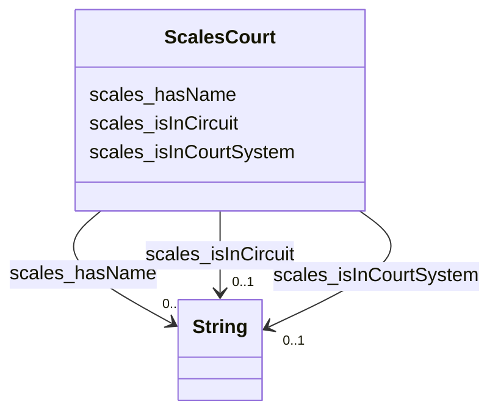

# Class: TODO -- what's a good name for this class (type)? (scales_Court)


_No type description provided_


URI: [scales:Court](http://schemas.scales-okn.org/rdf/scales#Court)





<!-- no inheritance hierarchy -->


## Slots

| Name | Cardinality and Range | Description | Inheritance |
| ---  | --- | --- | --- |
| [scales_isInCourtSystem](../slots/scales_isInCourtSystem.md) | 0..1 <br/> [xsd:string](http://www.w3.org/2001/XMLSchema#string) | No slot description provided | direct |
| [scales_hasName](../slots/scales_hasName.md) | 0..1 <br/> [xsd:string](http://www.w3.org/2001/XMLSchema#string) | No slot description provided | direct |
| [scales_isInCircuit](../slots/scales_isInCircuit.md) | 0..1 <br/> [xsd:string](http://www.w3.org/2001/XMLSchema#string) | No slot description provided | direct |


## Usages

| used by | used in | type | used |
| ---  | --- | --- | --- |
| [ScalesCaseCivil](../classes/ScalesCaseCivil.md) | [scales_isInCourt](../slots/scales_isInCourt.md) | range | [ScalesCourt](../classes/ScalesCourt.md) |
| [ScalesCaseCriminal](../classes/ScalesCaseCriminal.md) | [scales_isInCourt](../slots/scales_isInCourt.md) | range | [ScalesCourt](../classes/ScalesCourt.md) |


## TODOs

* TODO -- Todos for this class go here
* or you can delete the todos
* if you think the class is perfect.

## Identifier and Mapping Information


### Schema Source


* from schema: scales-kg


## Mappings

| Mapping Type | Mapped Value |
| ---  | ---  |
| self | scales:Court |
| native | scales-kg/:ScalesCourt |


## LinkML Source

<!-- TODO: investigate https://stackoverflow.com/questions/37606292/how-to-create-tabbed-code-blocks-in-mkdocs-or-sphinx -->

### Direct

<details>
```yaml
name: scales_Court
description: No type description provided
title: TODO -- what's a good name for this class (type)?
todos:
- TODO -- Todos for this class go here
- or you can delete the todos
- if you think the class is perfect.
notes:
- Class with 94 occurences.
from_schema: scales-kg
rank: 1000
slots:
- scales_isInCourtSystem
- scales_hasName
- scales_isInCircuit
class_uri: scales:Court

```
</details>

### Induced

<details>
```yaml
name: scales_Court
description: No type description provided
title: TODO -- what's a good name for this class (type)?
todos:
- TODO -- Todos for this class go here
- or you can delete the todos
- if you think the class is perfect.
notes:
- Class with 94 occurences.
from_schema: scales-kg
rank: 1000
attributes:
  scales_isInCourtSystem:
    name: scales_isInCourtSystem
    description: No slot description provided
    todos:
    - TODO -- Todos for this slot go here
    - or you can delete the todos
    - if you think the class is perfect.
    comments:
    - 94 occurrences with subject type scales_Court and object type string.
    examples:
    - value: scales:Court/akd scales:isInCourtSystem United States District Courts
    from_schema: scales-kg
    rank: 1000
    slot_uri: scales:isInCourtSystem
    alias: scales_isInCourtSystem
    owner: scales_Court
    domain_of:
    - scales_Court
    range: string
  scales_hasName:
    name: scales_hasName
    description: No slot description provided
    todos:
    - TODO -- Todos for this slot go here
    - or you can delete the todos
    - if you think the class is perfect.
    comments:
    - 11020147 occurrences with subject type scales_Agent and object type string.
    - 94 occurrences with subject type scales_Court and object type string.
    - 5385 occurrences with untyped subjects and object type string.
    examples:
    - value: scales:Agent/akd;;1:16-cr-00001_a0 scales:hasName SCALES-Party-Hash-01169B980BF3557176ECC743C5841A32
    - value: scales:Court/akd scales:hasName District Court, D. Alaska
    - value: scales:JudgeEntity/SJ000000 scales:hasName Cj Williams
    from_schema: scales-kg
    rank: 1000
    slot_uri: scales:hasName
    alias: scales_hasName
    owner: scales_Court
    domain_of:
    - scales_Agent
    - scales_Court
    range: string
  scales_isInCircuit:
    name: scales_isInCircuit
    description: No slot description provided
    todos:
    - TODO -- Todos for this slot go here
    - or you can delete the todos
    - if you think the class is perfect.
    comments:
    - 94 occurrences with subject type scales_Court and object type string.
    examples:
    - value: scales:Court/akd scales:isInCircuit Ninth
    from_schema: scales-kg
    rank: 1000
    slot_uri: scales:isInCircuit
    alias: scales_isInCircuit
    owner: scales_Court
    domain_of:
    - scales_Court
    range: string
class_uri: scales:Court

```
</details>