# Class: No class (type) name specified (scales_CriminalCase)


_No class (type) description specified_


This class occurs 2222787 times.


URI: [scales:CriminalCase](http://schemas.scales-okn.org/rdf/scales#CriminalCase)

```mermaid
 classDiagram
    class ScalesCriminalCase
    click ScalesCriminalCase href "../ScalesCriminalCase"
      ScalesCriminalCase : http___release.niem.gov_niem_domains_jxdm_7.2_CaseCourt
        
          
    
    
    ScalesCriminalCase --> "0..1" Any : http___release.niem.gov_niem_domains_jxdm_7.2_CaseCourt
    click Any href "../Any"

        
      ScalesCriminalCase : http___release.niem.gov_niem_domains_jxdm_7.2_CaseDefendantParty
        
          
    
    
    ScalesCriminalCase --> "0..1" Any : http___release.niem.gov_niem_domains_jxdm_7.2_CaseDefendantParty
    click Any href "../Any"

        
      ScalesCriminalCase : http___release.niem.gov_niem_domains_jxdm_7.2_CaseInitiatingParty
        
          
    
    
    ScalesCriminalCase --> "0..1" Any : http___release.niem.gov_niem_domains_jxdm_7.2_CaseInitiatingParty
    click Any href "../Any"

        
      ScalesCriminalCase : http___release.niem.gov_niem_domains_jxdm_7.2_CaseJudge
        
          
    
    
    ScalesCriminalCase --> "0..1" Any : http___release.niem.gov_niem_domains_jxdm_7.2_CaseJudge
    click Any href "../Any"

        
      ScalesCriminalCase : niem50_CaseDocketID
        
          
    
    
    ScalesCriminalCase --> "0..1" String : niem50_CaseDocketID
    click String href "../String"

        
      ScalesCriminalCase : niem50_CaseGeneralCategoryText
        
          
    
    
    ScalesCriminalCase --> "0..1" String : niem50_CaseGeneralCategoryText
    click String href "../String"

        
      ScalesCriminalCase : niem50_EndDate
        
          
    
    
    ScalesCriminalCase --> "0..1" Date : niem50_EndDate
    click Date href "../Date"

        
      ScalesCriminalCase : niem50_JurisdictionText
        
          
    
    
    ScalesCriminalCase --> "0..1" String : niem50_JurisdictionText
    click String href "../String"

        
      ScalesCriminalCase : niem50_StartDate
        
          
    
    
    ScalesCriminalCase --> "0..1" Date : niem50_StartDate
    click Date href "../Date"

        
      ScalesCriminalCase : niem50_StatusDescriptionText
        
          
    
    
    ScalesCriminalCase --> "0..1" String : niem50_StatusDescriptionText
    click String href "../String"

        
      ScalesCriminalCase : scales_DocketTable
        
          
    
    
    ScalesCriminalCase --> "0..1" HttpRelease.niem.govNiemDomainsJxdm7.2RegisterOfActions : scales_DocketTable
    click HttpRelease.niem.govNiemDomainsJxdm7.2RegisterOfActions href "../HttpRelease.niem.govNiemDomainsJxdm7.2RegisterOfActions"

        
      ScalesCriminalCase : scales_Party
        
          
    
    
    ScalesCriminalCase --> "0..1" ScalesParty : scales_Party
    click ScalesParty href "../ScalesParty"

        
      
```





<!-- no inheritance hierarchy -->


## Slots

| Name | Cardinality and Range | Description | Inheritance | Occurrences |
| ---  | --- | --- | --- | --- |
| [niem50_CaseGeneralCategoryText](../slots/niem50_CaseGeneralCategoryText.md) | 0..1 <br/> [xsd:string](http://www.w3.org/2001/XMLSchema#string) | No slot (predicate) description specified <br/>  | direct | 2131186 |
| [http___release.niem.gov_niem_domains_jxdm_7.2_CaseJudge](../slots/http___release.niem.gov_niem_domains_jxdm_7.2_CaseJudge.md) | 0..1 <br/> [HttpRelease.niem.govNiemDomainsJxdm7.2CaseJudge](../classes/HttpRelease.niem.govNiemDomainsJxdm7.2CaseJudge.md)&nbsp;or&nbsp;<br />[xsd:anyURI](http://www.w3.org/2001/XMLSchema#anyURI) | No slot (predicate) description specified <br/>  | direct | 2131186 |
| [scales_Party](../slots/scales_Party.md) | 0..1 <br/> [ScalesParty](../classes/ScalesParty.md) | No slot (predicate) description specified <br/>  | direct | 1418 |
| [http___release.niem.gov_niem_domains_jxdm_7.2_CaseInitiatingParty](../slots/http___release.niem.gov_niem_domains_jxdm_7.2_CaseInitiatingParty.md) | 0..1 <br/> [HttpRelease.niem.govNiemDomainsJxdm7.2CaseInitiatingParty](../classes/HttpRelease.niem.govNiemDomainsJxdm7.2CaseInitiatingParty.md)&nbsp;or&nbsp;<br />[ScalesParty](../classes/ScalesParty.md) | No slot (predicate) description specified <br/>  | direct | 2066409 |
| [niem50_StartDate](../slots/niem50_StartDate.md) | 0..1 <br/> [xsd:date](http://www.w3.org/2001/XMLSchema#date) | No slot (predicate) description specified <br/>  | direct | 2131186 |
| [niem50_EndDate](../slots/niem50_EndDate.md) | 0..1 <br/> [xsd:date](http://www.w3.org/2001/XMLSchema#date) | No slot (predicate) description specified <br/>  | direct | 2065315 |
| [http___release.niem.gov_niem_domains_jxdm_7.2_CaseCourt](../slots/http___release.niem.gov_niem_domains_jxdm_7.2_CaseCourt.md) | 0..1 <br/> [HttpRelease.niem.govNiemDomainsJxdm7.2Court](../classes/HttpRelease.niem.govNiemDomainsJxdm7.2Court.md)&nbsp;or&nbsp;<br />[xsd:string](http://www.w3.org/2001/XMLSchema#string) | No slot (predicate) description specified <br/>  | direct | 2131186 |
| [http___release.niem.gov_niem_domains_jxdm_7.2_CaseDefendantParty](../slots/http___release.niem.gov_niem_domains_jxdm_7.2_CaseDefendantParty.md) | 0..1 <br/> [HttpRelease.niem.govNiemDomainsJxdm7.2CaseDefendantParty](../classes/HttpRelease.niem.govNiemDomainsJxdm7.2CaseDefendantParty.md)&nbsp;or&nbsp;<br />[ScalesParty](../classes/ScalesParty.md) | No slot (predicate) description specified <br/>  | direct | 2155989 |
| [scales_DocketTable](../slots/scales_DocketTable.md) | 0..1 <br/> [HttpRelease.niem.govNiemDomainsJxdm7.2RegisterOfActions](../classes/HttpRelease.niem.govNiemDomainsJxdm7.2RegisterOfActions.md) | No slot (predicate) description specified <br/>  | direct | 2219202 |
| [niem50_CaseDocketID](../slots/niem50_CaseDocketID.md) | 0..1 <br/> [xsd:string](http://www.w3.org/2001/XMLSchema#string) | No slot (predicate) description specified <br/>  | direct | 2222787 |
| [niem50_StatusDescriptionText](../slots/niem50_StatusDescriptionText.md) | 0..1 <br/> [xsd:string](http://www.w3.org/2001/XMLSchema#string) | No slot (predicate) description specified <br/>  | direct | 2131186 |
| [niem50_JurisdictionText](../slots/niem50_JurisdictionText.md) | 0..1 <br/> [xsd:string](http://www.w3.org/2001/XMLSchema#string) | No slot (predicate) description specified <br/>  | direct | 2131186 |


## Usages

| used by | used in | type | used |
| ---  | --- | --- | --- |
| [HttpRelease.niem.govNiemDomainsJxdm7.2Charge](../classes/HttpRelease.niem.govNiemDomainsJxdm7.2Charge.md) | [http___release.niem.gov_niem_domains_jxdm_7.2_ChargeFiledCase](../slots/http___release.niem.gov_niem_domains_jxdm_7.2_ChargeFiledCase.md) | range | [ScalesCriminalCase](../classes/ScalesCriminalCase.md) |


## LinkML Source

<!-- TODO: investigate https://stackoverflow.com/questions/37606292/how-to-create-tabbed-code-blocks-in-mkdocs-or-sphinx -->

### Direct

<details>

```yaml
name: scales_CriminalCase
conforms_to: No schema conformance document specified
annotations:
  count:
    tag: count
    value: 2222787
description: No class (type) description specified
title: No class (type) name specified
from_schema: scales-kg
rank: 1000
slots:
- niem50_CaseGeneralCategoryText
- http___release.niem.gov_niem_domains_jxdm_7.2_CaseJudge
- scales_Party
- http___release.niem.gov_niem_domains_jxdm_7.2_CaseInitiatingParty
- niem50_StartDate
- niem50_EndDate
- http___release.niem.gov_niem_domains_jxdm_7.2_CaseCourt
- http___release.niem.gov_niem_domains_jxdm_7.2_CaseDefendantParty
- scales_DocketTable
- niem50_CaseDocketID
- niem50_StatusDescriptionText
- niem50_JurisdictionText
slot_usage:
  http___release.niem.gov_niem_domains_jxdm_7.2_CaseCourt:
    name: http___release.niem.gov_niem_domains_jxdm_7.2_CaseCourt
    annotations:
      string:
        tag: string
        value: 2131186
  http___release.niem.gov_niem_domains_jxdm_7.2_CaseDefendantParty:
    name: http___release.niem.gov_niem_domains_jxdm_7.2_CaseDefendantParty
    annotations:
      scales_Party:
        tag: scales_Party
        value: 2155989
  http___release.niem.gov_niem_domains_jxdm_7.2_CaseInitiatingParty:
    name: http___release.niem.gov_niem_domains_jxdm_7.2_CaseInitiatingParty
    annotations:
      scales_Party:
        tag: scales_Party
        value: 2066409
  http___release.niem.gov_niem_domains_jxdm_7.2_CaseJudge:
    name: http___release.niem.gov_niem_domains_jxdm_7.2_CaseJudge
    annotations:
      http___release.niem.gov_niem_domains_jxdm_7.2_CaseJudge:
        tag: http___release.niem.gov_niem_domains_jxdm_7.2_CaseJudge
        value: 2131186
  niem50_CaseDocketID:
    name: niem50_CaseDocketID
    annotations:
      string:
        tag: string
        value: 2222787
  niem50_CaseGeneralCategoryText:
    name: niem50_CaseGeneralCategoryText
    annotations:
      string:
        tag: string
        value: 2131186
  niem50_EndDate:
    name: niem50_EndDate
    annotations:
      date:
        tag: date
        value: 2065315
  niem50_JurisdictionText:
    name: niem50_JurisdictionText
    annotations:
      string:
        tag: string
        value: 2131186
  niem50_StartDate:
    name: niem50_StartDate
    annotations:
      date:
        tag: date
        value: 2131186
  niem50_StatusDescriptionText:
    name: niem50_StatusDescriptionText
    annotations:
      string:
        tag: string
        value: 2131186
  scales_DocketTable:
    name: scales_DocketTable
    annotations:
      http___release.niem.gov_niem_domains_jxdm_7.2_RegisterOfActions:
        tag: http___release.niem.gov_niem_domains_jxdm_7.2_RegisterOfActions
        value: 2219202
  scales_Party:
    name: scales_Party
    annotations:
      scales_Party:
        tag: scales_Party
        value: 1418
class_uri: scales:CriminalCase

```
</details>

### Induced

<details>

```yaml
name: scales_CriminalCase
conforms_to: No schema conformance document specified
annotations:
  count:
    tag: count
    value: 2222787
description: No class (type) description specified
title: No class (type) name specified
from_schema: scales-kg
rank: 1000
slot_usage:
  http___release.niem.gov_niem_domains_jxdm_7.2_CaseCourt:
    name: http___release.niem.gov_niem_domains_jxdm_7.2_CaseCourt
    annotations:
      string:
        tag: string
        value: 2131186
  http___release.niem.gov_niem_domains_jxdm_7.2_CaseDefendantParty:
    name: http___release.niem.gov_niem_domains_jxdm_7.2_CaseDefendantParty
    annotations:
      scales_Party:
        tag: scales_Party
        value: 2155989
  http___release.niem.gov_niem_domains_jxdm_7.2_CaseInitiatingParty:
    name: http___release.niem.gov_niem_domains_jxdm_7.2_CaseInitiatingParty
    annotations:
      scales_Party:
        tag: scales_Party
        value: 2066409
  http___release.niem.gov_niem_domains_jxdm_7.2_CaseJudge:
    name: http___release.niem.gov_niem_domains_jxdm_7.2_CaseJudge
    annotations:
      http___release.niem.gov_niem_domains_jxdm_7.2_CaseJudge:
        tag: http___release.niem.gov_niem_domains_jxdm_7.2_CaseJudge
        value: 2131186
  niem50_CaseDocketID:
    name: niem50_CaseDocketID
    annotations:
      string:
        tag: string
        value: 2222787
  niem50_CaseGeneralCategoryText:
    name: niem50_CaseGeneralCategoryText
    annotations:
      string:
        tag: string
        value: 2131186
  niem50_EndDate:
    name: niem50_EndDate
    annotations:
      date:
        tag: date
        value: 2065315
  niem50_JurisdictionText:
    name: niem50_JurisdictionText
    annotations:
      string:
        tag: string
        value: 2131186
  niem50_StartDate:
    name: niem50_StartDate
    annotations:
      date:
        tag: date
        value: 2131186
  niem50_StatusDescriptionText:
    name: niem50_StatusDescriptionText
    annotations:
      string:
        tag: string
        value: 2131186
  scales_DocketTable:
    name: scales_DocketTable
    annotations:
      http___release.niem.gov_niem_domains_jxdm_7.2_RegisterOfActions:
        tag: http___release.niem.gov_niem_domains_jxdm_7.2_RegisterOfActions
        value: 2219202
  scales_Party:
    name: scales_Party
    annotations:
      scales_Party:
        tag: scales_Party
        value: 1418
attributes:
  niem50_CaseGeneralCategoryText:
    name: niem50_CaseGeneralCategoryText
    annotations:
      string:
        tag: string
        value: 2131186
    description: No slot (predicate) description specified
    examples:
    - object:
        example_object: civil
        example_object_type: string
        example_predicate: niem50:CaseGeneralCategoryText
        example_subject: scales:CivilCase
        example_subject_type: http___release.niem.gov_niem_domains_jxdm_7.2_Case
    - object:
        example_object: civil
        example_object_type: string
        example_predicate: niem50:CaseGeneralCategoryText
        example_subject: scales:Case/ga-clayton-magistrate-civil;;0:00-cm-00001
        example_subject_type: scales_CivilCase
    - object:
        example_object: criminal
        example_object_type: string
        example_predicate: niem50:CaseGeneralCategoryText
        example_subject: scales:Case/ga-clayton-magistrate;;0:00-bc-00001
        example_subject_type: scales_CriminalCase
    from_schema: scales-kg
    rank: 1000
    slot_uri: niem50:CaseGeneralCategoryText
    alias: niem50_CaseGeneralCategoryText
    owner: scales_CriminalCase
    domain_of:
    - http___release.niem.gov_niem_domains_jxdm_7.2_Case
    - scales_Case
    - scales_CivilCase
    - scales_CriminalCase
    range: string
  http___release.niem.gov_niem_domains_jxdm_7.2_CaseJudge:
    name: http___release.niem.gov_niem_domains_jxdm_7.2_CaseJudge
    annotations:
      http___release.niem.gov_niem_domains_jxdm_7.2_CaseJudge:
        tag: http___release.niem.gov_niem_domains_jxdm_7.2_CaseJudge
        value: 2131186
    description: No slot (predicate) description specified
    examples:
    - object:
        example_object: scales:Agent/akd;;1:16-cv-00001_a2
        example_object_type: uri
        example_predicate: http://release.niem.gov/niem/domains/jxdm/7.2/CaseJudge
        example_subject: scales:CivilCase
        example_subject_type: http___release.niem.gov_niem_domains_jxdm_7.2_Case
    - object:
        example_object: scales:Judge/ga-clayton-magistrate-civil;;0:00-cm-00001_3
        example_object_type: http___release.niem.gov_niem_domains_jxdm_7.2_CaseJudge
        example_predicate: http://release.niem.gov/niem/domains/jxdm/7.2/CaseJudge
        example_subject: scales:Case/ga-clayton-magistrate-civil;;0:00-cm-00001
        example_subject_type: scales_CivilCase
    - object:
        example_object: scales:Judge/ga-clayton-magistrate;;0:00-bc-00001_0
        example_object_type: http___release.niem.gov_niem_domains_jxdm_7.2_CaseJudge
        example_predicate: http://release.niem.gov/niem/domains/jxdm/7.2/CaseJudge
        example_subject: scales:Case/ga-clayton-magistrate;;0:00-bc-00001
        example_subject_type: scales_CriminalCase
    from_schema: scales-kg
    rank: 1000
    slot_uri: http://release.niem.gov/niem/domains/jxdm/7.2/CaseJudge
    alias: http___release.niem.gov_niem_domains_jxdm_7.2_CaseJudge
    owner: scales_CriminalCase
    domain_of:
    - http___release.niem.gov_niem_domains_jxdm_7.2_Case
    - scales_Case
    - scales_CivilCase
    - scales_CriminalCase
    range: Any
    any_of:
    - range: http___release.niem.gov_niem_domains_jxdm_7.2_CaseJudge
    - range: uri
  scales_Party:
    name: scales_Party
    annotations:
      scales_Party:
        tag: scales_Party
        value: 1418
    description: No slot (predicate) description specified
    examples:
    - object:
        example_object: scales:Agent/akd;;1:16-cv-00008_a7
        example_object_type: scales_Party
        example_predicate: scales:Party
        example_subject: scales:CivilCase
        example_subject_type: scales_Case
    - object:
        example_object: scales:Agent/akd;;1:16-cv-00008_a7
        example_object_type: scales_Party
        example_predicate: scales:Party
        example_subject: scales:CivilCase
        example_subject_type: http___release.niem.gov_niem_domains_jxdm_7.2_Case
    - object:
        example_object: scales:Agent/ga-clayton-magistrate-civil;;0:00-cm-00017_a3
        example_object_type: scales_Party
        example_predicate: scales:Party
        example_subject: scales:Case/ga-clayton-magistrate-civil;;0:00-cm-00017
        example_subject_type: scales_CivilCase
    - object:
        example_object: scales:Agent/ga-clayton-state;;0:04-cr-02869_a2
        example_object_type: scales_Party
        example_predicate: scales:Party
        example_subject: scales:Case/ga-clayton-state;;0:04-cr-02869
        example_subject_type: scales_CriminalCase
    from_schema: scales-kg
    rank: 1000
    slot_uri: scales:Party
    alias: scales_Party
    owner: scales_CriminalCase
    domain_of:
    - http___release.niem.gov_niem_domains_jxdm_7.2_Case
    - scales_Case
    - scales_CivilCase
    - scales_CriminalCase
    range: scales_Party
  http___release.niem.gov_niem_domains_jxdm_7.2_CaseInitiatingParty:
    name: http___release.niem.gov_niem_domains_jxdm_7.2_CaseInitiatingParty
    annotations:
      scales_Party:
        tag: scales_Party
        value: 2066409
    description: No slot (predicate) description specified
    examples:
    - object:
        example_object: scales:Agent/akd;;1:16-cv-00001_a0
        example_object_type: http___release.niem.gov_niem_domains_jxdm_7.2_CaseInitiatingParty
        example_predicate: http://release.niem.gov/niem/domains/jxdm/7.2/CaseInitiatingParty
        example_subject: scales:CivilCase
        example_subject_type: scales_Case
    - object:
        example_object: scales:Agent/akd;;1:16-cv-00001_a0
        example_object_type: http___release.niem.gov_niem_domains_jxdm_7.2_CaseInitiatingParty
        example_predicate: http://release.niem.gov/niem/domains/jxdm/7.2/CaseInitiatingParty
        example_subject: scales:CivilCase
        example_subject_type: http___release.niem.gov_niem_domains_jxdm_7.2_Case
    - object:
        example_object: scales:Agent/ga-clayton-magistrate-civil;;0:00-cm-00001_a0
        example_object_type: scales_Party
        example_predicate: http://release.niem.gov/niem/domains/jxdm/7.2/CaseInitiatingParty
        example_subject: scales:Case/ga-clayton-magistrate-civil;;0:00-cm-00001
        example_subject_type: scales_CivilCase
    - object:
        example_object: scales:Agent/ga-clayton-magistrate;;0:00-co-00002_a0
        example_object_type: scales_Party
        example_predicate: http://release.niem.gov/niem/domains/jxdm/7.2/CaseInitiatingParty
        example_subject: scales:Case/ga-clayton-magistrate;;0:00-co-00002
        example_subject_type: scales_CriminalCase
    from_schema: scales-kg
    rank: 1000
    slot_uri: http://release.niem.gov/niem/domains/jxdm/7.2/CaseInitiatingParty
    alias: http___release.niem.gov_niem_domains_jxdm_7.2_CaseInitiatingParty
    owner: scales_CriminalCase
    domain_of:
    - http___release.niem.gov_niem_domains_jxdm_7.2_Case
    - scales_Case
    - scales_CivilCase
    - scales_CriminalCase
    range: Any
    any_of:
    - range: http___release.niem.gov_niem_domains_jxdm_7.2_CaseInitiatingParty
    - range: scales_Party
  niem50_StartDate:
    name: niem50_StartDate
    annotations:
      date:
        tag: date
        value: 2131186
    description: No slot (predicate) description specified
    examples:
    - object:
        example_object: '2002-01-02'
        example_object_type: date
        example_predicate: niem50:StartDate
        example_subject: scales:CivilCase
        example_subject_type: http___release.niem.gov_niem_domains_jxdm_7.2_Case
    - object:
        example_object: '2000-01-10'
        example_object_type: date
        example_predicate: niem50:StartDate
        example_subject: scales:Case/ga-clayton-magistrate-civil;;0:00-cm-00001
        example_subject_type: scales_CivilCase
    - object:
        example_object: '2000-01-05'
        example_object_type: date
        example_predicate: niem50:StartDate
        example_subject: scales:Case/ga-clayton-magistrate;;0:00-bc-00001
        example_subject_type: scales_CriminalCase
    from_schema: scales-kg
    rank: 1000
    slot_uri: niem50:StartDate
    alias: niem50_StartDate
    owner: scales_CriminalCase
    domain_of:
    - http___release.niem.gov_niem_domains_jxdm_7.2_Case
    - scales_Case
    - scales_CivilCase
    - scales_CriminalCase
    range: date
  niem50_EndDate:
    name: niem50_EndDate
    annotations:
      date:
        tag: date
        value: 2065315
    description: No slot (predicate) description specified
    examples:
    - object:
        example_object: '1968-03-14'
        example_object_type: date
        example_predicate: niem50:EndDate
        example_subject: scales:CivilCase
        example_subject_type: http___release.niem.gov_niem_domains_jxdm_7.2_Case
    - object:
        example_object: '2000-03-08'
        example_object_type: date
        example_predicate: niem50:EndDate
        example_subject: scales:Case/ga-clayton-magistrate-civil;;0:00-cm-00001
        example_subject_type: scales_CivilCase
    - object:
        example_object: '2000-01-20'
        example_object_type: date
        example_predicate: niem50:EndDate
        example_subject: scales:Case/ga-clayton-magistrate;;0:00-bc-00001
        example_subject_type: scales_CriminalCase
    from_schema: scales-kg
    rank: 1000
    slot_uri: niem50:EndDate
    alias: niem50_EndDate
    owner: scales_CriminalCase
    domain_of:
    - http___release.niem.gov_niem_domains_jxdm_7.2_Case
    - scales_Case
    - scales_CivilCase
    - scales_CriminalCase
    range: date
  http___release.niem.gov_niem_domains_jxdm_7.2_CaseCourt:
    name: http___release.niem.gov_niem_domains_jxdm_7.2_CaseCourt
    annotations:
      string:
        tag: string
        value: 2131186
    description: No slot (predicate) description specified
    examples:
    - object:
        example_object: scales:Court/akd
        example_object_type: http___release.niem.gov_niem_domains_jxdm_7.2_Court
        example_predicate: http://release.niem.gov/niem/domains/jxdm/7.2/CaseCourt
        example_subject: scales:CivilCase
        example_subject_type: scales_Case
    - object:
        example_object: scales:Court/akd
        example_object_type: http___release.niem.gov_niem_domains_jxdm_7.2_Court
        example_predicate: http://release.niem.gov/niem/domains/jxdm/7.2/CaseCourt
        example_subject: scales:CivilCase
        example_subject_type: http___release.niem.gov_niem_domains_jxdm_7.2_Case
    - object:
        example_object: ga-clayton-magistrate-civil
        example_object_type: string
        example_predicate: http://release.niem.gov/niem/domains/jxdm/7.2/CaseCourt
        example_subject: scales:Case/ga-clayton-magistrate-civil;;0:00-cm-00001
        example_subject_type: scales_CivilCase
    - object:
        example_object: ga-clayton-magistrate
        example_object_type: string
        example_predicate: http://release.niem.gov/niem/domains/jxdm/7.2/CaseCourt
        example_subject: scales:Case/ga-clayton-magistrate;;0:00-bc-00001
        example_subject_type: scales_CriminalCase
    from_schema: scales-kg
    rank: 1000
    slot_uri: http://release.niem.gov/niem/domains/jxdm/7.2/CaseCourt
    alias: http___release.niem.gov_niem_domains_jxdm_7.2_CaseCourt
    owner: scales_CriminalCase
    domain_of:
    - http___release.niem.gov_niem_domains_jxdm_7.2_Case
    - scales_Case
    - scales_CivilCase
    - scales_CriminalCase
    range: Any
    any_of:
    - range: http___release.niem.gov_niem_domains_jxdm_7.2_Court
    - range: string
  http___release.niem.gov_niem_domains_jxdm_7.2_CaseDefendantParty:
    name: http___release.niem.gov_niem_domains_jxdm_7.2_CaseDefendantParty
    annotations:
      scales_Party:
        tag: scales_Party
        value: 2155989
    description: No slot (predicate) description specified
    examples:
    - object:
        example_object: scales:Agent/akd;;1:16-cv-00001_a1
        example_object_type: http___release.niem.gov_niem_domains_jxdm_7.2_CaseDefendantParty
        example_predicate: http://release.niem.gov/niem/domains/jxdm/7.2/CaseDefendantParty
        example_subject: scales:CivilCase
        example_subject_type: scales_Case
    - object:
        example_object: scales:Agent/akd;;1:16-cv-00001_a1
        example_object_type: http___release.niem.gov_niem_domains_jxdm_7.2_CaseDefendantParty
        example_predicate: http://release.niem.gov/niem/domains/jxdm/7.2/CaseDefendantParty
        example_subject: scales:CivilCase
        example_subject_type: http___release.niem.gov_niem_domains_jxdm_7.2_Case
    - object:
        example_object: scales:Agent/ga-clayton-magistrate-civil;;0:00-cm-00001_a2
        example_object_type: scales_Party
        example_predicate: http://release.niem.gov/niem/domains/jxdm/7.2/CaseDefendantParty
        example_subject: scales:Case/ga-clayton-magistrate-civil;;0:00-cm-00001
        example_subject_type: scales_CivilCase
    - object:
        example_object: scales:Agent/ga-clayton-magistrate;;0:00-bc-00001_a0
        example_object_type: scales_Party
        example_predicate: http://release.niem.gov/niem/domains/jxdm/7.2/CaseDefendantParty
        example_subject: scales:Case/ga-clayton-magistrate;;0:00-bc-00001
        example_subject_type: scales_CriminalCase
    from_schema: scales-kg
    rank: 1000
    slot_uri: http://release.niem.gov/niem/domains/jxdm/7.2/CaseDefendantParty
    alias: http___release.niem.gov_niem_domains_jxdm_7.2_CaseDefendantParty
    owner: scales_CriminalCase
    domain_of:
    - http___release.niem.gov_niem_domains_jxdm_7.2_Case
    - scales_Case
    - scales_CivilCase
    - scales_CriminalCase
    range: Any
    any_of:
    - range: http___release.niem.gov_niem_domains_jxdm_7.2_CaseDefendantParty
    - range: scales_Party
  scales_DocketTable:
    name: scales_DocketTable
    annotations:
      http___release.niem.gov_niem_domains_jxdm_7.2_RegisterOfActions:
        tag: http___release.niem.gov_niem_domains_jxdm_7.2_RegisterOfActions
        value: 2219202
    description: No slot (predicate) description specified
    examples:
    - object:
        example_object: scales:DocketTable/ga-fulton-01-00-CR-244366
        example_object_type: http___release.niem.gov_niem_domains_jxdm_7.2_RegisterOfActions
        example_predicate: scales:DocketTable
        example_subject: scales:Case/ga-fulton-01-00-CR-244366
        example_subject_type: scales_CriminalCase
    - object:
        example_object: scales:DocketTable/ga-clayton-magistrate-civil;;0:00-cm-00001
        example_object_type: http___release.niem.gov_niem_domains_jxdm_7.2_RegisterOfActions
        example_predicate: scales:DocketTable
        example_subject: scales:Case/ga-clayton-magistrate-civil;;0:00-cm-00001
        example_subject_type: scales_CivilCase
    from_schema: scales-kg
    rank: 1000
    slot_uri: scales:DocketTable
    alias: scales_DocketTable
    owner: scales_CriminalCase
    domain_of:
    - scales_CivilCase
    - scales_CriminalCase
    range: http___release.niem.gov_niem_domains_jxdm_7.2_RegisterOfActions
  niem50_CaseDocketID:
    name: niem50_CaseDocketID
    annotations:
      string:
        tag: string
        value: 2222787
    description: No slot (predicate) description specified
    examples:
    - object:
        example_object: 00-CR-244366
        example_object_type: string
        example_predicate: niem50:CaseDocketID
        example_subject: scales:Case/ga-fulton-01-00-CR-244366
        example_subject_type: scales_CriminalCase
    - object:
        example_object: 0:15-cv-04235
        example_object_type: string
        example_predicate: niem50:CaseDocketID
        example_subject: scales:CivilCase
        example_subject_type: http___release.niem.gov_niem_domains_jxdm_7.2_Case
    - object:
        example_object: 2000CM00001 P
        example_object_type: string
        example_predicate: niem50:CaseDocketID
        example_subject: scales:Case/ga-clayton-magistrate-civil;;0:00-cm-00001
        example_subject_type: scales_CivilCase
    from_schema: scales-kg
    rank: 1000
    slot_uri: niem50:CaseDocketID
    alias: niem50_CaseDocketID
    owner: scales_CriminalCase
    domain_of:
    - http___release.niem.gov_niem_domains_jxdm_7.2_Case
    - scales_Case
    - scales_CivilCase
    - scales_CriminalCase
    range: string
  niem50_StatusDescriptionText:
    name: niem50_StatusDescriptionText
    annotations:
      string:
        tag: string
        value: 2131186
    description: No slot (predicate) description specified
    examples:
    - object:
        example_object: closed
        example_object_type: string
        example_predicate: niem50:StatusDescriptionText
        example_subject: scales:CivilCase
        example_subject_type: http___release.niem.gov_niem_domains_jxdm_7.2_Case
    - object:
        example_object: closed
        example_object_type: string
        example_predicate: niem50:StatusDescriptionText
        example_subject: scales:Case/ga-clayton-magistrate-civil;;0:00-cm-00001
        example_subject_type: scales_CivilCase
    - object:
        example_object: other
        example_object_type: string
        example_predicate: niem50:StatusDescriptionText
        example_subject: scales:Case/ga-clayton-magistrate;;0:00-bc-00001
        example_subject_type: scales_CriminalCase
    from_schema: scales-kg
    rank: 1000
    slot_uri: niem50:StatusDescriptionText
    alias: niem50_StatusDescriptionText
    owner: scales_CriminalCase
    domain_of:
    - http___release.niem.gov_niem_domains_jxdm_7.2_Case
    - scales_Case
    - scales_CivilCase
    - scales_CriminalCase
    range: string
  niem50_JurisdictionText:
    name: niem50_JurisdictionText
    annotations:
      string:
        tag: string
        value: 2131186
    description: No slot (predicate) description specified
    examples:
    - object:
        example_object: Diversity
        example_object_type: string
        example_predicate: niem50:JurisdictionText
        example_subject: scales:CivilCase
        example_subject_type: http___release.niem.gov_niem_domains_jxdm_7.2_Case
    - object:
        example_object: None
        example_object_type: string
        example_predicate: niem50:JurisdictionText
        example_subject: scales:Case/ga-clayton-magistrate-civil;;0:00-cm-00001
        example_subject_type: scales_CivilCase
    - object:
        example_object: None
        example_object_type: string
        example_predicate: niem50:JurisdictionText
        example_subject: scales:Case/ga-clayton-magistrate;;0:00-bc-00001
        example_subject_type: scales_CriminalCase
    from_schema: scales-kg
    rank: 1000
    slot_uri: niem50:JurisdictionText
    alias: niem50_JurisdictionText
    owner: scales_CriminalCase
    domain_of:
    - http___release.niem.gov_niem_domains_jxdm_7.2_Case
    - scales_Case
    - scales_CivilCase
    - scales_CriminalCase
    range: string
class_uri: scales:CriminalCase

```
</details>