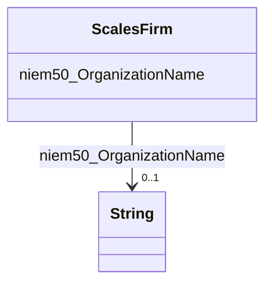

# Class: ScalesFirm


This class occurs 2929549 times.


URI: [scales:Firm](http://schemas.scales-okn.org/rdf/scales#Firm)





<!-- no inheritance hierarchy -->


## Slots

| Name | Cardinality and Range | Description | Inheritance | Occurrences |
| ---  | --- | --- | --- | --- |
| [niem50_OrganizationName](../slots/niem50_OrganizationName.md) | 0..1 <br/> [xsd:string](http://www.w3.org/2001/XMLSchema#string) |  <br/>  | direct | 2929547 |


## Usages

| used by | used in | type | used |
| ---  | --- | --- | --- |
| [Jxdm72Attorney](../classes/Jxdm72Attorney.md) | [ScalesFirm](../classes/ScalesFirm.md) | range | [ScalesFirm](../classes/ScalesFirm.md) |
| [Jxdm72CaseDefenseAttorney](../classes/Jxdm72CaseDefenseAttorney.md) | [ScalesFirm](../classes/ScalesFirm.md) | range | [ScalesFirm](../classes/ScalesFirm.md) |
| [Jxdm72CaseInitiatingAttorney](../classes/Jxdm72CaseInitiatingAttorney.md) | [ScalesFirm](../classes/ScalesFirm.md) | range | [ScalesFirm](../classes/ScalesFirm.md) |


## LinkML Source

<!-- TODO: investigate https://stackoverflow.com/questions/37606292/how-to-create-tabbed-code-blocks-in-mkdocs-or-sphinx -->

### Direct

<details>

```yaml
name: scales_Firm
from_schema: okns:scales-kg
rank: 1000
slots:
- niem50_OrganizationName
class_uri: scales:Firm

```
</details>

### Induced

<details>

```yaml
name: scales_Firm
from_schema: okns:scales-kg
rank: 1000
attributes:
  niem50_OrganizationName:
    name: niem50_OrganizationName
    from_schema: okns:scales-kg
    rank: 1000
    slot_uri: niem50:OrganizationName
    alias: niem50_OrganizationName
    owner: scales_Firm
    domain_of:
    - scales_Firm
    range: string
class_uri: scales:Firm

```
</details>