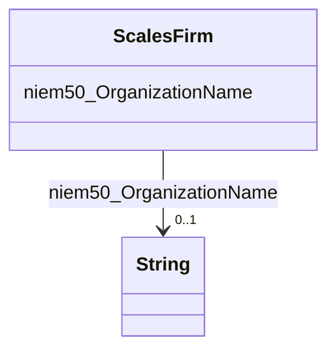

# Class: No class (type) name specified (scales_Firm)


_No class (type) description specified_


This class occurs 2929549 times.


URI: [scales:Firm](http://schemas.scales-okn.org/rdf/scales#Firm)





<!-- no inheritance hierarchy -->


## Slots

| Name | Cardinality and Range | Description | Inheritance | Occurrences |
| ---  | --- | --- | --- | --- |
| [niem50_OrganizationName](../slots/niem50_OrganizationName.md) | 0..1 <br/> [xsd:string](http://www.w3.org/2001/XMLSchema#string) | No slot (predicate) description specified <br/>  | direct | 2929547 |


## Usages

| used by | used in | type | used |
| ---  | --- | --- | --- |
| [HttpRelease.niem.govNiemDomainsJxdm7.2Attorney](../classes/HttpRelease.niem.govNiemDomainsJxdm7.2Attorney.md) | [ScalesFirm](../classes/ScalesFirm.md) | range | [ScalesFirm](../classes/ScalesFirm.md) |
| [HttpRelease.niem.govNiemDomainsJxdm7.2CaseDefenseAttorney](../classes/HttpRelease.niem.govNiemDomainsJxdm7.2CaseDefenseAttorney.md) | [ScalesFirm](../classes/ScalesFirm.md) | range | [ScalesFirm](../classes/ScalesFirm.md) |
| [HttpRelease.niem.govNiemDomainsJxdm7.2CaseInitiatingAttorney](../classes/HttpRelease.niem.govNiemDomainsJxdm7.2CaseInitiatingAttorney.md) | [ScalesFirm](../classes/ScalesFirm.md) | range | [ScalesFirm](../classes/ScalesFirm.md) |


## LinkML Source

<!-- TODO: investigate https://stackoverflow.com/questions/37606292/how-to-create-tabbed-code-blocks-in-mkdocs-or-sphinx -->

### Direct

<details>

```yaml
name: scales_Firm
conforms_to: No schema conformance document specified
annotations:
  count:
    tag: count
    value: 2929549
description: No class (type) description specified
title: No class (type) name specified
from_schema: scales-kg
rank: 1000
slots:
- niem50_OrganizationName
slot_usage:
  niem50_OrganizationName:
    name: niem50_OrganizationName
    annotations:
      string:
        tag: string
        value: 2929547
class_uri: scales:Firm

```
</details>

### Induced

<details>

```yaml
name: scales_Firm
conforms_to: No schema conformance document specified
annotations:
  count:
    tag: count
    value: 2929549
description: No class (type) description specified
title: No class (type) name specified
from_schema: scales-kg
rank: 1000
slot_usage:
  niem50_OrganizationName:
    name: niem50_OrganizationName
    annotations:
      string:
        tag: string
        value: 2929547
attributes:
  niem50_OrganizationName:
    name: niem50_OrganizationName
    annotations:
      string:
        tag: string
        value: 2929547
    description: No slot (predicate) description specified
    examples:
    - object:
        example_object: U.S. Attorney's Office (Anch)
        example_object_type: string
        example_predicate: niem50:OrganizationName
        example_subject: scales:/Agent/akd;;1:16-cr-00001_a10
        example_subject_type: scales_Firm
    from_schema: scales-kg
    rank: 1000
    slot_uri: niem50:OrganizationName
    alias: niem50_OrganizationName
    owner: scales_Firm
    domain_of:
    - scales_Firm
    range: string
class_uri: scales:Firm

```
</details>