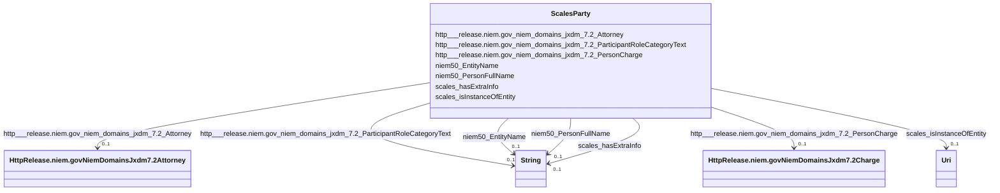

# Class: No class (type) name specified (scales_Party)


_No class (type) description specified_


This class occurs 7360081 times.


URI: [scales:Party](http://schemas.scales-okn.org/rdf/scales#Party)





<!-- no inheritance hierarchy -->


## Slots

| Name | Cardinality and Range | Description | Inheritance | Occurrences |
| ---  | --- | --- | --- | --- |
| [http___release.niem.gov_niem_domains_jxdm_7.2_Attorney](../slots/http___release.niem.gov_niem_domains_jxdm_7.2_Attorney.md) | 0..1 <br/> [HttpRelease.niem.govNiemDomainsJxdm7.2Attorney](../classes/HttpRelease.niem.govNiemDomainsJxdm7.2Attorney.md) | No slot (predicate) description specified <br/>  | direct | 537560 |
| [scales_isInstanceOfEntity](../slots/scales_isInstanceOfEntity.md) | 0..1 <br/> [xsd:anyURI](http://www.w3.org/2001/XMLSchema#anyURI) | No slot (predicate) description specified <br/>  | direct | 7042309 |
| [niem50_EntityName](../slots/niem50_EntityName.md) | 0..1 <br/> [xsd:string](http://www.w3.org/2001/XMLSchema#string) | No slot (predicate) description specified <br/>  | direct | 317772 |
| [http___release.niem.gov_niem_domains_jxdm_7.2_PersonCharge](../slots/http___release.niem.gov_niem_domains_jxdm_7.2_PersonCharge.md) | 0..1 <br/> [HttpRelease.niem.govNiemDomainsJxdm7.2Charge](../classes/HttpRelease.niem.govNiemDomainsJxdm7.2Charge.md) | No slot (predicate) description specified <br/>  | direct | 2155917 |
| [niem50_PersonFullName](../slots/niem50_PersonFullName.md) | 0..1 <br/> [xsd:string](http://www.w3.org/2001/XMLSchema#string) | No slot (predicate) description specified <br/>  | direct | 7042309 |
| [http___release.niem.gov_niem_domains_jxdm_7.2_ParticipantRoleCategoryText](../slots/http___release.niem.gov_niem_domains_jxdm_7.2_ParticipantRoleCategoryText.md) | 0..1 <br/> [xsd:string](http://www.w3.org/2001/XMLSchema#string) | No slot (predicate) description specified <br/>  | direct | 7339264 |
| [scales_hasExtraInfo](../slots/scales_hasExtraInfo.md) | 0..1 <br/> [xsd:string](http://www.w3.org/2001/XMLSchema#string) | No slot (predicate) description specified <br/>  | direct | 43157 |


## Usages

| used by | used in | type | used |
| ---  | --- | --- | --- |
| [HttpRelease.niem.govNiemDomainsJxdm7.2Case](../classes/HttpRelease.niem.govNiemDomainsJxdm7.2Case.md) | [HttpRelease.niem.govNiemDomainsJxdm7.2CaseDefendantParty](../classes/HttpRelease.niem.govNiemDomainsJxdm7.2CaseDefendantParty.md) | any_of[range] | [ScalesParty](../classes/ScalesParty.md) |
| [HttpRelease.niem.govNiemDomainsJxdm7.2Case](../classes/HttpRelease.niem.govNiemDomainsJxdm7.2Case.md) | [HttpRelease.niem.govNiemDomainsJxdm7.2CaseInitiatingParty](../classes/HttpRelease.niem.govNiemDomainsJxdm7.2CaseInitiatingParty.md) | any_of[range] | [ScalesParty](../classes/ScalesParty.md) |
| [HttpRelease.niem.govNiemDomainsJxdm7.2Case](../classes/HttpRelease.niem.govNiemDomainsJxdm7.2Case.md) | [ScalesParty](../classes/ScalesParty.md) | range | [ScalesParty](../classes/ScalesParty.md) |
| [ScalesCase](../classes/ScalesCase.md) | [HttpRelease.niem.govNiemDomainsJxdm7.2CaseDefendantParty](../classes/HttpRelease.niem.govNiemDomainsJxdm7.2CaseDefendantParty.md) | any_of[range] | [ScalesParty](../classes/ScalesParty.md) |
| [ScalesCase](../classes/ScalesCase.md) | [HttpRelease.niem.govNiemDomainsJxdm7.2CaseInitiatingParty](../classes/HttpRelease.niem.govNiemDomainsJxdm7.2CaseInitiatingParty.md) | any_of[range] | [ScalesParty](../classes/ScalesParty.md) |
| [ScalesCase](../classes/ScalesCase.md) | [ScalesParty](../classes/ScalesParty.md) | range | [ScalesParty](../classes/ScalesParty.md) |
| [ScalesCivilCase](../classes/ScalesCivilCase.md) | [ScalesParty](../classes/ScalesParty.md) | range | [ScalesParty](../classes/ScalesParty.md) |
| [ScalesCivilCase](../classes/ScalesCivilCase.md) | [HttpRelease.niem.govNiemDomainsJxdm7.2CaseInitiatingParty](../classes/HttpRelease.niem.govNiemDomainsJxdm7.2CaseInitiatingParty.md) | any_of[range] | [ScalesParty](../classes/ScalesParty.md) |
| [ScalesCivilCase](../classes/ScalesCivilCase.md) | [HttpRelease.niem.govNiemDomainsJxdm7.2CaseDefendantParty](../classes/HttpRelease.niem.govNiemDomainsJxdm7.2CaseDefendantParty.md) | any_of[range] | [ScalesParty](../classes/ScalesParty.md) |
| [ScalesCriminalCase](../classes/ScalesCriminalCase.md) | [ScalesParty](../classes/ScalesParty.md) | range | [ScalesParty](../classes/ScalesParty.md) |
| [ScalesCriminalCase](../classes/ScalesCriminalCase.md) | [HttpRelease.niem.govNiemDomainsJxdm7.2CaseInitiatingParty](../classes/HttpRelease.niem.govNiemDomainsJxdm7.2CaseInitiatingParty.md) | any_of[range] | [ScalesParty](../classes/ScalesParty.md) |
| [ScalesCriminalCase](../classes/ScalesCriminalCase.md) | [HttpRelease.niem.govNiemDomainsJxdm7.2CaseDefendantParty](../classes/HttpRelease.niem.govNiemDomainsJxdm7.2CaseDefendantParty.md) | any_of[range] | [ScalesParty](../classes/ScalesParty.md) |


## LinkML Source

<!-- TODO: investigate https://stackoverflow.com/questions/37606292/how-to-create-tabbed-code-blocks-in-mkdocs-or-sphinx -->

### Direct

<details>

```yaml
name: scales_Party
conforms_to: No schema conformance document specified
annotations:
  count:
    tag: count
    value: 7360081
description: No class (type) description specified
title: No class (type) name specified
from_schema: scales-kg
rank: 1000
slots:
- http___release.niem.gov_niem_domains_jxdm_7.2_Attorney
- scales_isInstanceOfEntity
- niem50_EntityName
- http___release.niem.gov_niem_domains_jxdm_7.2_PersonCharge
- niem50_PersonFullName
- http___release.niem.gov_niem_domains_jxdm_7.2_ParticipantRoleCategoryText
- scales_hasExtraInfo
slot_usage:
  http___release.niem.gov_niem_domains_jxdm_7.2_Attorney:
    name: http___release.niem.gov_niem_domains_jxdm_7.2_Attorney
    annotations:
      http___release.niem.gov_niem_domains_jxdm_7.2_Attorney:
        tag: http___release.niem.gov_niem_domains_jxdm_7.2_Attorney
        value: 537560
  http___release.niem.gov_niem_domains_jxdm_7.2_ParticipantRoleCategoryText:
    name: http___release.niem.gov_niem_domains_jxdm_7.2_ParticipantRoleCategoryText
    annotations:
      string:
        tag: string
        value: 7339264
  http___release.niem.gov_niem_domains_jxdm_7.2_PersonCharge:
    name: http___release.niem.gov_niem_domains_jxdm_7.2_PersonCharge
    annotations:
      http___release.niem.gov_niem_domains_jxdm_7.2_Charge:
        tag: http___release.niem.gov_niem_domains_jxdm_7.2_Charge
        value: 2155917
  niem50_EntityName:
    name: niem50_EntityName
    annotations:
      string:
        tag: string
        value: 317772
  niem50_PersonFullName:
    name: niem50_PersonFullName
    annotations:
      string:
        tag: string
        value: 7042309
  scales_hasExtraInfo:
    name: scales_hasExtraInfo
    annotations:
      string:
        tag: string
        value: 43157
  scales_isInstanceOfEntity:
    name: scales_isInstanceOfEntity
    annotations:
      uri:
        tag: uri
        value: 7042309
class_uri: scales:Party

```
</details>

### Induced

<details>

```yaml
name: scales_Party
conforms_to: No schema conformance document specified
annotations:
  count:
    tag: count
    value: 7360081
description: No class (type) description specified
title: No class (type) name specified
from_schema: scales-kg
rank: 1000
slot_usage:
  http___release.niem.gov_niem_domains_jxdm_7.2_Attorney:
    name: http___release.niem.gov_niem_domains_jxdm_7.2_Attorney
    annotations:
      http___release.niem.gov_niem_domains_jxdm_7.2_Attorney:
        tag: http___release.niem.gov_niem_domains_jxdm_7.2_Attorney
        value: 537560
  http___release.niem.gov_niem_domains_jxdm_7.2_ParticipantRoleCategoryText:
    name: http___release.niem.gov_niem_domains_jxdm_7.2_ParticipantRoleCategoryText
    annotations:
      string:
        tag: string
        value: 7339264
  http___release.niem.gov_niem_domains_jxdm_7.2_PersonCharge:
    name: http___release.niem.gov_niem_domains_jxdm_7.2_PersonCharge
    annotations:
      http___release.niem.gov_niem_domains_jxdm_7.2_Charge:
        tag: http___release.niem.gov_niem_domains_jxdm_7.2_Charge
        value: 2155917
  niem50_EntityName:
    name: niem50_EntityName
    annotations:
      string:
        tag: string
        value: 317772
  niem50_PersonFullName:
    name: niem50_PersonFullName
    annotations:
      string:
        tag: string
        value: 7042309
  scales_hasExtraInfo:
    name: scales_hasExtraInfo
    annotations:
      string:
        tag: string
        value: 43157
  scales_isInstanceOfEntity:
    name: scales_isInstanceOfEntity
    annotations:
      uri:
        tag: uri
        value: 7042309
attributes:
  http___release.niem.gov_niem_domains_jxdm_7.2_Attorney:
    name: http___release.niem.gov_niem_domains_jxdm_7.2_Attorney
    annotations:
      http___release.niem.gov_niem_domains_jxdm_7.2_Attorney:
        tag: http___release.niem.gov_niem_domains_jxdm_7.2_Attorney
        value: 537560
    description: No slot (predicate) description specified
    examples:
    - object:
        example_object: scales:Agent/akd;;1:16-cv-00008_a22
        example_object_type: http___release.niem.gov_niem_domains_jxdm_7.2_Attorney
        example_predicate: http://release.niem.gov/niem/domains/jxdm/7.2/Attorney
        example_subject: scales:Agent/akd;;1:16-cv-00008_a7
        example_subject_type: scales_Party
    from_schema: scales-kg
    rank: 1000
    slot_uri: http://release.niem.gov/niem/domains/jxdm/7.2/Attorney
    alias: http___release.niem.gov_niem_domains_jxdm_7.2_Attorney
    owner: scales_Party
    domain_of:
    - scales_Party
    range: http___release.niem.gov_niem_domains_jxdm_7.2_Attorney
  scales_isInstanceOfEntity:
    name: scales_isInstanceOfEntity
    annotations:
      uri:
        tag: uri
        value: 7042309
    description: No slot (predicate) description specified
    examples:
    - object:
        example_object: scales:PartyEntity/SPID-GA-CLAYTON-563646
        example_object_type: uri
        example_predicate: scales:isInstanceOfEntity
        example_subject: scales:Agent/ga-clayton-magistrate-civil;;0:00-cm-00001_a0
        example_subject_type: scales_Party
    - object:
        example_object: scales:PartyEntity/SPID-GA-CLAYTON-566344
        example_object_type: uri
        example_predicate: scales:isInstanceOfEntity
        example_subject: scales:Agent/ga-clayton-magistrate-civil;;0:23-cm-00005_a0
        example_subject_type: None
    from_schema: scales-kg
    rank: 1000
    slot_uri: scales:isInstanceOfEntity
    alias: scales_isInstanceOfEntity
    owner: scales_Party
    domain_of:
    - scales_Party
    range: uri
  niem50_EntityName:
    name: niem50_EntityName
    annotations:
      string:
        tag: string
        value: 317772
    description: No slot (predicate) description specified
    examples:
    - object:
        example_object: SCALES-Party-Hash-01169B980BF3557176ECC743C5841A32
        example_object_type: string
        example_predicate: niem50:EntityName
        example_subject: scales:Agent/akd;;1:16-cr-00001_a0
        example_subject_type: http___release.niem.gov_niem_domains_jxdm_7.2_CaseDefendantParty
    - object:
        example_object: USA
        example_object_type: string
        example_predicate: niem50:EntityName
        example_subject: scales:Agent/akd;;1:16-cr-00001_a1
        example_subject_type: http___release.niem.gov_niem_domains_jxdm_7.2_CaseInitiatingParty
    - object:
        example_object: State of Alaska
        example_object_type: string
        example_predicate: niem50:EntityName
        example_subject: scales:Agent/akd;;1:16-cv-00008_a7
        example_subject_type: scales_Party
    from_schema: scales-kg
    rank: 1000
    slot_uri: niem50:EntityName
    alias: niem50_EntityName
    owner: scales_Party
    domain_of:
    - http___release.niem.gov_niem_domains_jxdm_7.2_CaseDefendantParty
    - http___release.niem.gov_niem_domains_jxdm_7.2_CaseInitiatingParty
    - scales_Party
    range: string
  http___release.niem.gov_niem_domains_jxdm_7.2_PersonCharge:
    name: http___release.niem.gov_niem_domains_jxdm_7.2_PersonCharge
    annotations:
      http___release.niem.gov_niem_domains_jxdm_7.2_Charge:
        tag: http___release.niem.gov_niem_domains_jxdm_7.2_Charge
        value: 2155917
    description: No slot (predicate) description specified
    examples:
    - object:
        example_object: scales:Charge/akd;;1:16-cr-00001_c0-1-3
        example_object_type: http___release.niem.gov_niem_domains_jxdm_7.2_Charge
        example_predicate: http://release.niem.gov/niem/domains/jxdm/7.2/PersonCharge
        example_subject: scales:Agent/akd;;1:16-cr-00001_a0
        example_subject_type: http___release.niem.gov_niem_domains_jxdm_7.2_CaseDefendantParty
    - object:
        example_object: scales:Charge/ga-clayton-magistrate;;0:00-bc-00001_c0
        example_object_type: http___release.niem.gov_niem_domains_jxdm_7.2_Charge
        example_predicate: http://release.niem.gov/niem/domains/jxdm/7.2/PersonCharge
        example_subject: scales:Agent/ga-clayton-magistrate;;0:00-bc-00001_a0
        example_subject_type: scales_Party
    - object:
        example_object: scales:Charge/fulton-01-10000019
        example_object_type: http___release.niem.gov_niem_domains_jxdm_7.2_Charge
        example_predicate: http://release.niem.gov/niem/domains/jxdm/7.2/PersonCharge
        example_subject: scales:Agent/10000019_0
        example_subject_type: scales_Agent
    from_schema: scales-kg
    rank: 1000
    slot_uri: http://release.niem.gov/niem/domains/jxdm/7.2/PersonCharge
    alias: http___release.niem.gov_niem_domains_jxdm_7.2_PersonCharge
    owner: scales_Party
    domain_of:
    - http___release.niem.gov_niem_domains_jxdm_7.2_CaseDefendantParty
    - scales_Agent
    - scales_Party
    range: http___release.niem.gov_niem_domains_jxdm_7.2_Charge
  niem50_PersonFullName:
    name: niem50_PersonFullName
    annotations:
      string:
        tag: string
        value: 7042309
    description: No slot (predicate) description specified
    examples:
    - object:
        example_object: Timothy M. Burgess
        example_object_type: string
        example_predicate: niem50:PersonFullName
        example_subject: scales:Agent/akd;;1:16-cr-00001_a2
        example_subject_type: None
    - object:
        example_object: Matthew McCrary Scoble
        example_object_type: string
        example_predicate: niem50:PersonFullName
        example_subject: scales:Agent/akd;;1:16-cr-00001_a3
        example_subject_type: http___release.niem.gov_niem_domains_jxdm_7.2_CaseDefenseAttorney
    - object:
        example_object: Jack S. Schmidt
        example_object_type: string
        example_predicate: niem50:PersonFullName
        example_subject: scales:Agent/akd;;1:16-cr-00001_a5
        example_subject_type: http___release.niem.gov_niem_domains_jxdm_7.2_CaseInitiatingAttorney
    - object:
        example_object: Mary Ann Lundquist
        example_object_type: string
        example_predicate: niem50:PersonFullName
        example_subject: scales:Agent/akd;;1:16-cv-00008_a22
        example_subject_type: http___release.niem.gov_niem_domains_jxdm_7.2_Attorney
    - object:
        example_object: BRAZELTON TROY DBA
        example_object_type: string
        example_predicate: niem50:PersonFullName
        example_subject: scales:Agent/ga-clayton-magistrate-civil;;0:00-cm-00001_a0
        example_subject_type: scales_Party
    - object:
        example_object: BAIRD
        example_object_type: string
        example_predicate: niem50:PersonFullName
        example_subject: scales:Judge/ga-clayton-magistrate-civil;;0:00-cm-00001_3
        example_subject_type: http___release.niem.gov_niem_domains_jxdm_7.2_CaseJudge
    - object:
        example_object: Stephen H Locher
        example_object_type: string
        example_predicate: niem50:PersonFullName
        example_subject: scales:JudgeEntity/SJ000001
        example_subject_type: http___release.niem.gov_niem_domains_jxdm_7.2_Judge
    from_schema: scales-kg
    rank: 1000
    slot_uri: niem50:PersonFullName
    alias: niem50_PersonFullName
    owner: scales_Party
    domain_of:
    - http___release.niem.gov_niem_domains_jxdm_7.2_Attorney
    - http___release.niem.gov_niem_domains_jxdm_7.2_CaseDefenseAttorney
    - http___release.niem.gov_niem_domains_jxdm_7.2_CaseInitiatingAttorney
    - http___release.niem.gov_niem_domains_jxdm_7.2_CaseJudge
    - http___release.niem.gov_niem_domains_jxdm_7.2_Judge
    - scales_Party
    range: string
  http___release.niem.gov_niem_domains_jxdm_7.2_ParticipantRoleCategoryText:
    name: http___release.niem.gov_niem_domains_jxdm_7.2_ParticipantRoleCategoryText
    annotations:
      string:
        tag: string
        value: 7339264
    description: No slot (predicate) description specified
    examples:
    - object:
        example_object: Defendant
        example_object_type: string
        example_predicate: http://release.niem.gov/niem/domains/jxdm/7.2/ParticipantRoleCategoryText
        example_subject: scales:Agent/akd;;1:16-cr-00001_a0
        example_subject_type: http___release.niem.gov_niem_domains_jxdm_7.2_CaseDefendantParty
    - object:
        example_object: Plaintiff
        example_object_type: string
        example_predicate: http://release.niem.gov/niem/domains/jxdm/7.2/ParticipantRoleCategoryText
        example_subject: scales:Agent/akd;;1:16-cr-00001_a1
        example_subject_type: http___release.niem.gov_niem_domains_jxdm_7.2_CaseInitiatingParty
    - object:
        example_object: Amicus
        example_object_type: string
        example_predicate: http://release.niem.gov/niem/domains/jxdm/7.2/ParticipantRoleCategoryText
        example_subject: scales:Agent/akd;;1:16-cv-00008_a7
        example_subject_type: scales_Party
    - object:
        example_object: defendant
        example_object_type: string
        example_predicate: http://release.niem.gov/niem/domains/jxdm/7.2/ParticipantRoleCategoryText
        example_subject: scales:Agent/10000019_0
        example_subject_type: scales_Agent
    from_schema: scales-kg
    rank: 1000
    slot_uri: http://release.niem.gov/niem/domains/jxdm/7.2/ParticipantRoleCategoryText
    alias: http___release.niem.gov_niem_domains_jxdm_7.2_ParticipantRoleCategoryText
    owner: scales_Party
    domain_of:
    - http___release.niem.gov_niem_domains_jxdm_7.2_CaseDefendantParty
    - http___release.niem.gov_niem_domains_jxdm_7.2_CaseInitiatingParty
    - scales_Agent
    - scales_Party
    range: string
  scales_hasExtraInfo:
    name: scales_hasExtraInfo
    annotations:
      string:
        tag: string
        value: 43157
    description: No slot (predicate) description specified
    examples:
    - object:
        example_object: 'doing business as

          Northstar Gift Shop'
        example_object_type: string
        example_predicate: scales:hasExtraInfo
        example_subject: scales:Agent/akd;;1:16-cr-00004_a0
        example_subject_type: http___release.niem.gov_niem_domains_jxdm_7.2_CaseDefendantParty
    - object:
        example_object: 'Soc. Sec. #XXX-XX-0767'
        example_object_type: string
        example_predicate: scales:hasExtraInfo
        example_subject: scales:Agent/akd;;1:16-cv-00003_a0
        example_subject_type: http___release.niem.gov_niem_domains_jxdm_7.2_CaseInitiatingParty
    - object:
        example_object: husband and wife
        example_object_type: string
        example_predicate: scales:hasExtraInfo
        example_subject: scales:Agent/akd;;3:16-cv-00062_a4
        example_subject_type: scales_Party
    from_schema: scales-kg
    rank: 1000
    slot_uri: scales:hasExtraInfo
    alias: scales_hasExtraInfo
    owner: scales_Party
    domain_of:
    - http___release.niem.gov_niem_domains_jxdm_7.2_CaseDefendantParty
    - http___release.niem.gov_niem_domains_jxdm_7.2_CaseInitiatingParty
    - scales_Party
    range: string
class_uri: scales:Party

```
</details>