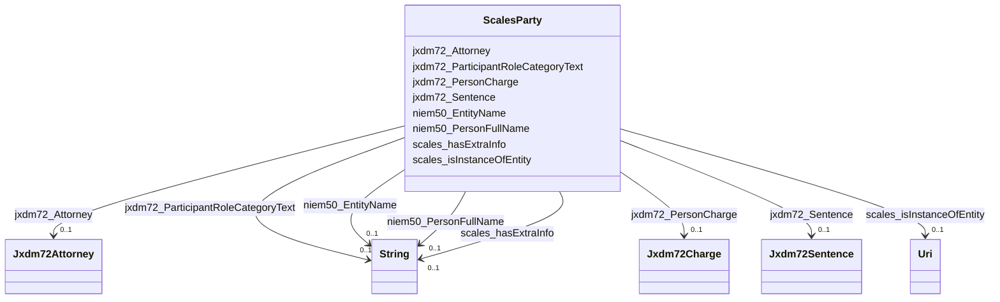

# Class: ScalesParty


This class occurs 7362525 times.


URI: [scales:Party](http://schemas.scales-okn.org/rdf/scales#Party)





<!-- no inheritance hierarchy -->


## Slots

| Name | Cardinality and Range | Description | Inheritance | Occurrences |
| ---  | --- | --- | --- | --- |
| [jxdm72_Attorney](../slots/jxdm72_Attorney.md) | 0..1 <br/> [Jxdm72Attorney](../classes/Jxdm72Attorney.md) |  <br/>  | direct | 537560 |
| [niem50_PersonFullName](../slots/niem50_PersonFullName.md) | 0..1 <br/> [xsd:string](http://www.w3.org/2001/XMLSchema#string) |  <br/>  | direct | 7044753 |
| [jxdm72_ParticipantRoleCategoryText](../slots/jxdm72_ParticipantRoleCategoryText.md) | 0..1 <br/> [xsd:string](http://www.w3.org/2001/XMLSchema#string) |  <br/>  | direct | 7341708 |
| [jxdm72_PersonCharge](../slots/jxdm72_PersonCharge.md) | 0..1 <br/> [Jxdm72Charge](../classes/Jxdm72Charge.md) |  <br/>  | direct | 2587593 |
| [scales_isInstanceOfEntity](../slots/scales_isInstanceOfEntity.md) | 0..1 <br/> [xsd:anyURI](http://www.w3.org/2001/XMLSchema#anyURI) |  <br/>  | direct | 7057563 |
| [jxdm72_Sentence](../slots/jxdm72_Sentence.md) | 0..1 <br/> [Jxdm72Sentence](../classes/Jxdm72Sentence.md) |  <br/>  | direct | 319576 |
| [scales_hasExtraInfo](../slots/scales_hasExtraInfo.md) | 0..1 <br/> [xsd:string](http://www.w3.org/2001/XMLSchema#string) |  <br/>  | direct | 43157 |
| [niem50_EntityName](../slots/niem50_EntityName.md) | 0..1 <br/> [xsd:string](http://www.w3.org/2001/XMLSchema#string) |  <br/>  | direct | 317772 |


## Usages

| used by | used in | type | used |
| ---  | --- | --- | --- |
| [ScalesCivilCase](../classes/ScalesCivilCase.md) | [Jxdm72CaseInitiatingParty](../classes/Jxdm72CaseInitiatingParty.md) | any_of[range] | [ScalesParty](../classes/ScalesParty.md) |
| [ScalesCivilCase](../classes/ScalesCivilCase.md) | [ScalesParty](../classes/ScalesParty.md) | range | [ScalesParty](../classes/ScalesParty.md) |
| [ScalesCivilCase](../classes/ScalesCivilCase.md) | [Jxdm72CaseDefendantParty](../classes/Jxdm72CaseDefendantParty.md) | any_of[range] | [ScalesParty](../classes/ScalesParty.md) |
| [ScalesCriminalCase](../classes/ScalesCriminalCase.md) | [Jxdm72CaseInitiatingParty](../classes/Jxdm72CaseInitiatingParty.md) | any_of[range] | [ScalesParty](../classes/ScalesParty.md) |
| [ScalesCriminalCase](../classes/ScalesCriminalCase.md) | [ScalesParty](../classes/ScalesParty.md) | range | [ScalesParty](../classes/ScalesParty.md) |
| [ScalesCriminalCase](../classes/ScalesCriminalCase.md) | [Jxdm72CaseDefendantParty](../classes/Jxdm72CaseDefendantParty.md) | any_of[range] | [ScalesParty](../classes/ScalesParty.md) |


## LinkML Source

<!-- TODO: investigate https://stackoverflow.com/questions/37606292/how-to-create-tabbed-code-blocks-in-mkdocs-or-sphinx -->

### Direct

<details>

```yaml
name: scales_Party
from_schema: okns:scales-kg
rank: 1000
slots:
- jxdm72_Attorney
- niem50_PersonFullName
- jxdm72_ParticipantRoleCategoryText
- jxdm72_PersonCharge
- scales_isInstanceOfEntity
- jxdm72_Sentence
- scales_hasExtraInfo
- niem50_EntityName
class_uri: scales:Party

```
</details>

### Induced

<details>

```yaml
name: scales_Party
from_schema: okns:scales-kg
rank: 1000
attributes:
  jxdm72_Attorney:
    name: jxdm72_Attorney
    from_schema: okns:scales-kg
    rank: 1000
    slot_uri: jxdm72:Attorney
    alias: jxdm72_Attorney
    owner: scales_Party
    domain_of:
    - scales_Party
    range: jxdm72_Attorney
  niem50_PersonFullName:
    name: niem50_PersonFullName
    from_schema: okns:scales-kg
    rank: 1000
    slot_uri: niem50:PersonFullName
    alias: niem50_PersonFullName
    owner: scales_Party
    domain_of:
    - jxdm72_Attorney
    - jxdm72_CaseDefendantParty
    - jxdm72_CaseDefenseAttorney
    - jxdm72_CaseInitiatingAttorney
    - jxdm72_CaseJudge
    - jxdm72_Judge
    - scales_Party
    range: string
  jxdm72_ParticipantRoleCategoryText:
    name: jxdm72_ParticipantRoleCategoryText
    from_schema: okns:scales-kg
    rank: 1000
    slot_uri: jxdm72:ParticipantRoleCategoryText
    alias: jxdm72_ParticipantRoleCategoryText
    owner: scales_Party
    domain_of:
    - jxdm72_CaseDefendantParty
    - jxdm72_CaseInitiatingParty
    - scales_Party
    range: string
  jxdm72_PersonCharge:
    name: jxdm72_PersonCharge
    from_schema: okns:scales-kg
    rank: 1000
    slot_uri: jxdm72:PersonCharge
    alias: jxdm72_PersonCharge
    owner: scales_Party
    domain_of:
    - jxdm72_CaseDefendantParty
    - scales_Party
    range: jxdm72_Charge
  scales_isInstanceOfEntity:
    name: scales_isInstanceOfEntity
    from_schema: okns:scales-kg
    rank: 1000
    slot_uri: scales:isInstanceOfEntity
    alias: scales_isInstanceOfEntity
    owner: scales_Party
    domain_of:
    - jxdm72_CaseDefendantParty
    - scales_Party
    range: uri
  jxdm72_Sentence:
    name: jxdm72_Sentence
    from_schema: okns:scales-kg
    rank: 1000
    slot_uri: jxdm72:Sentence
    alias: jxdm72_Sentence
    owner: scales_Party
    domain_of:
    - jxdm72_RegisterAction
    - scales_Party
    range: jxdm72_Sentence
  scales_hasExtraInfo:
    name: scales_hasExtraInfo
    from_schema: okns:scales-kg
    rank: 1000
    slot_uri: scales:hasExtraInfo
    alias: scales_hasExtraInfo
    owner: scales_Party
    domain_of:
    - jxdm72_CaseDefendantParty
    - jxdm72_CaseInitiatingParty
    - scales_Party
    range: string
  niem50_EntityName:
    name: niem50_EntityName
    from_schema: okns:scales-kg
    rank: 1000
    slot_uri: niem50:EntityName
    alias: niem50_EntityName
    owner: scales_Party
    domain_of:
    - jxdm72_CaseDefendantParty
    - jxdm72_CaseInitiatingParty
    - scales_Party
    range: string
class_uri: scales:Party

```
</details>