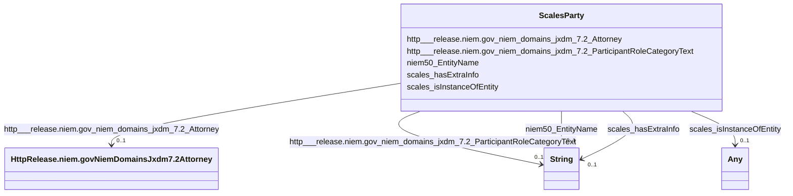

# Class: No class (type) name specified (scales_Party)


_No class (type) description specified_


This class occurs 2319 times.


URI: [scales:Party](http://schemas.scales-okn.org/rdf/scales#Party)





<!-- no inheritance hierarchy -->


## Slots

| Name | Cardinality and Range | Description | Inheritance | Occurrences |
| ---  | --- | --- | --- | --- |
| [http___release.niem.gov_niem_domains_jxdm_7.2_Attorney](../slots/http___release.niem.gov_niem_domains_jxdm_7.2_Attorney.md) | 0..1 <br/> [HttpRelease.niem.govNiemDomainsJxdm7.2Attorney](../classes/HttpRelease.niem.govNiemDomainsJxdm7.2Attorney.md) | No slot (predicate) description specified <br/>  | direct | 2538 |
| [scales_isInstanceOfEntity](../slots/scales_isInstanceOfEntity.md) | 0..1 <br/> [xsd:anyURI](http://www.w3.org/2001/XMLSchema#anyURI)&nbsp;or&nbsp;<br />[HttpRelease.niem.govNiemDomainsJxdm7.2Judge](../classes/HttpRelease.niem.govNiemDomainsJxdm7.2Judge.md) | No slot (predicate) description specified <br/>  | direct | 207 |
| [niem50_EntityName](../slots/niem50_EntityName.md) | 0..1 <br/> [xsd:string](http://www.w3.org/2001/XMLSchema#string) | No slot (predicate) description specified <br/>  | direct | 2319 |
| [scales_hasExtraInfo](../slots/scales_hasExtraInfo.md) | 0..1 <br/> [xsd:string](http://www.w3.org/2001/XMLSchema#string) | No slot (predicate) description specified <br/>  | direct | 144 |
| [http___release.niem.gov_niem_domains_jxdm_7.2_ParticipantRoleCategoryText](../slots/http___release.niem.gov_niem_domains_jxdm_7.2_ParticipantRoleCategoryText.md) | 0..1 <br/> [xsd:string](http://www.w3.org/2001/XMLSchema#string) | No slot (predicate) description specified <br/>  | direct | 2319 |


## Usages

| used by | used in | type | used |
| ---  | --- | --- | --- |
| [HttpRelease.niem.govNiemDomainsJxdm7.2Case](../classes/HttpRelease.niem.govNiemDomainsJxdm7.2Case.md) | [ScalesParty](../classes/ScalesParty.md) | range | [ScalesParty](../classes/ScalesParty.md) |
| [ScalesCase](../classes/ScalesCase.md) | [ScalesParty](../classes/ScalesParty.md) | range | [ScalesParty](../classes/ScalesParty.md) |


## LinkML Source

<!-- TODO: investigate https://stackoverflow.com/questions/37606292/how-to-create-tabbed-code-blocks-in-mkdocs-or-sphinx -->

### Direct

<details>

```yaml
name: scales_Party
conforms_to: No schema conformance document specified
annotations:
  count:
    tag: count
    value: 2319
description: No class (type) description specified
title: No class (type) name specified
from_schema: scales-kg
rank: 1000
slots:
- http___release.niem.gov_niem_domains_jxdm_7.2_Attorney
- scales_isInstanceOfEntity
- niem50_EntityName
- scales_hasExtraInfo
- http___release.niem.gov_niem_domains_jxdm_7.2_ParticipantRoleCategoryText
slot_usage:
  http___release.niem.gov_niem_domains_jxdm_7.2_Attorney:
    name: http___release.niem.gov_niem_domains_jxdm_7.2_Attorney
    annotations:
      http___release.niem.gov_niem_domains_jxdm_7.2_Attorney:
        tag: http___release.niem.gov_niem_domains_jxdm_7.2_Attorney
        value: 2538
  http___release.niem.gov_niem_domains_jxdm_7.2_ParticipantRoleCategoryText:
    name: http___release.niem.gov_niem_domains_jxdm_7.2_ParticipantRoleCategoryText
    annotations:
      string:
        tag: string
        value: 2319
  niem50_EntityName:
    name: niem50_EntityName
    annotations:
      string:
        tag: string
        value: 2319
  scales_hasExtraInfo:
    name: scales_hasExtraInfo
    annotations:
      string:
        tag: string
        value: 144
  scales_isInstanceOfEntity:
    name: scales_isInstanceOfEntity
    annotations:
      uri:
        tag: uri
        value: 207
class_uri: scales:Party

```
</details>

### Induced

<details>

```yaml
name: scales_Party
conforms_to: No schema conformance document specified
annotations:
  count:
    tag: count
    value: 2319
description: No class (type) description specified
title: No class (type) name specified
from_schema: scales-kg
rank: 1000
slot_usage:
  http___release.niem.gov_niem_domains_jxdm_7.2_Attorney:
    name: http___release.niem.gov_niem_domains_jxdm_7.2_Attorney
    annotations:
      http___release.niem.gov_niem_domains_jxdm_7.2_Attorney:
        tag: http___release.niem.gov_niem_domains_jxdm_7.2_Attorney
        value: 2538
  http___release.niem.gov_niem_domains_jxdm_7.2_ParticipantRoleCategoryText:
    name: http___release.niem.gov_niem_domains_jxdm_7.2_ParticipantRoleCategoryText
    annotations:
      string:
        tag: string
        value: 2319
  niem50_EntityName:
    name: niem50_EntityName
    annotations:
      string:
        tag: string
        value: 2319
  scales_hasExtraInfo:
    name: scales_hasExtraInfo
    annotations:
      string:
        tag: string
        value: 144
  scales_isInstanceOfEntity:
    name: scales_isInstanceOfEntity
    annotations:
      uri:
        tag: uri
        value: 207
attributes:
  http___release.niem.gov_niem_domains_jxdm_7.2_Attorney:
    name: http___release.niem.gov_niem_domains_jxdm_7.2_Attorney
    annotations:
      http___release.niem.gov_niem_domains_jxdm_7.2_Attorney:
        tag: http___release.niem.gov_niem_domains_jxdm_7.2_Attorney
        value: 2538
    description: No slot (predicate) description specified
    examples:
    - object:
        example_object: scales:/Agent/casd;;3:16-cv-01645_a20
        example_object_type: http___release.niem.gov_niem_domains_jxdm_7.2_Attorney
        example_predicate: http://release.niem.gov/niem/domains/jxdm/7.2/Attorney
        example_subject: scales:/Agent/casd;;3:16-cv-01645_a3
        example_subject_type: scales_Party
    from_schema: scales-kg
    rank: 1000
    slot_uri: http://release.niem.gov/niem/domains/jxdm/7.2/Attorney
    alias: http___release.niem.gov_niem_domains_jxdm_7.2_Attorney
    owner: scales_Party
    domain_of:
    - scales_Party
    range: http___release.niem.gov_niem_domains_jxdm_7.2_Attorney
  scales_isInstanceOfEntity:
    name: scales_isInstanceOfEntity
    annotations:
      uri:
        tag: uri
        value: 207
    description: No slot (predicate) description specified
    examples:
    - object:
        example_object: scales:/PartyEntity/SPID-GOVERNMENT-ST-025-000001969
        example_object_type: uri
        example_predicate: scales:isInstanceOfEntity
        example_subject: scales:/Agent/casd;;3:16-cv-01644_a1
        example_subject_type: http___release.niem.gov_niem_domains_jxdm_7.2_CaseDefendantParty
    - object:
        example_object: scales:/JudgeEntity/SJ002053
        example_object_type: http___release.niem.gov_niem_domains_jxdm_7.2_Judge
        example_predicate: scales:isInstanceOfEntity
        example_subject: scales:/Agent/casd;;3:17-cr-03540_a2
        example_subject_type: None
    - object:
        example_object: scales:/PartyEntity/SPID-INDUSTRY-ST-020-000011105
        example_object_type: uri
        example_predicate: scales:isInstanceOfEntity
        example_subject: scales:/Agent/casd;;3:16-cv-01645_a0
        example_subject_type: http___release.niem.gov_niem_domains_jxdm_7.2_CaseInitiatingParty
    - object:
        example_object: scales:/PartyEntity/SPID-INDUSTRY-ST-008-000022280
        example_object_type: uri
        example_predicate: scales:isInstanceOfEntity
        example_subject: scales:/Agent/casd;;3:16-cv-01645_a3
        example_subject_type: scales_Party
    from_schema: scales-kg
    rank: 1000
    slot_uri: scales:isInstanceOfEntity
    alias: scales_isInstanceOfEntity
    owner: scales_Party
    domain_of:
    - http___release.niem.gov_niem_domains_jxdm_7.2_CaseDefendantParty
    - http___release.niem.gov_niem_domains_jxdm_7.2_CaseInitiatingParty
    - scales_Party
    range: Any
    any_of:
    - range: uri
    - range: http___release.niem.gov_niem_domains_jxdm_7.2_Judge
  niem50_EntityName:
    name: niem50_EntityName
    annotations:
      string:
        tag: string
        value: 2319
    description: No slot (predicate) description specified
    examples:
    - object:
        example_object: SCALES-Party-Hash-A832763C1FE77A32B6DE912B9C77F80C
        example_object_type: string
        example_predicate: niem50:EntityName
        example_subject: scales:/Agent/casd;;3:16-cv-01644_a0
        example_subject_type: http___release.niem.gov_niem_domains_jxdm_7.2_CaseInitiatingParty
    - object:
        example_object: USA
        example_object_type: string
        example_predicate: niem50:EntityName
        example_subject: scales:/Agent/casd;;3:16-cv-01644_a1
        example_subject_type: http___release.niem.gov_niem_domains_jxdm_7.2_CaseDefendantParty
    - object:
        example_object: Revolar, Inc.
        example_object_type: string
        example_predicate: niem50:EntityName
        example_subject: scales:/Agent/casd;;3:16-cv-01645_a3
        example_subject_type: scales_Party
    from_schema: scales-kg
    rank: 1000
    slot_uri: niem50:EntityName
    alias: niem50_EntityName
    owner: scales_Party
    domain_of:
    - http___release.niem.gov_niem_domains_jxdm_7.2_CaseDefendantParty
    - http___release.niem.gov_niem_domains_jxdm_7.2_CaseInitiatingParty
    - scales_Party
    range: string
  scales_hasExtraInfo:
    name: scales_hasExtraInfo
    annotations:
      string:
        tag: string
        value: 144
    description: No slot (predicate) description specified
    examples:
    - object:
        example_object: a Delaware limited liability company
        example_object_type: string
        example_predicate: scales:hasExtraInfo
        example_subject: scales:/Agent/casd;;3:16-cv-01645_a0
        example_subject_type: http___release.niem.gov_niem_domains_jxdm_7.2_CaseInitiatingParty
    - object:
        example_object: a Delaware corporation
        example_object_type: string
        example_predicate: scales:hasExtraInfo
        example_subject: scales:/Agent/casd;;3:16-cv-01645_a1
        example_subject_type: http___release.niem.gov_niem_domains_jxdm_7.2_CaseDefendantParty
    - object:
        example_object: a Delaware corporation
        example_object_type: string
        example_predicate: scales:hasExtraInfo
        example_subject: scales:/Agent/casd;;3:16-cv-01645_a3
        example_subject_type: scales_Party
    from_schema: scales-kg
    rank: 1000
    slot_uri: scales:hasExtraInfo
    alias: scales_hasExtraInfo
    owner: scales_Party
    domain_of:
    - http___release.niem.gov_niem_domains_jxdm_7.2_CaseDefendantParty
    - http___release.niem.gov_niem_domains_jxdm_7.2_CaseInitiatingParty
    - scales_Party
    range: string
  http___release.niem.gov_niem_domains_jxdm_7.2_ParticipantRoleCategoryText:
    name: http___release.niem.gov_niem_domains_jxdm_7.2_ParticipantRoleCategoryText
    annotations:
      string:
        tag: string
        value: 2319
    description: No slot (predicate) description specified
    examples:
    - object:
        example_object: Petitioner
        example_object_type: string
        example_predicate: http://release.niem.gov/niem/domains/jxdm/7.2/ParticipantRoleCategoryText
        example_subject: scales:/Agent/casd;;3:16-cv-01644_a0
        example_subject_type: http___release.niem.gov_niem_domains_jxdm_7.2_CaseInitiatingParty
    - object:
        example_object: Respondent
        example_object_type: string
        example_predicate: http://release.niem.gov/niem/domains/jxdm/7.2/ParticipantRoleCategoryText
        example_subject: scales:/Agent/casd;;3:16-cv-01644_a1
        example_subject_type: http___release.niem.gov_niem_domains_jxdm_7.2_CaseDefendantParty
    - object:
        example_object: Counter Claimant
        example_object_type: string
        example_predicate: http://release.niem.gov/niem/domains/jxdm/7.2/ParticipantRoleCategoryText
        example_subject: scales:/Agent/casd;;3:16-cv-01645_a3
        example_subject_type: scales_Party
    from_schema: scales-kg
    rank: 1000
    slot_uri: http://release.niem.gov/niem/domains/jxdm/7.2/ParticipantRoleCategoryText
    alias: http___release.niem.gov_niem_domains_jxdm_7.2_ParticipantRoleCategoryText
    owner: scales_Party
    domain_of:
    - http___release.niem.gov_niem_domains_jxdm_7.2_CaseDefendantParty
    - http___release.niem.gov_niem_domains_jxdm_7.2_CaseInitiatingParty
    - scales_Party
    range: string
class_uri: scales:Party

```
</details>