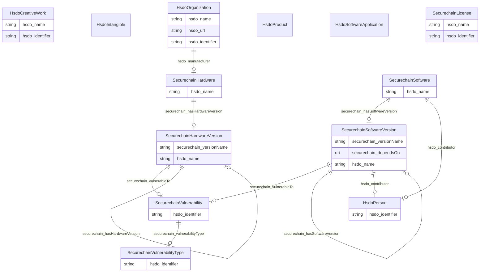

# No schema name specified

No schema description specified

## Schema Diagram

## IRI prefixes

* hsdo: http://schema.org/
* linkml: https://w3id.org/linkml/
* rdf: http://www.w3.org/1999/02/22-rdf-syntax-ns#
* rdfs: http://www.w3.org/2000/01/rdf-schema#
* schema: https://schema.org/
* securechain: https://w3id.org/secure-chain/

## Classes

| Class | Description |
| --- | --- |
| [HsdoCreativeWork](classes/HsdoCreativeWork.md) | The most generic kind of creative work, including books, movies, photographs, software programs, etc. Class with 20 occurrences.| 
| &nbsp;&nbsp;&nbsp;&nbsp;&nbsp;&nbsp;&nbsp;&nbsp;[SecurechainLicense](classes/SecurechainLicense.md) | No class (type) description specified Class with 0 occurrences.| 
| [HsdoIntangible](classes/HsdoIntangible.md) | No class (type) description specified Class with 0 occurrences.| 
| &nbsp;&nbsp;&nbsp;&nbsp;&nbsp;&nbsp;&nbsp;&nbsp;[SecurechainVulnerability](classes/SecurechainVulnerability.md) | No class (type) description specified Class with 259334 occurrences.| 
| &nbsp;&nbsp;&nbsp;&nbsp;&nbsp;&nbsp;&nbsp;&nbsp;[SecurechainVulnerabilityType](classes/SecurechainVulnerabilityType.md) | No class (type) description specified Class with 445 occurrences.| 
| [HsdoOrganization](classes/HsdoOrganization.md) | An organization such as a school, NGO, corporation, club, etc. Class with 22889 occurrences.| 
| [HsdoPerson](classes/HsdoPerson.md) | A person (alive, dead, undead, or fictional). Class with 30434 occurrences.| 
| [HsdoProduct](classes/HsdoProduct.md) | No class (type) description specified Class with 0 occurrences.| 
| &nbsp;&nbsp;&nbsp;&nbsp;&nbsp;&nbsp;&nbsp;&nbsp;[SecurechainHardware](classes/SecurechainHardware.md) | No class (type) description specified Class with 53378 occurrences.| 
| &nbsp;&nbsp;&nbsp;&nbsp;&nbsp;&nbsp;&nbsp;&nbsp;&nbsp;&nbsp;&nbsp;&nbsp;&nbsp;&nbsp;&nbsp;&nbsp;[SecurechainHardwareVersion](classes/SecurechainHardwareVersion.md) | No class (type) description specified Class with 57295 occurrences.| 
| [HsdoSoftwareApplication](classes/HsdoSoftwareApplication.md) | No class (type) description specified Class with 0 occurrences.| 
| &nbsp;&nbsp;&nbsp;&nbsp;&nbsp;&nbsp;&nbsp;&nbsp;[SecurechainSoftware](classes/SecurechainSoftware.md) | No class (type) description specified Class with 34469 occurrences.| 
| &nbsp;&nbsp;&nbsp;&nbsp;&nbsp;&nbsp;&nbsp;&nbsp;&nbsp;&nbsp;&nbsp;&nbsp;&nbsp;&nbsp;&nbsp;&nbsp;[SecurechainSoftwareVersion](classes/SecurechainSoftwareVersion.md) | No class (type) description specified Class with 164001 occurrences.| 

## Slots

| Slot | Description |
| --- | --- |
| [hsdo_contributor](slots/hsdo_contributor.md) | No slot (predicate) description specified 3668 occurrences with untyped subjects and object type http://schema.org/Person. 33048 occurrences with subject type securechain_Software and object type hsdo_Person.|
| [hsdo_identifier](slots/hsdo_identifier.md) | No slot (predicate) description specified 30434 occurrences with subject type hsdo_Person and object type string. 259334 occurrences with subject type securechain_Vulnerability and object type string. 445 occurrences with subject type securechain_VulnerabilityType and object type string. 887 occurrences with subject type hsdo_Organization and object type string. 20 occurrences with subject type hsdo_CreativeWork and object type string.|
| [hsdo_manufacturer](slots/hsdo_manufacturer.md) | No slot (predicate) description specified 54369 occurrences with subject type hsdo_Organization and object type securechain_Hardware.|
| [hsdo_name](slots/hsdo_name.md) | No slot (predicate) description specified 53378 occurrences with subject type securechain_Hardware and object type string. 22002 occurrences with subject type hsdo_Organization and object type string. 20 occurrences with subject type hsdo_CreativeWork and object type string. 34466 occurrences with subject type securechain_Software and object type string.|
| [hsdo_url](slots/hsdo_url.md) | No slot (predicate) description specified 887 occurrences with subject type hsdo_Organization and object type string.|
| [securechain_dependsOn](slots/securechain_dependsOn.md) | No slot (predicate) description specified 696916 occurrences with subject type securechain_SoftwareVersion and object type securechain_SoftwareVersion. 982961 occurrences with untyped subjects and object type https://w3id.org/secure-chain/SoftwareVersion. 2 occurrences with subject type securechain_SoftwareVersion and object type uri. 39 occurrences with untyped subjects and object type uri.|
| [securechain_Hardware](slots/securechain_Hardware.md) | No slot (predicate) description specified No occurrences of this slot in the graph.|
| [securechain_HardwareVersion](slots/securechain_HardwareVersion.md) | No slot (predicate) description specified No occurrences of this slot in the graph.|
| [securechain_hasHardwareVersion](slots/securechain_hasHardwareVersion.md) | No slot (predicate) description specified 57295 occurrences with subject type securechain_Hardware and object type securechain_HardwareVersion.|
| [securechain_hasSoftwareVersion](slots/securechain_hasSoftwareVersion.md) | No slot (predicate) description specified 164001 occurrences with subject type securechain_Software and object type securechain_SoftwareVersion.|
| [securechain_License](slots/securechain_License.md) | No slot (predicate) description specified No occurrences of this slot in the graph.|
| [securechain_Software](slots/securechain_Software.md) | No slot (predicate) description specified No occurrences of this slot in the graph.|
| [securechain_SoftwareVersion](slots/securechain_SoftwareVersion.md) | No slot (predicate) description specified No occurrences of this slot in the graph.|
| [securechain_versionName](slots/securechain_versionName.md) | No slot (predicate) description specified 57295 occurrences with subject type securechain_HardwareVersion and object type string. 164000 occurrences with subject type securechain_SoftwareVersion and object type string.|
| [securechain_Vulnerability](slots/securechain_Vulnerability.md) | No slot (predicate) description specified No occurrences of this slot in the graph.|
| [securechain_VulnerabilityType](slots/securechain_VulnerabilityType.md) | No slot (predicate) description specified No occurrences of this slot in the graph.|
| [securechain_vulnerabilityType](slots/securechain_vulnerabilityType.md) | No slot (predicate) description specified 177404 occurrences with subject type securechain_Vulnerability and object type securechain_VulnerabilityType.|
| [securechain_vulnerableTo](slots/securechain_vulnerableTo.md) | No slot (predicate) description specified 445386 occurrences with subject type securechain_HardwareVersion and object type securechain_Vulnerability. 5067 occurrences with subject type securechain_SoftwareVersion and object type securechain_Vulnerability. 21897 occurrences with untyped subjects and object type https://w3id.org/secure-chain/Vulnerability.|

