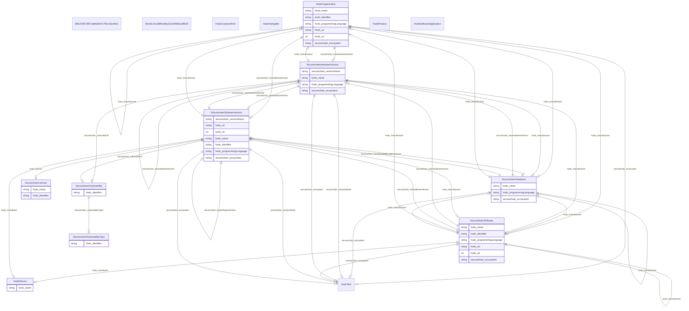

# securechainkg

No schema description specified

## Schema Diagram

## Imports

* linkml:types

## Classes

| Class | Description | Occurrences |
| --- | --- | --- || [B8e37d573f67cafe60bd7c79e143cd62e](classes/B8e37d573f67cafe60bd7c79e143cd62e.md) | No class (type) description specified |  | 
| [Bcfd3c14c389f3c8ba32c30498a1d8b29](classes/Bcfd3c14c389f3c8ba32c30498a1d8b29.md) | No class (type) description specified |  | 

| [HsdoCreativeWork](classes/HsdoCreativeWork.md) | No class (type) description specified |  | 
| &nbsp;&nbsp;&nbsp;&nbsp;&nbsp;&nbsp;&nbsp;&nbsp;[SecurechainLicense](classes/SecurechainLicense.md) | No class (type) description specified | 294 | 
| [HsdoIntangible](classes/HsdoIntangible.md) | No class (type) description specified |  | 
| &nbsp;&nbsp;&nbsp;&nbsp;&nbsp;&nbsp;&nbsp;&nbsp;[SecurechainVulnerability](classes/SecurechainVulnerability.md) | No class (type) description specified | 259806 | 
| &nbsp;&nbsp;&nbsp;&nbsp;&nbsp;&nbsp;&nbsp;&nbsp;[SecurechainVulnerabilityType](classes/SecurechainVulnerabilityType.md) | No class (type) description specified | 445 | 
| [HsdoOrganization](classes/HsdoOrganization.md) | No class (type) description specified | 22889 | 
| [HsdoPerson](classes/HsdoPerson.md) | No class (type) description specified | 27009 | 
| [HsdoProduct](classes/HsdoProduct.md) | No class (type) description specified |  | 
| &nbsp;&nbsp;&nbsp;&nbsp;&nbsp;&nbsp;&nbsp;&nbsp;[SecurechainHardware](classes/SecurechainHardware.md) | No class (type) description specified | 53378 | 
| &nbsp;&nbsp;&nbsp;&nbsp;&nbsp;&nbsp;&nbsp;&nbsp;&nbsp;&nbsp;&nbsp;&nbsp;&nbsp;&nbsp;&nbsp;&nbsp;[SecurechainHardwareVersion](classes/SecurechainHardwareVersion.md) | No class (type) description specified | 57295 | 
| [HsdoSoftwareApplication](classes/HsdoSoftwareApplication.md) | No class (type) description specified |  | 
| &nbsp;&nbsp;&nbsp;&nbsp;&nbsp;&nbsp;&nbsp;&nbsp;[SecurechainSoftware](classes/SecurechainSoftware.md) | No class (type) description specified | 803769 | 
| &nbsp;&nbsp;&nbsp;&nbsp;&nbsp;&nbsp;&nbsp;&nbsp;&nbsp;&nbsp;&nbsp;&nbsp;&nbsp;&nbsp;&nbsp;&nbsp;[SecurechainSoftwareVersion](classes/SecurechainSoftwareVersion.md) | No class (type) description specified | 8593149 | 
| [HsdoText](classes/HsdoText.md) | No class (type) description specified |  | 

## Slots

| Slot | Description | Occurrences |
| --- | --- | --- |
| [hsdo_contributor](slots/hsdo_contributor.md) | No slot (predicate) description specified | 32408 |
| [hsdo_identifier](slots/hsdo_identifier.md) | No slot (predicate) description specified | 261432 |
| [hsdo_license](slots/hsdo_license.md) | No slot (predicate) description specified | 5018025 |
| [hsdo_manufacturer](slots/hsdo_manufacturer.md) | No slot (predicate) description specified | 54369 |
| [hsdo_name](slots/hsdo_name.md) | No slot (predicate) description specified | 906771 |
| [hsdo_programmingLanguage](slots/hsdo_programmingLanguage.md) | No slot (predicate) description specified | 803769 |
| [hsdo_url](slots/hsdo_url.md) | No slot (predicate) description specified | 7734800 |
| [securechain_dependsOn](slots/securechain_dependsOn.md) | No slot (predicate) description specified | 29787726 |
| [securechain_discover](slots/securechain_discover.md) | No slot (predicate) description specified No occurrences of this slot in the graph.|  |
| [securechain_ecosystem](slots/securechain_ecosystem.md) | No slot (predicate) description specified | 803769 |
| [securechain_hasHardwareVersion](slots/securechain_hasHardwareVersion.md) | No slot (predicate) description specified | 57295 |
| [securechain_hasSoftwareVersion](slots/securechain_hasSoftwareVersion.md) | No slot (predicate) description specified | 8593149 |
| [securechain_operatesOn](slots/securechain_operatesOn.md) | No slot (predicate) description specified No occurrences of this slot in the graph.|  |
| [securechain_versionName](slots/securechain_versionName.md) | No slot (predicate) description specified | 8650443 |
| [securechain_vulnerabilityType](slots/securechain_vulnerabilityType.md) | No slot (predicate) description specified | 177404 |
| [securechain_vulnerableTo](slots/securechain_vulnerableTo.md) | No slot (predicate) description specified | 835140 |

## IRI prefixes

* hsdo: http://schema.org/
* linkml: https://w3id.org/linkml/
* owl: http://www.w3.org/2002/07/owl#
* rdf: http://www.w3.org/1999/02/22-rdf-syntax-ns#
* rdfs: http://www.w3.org/2000/01/rdf-schema#
* securechain: https://w3id.org/secure-chain/
* xsd: http://www.w3.org/2001/XMLSchema#
* shex: http://www.w3.org/ns/shex#
* schema: http://schema.org/
