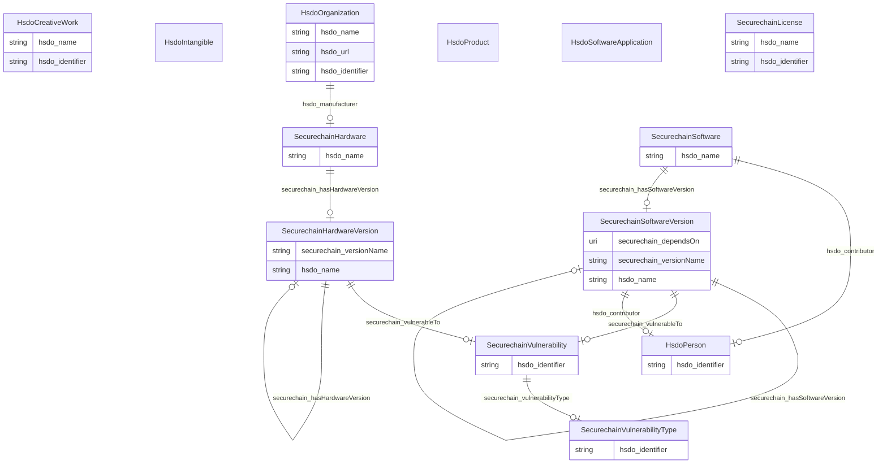

# No schema name specified

No schema description specified

## Schema Diagram

## Classes

| Class | Description | Occurrences |
| --- | --- | --- |
| [HsdoCreativeWork](classes/HsdoCreativeWork.md) | The most generic kind of creative work, including books, movies, photographs, software programs, etc. | 20 | 
| &nbsp;&nbsp;&nbsp;&nbsp;&nbsp;&nbsp;&nbsp;&nbsp;[SecurechainLicense](classes/SecurechainLicense.md) | No class (type) description specified | 0 | 
| [HsdoIntangible](classes/HsdoIntangible.md) | No class (type) description specified | 0 | 
| &nbsp;&nbsp;&nbsp;&nbsp;&nbsp;&nbsp;&nbsp;&nbsp;[SecurechainVulnerability](classes/SecurechainVulnerability.md) | No class (type) description specified | 259334 | 
| &nbsp;&nbsp;&nbsp;&nbsp;&nbsp;&nbsp;&nbsp;&nbsp;[SecurechainVulnerabilityType](classes/SecurechainVulnerabilityType.md) | No class (type) description specified | 445 | 
| [HsdoOrganization](classes/HsdoOrganization.md) | An organization such as a school, NGO, corporation, club, etc. | 22889 | 
| [HsdoPerson](classes/HsdoPerson.md) | A person (alive, dead, undead, or fictional). | 30434 | 
| [HsdoProduct](classes/HsdoProduct.md) | No class (type) description specified | 0 | 
| &nbsp;&nbsp;&nbsp;&nbsp;&nbsp;&nbsp;&nbsp;&nbsp;[SecurechainHardware](classes/SecurechainHardware.md) | No class (type) description specified | 53378 | 
| &nbsp;&nbsp;&nbsp;&nbsp;&nbsp;&nbsp;&nbsp;&nbsp;&nbsp;&nbsp;&nbsp;&nbsp;&nbsp;&nbsp;&nbsp;&nbsp;[SecurechainHardwareVersion](classes/SecurechainHardwareVersion.md) | No class (type) description specified | 57295 | 
| [HsdoSoftwareApplication](classes/HsdoSoftwareApplication.md) | No class (type) description specified | 0 | 
| &nbsp;&nbsp;&nbsp;&nbsp;&nbsp;&nbsp;&nbsp;&nbsp;[SecurechainSoftware](classes/SecurechainSoftware.md) | No class (type) description specified | 34469 | 
| &nbsp;&nbsp;&nbsp;&nbsp;&nbsp;&nbsp;&nbsp;&nbsp;&nbsp;&nbsp;&nbsp;&nbsp;&nbsp;&nbsp;&nbsp;&nbsp;[SecurechainSoftwareVersion](classes/SecurechainSoftwareVersion.md) | No class (type) description specified | 164001 | 

## Slots

| Slot | Description | Occurrences |
| --- | --- | --- |
| [hsdo_contributor](slots/hsdo_contributor.md) | A secondary contributor to the CreativeWork or Event | 36716 |
| [hsdo_identifier](slots/hsdo_identifier.md) | The identifier property represents any kind of identifier for any kind of [[T... | 291120 |
| [hsdo_manufacturer](slots/hsdo_manufacturer.md) | The manufacturer of the product | 54369 |
| [hsdo_name](slots/hsdo_name.md) | The name of the item | 109866 |
| [hsdo_url](slots/hsdo_url.md) | URL of the item | 887 |
| [securechain_dependsOn](slots/securechain_dependsOn.md) | No slot (predicate) description specified | 1679918 |
| [securechain_discover](slots/securechain_discover.md) | No slot (predicate) description specified No occurrences of this slot in the graph.| 0 |
| [securechain_hasHardwareVersion](slots/securechain_hasHardwareVersion.md) | No slot (predicate) description specified | 57295 |
| [securechain_hasSoftwareVersion](slots/securechain_hasSoftwareVersion.md) | No slot (predicate) description specified | 164001 |
| [securechain_versionName](slots/securechain_versionName.md) | No slot (predicate) description specified | 221295 |
| [securechain_vulnerabilityType](slots/securechain_vulnerabilityType.md) | No slot (predicate) description specified | 177404 |
| [securechain_vulnerableTo](slots/securechain_vulnerableTo.md) | No slot (predicate) description specified | 472350 |

## IRI prefixes

* hsdo: http://schema.org/
* linkml: https://w3id.org/linkml/
* rdfs: http://www.w3.org/2000/01/rdf-schema#
* schema: https://schema.org/
* securechain: https://w3id.org/secure-chain/
* xsd: http://www.w3.org/2001/XMLSchema#
* shex: http://www.w3.org/ns/shex#
