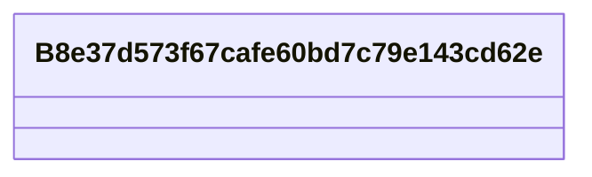

# Class: No class (entity type) name specified (__B8e37d573f67cafe60bd7c79e143cd62e)


_No class (type) description specified_


URI: [_:B8e37d573f67cafe60bd7c79e143cd62e](_:B8e37d573f67cafe60bd7c79e143cd62e)





<!-- no inheritance hierarchy -->


## Slots

| Name | Cardinality and Range | Description | Inheritance | Occurrences |
| ---  | --- | --- | --- | --- |


## LinkML Source

<!-- TODO: investigate https://stackoverflow.com/questions/37606292/how-to-create-tabbed-code-blocks-in-mkdocs-or-sphinx -->

### Direct

<details>

```yaml
name: __B8e37d573f67cafe60bd7c79e143cd62e
conforms_to: No schema conformance document specified
description: No class (type) description specified
title: No class (entity type) name specified
from_schema: secure-chain-kg
rank: 1000
class_uri: _:B8e37d573f67cafe60bd7c79e143cd62e

```
</details>

### Induced

<details>

```yaml
name: __B8e37d573f67cafe60bd7c79e143cd62e
conforms_to: No schema conformance document specified
description: No class (type) description specified
title: No class (entity type) name specified
from_schema: secure-chain-kg
rank: 1000
class_uri: _:B8e37d573f67cafe60bd7c79e143cd62e

```
</details>