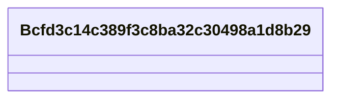

# Class: No class (entity type) name specified (__Bcfd3c14c389f3c8ba32c30498a1d8b29)


_No class (type) description specified_


URI: [_:Bcfd3c14c389f3c8ba32c30498a1d8b29](_:Bcfd3c14c389f3c8ba32c30498a1d8b29)





<!-- no inheritance hierarchy -->


## Slots

| Name | Cardinality and Range | Description | Inheritance | Occurrences |
| ---  | --- | --- | --- | --- |


## Usages

| used by | used in | type | used |
| ---  | --- | --- | --- |
| [SecurechainHardwareVersion](../classes/SecurechainHardwareVersion.md) | [securechain_versionName](../slots/securechain_versionName.md) | domain | [Bcfd3c14c389f3c8ba32c30498a1d8b29](../classes/Bcfd3c14c389f3c8ba32c30498a1d8b29.md) |
| [SecurechainSoftwareVersion](../classes/SecurechainSoftwareVersion.md) | [securechain_versionName](../slots/securechain_versionName.md) | domain | [Bcfd3c14c389f3c8ba32c30498a1d8b29](../classes/Bcfd3c14c389f3c8ba32c30498a1d8b29.md) |


## LinkML Source

<!-- TODO: investigate https://stackoverflow.com/questions/37606292/how-to-create-tabbed-code-blocks-in-mkdocs-or-sphinx -->

### Direct

<details>

```yaml
name: __Bcfd3c14c389f3c8ba32c30498a1d8b29
conforms_to: No schema conformance document specified
description: No class (type) description specified
title: No class (entity type) name specified
from_schema: secure-chain-kg
rank: 1000
class_uri: _:Bcfd3c14c389f3c8ba32c30498a1d8b29

```
</details>

### Induced

<details>

```yaml
name: __Bcfd3c14c389f3c8ba32c30498a1d8b29
conforms_to: No schema conformance document specified
description: No class (type) description specified
title: No class (entity type) name specified
from_schema: secure-chain-kg
rank: 1000
class_uri: _:Bcfd3c14c389f3c8ba32c30498a1d8b29

```
</details>