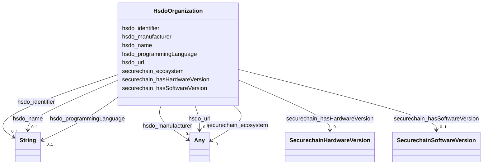

# Class: No class (type) name specified (hsdo_Organization)


_No class (type) description specified_


This class occurs 22889 times.


URI: [hsdo:Organization](http://schema.org/Organization)





<!-- no inheritance hierarchy -->


## Slots

| Name | Cardinality and Range | Description | Inheritance | Occurrences |
| ---  | --- | --- | --- | --- |
| [hsdo_name](../slots/hsdo_name.md) | 0..1 <br/> [xsd:string](http://www.w3.org/2001/XMLSchema#string) | No slot (predicate) description specified <br/>  | direct | 22620 |
| [hsdo_identifier](../slots/hsdo_identifier.md) | 0..1 <br/> [xsd:string](http://www.w3.org/2001/XMLSchema#string) | No slot (predicate) description specified <br/>  | direct | 883 |
| [hsdo_programmingLanguage](../slots/hsdo_programmingLanguage.md) | 0..1 <br/> [xsd:string](http://www.w3.org/2001/XMLSchema#string) | No slot (predicate) description specified <br/>  | direct |  |
| [securechain_hasHardwareVersion](../slots/securechain_hasHardwareVersion.md) | 0..1 <br/> [SecurechainHardwareVersion](../classes/SecurechainHardwareVersion.md) | No slot (predicate) description specified <br/>  | direct | 53 |
| [hsdo_url](../slots/hsdo_url.md) | 0..1 <br/> [xsd:string](http://www.w3.org/2001/XMLSchema#string)&nbsp;or&nbsp;<br />[xsd:anyURI](http://www.w3.org/2001/XMLSchema#anyURI) | No slot (predicate) description specified <br/>  | direct | 883 |
| [securechain_ecosystem](../slots/securechain_ecosystem.md) | 0..1 <br/> [HsdoText](../classes/HsdoText.md)&nbsp;or&nbsp;<br />[xsd:string](http://www.w3.org/2001/XMLSchema#string) | No slot (predicate) description specified <br/>  | direct |  |
| [securechain_hasSoftwareVersion](../slots/securechain_hasSoftwareVersion.md) | 0..1 <br/> [SecurechainSoftwareVersion](../classes/SecurechainSoftwareVersion.md) | No slot (predicate) description specified <br/>  | direct | 1437 |
| [hsdo_manufacturer](../slots/hsdo_manufacturer.md) | 0..1 <br/> [HsdoOrganization](../classes/HsdoOrganization.md)&nbsp;or&nbsp;<br />[SecurechainHardware](../classes/SecurechainHardware.md)&nbsp;or&nbsp;<br />[SecurechainSoftware](../classes/SecurechainSoftware.md) | No slot (predicate) description specified <br/>  | direct | 77 |


## Usages

| used by | used in | type | used |
| ---  | --- | --- | --- |
| [HsdoOrganization](../classes/HsdoOrganization.md) | [hsdo_manufacturer](../slots/hsdo_manufacturer.md) | any_of[range] | [HsdoOrganization](../classes/HsdoOrganization.md) |
| [SecurechainHardware](../classes/SecurechainHardware.md) | [hsdo_manufacturer](../slots/hsdo_manufacturer.md) | any_of[range] | [HsdoOrganization](../classes/HsdoOrganization.md) |
| [SecurechainHardwareVersion](../classes/SecurechainHardwareVersion.md) | [hsdo_manufacturer](../slots/hsdo_manufacturer.md) | any_of[range] | [HsdoOrganization](../classes/HsdoOrganization.md) |
| [SecurechainSoftware](../classes/SecurechainSoftware.md) | [hsdo_manufacturer](../slots/hsdo_manufacturer.md) | any_of[range] | [HsdoOrganization](../classes/HsdoOrganization.md) |
| [SecurechainSoftwareVersion](../classes/SecurechainSoftwareVersion.md) | [hsdo_manufacturer](../slots/hsdo_manufacturer.md) | any_of[range] | [HsdoOrganization](../classes/HsdoOrganization.md) |


## LinkML Source

<!-- TODO: investigate https://stackoverflow.com/questions/37606292/how-to-create-tabbed-code-blocks-in-mkdocs-or-sphinx -->

### Direct

<details>

```yaml
name: hsdo_Organization
conforms_to: No schema conformance document specified
annotations:
  count:
    tag: count
    value: 22889
description: No class (type) description specified
title: No class (type) name specified
from_schema: secure-chain-kg
rank: 1000
slots:
- hsdo_name
- hsdo_identifier
- hsdo_programmingLanguage
- securechain_hasHardwareVersion
- hsdo_url
- securechain_ecosystem
- securechain_hasSoftwareVersion
- hsdo_manufacturer
slot_usage:
  hsdo_identifier:
    name: hsdo_identifier
    annotations:
      string:
        tag: string
        value: 883
  hsdo_manufacturer:
    name: hsdo_manufacturer
    annotations:
      hsdo_Organization:
        tag: hsdo_Organization
        value: 53
      securechain_Hardware:
        tag: securechain_Hardware
        value: 23
      securechain_Software:
        tag: securechain_Software
        value: 1
  hsdo_name:
    name: hsdo_name
    annotations:
      string:
        tag: string
        value: 22620
  hsdo_url:
    name: hsdo_url
    annotations:
      uri:
        tag: uri
        value: 883
  securechain_hasHardwareVersion:
    name: securechain_hasHardwareVersion
    annotations:
      securechain_HardwareVersion:
        tag: securechain_HardwareVersion
        value: 53
  securechain_hasSoftwareVersion:
    name: securechain_hasSoftwareVersion
    annotations:
      securechain_SoftwareVersion:
        tag: securechain_SoftwareVersion
        value: 1437
class_uri: hsdo:Organization

```
</details>

### Induced

<details>

```yaml
name: hsdo_Organization
conforms_to: No schema conformance document specified
annotations:
  count:
    tag: count
    value: 22889
description: No class (type) description specified
title: No class (type) name specified
from_schema: secure-chain-kg
rank: 1000
slot_usage:
  hsdo_identifier:
    name: hsdo_identifier
    annotations:
      string:
        tag: string
        value: 883
  hsdo_manufacturer:
    name: hsdo_manufacturer
    annotations:
      hsdo_Organization:
        tag: hsdo_Organization
        value: 53
      securechain_Hardware:
        tag: securechain_Hardware
        value: 23
      securechain_Software:
        tag: securechain_Software
        value: 1
  hsdo_name:
    name: hsdo_name
    annotations:
      string:
        tag: string
        value: 22620
  hsdo_url:
    name: hsdo_url
    annotations:
      uri:
        tag: uri
        value: 883
  securechain_hasHardwareVersion:
    name: securechain_hasHardwareVersion
    annotations:
      securechain_HardwareVersion:
        tag: securechain_HardwareVersion
        value: 53
  securechain_hasSoftwareVersion:
    name: securechain_hasSoftwareVersion
    annotations:
      securechain_SoftwareVersion:
        tag: securechain_SoftwareVersion
        value: 1437
attributes:
  hsdo_name:
    name: hsdo_name
    annotations:
      string:
        tag: string
        value: 22620
    description: No slot (predicate) description specified
    examples:
    - object:
        example_object: 0----0
        example_object_type: string
        example_predicate: hsdo:name
        example_subject: https://github.com/0----0
        example_subject_type: hsdo_Person
    - object:
        example_object: Permission to use, copy, modify, and/or distribute this software
          for any
        example_object_type: string
        example_predicate: hsdo:name
        example_subject: https://spdx.org/licenses/0bsd.html
        example_subject_type: securechain_License
    - object:
        example_object: 2n
        example_object_type: string
        example_predicate: hsdo:name
        example_subject: https://www.google.com/search?q=2n
        example_subject_type: hsdo_Organization
    - object:
        example_object: '360'
        example_object_type: string
        example_predicate: hsdo:name
        example_subject: https://www.google.com/search?q=360
        example_subject_type: securechain_Hardware
    - object:
        example_object: amd
        example_object_type: string
        example_predicate: hsdo:name
        example_subject: https://www.google.com/search?q=amd
        example_subject_type: securechain_Software
    from_schema: secure-chain-kg
    rank: 1000
    slot_uri: hsdo:name
    alias: hsdo_name
    owner: hsdo_Organization
    domain_of:
    - hsdo_Organization
    - hsdo_Person
    - securechain_Hardware
    - securechain_License
    - securechain_Software
    range: string
  hsdo_identifier:
    name: hsdo_identifier
    annotations:
      string:
        tag: string
        value: 883
    description: No slot (predicate) description specified
    examples:
    - object:
        example_object: CWE-1
        example_object_type: string
        example_predicate: hsdo:identifier
        example_subject: https://cwe.mitre.org/data/definitions/1.html
        example_subject_type: securechain_VulnerabilityType
    - object:
        example_object: CVE-1999-0060
        example_object_type: string
        example_predicate: hsdo:identifier
        example_subject: https://nvd.nist.gov/vuln/detail/CVE-1999-0060
        example_subject_type: securechain_Vulnerability
    - object:
        example_object: (Apache-2.0
        example_object_type: string
        example_predicate: hsdo:identifier
        example_subject: https://spdx.org/licenses/%28Apache-2.0.html
        example_subject_type: securechain_License
    - object:
        example_object: Q2150861
        example_object_type: string
        example_predicate: hsdo:identifier
        example_subject: https://www.google.com/search?q=1Password
        example_subject_type: hsdo_Organization
    - object:
        example_object: Q202400
        example_object_type: string
        example_predicate: hsdo:identifier
        example_subject: https://www.google.com/search?q=Kernel
        example_subject_type: securechain_Software
    from_schema: secure-chain-kg
    rank: 1000
    slot_uri: hsdo:identifier
    alias: hsdo_identifier
    owner: hsdo_Organization
    domain_of:
    - hsdo_Organization
    - securechain_License
    - securechain_Software
    - securechain_Vulnerability
    - securechain_VulnerabilityType
    range: string
  hsdo_programmingLanguage:
    name: hsdo_programmingLanguage
    annotations:
      count:
        tag: count
        value: 803769
    description: No slot (predicate) description specified
    examples:
    - object:
        example_object: C/C++
        example_object_type: string
        example_predicate: hsdo:programmingLanguage
        example_subject: https://www.google.com/search?q=amd
        example_subject_type: securechain_Software
    - object:
        example_object: C/C++
        example_object_type: string
        example_predicate: hsdo:programmingLanguage
        example_subject: https://www.google.com/search?q=st
        example_subject_type: securechain_Hardware
    from_schema: secure-chain-kg
    rank: 1000
    slot_uri: hsdo:programmingLanguage
    alias: hsdo_programmingLanguage
    owner: hsdo_Organization
    domain_of:
    - hsdo_Organization
    - securechain_Hardware
    - securechain_Software
    range: string
  securechain_hasHardwareVersion:
    name: securechain_hasHardwareVersion
    annotations:
      securechain_HardwareVersion:
        tag: securechain_HardwareVersion
        value: 53
    description: No slot (predicate) description specified
    title: No slot (predicate) name specified
    examples:
    - object:
        example_object: https://www.google.com/search?q=360+-
        example_object_type: securechain_HardwareVersion
        example_predicate: securechain:hasHardwareVersion
        example_subject: https://www.google.com/search?q=360
        example_subject_type: hsdo_Organization
    - object:
        example_object: https://www.google.com/search?q=360+-
        example_object_type: securechain_HardwareVersion
        example_predicate: securechain:hasHardwareVersion
        example_subject: https://www.google.com/search?q=360
        example_subject_type: securechain_Hardware
    - object:
        example_object: https://www.google.com/search?q=st+14.2
        example_object_type: securechain_HardwareVersion
        example_predicate: securechain:hasHardwareVersion
        example_subject: https://www.google.com/search?q=st
        example_subject_type: securechain_Software
    from_schema: secure-chain-kg
    rank: 1000
    domain: securechain_Hardware
    slot_uri: securechain:hasHardwareVersion
    alias: securechain_hasHardwareVersion
    owner: hsdo_Organization
    domain_of:
    - hsdo_Organization
    - securechain_Hardware
    - securechain_Software
    range: securechain_HardwareVersion
  hsdo_url:
    name: hsdo_url
    annotations:
      uri:
        tag: uri
        value: 883
    description: No slot (predicate) description specified
    examples:
    - object:
        example_object: https://github.com/ddddddeon/a
        example_object_type: string
        example_predicate: hsdo:url
        example_subject: https://crates.io/crates/a-gpt/0.1.0/
        example_subject_type: securechain_SoftwareVersion
    - object:
        example_object: '[''https://1password.com'', ''http://1passwd.com'', ''https://1password.com/zh-tw'',
          ''https://1password.com/zh-cn'']'
        example_object_type: uri
        example_predicate: hsdo:url
        example_subject: https://www.google.com/search?q=1Password
        example_subject_type: hsdo_Organization
    - object:
        example_object: '[]'
        example_object_type: uri
        example_predicate: hsdo:url
        example_subject: https://www.google.com/search?q=Kernel
        example_subject_type: securechain_Software
    from_schema: secure-chain-kg
    rank: 1000
    slot_uri: hsdo:url
    alias: hsdo_url
    owner: hsdo_Organization
    domain_of:
    - hsdo_Organization
    - securechain_Software
    - securechain_SoftwareVersion
    range: Any
    any_of:
    - range: string
    - range: uri
  securechain_ecosystem:
    name: securechain_ecosystem
    annotations:
      count:
        tag: count
        value: 803769
    description: No slot (predicate) description specified
    title: No slot (predicate) name specified
    examples:
    - object:
        example_object: Unknown
        example_object_type: string
        example_predicate: securechain:ecosystem
        example_subject: https://www.google.com/search?q=amd
        example_subject_type: securechain_Software
    - object:
        example_object: Unknown
        example_object_type: string
        example_predicate: securechain:ecosystem
        example_subject: https://www.google.com/search?q=st
        example_subject_type: securechain_Hardware
    from_schema: secure-chain-kg
    rank: 1000
    domain: securechain_Software
    slot_uri: securechain:ecosystem
    alias: securechain_ecosystem
    owner: hsdo_Organization
    domain_of:
    - hsdo_Organization
    - securechain_Hardware
    - securechain_Software
    range: Any
    any_of:
    - range: hsdo_Text
    - range: string
  securechain_hasSoftwareVersion:
    name: securechain_hasSoftwareVersion
    annotations:
      securechain_SoftwareVersion:
        tag: securechain_SoftwareVersion
        value: 1437
    description: No slot (predicate) description specified
    title: No slot (predicate) name specified
    examples:
    - object:
        example_object: https://www.google.com/search?q=amd+64
        example_object_type: securechain_SoftwareVersion
        example_predicate: securechain:hasSoftwareVersion
        example_subject: https://www.google.com/search?q=amd
        example_subject_type: hsdo_Organization
    - object:
        example_object: https://www.google.com/search?q=amd+64
        example_object_type: securechain_SoftwareVersion
        example_predicate: securechain:hasSoftwareVersion
        example_subject: https://www.google.com/search?q=amd
        example_subject_type: securechain_Software
    - object:
        example_object: https://www.google.com/search?q=st+*
        example_object_type: securechain_SoftwareVersion
        example_predicate: securechain:hasSoftwareVersion
        example_subject: https://www.google.com/search?q=st
        example_subject_type: securechain_Hardware
    from_schema: secure-chain-kg
    rank: 1000
    domain: securechain_Software
    slot_uri: securechain:hasSoftwareVersion
    alias: securechain_hasSoftwareVersion
    owner: hsdo_Organization
    domain_of:
    - hsdo_Organization
    - securechain_Hardware
    - securechain_Software
    range: securechain_SoftwareVersion
  hsdo_manufacturer:
    name: hsdo_manufacturer
    annotations:
      hsdo_Organization:
        tag: hsdo_Organization
        value: 53
      securechain_Hardware:
        tag: securechain_Hardware
        value: 23
      securechain_Software:
        tag: securechain_Software
        value: 1
    description: No slot (predicate) description specified
    examples:
    - object:
        example_object: https://www.google.com/search?q=hp
        example_object_type: hsdo_Organization
        example_predicate: hsdo:manufacturer
        example_subject: https://www.google.com/search?q=360
        example_subject_type: hsdo_Organization
    - object:
        example_object: https://www.google.com/search?q=hp
        example_object_type: hsdo_Organization
        example_predicate: hsdo:manufacturer
        example_subject: https://www.google.com/search?q=360
        example_subject_type: securechain_Hardware
    - object:
        example_object: https://www.google.com/search?q=arduino
        example_object_type: securechain_Hardware
        example_predicate: hsdo:manufacturer
        example_subject: https://www.google.com/search?q=arduino
        example_subject_type: hsdo_Organization
    - object:
        example_object: https://www.google.com/search?q=arduino
        example_object_type: securechain_Hardware
        example_predicate: hsdo:manufacturer
        example_subject: https://www.google.com/search?q=arduino
        example_subject_type: securechain_Hardware
    - object:
        example_object: https://www.google.com/search?q=amd
        example_object_type: securechain_Software
        example_predicate: hsdo:manufacturer
        example_subject: https://www.google.com/search?q=milan
        example_subject_type: hsdo_Organization
    - object:
        example_object: https://www.google.com/search?q=amd
        example_object_type: securechain_Software
        example_predicate: hsdo:manufacturer
        example_subject: https://www.google.com/search?q=milan
        example_subject_type: securechain_Hardware
    - object:
        example_object: https://www.google.com/search?q=mitel
        example_object_type: hsdo_Organization
        example_predicate: hsdo:manufacturer
        example_subject: https://www.google.com/search?q=st
        example_subject_type: securechain_Software
    - object:
        example_object: https://www.google.com/search?q=oculus
        example_object_type: securechain_Software
        example_predicate: hsdo:manufacturer
        example_subject: https://www.google.com/search?q=rift
        example_subject_type: securechain_Software
    from_schema: secure-chain-kg
    rank: 1000
    slot_uri: hsdo:manufacturer
    alias: hsdo_manufacturer
    owner: hsdo_Organization
    domain_of:
    - hsdo_Organization
    - securechain_Hardware
    - securechain_Software
    range: Any
    any_of:
    - range: hsdo_Organization
    - range: securechain_Hardware
    - range: securechain_Software
class_uri: hsdo:Organization

```
</details>