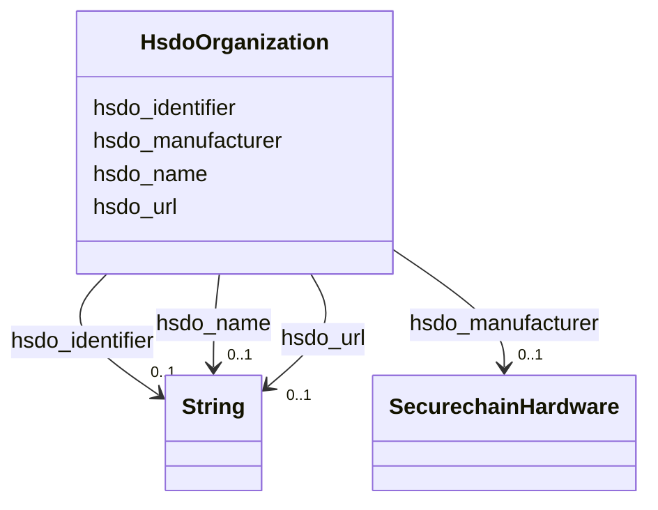

# Class: Organization (hsdo_Organization)


_An organization such as a school, NGO, corporation, club, etc._


URI: [hsdo:Organization](http://schema.org/Organization)





<!-- no inheritance hierarchy -->


## Slots

| Name | Cardinality and Range | Description | Inheritance |
| ---  | --- | --- | --- |
| [hsdo_name](../slots/hsdo_name.md) | 0..1 <br/> [xsd:string](xsd:string) | No slot (predicate) description specified <br/> 53378 occurrences with subject type securechain_Hardware and object type string.<br/>22002 occurrences with subject type hsdo_Organization and object type string.<br/>20 occurrences with subject type hsdo_CreativeWork and object type string.<br/>34466 occurrences with subject type securechain_Software and object type string. | direct |
| [hsdo_url](../slots/hsdo_url.md) | 0..1 <br/> [xsd:string](xsd:string) | No slot (predicate) description specified <br/> 887 occurrences with subject type hsdo_Organization and object type string. | direct |
| [hsdo_manufacturer](../slots/hsdo_manufacturer.md) | 0..1 <br/> [SecurechainHardware](../classes/SecurechainHardware.md) | No slot (predicate) description specified <br/> 54369 occurrences with subject type hsdo_Organization and object type securechain_Hardware. | direct |
| [hsdo_identifier](../slots/hsdo_identifier.md) | 0..1 <br/> [xsd:string](xsd:string) | No slot (predicate) description specified <br/> 30434 occurrences with subject type hsdo_Person and object type string.<br/>259334 occurrences with subject type securechain_Vulnerability and object type string.<br/>445 occurrences with subject type securechain_VulnerabilityType and object type string.<br/>887 occurrences with subject type hsdo_Organization and object type string.<br/>20 occurrences with subject type hsdo_CreativeWork and object type string. | direct |


## Identifier and Mapping Information


### Schema Source


* from schema: secure-chain-kg


## Mappings

| Mapping Type | Mapped Value |
| ---  | ---  |
| self | hsdo:Organization |
| native | secure-chain-kg/:HsdoOrganization |


## LinkML Source

<!-- TODO: investigate https://stackoverflow.com/questions/37606292/how-to-create-tabbed-code-blocks-in-mkdocs-or-sphinx -->

### Direct

<details>
```yaml
name: hsdo_Organization
conforms_to: No schema conformance document specified
description: An organization such as a school, NGO, corporation, club, etc.
title: Organization
notes:
- Class with 22889 occurrences.
from_schema: secure-chain-kg
rank: 1000
slots:
- hsdo_name
- hsdo_url
- hsdo_manufacturer
- hsdo_identifier
class_uri: hsdo:Organization

```
</details>

### Induced

<details>
```yaml
name: hsdo_Organization
conforms_to: No schema conformance document specified
description: An organization such as a school, NGO, corporation, club, etc.
title: Organization
notes:
- Class with 22889 occurrences.
from_schema: secure-chain-kg
rank: 1000
attributes:
  hsdo_name:
    name: hsdo_name
    description: No slot (predicate) description specified
    comments:
    - 53378 occurrences with subject type securechain_Hardware and object type string.
    - 22002 occurrences with subject type hsdo_Organization and object type string.
    - 20 occurrences with subject type hsdo_CreativeWork and object type string.
    - 34466 occurrences with subject type securechain_Software and object type string.
    examples:
    - description: securechain_Hardware → string
      object:
        example_object: '-'
        example_object_type: string
        example_predicate: hsdo:name
        example_subject: securechain:Hardware/-
        example_subject_type: securechain_Hardware
    - description: hsdo_Organization → string
      object:
        example_object: '%240.99_kindle_books_project'
        example_object_type: string
        example_predicate: hsdo:name
        example_subject: schema:Organization/%25240.99_kindle_books_project
        example_subject_type: hsdo_Organization
    - description: hsdo_CreativeWork → string
      object:
        example_object: Permission to use, copy, modify, and/or distribute this software
          for any
        example_object_type: string
        example_predicate: hsdo:name
        example_subject: securechain:License/0bsd
        example_subject_type: hsdo_CreativeWork
    - description: securechain_Software → string
      object:
        example_object: ''
        example_object_type: string
        example_predicate: hsdo:name
        example_subject: securechain:Software/
        example_subject_type: securechain_Software
    from_schema: secure-chain-kg
    rank: 1000
    slot_uri: hsdo:name
    alias: hsdo_name
    owner: hsdo_Organization
    domain_of:
    - hsdo_CreativeWork
    - hsdo_Organization
    - securechain_Hardware
    - securechain_Software
    range: string
  hsdo_url:
    name: hsdo_url
    description: No slot (predicate) description specified
    comments:
    - 887 occurrences with subject type hsdo_Organization and object type string.
    examples:
    - description: hsdo_Organization → string
      object:
        example_object: '[''https://1password.com'', ''http://1passwd.com'', ''https://1password.com/zh-tw'',
          ''https://1password.com/zh-cn'']'
        example_object_type: string
        example_predicate: hsdo:url
        example_subject: schema:Organization/1Password
        example_subject_type: hsdo_Organization
    from_schema: secure-chain-kg
    rank: 1000
    slot_uri: hsdo:url
    alias: hsdo_url
    owner: hsdo_Organization
    domain_of:
    - hsdo_Organization
    range: string
  hsdo_manufacturer:
    name: hsdo_manufacturer
    description: No slot (predicate) description specified
    comments:
    - 54369 occurrences with subject type hsdo_Organization and object type securechain_Hardware.
    examples:
    - description: hsdo_Organization → securechain_Hardware
      object:
        example_object: securechain:Hardware/keymouse
        example_object_type: securechain_Hardware
        example_predicate: hsdo:manufacturer
        example_subject: schema:Organization/zzinc
        example_subject_type: hsdo_Organization
    from_schema: secure-chain-kg
    rank: 1000
    slot_uri: hsdo:manufacturer
    alias: hsdo_manufacturer
    owner: hsdo_Organization
    domain_of:
    - hsdo_Organization
    range: securechain_Hardware
  hsdo_identifier:
    name: hsdo_identifier
    description: No slot (predicate) description specified
    comments:
    - 30434 occurrences with subject type hsdo_Person and object type string.
    - 259334 occurrences with subject type securechain_Vulnerability and object type
      string.
    - 445 occurrences with subject type securechain_VulnerabilityType and object type
      string.
    - 887 occurrences with subject type hsdo_Organization and object type string.
    - 20 occurrences with subject type hsdo_CreativeWork and object type string.
    examples:
    - description: hsdo_Person → string
      object:
        example_object: 0----0
        example_object_type: string
        example_predicate: hsdo:identifier
        example_subject: schema:Person/0----0
        example_subject_type: hsdo_Person
    - description: securechain_Vulnerability → string
      object:
        example_object: CVE-1999-0043
        example_object_type: string
        example_predicate: hsdo:identifier
        example_subject: securechain:Vulnerability/CVE-1999-0043
        example_subject_type: securechain_Vulnerability
    - description: securechain_VulnerabilityType → string
      object:
        example_object: CWE-1
        example_object_type: string
        example_predicate: hsdo:identifier
        example_subject: securechain:VulnerabilityType/CWE-1
        example_subject_type: securechain_VulnerabilityType
    - description: hsdo_Organization → string
      object:
        example_object: Q2150861
        example_object_type: string
        example_predicate: hsdo:identifier
        example_subject: schema:Organization/1Password
        example_subject_type: hsdo_Organization
    - description: hsdo_CreativeWork → string
      object:
        example_object: 0bsd
        example_object_type: string
        example_predicate: hsdo:identifier
        example_subject: securechain:License/0bsd
        example_subject_type: hsdo_CreativeWork
    from_schema: secure-chain-kg
    rank: 1000
    slot_uri: hsdo:identifier
    alias: hsdo_identifier
    owner: hsdo_Organization
    domain_of:
    - hsdo_CreativeWork
    - hsdo_Organization
    - hsdo_Person
    - securechain_Vulnerability
    - securechain_VulnerabilityType
    range: string
class_uri: hsdo:Organization

```
</details>