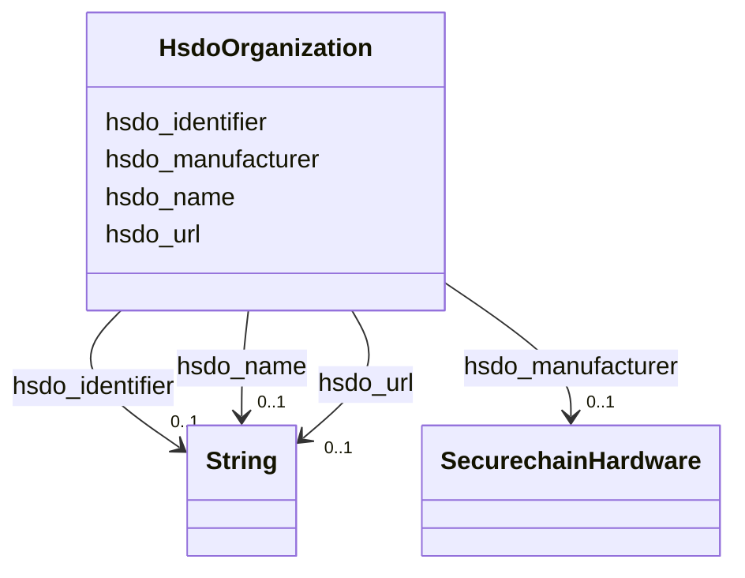

# Class: Organization (hsdo_Organization)


_An organization such as a school, NGO, corporation, club, etc._


This class occurs 22889 times.


URI: [hsdo:Organization](http://schema.org/Organization)





<!-- no inheritance hierarchy -->


## Slots

| Name | Cardinality and Range | Description | Inheritance | Occurrences |
| ---  | --- | --- | --- | --- |
| [hsdo_name](../slots/hsdo_name.md) | 0..1 <br/> [xsd:string](http://www.w3.org/2001/XMLSchema#string) | The name of the item <br/>  | direct | 22002 |
| [hsdo_url](../slots/hsdo_url.md) | 0..1 <br/> [xsd:string](http://www.w3.org/2001/XMLSchema#string) | URL of the item <br/>  | direct | 887 |
| [hsdo_manufacturer](../slots/hsdo_manufacturer.md) | 0..1 <br/> [SecurechainHardware](../classes/SecurechainHardware.md) | The manufacturer of the product <br/>  | direct | 54369 |
| [hsdo_identifier](../slots/hsdo_identifier.md) | 0..1 <br/> [xsd:string](http://www.w3.org/2001/XMLSchema#string) | The identifier property represents any kind of identifier for any kind of [[T... <br/>  | direct | 887 |


## LinkML Source

<!-- TODO: investigate https://stackoverflow.com/questions/37606292/how-to-create-tabbed-code-blocks-in-mkdocs-or-sphinx -->

### Direct

<details>

```yaml
name: hsdo_Organization
conforms_to: No schema conformance document specified
annotations:
  count:
    tag: count
    value: 22889
description: An organization such as a school, NGO, corporation, club, etc.
title: Organization
from_schema: secure-chain-kg
rank: 1000
slots:
- hsdo_name
- hsdo_url
- hsdo_manufacturer
- hsdo_identifier
slot_usage:
  hsdo_identifier:
    name: hsdo_identifier
    annotations:
      string:
        tag: string
        value: 887
  hsdo_manufacturer:
    name: hsdo_manufacturer
    annotations:
      securechain_Hardware:
        tag: securechain_Hardware
        value: 54369
  hsdo_name:
    name: hsdo_name
    annotations:
      string:
        tag: string
        value: 22002
  hsdo_url:
    name: hsdo_url
    annotations:
      string:
        tag: string
        value: 887
class_uri: hsdo:Organization

```
</details>

### Induced

<details>

```yaml
name: hsdo_Organization
conforms_to: No schema conformance document specified
annotations:
  count:
    tag: count
    value: 22889
description: An organization such as a school, NGO, corporation, club, etc.
title: Organization
from_schema: secure-chain-kg
rank: 1000
slot_usage:
  hsdo_identifier:
    name: hsdo_identifier
    annotations:
      string:
        tag: string
        value: 887
  hsdo_manufacturer:
    name: hsdo_manufacturer
    annotations:
      securechain_Hardware:
        tag: securechain_Hardware
        value: 54369
  hsdo_name:
    name: hsdo_name
    annotations:
      string:
        tag: string
        value: 22002
  hsdo_url:
    name: hsdo_url
    annotations:
      string:
        tag: string
        value: 887
attributes:
  hsdo_name:
    name: hsdo_name
    annotations:
      string:
        tag: string
        value: 22002
    description: The name of the item.
    title: name
    examples:
    - object:
        example_object: '-'
        example_object_type: string
        example_predicate: hsdo:name
        example_subject: securechain:Hardware/-
        example_subject_type: securechain_Hardware
    - object:
        example_object: '%240.99_kindle_books_project'
        example_object_type: string
        example_predicate: hsdo:name
        example_subject: schema:Organization/%25240.99_kindle_books_project
        example_subject_type: hsdo_Organization
    - object:
        example_object: Permission to use, copy, modify, and/or distribute this software
          for any
        example_object_type: string
        example_predicate: hsdo:name
        example_subject: securechain:License/0bsd
        example_subject_type: hsdo_CreativeWork
    - object:
        example_object: ''
        example_object_type: string
        example_predicate: hsdo:name
        example_subject: securechain:Software/
        example_subject_type: securechain_Software
    from_schema: secure-chain-kg
    rank: 1000
    slot_uri: hsdo:name
    alias: hsdo_name
    owner: hsdo_Organization
    domain_of:
    - hsdo_CreativeWork
    - hsdo_Organization
    - securechain_Hardware
    - securechain_Software
    range: string
  hsdo_url:
    name: hsdo_url
    annotations:
      string:
        tag: string
        value: 887
    description: URL of the item.
    title: url
    examples:
    - object:
        example_object: '[''https://1password.com'', ''http://1passwd.com'', ''https://1password.com/zh-tw'',
          ''https://1password.com/zh-cn'']'
        example_object_type: string
        example_predicate: hsdo:url
        example_subject: schema:Organization/1Password
        example_subject_type: hsdo_Organization
    from_schema: secure-chain-kg
    rank: 1000
    slot_uri: hsdo:url
    alias: hsdo_url
    owner: hsdo_Organization
    domain_of:
    - hsdo_Organization
    range: string
  hsdo_manufacturer:
    name: hsdo_manufacturer
    annotations:
      securechain_Hardware:
        tag: securechain_Hardware
        value: 54369
    description: The manufacturer of the product.
    title: manufacturer
    examples:
    - object:
        example_object: securechain:Hardware/access_unit_2.0
        example_object_type: securechain_Hardware
        example_predicate: hsdo:manufacturer
        example_subject: schema:Organization/2n
        example_subject_type: hsdo_Organization
    from_schema: secure-chain-kg
    rank: 1000
    slot_uri: hsdo:manufacturer
    alias: hsdo_manufacturer
    owner: hsdo_Organization
    domain_of:
    - hsdo_Organization
    range: securechain_Hardware
  hsdo_identifier:
    name: hsdo_identifier
    annotations:
      string:
        tag: string
        value: 887
    description: 'The identifier property represents any kind of identifier for any
      kind of [[Thing]], such as ISBNs, GTIN codes, UUIDs etc. Schema.org provides
      dedicated properties for representing many of these, either as textual strings
      or as URL (URI) links. See [background notes](/docs/datamodel.html#identifierBg)
      for more details.␊        '
    title: identifier
    examples:
    - object:
        example_object: 0----0
        example_object_type: string
        example_predicate: hsdo:identifier
        example_subject: schema:Person/0----0
        example_subject_type: hsdo_Person
    - object:
        example_object: CVE-1999-0043
        example_object_type: string
        example_predicate: hsdo:identifier
        example_subject: securechain:Vulnerability/CVE-1999-0043
        example_subject_type: securechain_Vulnerability
    - object:
        example_object: CWE-1
        example_object_type: string
        example_predicate: hsdo:identifier
        example_subject: securechain:VulnerabilityType/CWE-1
        example_subject_type: securechain_VulnerabilityType
    - object:
        example_object: Q2150861
        example_object_type: string
        example_predicate: hsdo:identifier
        example_subject: schema:Organization/1Password
        example_subject_type: hsdo_Organization
    - object:
        example_object: 0bsd
        example_object_type: string
        example_predicate: hsdo:identifier
        example_subject: securechain:License/0bsd
        example_subject_type: hsdo_CreativeWork
    from_schema: secure-chain-kg
    rank: 1000
    slot_uri: hsdo:identifier
    alias: hsdo_identifier
    owner: hsdo_Organization
    domain_of:
    - hsdo_CreativeWork
    - hsdo_Organization
    - hsdo_Person
    - securechain_Vulnerability
    - securechain_VulnerabilityType
    range: string
class_uri: hsdo:Organization

```
</details>