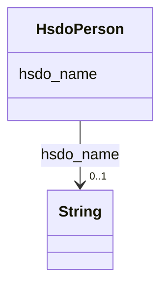

# Class: No class (type) name specified (hsdo_Person)


_No class (type) description specified_


This class occurs 27009 times.


URI: [hsdo:Person](http://schema.org/Person)





<!-- no inheritance hierarchy -->


## Slots

| Name | Cardinality and Range | Description | Inheritance | Occurrences |
| ---  | --- | --- | --- | --- |
| [hsdo_name](../slots/hsdo_name.md) | 0..1 <br/> [xsd:string](http://www.w3.org/2001/XMLSchema#string) | No slot (predicate) description specified <br/>  | direct | 27009 |


## Usages

| used by | used in | type | used |
| ---  | --- | --- | --- |
| [SecurechainSoftware](../classes/SecurechainSoftware.md) | [hsdo_contributor](../slots/hsdo_contributor.md) | range | [HsdoPerson](../classes/HsdoPerson.md) |
| [SecurechainSoftwareVersion](../classes/SecurechainSoftwareVersion.md) | [hsdo_contributor](../slots/hsdo_contributor.md) | range | [HsdoPerson](../classes/HsdoPerson.md) |


## LinkML Source

<!-- TODO: investigate https://stackoverflow.com/questions/37606292/how-to-create-tabbed-code-blocks-in-mkdocs-or-sphinx -->

### Direct

<details>

```yaml
name: hsdo_Person
conforms_to: No schema conformance document specified
annotations:
  count:
    tag: count
    value: 27009
description: No class (type) description specified
title: No class (type) name specified
from_schema: secure-chain-kg
rank: 1000
slots:
- hsdo_name
slot_usage:
  hsdo_name:
    name: hsdo_name
    annotations:
      string:
        tag: string
        value: 27009
class_uri: hsdo:Person

```
</details>

### Induced

<details>

```yaml
name: hsdo_Person
conforms_to: No schema conformance document specified
annotations:
  count:
    tag: count
    value: 27009
description: No class (type) description specified
title: No class (type) name specified
from_schema: secure-chain-kg
rank: 1000
slot_usage:
  hsdo_name:
    name: hsdo_name
    annotations:
      string:
        tag: string
        value: 27009
attributes:
  hsdo_name:
    name: hsdo_name
    annotations:
      string:
        tag: string
        value: 27009
    description: No slot (predicate) description specified
    examples:
    - object:
        example_object: 0----0
        example_object_type: string
        example_predicate: hsdo:name
        example_subject: https://github.com/0----0
        example_subject_type: hsdo_Person
    - object:
        example_object: Permission to use, copy, modify, and/or distribute this software
          for any
        example_object_type: string
        example_predicate: hsdo:name
        example_subject: https://spdx.org/licenses/0bsd.html
        example_subject_type: securechain_License
    - object:
        example_object: 2n
        example_object_type: string
        example_predicate: hsdo:name
        example_subject: https://www.google.com/search?q=2n
        example_subject_type: hsdo_Organization
    - object:
        example_object: '360'
        example_object_type: string
        example_predicate: hsdo:name
        example_subject: https://www.google.com/search?q=360
        example_subject_type: securechain_Hardware
    - object:
        example_object: amd
        example_object_type: string
        example_predicate: hsdo:name
        example_subject: https://www.google.com/search?q=amd
        example_subject_type: securechain_Software
    from_schema: secure-chain-kg
    rank: 1000
    slot_uri: hsdo:name
    alias: hsdo_name
    owner: hsdo_Person
    domain_of:
    - hsdo_Organization
    - hsdo_Person
    - securechain_Hardware
    - securechain_License
    - securechain_Software
    range: string
class_uri: hsdo:Person

```
</details>