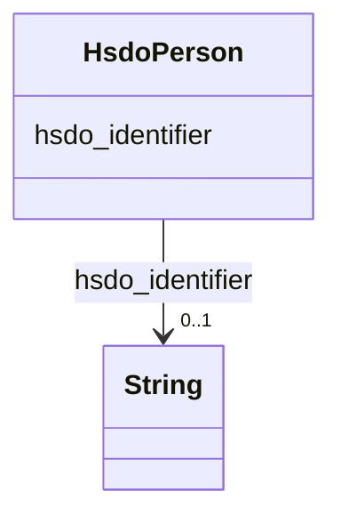

# Class: Person (hsdo_Person)


_A person (alive, dead, undead, or fictional)._


URI: [hsdo:Person](http://schema.org/Person)





<!-- no inheritance hierarchy -->


## Slots

| Name | Cardinality and Range | Description | Inheritance |
| ---  | --- | --- | --- |
| [hsdo_identifier](../slots/hsdo_identifier.md) | 0..1 <br/> [xsd:string](xsd:string) | No slot (predicate) description specified <br/> 30434 occurrences with subject type hsdo_Person and object type string.<br/>259334 occurrences with subject type securechain_Vulnerability and object type string.<br/>445 occurrences with subject type securechain_VulnerabilityType and object type string.<br/>887 occurrences with subject type hsdo_Organization and object type string.<br/>20 occurrences with subject type hsdo_CreativeWork and object type string. | direct |


## Usages

| used by | used in | type | used |
| ---  | --- | --- | --- |
| [SecurechainSoftware](../classes/SecurechainSoftware.md) | [hsdo_contributor](../slots/hsdo_contributor.md) | range | [HsdoPerson](../classes/HsdoPerson.md) |
| [SecurechainSoftwareVersion](../classes/SecurechainSoftwareVersion.md) | [hsdo_contributor](../slots/hsdo_contributor.md) | range | [HsdoPerson](../classes/HsdoPerson.md) |


## Identifier and Mapping Information


### Schema Source


* from schema: secure-chain-kg


## Mappings

| Mapping Type | Mapped Value |
| ---  | ---  |
| self | hsdo:Person |
| native | secure-chain-kg/:HsdoPerson |


## LinkML Source

<!-- TODO: investigate https://stackoverflow.com/questions/37606292/how-to-create-tabbed-code-blocks-in-mkdocs-or-sphinx -->

### Direct

<details>
```yaml
name: hsdo_Person
conforms_to: No schema conformance document specified
description: A person (alive, dead, undead, or fictional).
title: Person
notes:
- Class with 30434 occurrences.
from_schema: secure-chain-kg
rank: 1000
slots:
- hsdo_identifier
class_uri: hsdo:Person

```
</details>

### Induced

<details>
```yaml
name: hsdo_Person
conforms_to: No schema conformance document specified
description: A person (alive, dead, undead, or fictional).
title: Person
notes:
- Class with 30434 occurrences.
from_schema: secure-chain-kg
rank: 1000
attributes:
  hsdo_identifier:
    name: hsdo_identifier
    description: No slot (predicate) description specified
    comments:
    - 30434 occurrences with subject type hsdo_Person and object type string.
    - 259334 occurrences with subject type securechain_Vulnerability and object type
      string.
    - 445 occurrences with subject type securechain_VulnerabilityType and object type
      string.
    - 887 occurrences with subject type hsdo_Organization and object type string.
    - 20 occurrences with subject type hsdo_CreativeWork and object type string.
    examples:
    - description: hsdo_Person → string
      object:
        example_object: 0----0
        example_object_type: string
        example_predicate: hsdo:identifier
        example_subject: schema:Person/0----0
        example_subject_type: hsdo_Person
    - description: securechain_Vulnerability → string
      object:
        example_object: CVE-1999-0043
        example_object_type: string
        example_predicate: hsdo:identifier
        example_subject: securechain:Vulnerability/CVE-1999-0043
        example_subject_type: securechain_Vulnerability
    - description: securechain_VulnerabilityType → string
      object:
        example_object: CWE-1
        example_object_type: string
        example_predicate: hsdo:identifier
        example_subject: securechain:VulnerabilityType/CWE-1
        example_subject_type: securechain_VulnerabilityType
    - description: hsdo_Organization → string
      object:
        example_object: Q2150861
        example_object_type: string
        example_predicate: hsdo:identifier
        example_subject: schema:Organization/1Password
        example_subject_type: hsdo_Organization
    - description: hsdo_CreativeWork → string
      object:
        example_object: 0bsd
        example_object_type: string
        example_predicate: hsdo:identifier
        example_subject: securechain:License/0bsd
        example_subject_type: hsdo_CreativeWork
    from_schema: secure-chain-kg
    rank: 1000
    slot_uri: hsdo:identifier
    alias: hsdo_identifier
    owner: hsdo_Person
    domain_of:
    - hsdo_CreativeWork
    - hsdo_Organization
    - hsdo_Person
    - securechain_Vulnerability
    - securechain_VulnerabilityType
    range: string
class_uri: hsdo:Person

```
</details>