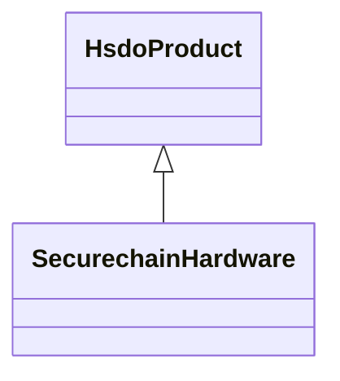

# Class: No class (type) name specified -- this class is noted as a superclass of another class in this graph but has not itself been defined. (hsdo_Product)


_No class (type) description specified_


URI: [hsdo:Product](http://schema.org/Product)





## Inheritance
* **HsdoProduct**
    * [SecurechainHardware](../classes/SecurechainHardware.md)


## Slots

| Name | Cardinality and Range | Description | Inheritance |
| ---  | --- | --- | --- |


## Identifier and Mapping Information


### Schema Source


* from schema: secure-chain-kg


## Mappings

| Mapping Type | Mapped Value |
| ---  | ---  |
| self | hsdo:Product |
| native | secure-chain-kg/:HsdoProduct |


## LinkML Source

<!-- TODO: investigate https://stackoverflow.com/questions/37606292/how-to-create-tabbed-code-blocks-in-mkdocs-or-sphinx -->

### Direct

<details>
```yaml
name: hsdo_Product
conforms_to: No schema conformance document specified
description: No class (type) description specified
title: No class (type) name specified -- this class is noted as a superclass of another
  class in this graph but has not itself been defined.
notes:
- Class with 0 occurrences.
from_schema: secure-chain-kg
rank: 1000
class_uri: hsdo:Product

```
</details>

### Induced

<details>
```yaml
name: hsdo_Product
conforms_to: No schema conformance document specified
description: No class (type) description specified
title: No class (type) name specified -- this class is noted as a superclass of another
  class in this graph but has not itself been defined.
notes:
- Class with 0 occurrences.
from_schema: secure-chain-kg
rank: 1000
class_uri: hsdo:Product

```
</details>