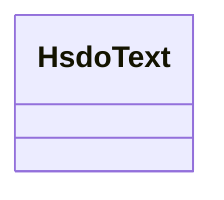

# Class: No class (entity type) name specified -- this class is noted as being in the domain or range of a slot in this graph, but the class has not itself been defined. (hsdo_Text)


_No class (type) description specified_


URI: [hsdo:Text](http://schema.org/Text)





<!-- no inheritance hierarchy -->


## Slots

| Name | Cardinality and Range | Description | Inheritance | Occurrences |
| ---  | --- | --- | --- | --- |


## Usages

| used by | used in | type | used |
| ---  | --- | --- | --- |
| [HsdoOrganization](../classes/HsdoOrganization.md) | [securechain_ecosystem](../slots/securechain_ecosystem.md) | any_of[range] | [HsdoText](../classes/HsdoText.md) |
| [SecurechainHardware](../classes/SecurechainHardware.md) | [securechain_ecosystem](../slots/securechain_ecosystem.md) | any_of[range] | [HsdoText](../classes/HsdoText.md) |
| [SecurechainHardwareVersion](../classes/SecurechainHardwareVersion.md) | [securechain_versionName](../slots/securechain_versionName.md) | any_of[range] | [HsdoText](../classes/HsdoText.md) |
| [SecurechainHardwareVersion](../classes/SecurechainHardwareVersion.md) | [securechain_ecosystem](../slots/securechain_ecosystem.md) | any_of[range] | [HsdoText](../classes/HsdoText.md) |
| [SecurechainSoftware](../classes/SecurechainSoftware.md) | [securechain_ecosystem](../slots/securechain_ecosystem.md) | any_of[range] | [HsdoText](../classes/HsdoText.md) |
| [SecurechainSoftwareVersion](../classes/SecurechainSoftwareVersion.md) | [securechain_versionName](../slots/securechain_versionName.md) | any_of[range] | [HsdoText](../classes/HsdoText.md) |
| [SecurechainSoftwareVersion](../classes/SecurechainSoftwareVersion.md) | [securechain_ecosystem](../slots/securechain_ecosystem.md) | any_of[range] | [HsdoText](../classes/HsdoText.md) |


## LinkML Source

<!-- TODO: investigate https://stackoverflow.com/questions/37606292/how-to-create-tabbed-code-blocks-in-mkdocs-or-sphinx -->

### Direct

<details>

```yaml
name: hsdo_Text
conforms_to: No schema conformance document specified
description: No class (type) description specified
title: No class (entity type) name specified -- this class is noted as being in the
  domain or range of a slot in this graph, but the class has not itself been defined.
from_schema: secure-chain-kg
rank: 1000
class_uri: hsdo:Text

```
</details>

### Induced

<details>

```yaml
name: hsdo_Text
conforms_to: No schema conformance document specified
description: No class (type) description specified
title: No class (entity type) name specified -- this class is noted as being in the
  domain or range of a slot in this graph, but the class has not itself been defined.
from_schema: secure-chain-kg
rank: 1000
class_uri: hsdo:Text

```
</details>