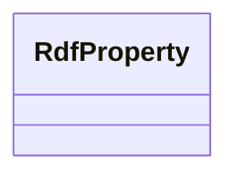

# Class: TODO -- what's a good name for what this class (type) describes? (rdf_Property)


_TODO -- tell the world what this class (type) describes._


URI: [rdf:Property](http://www.w3.org/1999/02/22-rdf-syntax-ns#Property)





<!-- no inheritance hierarchy -->


## Slots

| Name | Cardinality and Range | Description | Inheritance |
| ---  | --- | --- | --- |


## Examples

| Value |
| --- |
| securechain:hasSoftwareVersion |

## TODOs

* TODO -- Todos for this class go here
* or you can delete the todos
* if you think the class is perfect.

## Identifier and Mapping Information


### Schema Source


* from schema: secure-chain-kg/develop


## Mappings

| Mapping Type | Mapped Value |
| ---  | ---  |
| self | rdf:Property |
| native | secure-chain-kg/develop/:RdfProperty |


## LinkML Source

<!-- TODO: investigate https://stackoverflow.com/questions/37606292/how-to-create-tabbed-code-blocks-in-mkdocs-or-sphinx -->

### Direct

<details>
```yaml
name: rdf_Property
description: TODO -- tell the world what this class (type) describes.
title: TODO -- what's a good name for what this class (type) describes?
todos:
- TODO -- Todos for this class go here
- or you can delete the todos
- if you think the class is perfect.
notes:
- There are 7 instances of this class.
examples:
- value: securechain:hasSoftwareVersion
from_schema: secure-chain-kg/develop
class_uri: rdf:Property

```
</details>

### Induced

<details>
```yaml
name: rdf_Property
description: TODO -- tell the world what this class (type) describes.
title: TODO -- what's a good name for what this class (type) describes?
todos:
- TODO -- Todos for this class go here
- or you can delete the todos
- if you think the class is perfect.
notes:
- There are 7 instances of this class.
examples:
- value: securechain:hasSoftwareVersion
from_schema: secure-chain-kg/develop
class_uri: rdf:Property

```
</details>