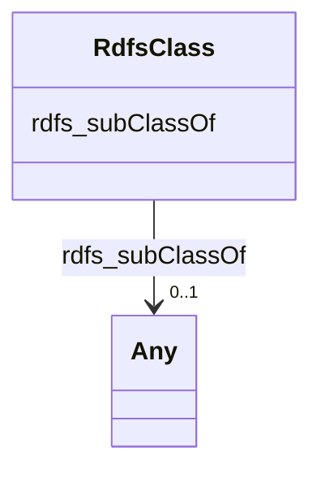

# Class: TODO -- what's a good name for what this class (type) describes? (rdfs_Class)


_TODO -- tell the world what this class (type) describes._


URI: [rdfs:Class](http://www.w3.org/2000/01/rdf-schema#Class)





<!-- no inheritance hierarchy -->


## Slots

| Name | Cardinality and Range | Description | Inheritance |
| ---  | --- | --- | --- |
| [rdfs_subClassOf](../slots/rdfs_subClassOf.md) | 0..1 <br/> [Any](../classes/Any.md)&nbsp;or&nbsp;<br />[RdfsClass](../classes/RdfsClass.md)&nbsp;or&nbsp;<br />[xsd:anyURI](http://www.w3.org/2001/XMLSchema#anyURI) | TODO -- tell the world what this slot (predicate) describes | direct |


## Usages

| used by | used in | type | used |
| ---  | --- | --- | --- |
| [RdfsClass](../classes/RdfsClass.md) | [rdfs_subClassOf](../slots/rdfs_subClassOf.md) | any_of[range] | [RdfsClass](../classes/RdfsClass.md) |


## Examples

| Value |
| --- |
| securechain:Hardware |

## TODOs

* TODO -- Todos for this class go here
* or you can delete the todos
* if you think the class is perfect.

## Identifier and Mapping Information


### Schema Source


* from schema: secure-chain-kg/develop


## Mappings

| Mapping Type | Mapped Value |
| ---  | ---  |
| self | rdfs:Class |
| native | secure-chain-kg/develop/:RdfsClass |


## LinkML Source

<!-- TODO: investigate https://stackoverflow.com/questions/37606292/how-to-create-tabbed-code-blocks-in-mkdocs-or-sphinx -->

### Direct

<details>
```yaml
name: rdfs_Class
description: TODO -- tell the world what this class (type) describes.
title: TODO -- what's a good name for what this class (type) describes?
todos:
- TODO -- Todos for this class go here
- or you can delete the todos
- if you think the class is perfect.
notes:
- There are 7 instances of this class.
examples:
- value: securechain:Hardware
from_schema: secure-chain-kg/develop
slots:
- rdfs_subClassOf
class_uri: rdfs:Class

```
</details>

### Induced

<details>
```yaml
name: rdfs_Class
description: TODO -- tell the world what this class (type) describes.
title: TODO -- what's a good name for what this class (type) describes?
todos:
- TODO -- Todos for this class go here
- or you can delete the todos
- if you think the class is perfect.
notes:
- There are 7 instances of this class.
examples:
- value: securechain:Hardware
from_schema: secure-chain-kg/develop
attributes:
  rdfs_subClassOf:
    name: rdfs_subClassOf
    description: TODO -- tell the world what this slot (predicate) describes.
    todos:
    - TODO -- Todos for this slot go here
    - or you can delete the todos
    - if you think the class is perfect.
    comments:
    - 2 occurrences with subject type rdfs_Class and object type rdfs_Class.
    - 5 occurrences with subject type rdfs_Class and object type uri.
    examples:
    - value: securechain:SoftwareVersion rdfs:subClassOf securechain:Software
    - value: securechain:Hardware rdfs:subClassOf sdoh:Product
    from_schema: secure-chain-kg/develop
    rank: 1000
    slot_uri: rdfs:subClassOf
    alias: rdfs_subClassOf
    owner: rdfs_Class
    domain_of:
    - rdfs_Class
    range: Any
    any_of:
    - range: rdfs_Class
    - range: uri
class_uri: rdfs:Class

```
</details>