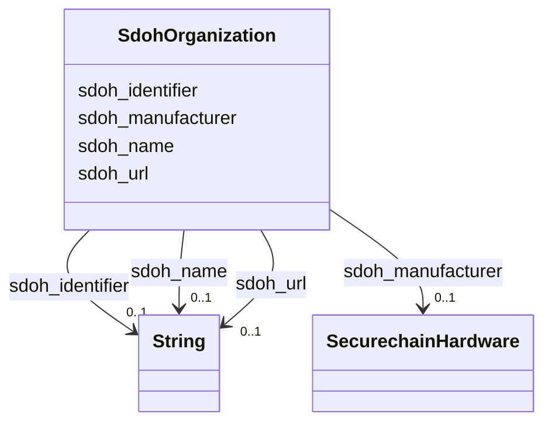

# Class: Organization (sdoh_Organization)


_An organization such as a school, NGO, corporation, club, etc._


URI: [sdoh:Organization](http://schema.org/Organization)





<!-- no inheritance hierarchy -->


## Slots

| Name | Cardinality and Range | Description | Inheritance |
| ---  | --- | --- | --- |
| [sdoh_identifier](../slots/sdoh_identifier.md) | 0..1 <br/> [xsd:string](xsd:string) | No slot description provided | direct |
| [sdoh_url](../slots/sdoh_url.md) | 0..1 <br/> [xsd:string](xsd:string) | No slot description provided | direct |
| [sdoh_name](../slots/sdoh_name.md) | 0..1 <br/> [xsd:string](xsd:string) | No slot description provided | direct |
| [sdoh_manufacturer](../slots/sdoh_manufacturer.md) | 0..1 <br/> [SecurechainHardware](../classes/SecurechainHardware.md) | No slot description provided | direct |


## Examples

| Value |
| --- |
| schema:Organization/anusthanokarehasya |

## TODOs

* TODO -- Todos for this class go here
* or you can delete the todos
* if you think the class is perfect.

## Identifier and Mapping Information


### Schema Source


* from schema: secure-chain-kg


## Mappings

| Mapping Type | Mapped Value |
| ---  | ---  |
| self | sdoh:Organization |
| native | secure-chain-kg/:SdohOrganization |


## LinkML Source

<!-- TODO: investigate https://stackoverflow.com/questions/37606292/how-to-create-tabbed-code-blocks-in-mkdocs-or-sphinx -->

### Direct

<details>
```yaml
name: sdoh_Organization
description: An organization such as a school, NGO, corporation, club, etc.
title: Organization
todos:
- TODO -- Todos for this class go here
- or you can delete the todos
- if you think the class is perfect.
notes:
- Class with 22889 occurences.
examples:
- value: schema:Organization/anusthanokarehasya
from_schema: secure-chain-kg
rank: 1000
slots:
- sdoh_identifier
- sdoh_url
- sdoh_name
- sdoh_manufacturer
class_uri: sdoh:Organization

```
</details>

### Induced

<details>
```yaml
name: sdoh_Organization
description: An organization such as a school, NGO, corporation, club, etc.
title: Organization
todos:
- TODO -- Todos for this class go here
- or you can delete the todos
- if you think the class is perfect.
notes:
- Class with 22889 occurences.
examples:
- value: schema:Organization/anusthanokarehasya
from_schema: secure-chain-kg
rank: 1000
attributes:
  sdoh_identifier:
    name: sdoh_identifier
    description: No slot description provided
    todos:
    - TODO -- Todos for this slot go here
    - or you can delete the todos
    - if you think the class is perfect.
    comments:
    - 259334 occurrences with subject type securechain_Vulnerability and object type
      string.
    - 30434 occurrences with subject type sdoh_Person and object type string.
    - 445 occurrences with subject type securechain_VulnerabilityType and object type
      string.
    - 887 occurrences with subject type sdoh_Organization and object type string.
    - 20 occurrences with subject type sdoh_CreativeWork and object type string.
    examples:
    - value: securechain:Vulnerability/CVE-2019-9484 sdoh:identifier CVE-2019-9484
    - value: schema:Person/rncbc sdoh:identifier rncbc
    - value: securechain:VulnerabilityType/CWE-228 sdoh:identifier CWE-228
    - value: schema:Organization/Jgraph sdoh:identifier Q59339175
    - value: securechain:License/mpl-2.0 sdoh:identifier mpl-2.0
    from_schema: secure-chain-kg
    rank: 1000
    slot_uri: sdoh:identifier
    alias: sdoh_identifier
    owner: sdoh_Organization
    domain_of:
    - sdoh_CreativeWork
    - sdoh_Organization
    - sdoh_Person
    - securechain_Vulnerability
    - securechain_VulnerabilityType
    range: string
  sdoh_url:
    name: sdoh_url
    description: No slot description provided
    todos:
    - TODO -- Todos for this slot go here
    - or you can delete the todos
    - if you think the class is perfect.
    comments:
    - 887 occurrences with subject type sdoh_Organization and object type string.
    examples:
    - value: schema:Organization/Es sdoh:url []
    from_schema: secure-chain-kg
    rank: 1000
    slot_uri: sdoh:url
    alias: sdoh_url
    owner: sdoh_Organization
    domain_of:
    - sdoh_Organization
    range: string
  sdoh_name:
    name: sdoh_name
    description: No slot description provided
    todos:
    - TODO -- Todos for this slot go here
    - or you can delete the todos
    - if you think the class is perfect.
    comments:
    - 53378 occurrences with subject type securechain_Hardware and object type string.
    - 22002 occurrences with subject type sdoh_Organization and object type string.
    - 34469 occurrences with subject type securechain_Software and object type string.
    - 20 occurrences with subject type sdoh_CreativeWork and object type string.
    examples:
    - value: securechain:Hardware/nvr1xxx sdoh:name nvr1xxx
    - value: schema:Organization/opencaching sdoh:name opencaching
    - value: securechain:Software/libdime sdoh:name libdime
    - value: securechain:License/mit sdoh:name MIT License
    from_schema: secure-chain-kg
    rank: 1000
    slot_uri: sdoh:name
    alias: sdoh_name
    owner: sdoh_Organization
    domain_of:
    - sdoh_CreativeWork
    - sdoh_Organization
    - securechain_Hardware
    - securechain_Software
    range: string
  sdoh_manufacturer:
    name: sdoh_manufacturer
    description: No slot description provided
    todos:
    - TODO -- Todos for this slot go here
    - or you can delete the todos
    - if you think the class is perfect.
    comments:
    - 54369 occurrences with subject type sdoh_Organization and object type securechain_Hardware.
    examples:
    - value: schema:Organization/hp sdoh:manufacturer securechain:Hardware/laptop_15-da0xxx
    from_schema: secure-chain-kg
    rank: 1000
    slot_uri: sdoh:manufacturer
    alias: sdoh_manufacturer
    owner: sdoh_Organization
    domain_of:
    - sdoh_Organization
    range: securechain_Hardware
class_uri: sdoh:Organization

```
</details>