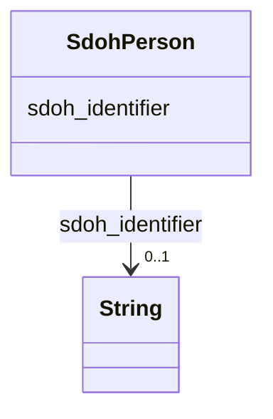

# Class: Person (sdoh_Person)


_A person (alive, dead, undead, or fictional)._


URI: [sdoh:Person](http://schema.org/Person)





<!-- no inheritance hierarchy -->


## Slots

| Name | Cardinality and Range | Description | Inheritance |
| ---  | --- | --- | --- |
| [sdoh_identifier](../slots/sdoh_identifier.md) | 0..1 <br/> [xsd:string](xsd:string) | No slot description provided | direct |


## Usages

| used by | used in | type | used |
| ---  | --- | --- | --- |
| [SecurechainSoftware](../classes/SecurechainSoftware.md) | [sdoh_contributor](../slots/sdoh_contributor.md) | range | [SdohPerson](../classes/SdohPerson.md) |
| [SecurechainSoftwareVersion](../classes/SecurechainSoftwareVersion.md) | [sdoh_contributor](../slots/sdoh_contributor.md) | range | [SdohPerson](../classes/SdohPerson.md) |


## Examples

| Value |
| --- |
| schema:Person/jam3sward |

## TODOs

* TODO -- Todos for this class go here
* or you can delete the todos
* if you think the class is perfect.

## Identifier and Mapping Information


### Schema Source


* from schema: secure-chain-kg


## Mappings

| Mapping Type | Mapped Value |
| ---  | ---  |
| self | sdoh:Person |
| native | secure-chain-kg/:SdohPerson |


## LinkML Source

<!-- TODO: investigate https://stackoverflow.com/questions/37606292/how-to-create-tabbed-code-blocks-in-mkdocs-or-sphinx -->

### Direct

<details>
```yaml
name: sdoh_Person
description: A person (alive, dead, undead, or fictional).
title: Person
todos:
- TODO -- Todos for this class go here
- or you can delete the todos
- if you think the class is perfect.
notes:
- Class with 30434 occurences.
examples:
- value: schema:Person/jam3sward
from_schema: secure-chain-kg
rank: 1000
slots:
- sdoh_identifier
class_uri: sdoh:Person

```
</details>

### Induced

<details>
```yaml
name: sdoh_Person
description: A person (alive, dead, undead, or fictional).
title: Person
todos:
- TODO -- Todos for this class go here
- or you can delete the todos
- if you think the class is perfect.
notes:
- Class with 30434 occurences.
examples:
- value: schema:Person/jam3sward
from_schema: secure-chain-kg
rank: 1000
attributes:
  sdoh_identifier:
    name: sdoh_identifier
    description: No slot description provided
    todos:
    - TODO -- Todos for this slot go here
    - or you can delete the todos
    - if you think the class is perfect.
    comments:
    - 259334 occurrences with subject type securechain_Vulnerability and object type
      string.
    - 30434 occurrences with subject type sdoh_Person and object type string.
    - 445 occurrences with subject type securechain_VulnerabilityType and object type
      string.
    - 887 occurrences with subject type sdoh_Organization and object type string.
    - 20 occurrences with subject type sdoh_CreativeWork and object type string.
    examples:
    - value: securechain:Vulnerability/CVE-2019-9484 sdoh:identifier CVE-2019-9484
    - value: schema:Person/rncbc sdoh:identifier rncbc
    - value: securechain:VulnerabilityType/CWE-228 sdoh:identifier CWE-228
    - value: schema:Organization/Jgraph sdoh:identifier Q59339175
    - value: securechain:License/mpl-2.0 sdoh:identifier mpl-2.0
    from_schema: secure-chain-kg
    rank: 1000
    slot_uri: sdoh:identifier
    alias: sdoh_identifier
    owner: sdoh_Person
    domain_of:
    - sdoh_CreativeWork
    - sdoh_Organization
    - sdoh_Person
    - securechain_Vulnerability
    - securechain_VulnerabilityType
    range: string
class_uri: sdoh:Person

```
</details>