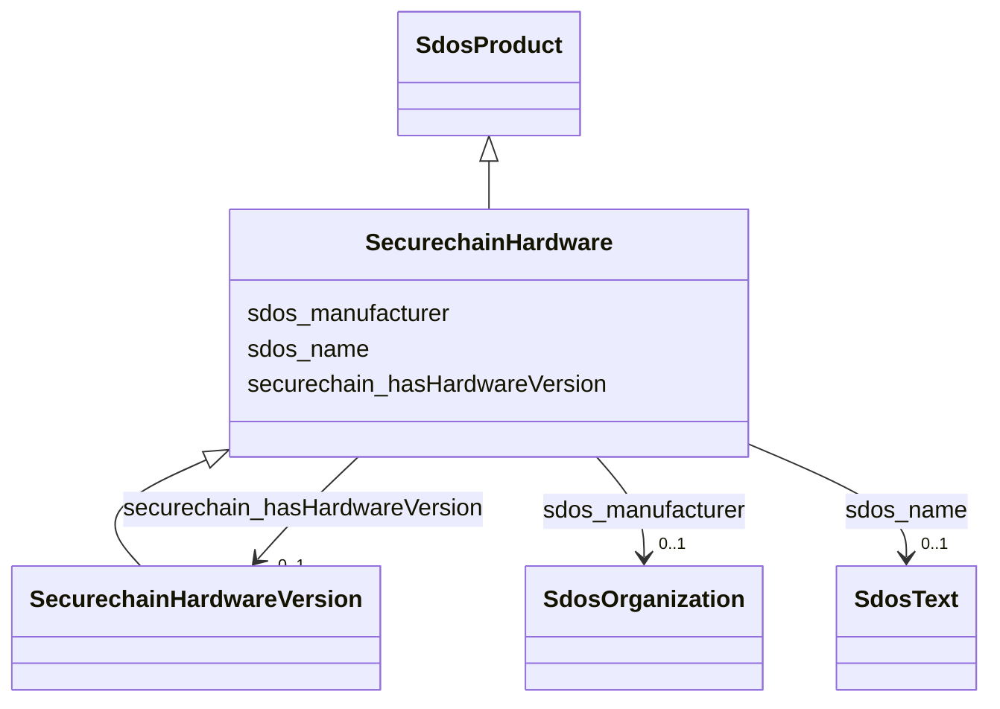

# Class: SecurechainHardware


This class occurs 55764 times.


URI: [securechain:Hardware](https://w3id.org/secure-chain/Hardware)





## Inheritance
* [SdosThing](../classes/SdosThing.md)
    * [SdosProduct](../classes/SdosProduct.md)
        * **SecurechainHardware**
            * [SecurechainHardwareVersion](../classes/SecurechainHardwareVersion.md)


## Slots

| Name | Cardinality and Range | Description | Inheritance | Occurrences |
| ---  | --- | --- | --- | --- |
| [sdos_manufacturer](../slots/sdos_manufacturer.md) | 0..1 <br/> [SdosOrganization](../classes/SdosOrganization.md) | The manufacturer of the product <br/>  | direct | 59438 |
| [sdos_name](../slots/sdos_name.md) | 0..1 <br/> [SdosText](../classes/SdosText.md) | The name of the item <br/>  | direct | 60817 |
| [securechain_hasHardwareVersion](../slots/securechain_hasHardwareVersion.md) | 0..1 <br/> [SecurechainHardwareVersion](../classes/SecurechainHardwareVersion.md) |  <br/>  | direct | 59978 |


## Usages

| used by | used in | type | used |
| ---  | --- | --- | --- |
| [SecurechainHardware](../classes/SecurechainHardware.md) | [securechain_hasHardwareVersion](../slots/securechain_hasHardwareVersion.md) | domain | [SecurechainHardware](../classes/SecurechainHardware.md) |
| [SecurechainHardwareVersion](../classes/SecurechainHardwareVersion.md) | [securechain_hasHardwareVersion](../slots/securechain_hasHardwareVersion.md) | domain | [SecurechainHardware](../classes/SecurechainHardware.md) |


## LinkML Source

<!-- TODO: investigate https://stackoverflow.com/questions/37606292/how-to-create-tabbed-code-blocks-in-mkdocs-or-sphinx -->

### Direct

<details>

```yaml
name: securechain_Hardware
from_schema: okns:secure-chain-kg
rank: 1000
is_a: sdos_Product
slots:
- sdos_manufacturer
- sdos_name
- securechain_hasHardwareVersion
class_uri: securechain:Hardware

```
</details>

### Induced

<details>

```yaml
name: securechain_Hardware
from_schema: okns:secure-chain-kg
rank: 1000
is_a: sdos_Product
attributes:
  sdos_manufacturer:
    name: sdos_manufacturer
    description: The manufacturer of the product.
    title: manufacturer
    notes:
    - No occurrences of this slot in the graph.
    from_schema: okns:sdo
    domain: sdos_Product
    slot_uri: sdos:manufacturer
    alias: sdos_manufacturer
    owner: securechain_Hardware
    domain_of:
    - securechain_Hardware
    range: sdos_Organization
  sdos_name:
    name: sdos_name
    description: The name of the item.
    title: name
    notes:
    - No occurrences of this slot in the graph.
    from_schema: okns:sdo
    exact_mappings:
    - http://purl.org/dc/terms/title
    domain: sdos_Thing
    slot_uri: sdos:name
    alias: sdos_name
    owner: securechain_Hardware
    domain_of:
    - securechain_Hardware
    - securechain_HardwareVersion
    subproperty_of: rdfs_label
    range: sdos_Text
  securechain_hasHardwareVersion:
    name: securechain_hasHardwareVersion
    from_schema: okns:secure-chain-kg
    rank: 1000
    domain: securechain_Hardware
    slot_uri: securechain:hasHardwareVersion
    alias: securechain_hasHardwareVersion
    owner: securechain_Hardware
    domain_of:
    - securechain_Hardware
    range: securechain_HardwareVersion
class_uri: securechain:Hardware

```
</details>