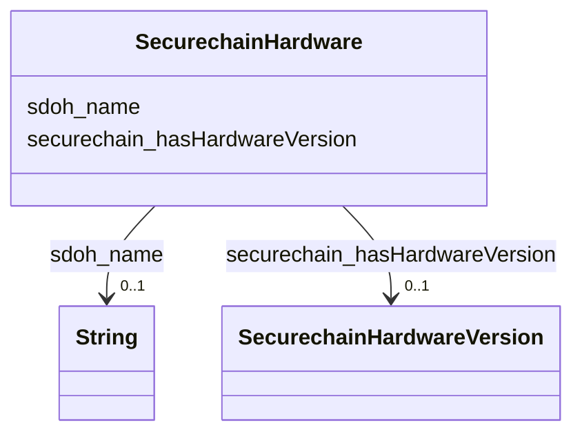

# Class: TODO -- what's a good name for what this class (type) describes? (securechain_Hardware)


_TODO -- tell the world what this class (type) describes._


URI: [securechain:Hardware](https://w3id.org/secure-chain/Hardware)





<!-- no inheritance hierarchy -->


## Slots

| Name | Cardinality and Range | Description | Inheritance |
| ---  | --- | --- | --- |
| [securechain_hasHardwareVersion](../slots/securechain_hasHardwareVersion.md) | 0..1 <br/> [SecurechainHardwareVersion](../classes/SecurechainHardwareVersion.md) | TODO -- tell the world what this slot (predicate) describes | direct |
| [sdoh_name](../slots/sdoh_name.md) | 0..1 <br/> [xsd:string](http://www.w3.org/2001/XMLSchema#string) | TODO -- tell the world what this slot (predicate) describes | direct |


## Usages

| used by | used in | type | used |
| ---  | --- | --- | --- |
| [SdohOrganization](../classes/SdohOrganization.md) | [sdoh_manufacturer](../slots/sdoh_manufacturer.md) | range | [SecurechainHardware](../classes/SecurechainHardware.md) |


## Examples

| Value |
| --- |
| securechain:Hardware/fx0-gpnt00000 |

## TODOs

* TODO -- Todos for this class go here
* or you can delete the todos
* if you think the class is perfect.

## Identifier and Mapping Information


### Schema Source


* from schema: secure-chain-kg/develop


## Mappings

| Mapping Type | Mapped Value |
| ---  | ---  |
| self | securechain:Hardware |
| native | secure-chain-kg/develop/:SecurechainHardware |


## LinkML Source

<!-- TODO: investigate https://stackoverflow.com/questions/37606292/how-to-create-tabbed-code-blocks-in-mkdocs-or-sphinx -->

### Direct

<details>
```yaml
name: securechain_Hardware
description: TODO -- tell the world what this class (type) describes.
title: TODO -- what's a good name for what this class (type) describes?
todos:
- TODO -- Todos for this class go here
- or you can delete the todos
- if you think the class is perfect.
notes:
- There are 53378 instances of this class.
examples:
- value: securechain:Hardware/fx0-gpnt00000
from_schema: secure-chain-kg/develop
slots:
- securechain_hasHardwareVersion
- sdoh_name
class_uri: securechain:Hardware

```
</details>

### Induced

<details>
```yaml
name: securechain_Hardware
description: TODO -- tell the world what this class (type) describes.
title: TODO -- what's a good name for what this class (type) describes?
todos:
- TODO -- Todos for this class go here
- or you can delete the todos
- if you think the class is perfect.
notes:
- There are 53378 instances of this class.
examples:
- value: securechain:Hardware/fx0-gpnt00000
from_schema: secure-chain-kg/develop
attributes:
  securechain_hasHardwareVersion:
    name: securechain_hasHardwareVersion
    description: TODO -- tell the world what this slot (predicate) describes.
    todos:
    - TODO -- Todos for this slot go here
    - or you can delete the todos
    - if you think the class is perfect.
    comments:
    - 57295 occurrences with subject type securechain_Hardware and object type securechain_HardwareVersion.
    examples:
    - value: securechain:Hardware/catalyst_3750x-48p-e securechain:hasHardwareVersion
        securechain:HardwareVersion/catalyst_3750x-48p-e#-
    from_schema: secure-chain-kg/develop
    rank: 1000
    slot_uri: securechain:hasHardwareVersion
    alias: securechain_hasHardwareVersion
    owner: securechain_Hardware
    domain_of:
    - securechain_Hardware
    range: securechain_HardwareVersion
  sdoh_name:
    name: sdoh_name
    description: TODO -- tell the world what this slot (predicate) describes.
    todos:
    - TODO -- Todos for this slot go here
    - or you can delete the todos
    - if you think the class is perfect.
    comments:
    - 53378 occurrences with subject type securechain_Hardware and object type string.
    - 22002 occurrences with subject type sdoh_Organization and object type string.
    - 34469 occurrences with subject type securechain_Software and object type string.
    - 20 occurrences with subject type sdoh_CreativeWork and object type string.
    examples:
    - value: securechain:Hardware/field_programmable_gate_array_programmable_acceleration_card_n3000
        sdoh:name field_programmable_gate_array_programmable_acceleration_card_n3000
    - value: schema:Organization/social_microblogging_pro_project sdoh:name social_microblogging_pro_project
    - value: securechain:Software/libcupscgi1 sdoh:name libcupscgi1
    - value: securechain:License/unlicense sdoh:name This is free and unencumbered
        software released into the public domain.
    from_schema: secure-chain-kg/develop
    rank: 1000
    slot_uri: sdoh:name
    alias: sdoh_name
    owner: securechain_Hardware
    domain_of:
    - securechain_Hardware
    - securechain_Software
    - sdoh_CreativeWork
    - sdoh_Organization
    range: string
class_uri: securechain:Hardware

```
</details>