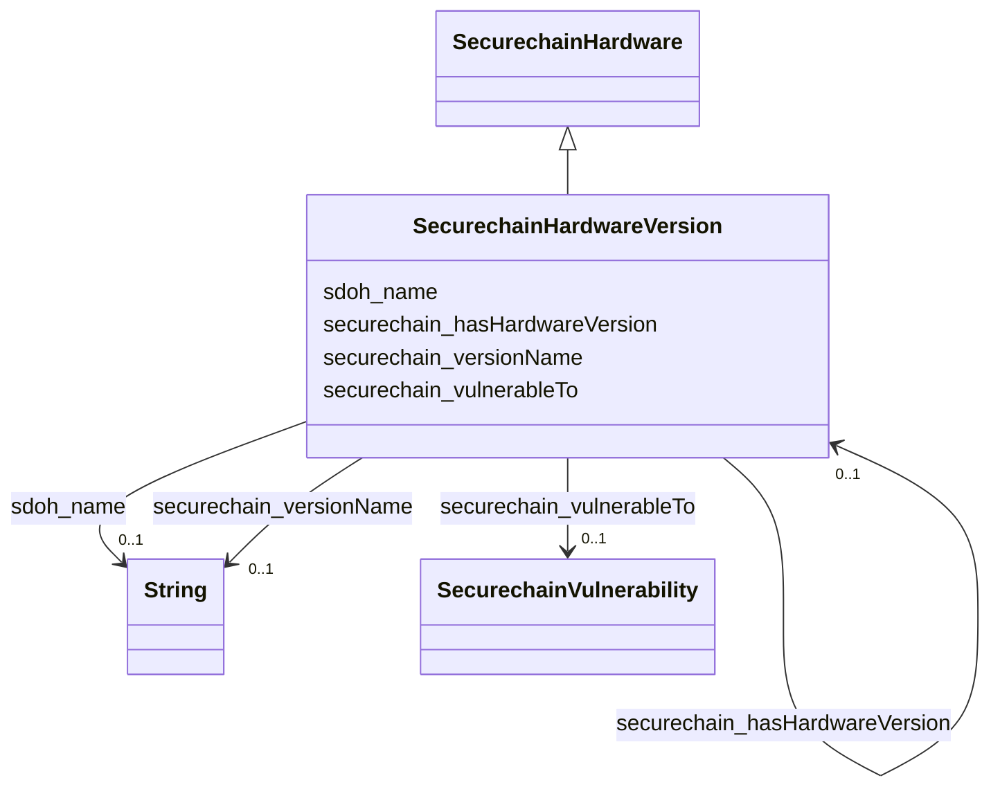

# Class: TODO -- what's a good name for this class (type)? (securechain_HardwareVersion)


_No type description provided_


URI: [securechain:HardwareVersion](https://w3id.org/secure-chain/HardwareVersion)





## Inheritance
* [SdohProduct](../classes/SdohProduct.md)
    * [SecurechainHardware](../classes/SecurechainHardware.md)
        * **SecurechainHardwareVersion**


## Slots

| Name | Cardinality and Range | Description | Inheritance |
| ---  | --- | --- | --- |
| [securechain_vulnerableTo](../slots/securechain_vulnerableTo.md) | 0..1 <br/> [SecurechainVulnerability](../classes/SecurechainVulnerability.md) | No slot description provided | direct |
| [securechain_versionName](../slots/securechain_versionName.md) | 0..1 <br/> [xsd:string](xsd:string) | No slot description provided | direct |
| [securechain_hasHardwareVersion](../slots/securechain_hasHardwareVersion.md) | 0..1 <br/> [SecurechainHardwareVersion](../classes/SecurechainHardwareVersion.md) | No slot description provided | [SecurechainHardware](../classes/SecurechainHardware.md) |
| [sdoh_name](../slots/sdoh_name.md) | 0..1 <br/> [xsd:string](xsd:string) | No slot description provided | [SecurechainHardware](../classes/SecurechainHardware.md) |


## Usages

| used by | used in | type | used |
| ---  | --- | --- | --- |
| [SecurechainHardware](../classes/SecurechainHardware.md) | [securechain_hasHardwareVersion](../slots/securechain_hasHardwareVersion.md) | range | [SecurechainHardwareVersion](../classes/SecurechainHardwareVersion.md) |
| [SecurechainHardwareVersion](../classes/SecurechainHardwareVersion.md) | [securechain_hasHardwareVersion](../slots/securechain_hasHardwareVersion.md) | range | [SecurechainHardwareVersion](../classes/SecurechainHardwareVersion.md) |


## Examples

| Value |
| --- |
| securechain:HardwareVersion/wcn3991#- |

## TODOs

* TODO -- Todos for this class go here
* or you can delete the todos
* if you think the class is perfect.

## Identifier and Mapping Information


### Schema Source


* from schema: secure-chain-kg


## Mappings

| Mapping Type | Mapped Value |
| ---  | ---  |
| self | securechain:HardwareVersion |
| native | secure-chain-kg/:SecurechainHardwareVersion |


## LinkML Source

<!-- TODO: investigate https://stackoverflow.com/questions/37606292/how-to-create-tabbed-code-blocks-in-mkdocs-or-sphinx -->

### Direct

<details>
```yaml
name: securechain_HardwareVersion
description: No type description provided
title: TODO -- what's a good name for this class (type)?
todos:
- TODO -- Todos for this class go here
- or you can delete the todos
- if you think the class is perfect.
notes:
- Class with 57295 occurences.
examples:
- value: securechain:HardwareVersion/wcn3991#-
from_schema: secure-chain-kg
rank: 1000
is_a: securechain_Hardware
slots:
- securechain_vulnerableTo
- securechain_versionName
class_uri: securechain:HardwareVersion

```
</details>

### Induced

<details>
```yaml
name: securechain_HardwareVersion
description: No type description provided
title: TODO -- what's a good name for this class (type)?
todos:
- TODO -- Todos for this class go here
- or you can delete the todos
- if you think the class is perfect.
notes:
- Class with 57295 occurences.
examples:
- value: securechain:HardwareVersion/wcn3991#-
from_schema: secure-chain-kg
rank: 1000
is_a: securechain_Hardware
attributes:
  securechain_vulnerableTo:
    name: securechain_vulnerableTo
    description: No slot description provided
    todos:
    - TODO -- Todos for this slot go here
    - or you can delete the todos
    - if you think the class is perfect.
    comments:
    - 445386 occurrences with subject type securechain_HardwareVersion and object
      type securechain_Vulnerability.
    - 21897 occurrences with untyped subjects and object type https://w3id.org/secure-chain/Vulnerability.
    - 5067 occurrences with subject type securechain_SoftwareVersion and object type
      securechain_Vulnerability.
    examples:
    - value: securechain:HardwareVersion/x12dpl-i6#- securechain:vulnerableTo securechain:Vulnerability/CVE-2023-33412
    - value: securechain:HardwareVersion/wireless-n_7260#- securechain:vulnerableTo
        securechain:Vulnerability/CVE-2018-12177
    - value: securechain:SoftwareVersion/freetype#2.2.1-5 securechain:vulnerableTo
        securechain:Vulnerability/CVE-2011-0226
    from_schema: secure-chain-kg
    rank: 1000
    slot_uri: securechain:vulnerableTo
    alias: securechain_vulnerableTo
    owner: securechain_HardwareVersion
    domain_of:
    - securechain_HardwareVersion
    - securechain_SoftwareVersion
    range: securechain_Vulnerability
  securechain_versionName:
    name: securechain_versionName
    description: No slot description provided
    todos:
    - TODO -- Todos for this slot go here
    - or you can delete the todos
    - if you think the class is perfect.
    comments:
    - 164001 occurrences with subject type securechain_SoftwareVersion and object
      type string.
    - 57295 occurrences with subject type securechain_HardwareVersion and object type
      string.
    examples:
    - value: securechain:SoftwareVersion/libaudcore5#%3E%3D+3.9 securechain:versionName
        >= 3.9
    - value: securechain:HardwareVersion/vantage_velocity#- securechain:versionName
        -
    from_schema: secure-chain-kg
    rank: 1000
    slot_uri: securechain:versionName
    alias: securechain_versionName
    owner: securechain_HardwareVersion
    domain_of:
    - securechain_HardwareVersion
    - securechain_SoftwareVersion
    range: string
  securechain_hasHardwareVersion:
    name: securechain_hasHardwareVersion
    description: No slot description provided
    todos:
    - TODO -- Todos for this slot go here
    - or you can delete the todos
    - if you think the class is perfect.
    comments:
    - 57295 occurrences with subject type securechain_Hardware and object type securechain_HardwareVersion.
    examples:
    - value: securechain:Hardware/core_i5 securechain:hasHardwareVersion securechain:HardwareVersion/core_i5#2557m
    from_schema: secure-chain-kg
    rank: 1000
    slot_uri: securechain:hasHardwareVersion
    alias: securechain_hasHardwareVersion
    owner: securechain_HardwareVersion
    domain_of:
    - securechain_Hardware
    range: securechain_HardwareVersion
  sdoh_name:
    name: sdoh_name
    description: No slot description provided
    todos:
    - TODO -- Todos for this slot go here
    - or you can delete the todos
    - if you think the class is perfect.
    comments:
    - 53378 occurrences with subject type securechain_Hardware and object type string.
    - 22002 occurrences with subject type sdoh_Organization and object type string.
    - 34469 occurrences with subject type securechain_Software and object type string.
    - 20 occurrences with subject type sdoh_CreativeWork and object type string.
    examples:
    - value: securechain:Hardware/nvr1xxx sdoh:name nvr1xxx
    - value: schema:Organization/opencaching sdoh:name opencaching
    - value: securechain:Software/libdime sdoh:name libdime
    - value: securechain:License/mit sdoh:name MIT License
    from_schema: secure-chain-kg
    rank: 1000
    slot_uri: sdoh:name
    alias: sdoh_name
    owner: securechain_HardwareVersion
    domain_of:
    - sdoh_CreativeWork
    - sdoh_Organization
    - securechain_Hardware
    - securechain_Software
    range: string
class_uri: securechain:HardwareVersion

```
</details>