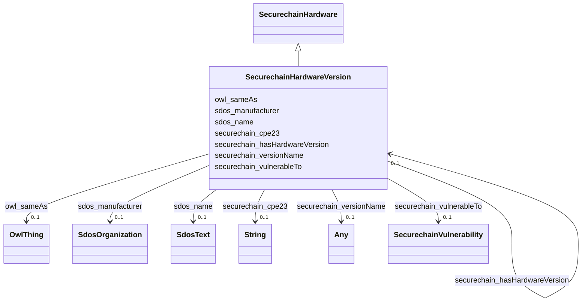

# Class: SecurechainHardwareVersion


This class occurs 59978 times.


URI: [securechain:HardwareVersion](https://w3id.org/secure-chain/HardwareVersion)





## Inheritance
* [SdosThing](../classes/SdosThing.md)
    * [SdosProduct](../classes/SdosProduct.md)
        * [SecurechainHardware](../classes/SecurechainHardware.md)
            * **SecurechainHardwareVersion**


## Slots

| Name | Cardinality and Range | Description | Inheritance | Occurrences |
| ---  | --- | --- | --- | --- |
| [sdos_name](../slots/sdos_name.md) | 0..1 <br/> [SdosText](../classes/SdosText.md) | The name of the item <br/>  | direct | 60799 |
| [securechain_vulnerableTo](../slots/securechain_vulnerableTo.md) | 0..1 <br/> [SecurechainVulnerability](../classes/SecurechainVulnerability.md) |  <br/>  | direct | 46230 |
| [owl_sameAs](../slots/owl_sameAs.md) | 0..1 <br/> [OwlThing](../classes/OwlThing.md) | The property that determines that two given individuals are equal <br/>  | direct | 18094 |
| [securechain_cpe23](../slots/securechain_cpe23.md) | 0..1 <br/> [xsd:string](xsd:string) |  <br/>  | direct | 61042 |
| [securechain_versionName](../slots/securechain_versionName.md) | 0..1 <br/> [xsd:string](xsd:string)&nbsp;or&nbsp;<br />[SdosText](../classes/SdosText.md) |  <br/>  | direct | 59978 |
| [securechain_hasHardwareVersion](../slots/securechain_hasHardwareVersion.md) | 0..1 <br/> [SecurechainHardwareVersion](../classes/SecurechainHardwareVersion.md) |  | [SecurechainHardware](../classes/SecurechainHardware.md) |  |
| [sdos_manufacturer](../slots/sdos_manufacturer.md) | 0..1 <br/> [SdosOrganization](../classes/SdosOrganization.md) | The manufacturer of the product | [SecurechainHardware](../classes/SecurechainHardware.md) |  |


## Usages

| used by | used in | type | used |
| ---  | --- | --- | --- |
| [SecurechainHardware](../classes/SecurechainHardware.md) | [securechain_hasHardwareVersion](../slots/securechain_hasHardwareVersion.md) | range | [SecurechainHardwareVersion](../classes/SecurechainHardwareVersion.md) |
| [SecurechainHardwareVersion](../classes/SecurechainHardwareVersion.md) | [securechain_hasHardwareVersion](../slots/securechain_hasHardwareVersion.md) | range | [SecurechainHardwareVersion](../classes/SecurechainHardwareVersion.md) |


## LinkML Source

<!-- TODO: investigate https://stackoverflow.com/questions/37606292/how-to-create-tabbed-code-blocks-in-mkdocs-or-sphinx -->

### Direct

<details>

```yaml
name: securechain_HardwareVersion
from_schema: okns:secure-chain-kg
rank: 1000
is_a: securechain_Hardware
slots:
- sdos_name
- securechain_vulnerableTo
- owl_sameAs
- securechain_cpe23
- securechain_versionName
class_uri: securechain:HardwareVersion

```
</details>

### Induced

<details>

```yaml
name: securechain_HardwareVersion
from_schema: okns:secure-chain-kg
rank: 1000
is_a: securechain_Hardware
attributes:
  sdos_name:
    name: sdos_name
    description: The name of the item.
    title: name
    notes:
    - No occurrences of this slot in the graph.
    from_schema: okns:sdo
    exact_mappings:
    - http://purl.org/dc/terms/title
    domain: sdos_Thing
    slot_uri: sdos:name
    alias: sdos_name
    owner: securechain_HardwareVersion
    domain_of:
    - securechain_Hardware
    - securechain_HardwareVersion
    subproperty_of: rdfs_label
    range: sdos_Text
  securechain_vulnerableTo:
    name: securechain_vulnerableTo
    from_schema: okns:secure-chain-kg
    rank: 1000
    domain: securechain_SoftwareVersion
    slot_uri: securechain:vulnerableTo
    alias: securechain_vulnerableTo
    owner: securechain_HardwareVersion
    domain_of:
    - securechain_HardwareVersion
    range: securechain_Vulnerability
  owl_sameAs:
    name: owl_sameAs
    description: The property that determines that two given individuals are equal.
    title: sameAs
    notes:
    - No occurrences of this slot in the graph.
    from_schema: okns:owl-rdf-rdfs
    source: http://www.w3.org/2002/07/owl#
    domain: owl_Thing
    slot_uri: owl:sameAs
    alias: owl_sameAs
    owner: securechain_HardwareVersion
    domain_of:
    - securechain_HardwareVersion
    range: owl_Thing
  securechain_cpe23:
    name: securechain_cpe23
    from_schema: okns:secure-chain-kg
    rank: 1000
    slot_uri: securechain:cpe23
    alias: securechain_cpe23
    owner: securechain_HardwareVersion
    domain_of:
    - securechain_HardwareVersion
    range: string
  securechain_versionName:
    name: securechain_versionName
    from_schema: okns:secure-chain-kg
    rank: 1000
    slot_uri: securechain:versionName
    alias: securechain_versionName
    owner: securechain_HardwareVersion
    domain_of:
    - securechain_HardwareVersion
    range: Any
    any_of:
    - range: string
    - range: sdos_Text
  securechain_hasHardwareVersion:
    name: securechain_hasHardwareVersion
    from_schema: okns:secure-chain-kg
    rank: 1000
    domain: securechain_Hardware
    slot_uri: securechain:hasHardwareVersion
    alias: securechain_hasHardwareVersion
    owner: securechain_HardwareVersion
    domain_of:
    - securechain_Hardware
    range: securechain_HardwareVersion
  sdos_manufacturer:
    name: sdos_manufacturer
    description: The manufacturer of the product.
    title: manufacturer
    notes:
    - No occurrences of this slot in the graph.
    from_schema: okns:sdo
    domain: sdos_Product
    slot_uri: sdos:manufacturer
    alias: sdos_manufacturer
    owner: securechain_HardwareVersion
    domain_of:
    - securechain_Hardware
    range: sdos_Organization
class_uri: securechain:HardwareVersion

```
</details>