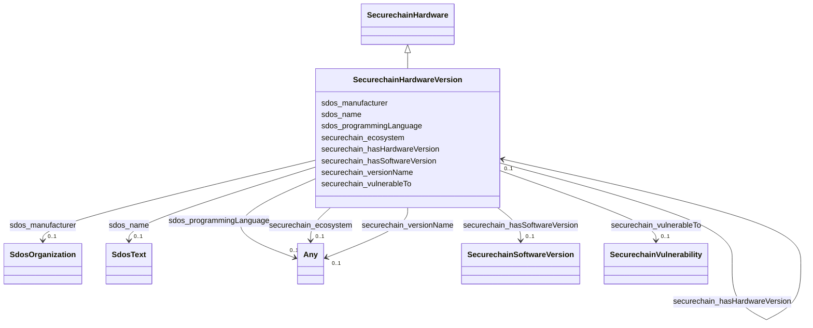

# Class: SecurechainHardwareVersion


This class occurs 57295 times.


URI: [securechain:HardwareVersion](https://w3id.org/secure-chain/HardwareVersion)





## Inheritance
* [SdosThing](../classes/SdosThing.md)
    * [SdosProduct](../classes/SdosProduct.md)
        * [SecurechainHardware](../classes/SecurechainHardware.md)
            * **SecurechainHardwareVersion**


## Slots

| Name | Cardinality and Range | Description | Inheritance | Occurrences |
| ---  | --- | --- | --- | --- |
| [securechain_vulnerableTo](../slots/securechain_vulnerableTo.md) | 0..1 <br/> [SecurechainVulnerability](../classes/SecurechainVulnerability.md) |  <br/>  | direct | 451784 |
| [securechain_versionName](../slots/securechain_versionName.md) | 0..1 <br/> [SdosText](../classes/SdosText.md)&nbsp;or&nbsp;<br />[xsd:string](xsd:string) |  <br/>  | direct | 57295 |
| [securechain_hasSoftwareVersion](../slots/securechain_hasSoftwareVersion.md) | 0..1 <br/> [SecurechainSoftwareVersion](../classes/SecurechainSoftwareVersion.md) |  | [SecurechainHardware](../classes/SecurechainHardware.md) |  |
| [securechain_ecosystem](../slots/securechain_ecosystem.md) | 0..1 <br/> [SdosText](../classes/SdosText.md)&nbsp;or&nbsp;<br />[xsd:string](xsd:string) |  | [SecurechainHardware](../classes/SecurechainHardware.md) |  |
| [sdos_name](../slots/sdos_name.md) | 0..1 <br/> [SdosText](../classes/SdosText.md) | The name of the item | [SecurechainHardware](../classes/SecurechainHardware.md) |  |
| [sdos_programmingLanguage](../slots/sdos_programmingLanguage.md) | 0..1 <br/> [SdosComputerLanguage](../classes/SdosComputerLanguage.md)&nbsp;or&nbsp;<br />[SdosText](../classes/SdosText.md) | The computer programming language | [SecurechainHardware](../classes/SecurechainHardware.md) |  |
| [securechain_hasHardwareVersion](../slots/securechain_hasHardwareVersion.md) | 0..1 <br/> [SecurechainHardwareVersion](../classes/SecurechainHardwareVersion.md) |  | [SecurechainHardware](../classes/SecurechainHardware.md) |  |
| [sdos_manufacturer](../slots/sdos_manufacturer.md) | 0..1 <br/> [SdosOrganization](../classes/SdosOrganization.md) | The manufacturer of the product | [SecurechainHardware](../classes/SecurechainHardware.md) |  |


## Usages

| used by | used in | type | used |
| ---  | --- | --- | --- |
| [SecurechainHardware](../classes/SecurechainHardware.md) | [securechain_hasHardwareVersion](../slots/securechain_hasHardwareVersion.md) | range | [SecurechainHardwareVersion](../classes/SecurechainHardwareVersion.md) |
| [SecurechainHardwareVersion](../classes/SecurechainHardwareVersion.md) | [securechain_hasHardwareVersion](../slots/securechain_hasHardwareVersion.md) | range | [SecurechainHardwareVersion](../classes/SecurechainHardwareVersion.md) |
| [SecurechainSoftware](../classes/SecurechainSoftware.md) | [securechain_hasHardwareVersion](../slots/securechain_hasHardwareVersion.md) | range | [SecurechainHardwareVersion](../classes/SecurechainHardwareVersion.md) |
| [SecurechainSoftwareVersion](../classes/SecurechainSoftwareVersion.md) | [securechain_hasHardwareVersion](../slots/securechain_hasHardwareVersion.md) | range | [SecurechainHardwareVersion](../classes/SecurechainHardwareVersion.md) |


## LinkML Source

<!-- TODO: investigate https://stackoverflow.com/questions/37606292/how-to-create-tabbed-code-blocks-in-mkdocs-or-sphinx -->

### Direct

<details>

```yaml
name: securechain_HardwareVersion
from_schema: okns:secure-chain-kg
rank: 1000
is_a: securechain_Hardware
slots:
- securechain_vulnerableTo
- securechain_versionName
class_uri: securechain:HardwareVersion

```
</details>

### Induced

<details>

```yaml
name: securechain_HardwareVersion
from_schema: okns:secure-chain-kg
rank: 1000
is_a: securechain_Hardware
attributes:
  securechain_vulnerableTo:
    name: securechain_vulnerableTo
    from_schema: okns:secure-chain-kg
    rank: 1000
    domain: securechain_SoftwareVersion
    slot_uri: securechain:vulnerableTo
    alias: securechain_vulnerableTo
    owner: securechain_HardwareVersion
    domain_of:
    - securechain_HardwareVersion
    - securechain_SoftwareVersion
    range: securechain_Vulnerability
  securechain_versionName:
    name: securechain_versionName
    from_schema: okns:secure-chain-kg
    rank: 1000
    slot_uri: securechain:versionName
    alias: securechain_versionName
    owner: securechain_HardwareVersion
    domain_of:
    - securechain_HardwareVersion
    - securechain_SoftwareVersion
    range: Any
    any_of:
    - range: sdos_Text
    - range: string
  securechain_hasSoftwareVersion:
    name: securechain_hasSoftwareVersion
    from_schema: okns:secure-chain-kg
    rank: 1000
    domain: securechain_Software
    slot_uri: securechain:hasSoftwareVersion
    alias: securechain_hasSoftwareVersion
    owner: securechain_HardwareVersion
    domain_of:
    - securechain_Hardware
    - securechain_Software
    range: securechain_SoftwareVersion
  securechain_ecosystem:
    name: securechain_ecosystem
    from_schema: okns:secure-chain-kg
    rank: 1000
    domain: securechain_Software
    slot_uri: securechain:ecosystem
    alias: securechain_ecosystem
    owner: securechain_HardwareVersion
    domain_of:
    - securechain_Hardware
    - securechain_Software
    range: Any
    any_of:
    - range: sdos_Text
    - range: string
  sdos_name:
    name: sdos_name
    description: The name of the item.
    title: name
    notes:
    - No occurrences of this slot in the graph.
    from_schema: okns:sdo
    exact_mappings:
    - http://purl.org/dc/terms/title
    domain: sdos_Thing
    slot_uri: sdos:name
    alias: sdos_name
    owner: securechain_HardwareVersion
    domain_of:
    - securechain_Hardware
    - securechain_License
    - securechain_Software
    subproperty_of: rdfs_label
    range: sdos_Text
  sdos_programmingLanguage:
    name: sdos_programmingLanguage
    description: The computer programming language.
    title: programmingLanguage
    notes:
    - No occurrences of this slot in the graph.
    from_schema: okns:sdo
    domain: sdos_SoftwareSourceCode
    slot_uri: sdos:programmingLanguage
    alias: sdos_programmingLanguage
    owner: securechain_HardwareVersion
    domain_of:
    - securechain_Hardware
    - securechain_Software
    range: Any
    any_of:
    - range: sdos_ComputerLanguage
    - range: sdos_Text
  securechain_hasHardwareVersion:
    name: securechain_hasHardwareVersion
    from_schema: okns:secure-chain-kg
    rank: 1000
    domain: securechain_Hardware
    slot_uri: securechain:hasHardwareVersion
    alias: securechain_hasHardwareVersion
    owner: securechain_HardwareVersion
    domain_of:
    - securechain_Hardware
    - securechain_Software
    range: securechain_HardwareVersion
  sdos_manufacturer:
    name: sdos_manufacturer
    description: The manufacturer of the product.
    title: manufacturer
    notes:
    - No occurrences of this slot in the graph.
    from_schema: okns:sdo
    domain: sdos_Product
    slot_uri: sdos:manufacturer
    alias: sdos_manufacturer
    owner: securechain_HardwareVersion
    domain_of:
    - securechain_Hardware
    - securechain_Software
    range: sdos_Organization
class_uri: securechain:HardwareVersion

```
</details>