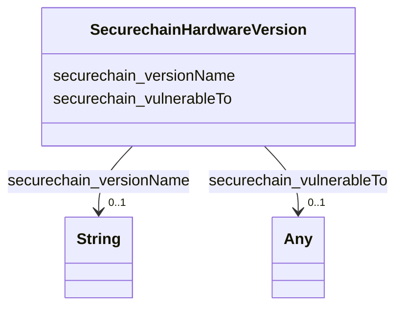

# Class: TODO -- what's a good name for what this class (type) describes? (securechain_HardwareVersion)


_TODO -- tell the world what this class (type) describes._


URI: [securechain:HardwareVersion](https://w3id.org/secure-chain/HardwareVersion)





<!-- no inheritance hierarchy -->


## Slots

| Name | Cardinality and Range | Description | Inheritance |
| ---  | --- | --- | --- |
| [securechain_vulnerableTo](../slots/securechain_vulnerableTo.md) | 0..1 <br/> [Any](../classes/Any.md)&nbsp;or&nbsp;<br />[SecurechainVulnerability](../classes/SecurechainVulnerability.md)&nbsp;or&nbsp;<br />[SecurechainVulnerability](../classes/SecurechainVulnerability.md) | TODO -- tell the world what this slot (predicate) describes | direct |
| [securechain_versionName](../slots/securechain_versionName.md) | 0..1 <br/> [xsd:string](http://www.w3.org/2001/XMLSchema#string) | TODO -- tell the world what this slot (predicate) describes | direct |


## Usages

| used by | used in | type | used |
| ---  | --- | --- | --- |
| [SecurechainHardware](../classes/SecurechainHardware.md) | [securechain_hasHardwareVersion](../slots/securechain_hasHardwareVersion.md) | range | [SecurechainHardwareVersion](../classes/SecurechainHardwareVersion.md) |


## Examples

| Value |
| --- |
| securechain:HardwareVersion/ideacentre_aio_3-24alc6#- |

## TODOs

* TODO -- Todos for this class go here
* or you can delete the todos
* if you think the class is perfect.

## Identifier and Mapping Information


### Schema Source


* from schema: secure-chain-kg/develop


## Mappings

| Mapping Type | Mapped Value |
| ---  | ---  |
| self | securechain:HardwareVersion |
| native | secure-chain-kg/develop/:SecurechainHardwareVersion |


## LinkML Source

<!-- TODO: investigate https://stackoverflow.com/questions/37606292/how-to-create-tabbed-code-blocks-in-mkdocs-or-sphinx -->

### Direct

<details>
```yaml
name: securechain_HardwareVersion
description: TODO -- tell the world what this class (type) describes.
title: TODO -- what's a good name for what this class (type) describes?
todos:
- TODO -- Todos for this class go here
- or you can delete the todos
- if you think the class is perfect.
notes:
- There are 57295 instances of this class.
examples:
- value: securechain:HardwareVersion/ideacentre_aio_3-24alc6#-
from_schema: secure-chain-kg/develop
slots:
- securechain_vulnerableTo
- securechain_versionName
class_uri: securechain:HardwareVersion

```
</details>

### Induced

<details>
```yaml
name: securechain_HardwareVersion
description: TODO -- tell the world what this class (type) describes.
title: TODO -- what's a good name for what this class (type) describes?
todos:
- TODO -- Todos for this class go here
- or you can delete the todos
- if you think the class is perfect.
notes:
- There are 57295 instances of this class.
examples:
- value: securechain:HardwareVersion/ideacentre_aio_3-24alc6#-
from_schema: secure-chain-kg/develop
attributes:
  securechain_vulnerableTo:
    name: securechain_vulnerableTo
    description: TODO -- tell the world what this slot (predicate) describes.
    todos:
    - TODO -- Todos for this slot go here
    - or you can delete the todos
    - if you think the class is perfect.
    comments:
    - 445386 occurrences with subject type securechain_HardwareVersion and object
      type securechain_Vulnerability.
    - 5067 occurrences with subject type securechain_SoftwareVersion and object type
      securechain_Vulnerability.
    - 21897 occurrences on untyped entities with type securechain_Vulnerability.
    examples:
    - value: securechain:HardwareVersion/xeon_e5-2699r_v4#- securechain:vulnerableTo
        securechain:Vulnerability/CVE-2021-0114
    - value: securechain:SoftwareVersion/mapserver#4.10.0-5%2Betch1 securechain:vulnerableTo
        securechain:Vulnerability/CVE-2009-0839
    from_schema: secure-chain-kg/develop
    rank: 1000
    slot_uri: securechain:vulnerableTo
    alias: securechain_vulnerableTo
    owner: securechain_HardwareVersion
    domain_of:
    - securechain_HardwareVersion
    - securechain_SoftwareVersion
    range: Any
    any_of:
    - range: securechain_Vulnerability
    - range: securechain_Vulnerability
  securechain_versionName:
    name: securechain_versionName
    description: TODO -- tell the world what this slot (predicate) describes.
    todos:
    - TODO -- Todos for this slot go here
    - or you can delete the todos
    - if you think the class is perfect.
    comments:
    - 164001 occurrences with subject type securechain_SoftwareVersion and object
      type string.
    - 57295 occurrences with subject type securechain_HardwareVersion and object type
      string.
    examples:
    - value: securechain:SoftwareVersion/gee-0.8#0.8 securechain:versionName 0.8
    - value: securechain:HardwareVersion/wsr-600dhp#- securechain:versionName -
    from_schema: secure-chain-kg/develop
    rank: 1000
    slot_uri: securechain:versionName
    alias: securechain_versionName
    owner: securechain_HardwareVersion
    domain_of:
    - securechain_HardwareVersion
    - securechain_SoftwareVersion
    range: string
class_uri: securechain:HardwareVersion

```
</details>