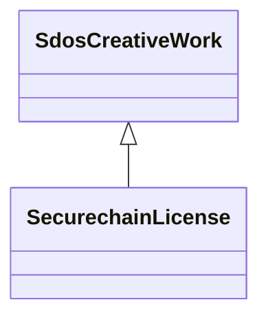

# Class: SecurechainLicense


URI: [securechain:License](https://w3id.org/secure-chain/License)





## Inheritance
* [SdosThing](../classes/SdosThing.md)
    * [SdosCreativeWork](../classes/SdosCreativeWork.md)
        * **SecurechainLicense**


## Slots

| Name | Cardinality and Range | Description | Inheritance | Occurrences |
| ---  | --- | --- | --- | --- |


## LinkML Source

<!-- TODO: investigate https://stackoverflow.com/questions/37606292/how-to-create-tabbed-code-blocks-in-mkdocs-or-sphinx -->

### Direct

<details>

```yaml
name: securechain_License
from_schema: okns:secure-chain-kg
rank: 1000
is_a: sdos_CreativeWork
class_uri: securechain:License

```
</details>

### Induced

<details>

```yaml
name: securechain_License
from_schema: okns:secure-chain-kg
rank: 1000
is_a: sdos_CreativeWork
class_uri: securechain:License

```
</details>