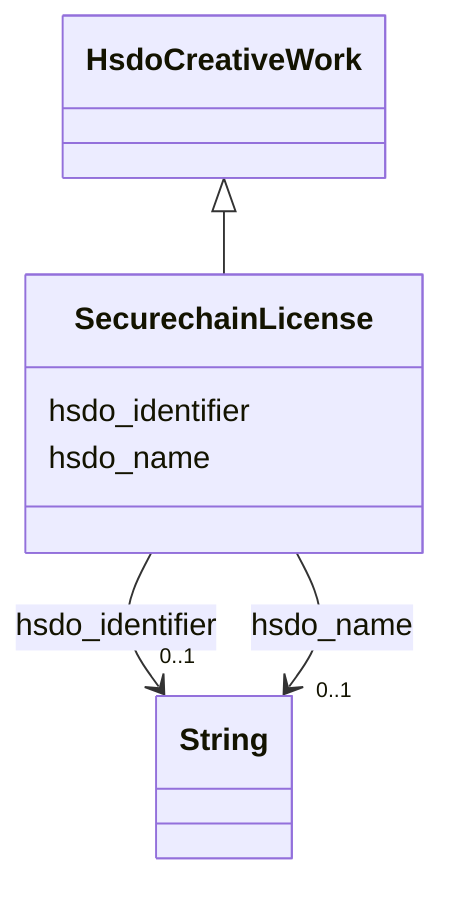

# Class: No class (entity type) name specified (securechain_License)


_No class (type) description specified_


This class occurs 294 times.


URI: [securechain:License](https://w3id.org/secure-chain/License)





## Inheritance
* [HsdoCreativeWork](../classes/HsdoCreativeWork.md)
    * **SecurechainLicense**


## Slots

| Name | Cardinality and Range | Description | Inheritance | Occurrences |
| ---  | --- | --- | --- | --- |
| [hsdo_name](../slots/hsdo_name.md) | 0..1 <br/> [xsd:string](http://www.w3.org/2001/XMLSchema#string) | No slot (predicate) description specified <br/>  | direct | 20 |
| [hsdo_identifier](../slots/hsdo_identifier.md) | 0..1 <br/> [xsd:string](http://www.w3.org/2001/XMLSchema#string) | No slot (predicate) description specified <br/>  | direct | 294 |


## Usages

| used by | used in | type | used |
| ---  | --- | --- | --- |
| [SecurechainSoftwareVersion](../classes/SecurechainSoftwareVersion.md) | [hsdo_license](../slots/hsdo_license.md) | range | [SecurechainLicense](../classes/SecurechainLicense.md) |


## LinkML Source

<!-- TODO: investigate https://stackoverflow.com/questions/37606292/how-to-create-tabbed-code-blocks-in-mkdocs-or-sphinx -->

### Direct

<details>

```yaml
name: securechain_License
conforms_to: No schema conformance document specified
annotations:
  count:
    tag: count
    value: 294
description: No class (type) description specified
title: No class (entity type) name specified
from_schema: secure-chain-kg
rank: 1000
is_a: hsdo_CreativeWork
slots:
- hsdo_name
- hsdo_identifier
slot_usage:
  hsdo_identifier:
    name: hsdo_identifier
    annotations:
      string:
        tag: string
        value: 294
  hsdo_name:
    name: hsdo_name
    annotations:
      string:
        tag: string
        value: 20
class_uri: securechain:License

```
</details>

### Induced

<details>

```yaml
name: securechain_License
conforms_to: No schema conformance document specified
annotations:
  count:
    tag: count
    value: 294
description: No class (type) description specified
title: No class (entity type) name specified
from_schema: secure-chain-kg
rank: 1000
is_a: hsdo_CreativeWork
slot_usage:
  hsdo_identifier:
    name: hsdo_identifier
    annotations:
      string:
        tag: string
        value: 294
  hsdo_name:
    name: hsdo_name
    annotations:
      string:
        tag: string
        value: 20
attributes:
  hsdo_name:
    name: hsdo_name
    annotations:
      string:
        tag: string
        value: 20
    description: No slot (predicate) description specified
    examples:
    - object:
        example_object: 0----0
        example_object_type: string
        example_predicate: hsdo:name
        example_subject: https://github.com/0----0
        example_subject_type: hsdo_Person
    - object:
        example_object: Permission to use, copy, modify, and/or distribute this software
          for any
        example_object_type: string
        example_predicate: hsdo:name
        example_subject: https://spdx.org/licenses/0bsd.html
        example_subject_type: securechain_License
    - object:
        example_object: 2n
        example_object_type: string
        example_predicate: hsdo:name
        example_subject: https://www.google.com/search?q=2n
        example_subject_type: hsdo_Organization
    - object:
        example_object: '360'
        example_object_type: string
        example_predicate: hsdo:name
        example_subject: https://www.google.com/search?q=360
        example_subject_type: securechain_Hardware
    - object:
        example_object: amd
        example_object_type: string
        example_predicate: hsdo:name
        example_subject: https://www.google.com/search?q=amd
        example_subject_type: securechain_Software
    from_schema: secure-chain-kg
    rank: 1000
    slot_uri: hsdo:name
    alias: hsdo_name
    owner: securechain_License
    domain_of:
    - hsdo_Organization
    - hsdo_Person
    - securechain_Hardware
    - securechain_License
    - securechain_Software
    range: string
  hsdo_identifier:
    name: hsdo_identifier
    annotations:
      string:
        tag: string
        value: 294
    description: No slot (predicate) description specified
    examples:
    - object:
        example_object: CWE-1
        example_object_type: string
        example_predicate: hsdo:identifier
        example_subject: https://cwe.mitre.org/data/definitions/1.html
        example_subject_type: securechain_VulnerabilityType
    - object:
        example_object: CVE-1999-0060
        example_object_type: string
        example_predicate: hsdo:identifier
        example_subject: https://nvd.nist.gov/vuln/detail/CVE-1999-0060
        example_subject_type: securechain_Vulnerability
    - object:
        example_object: (Apache-2.0
        example_object_type: string
        example_predicate: hsdo:identifier
        example_subject: https://spdx.org/licenses/%28Apache-2.0.html
        example_subject_type: securechain_License
    - object:
        example_object: Q2150861
        example_object_type: string
        example_predicate: hsdo:identifier
        example_subject: https://www.google.com/search?q=1Password
        example_subject_type: hsdo_Organization
    - object:
        example_object: Q202400
        example_object_type: string
        example_predicate: hsdo:identifier
        example_subject: https://www.google.com/search?q=Kernel
        example_subject_type: securechain_Software
    from_schema: secure-chain-kg
    rank: 1000
    slot_uri: hsdo:identifier
    alias: hsdo_identifier
    owner: securechain_License
    domain_of:
    - hsdo_Organization
    - securechain_License
    - securechain_Software
    - securechain_Vulnerability
    - securechain_VulnerabilityType
    range: string
class_uri: securechain:License

```
</details>