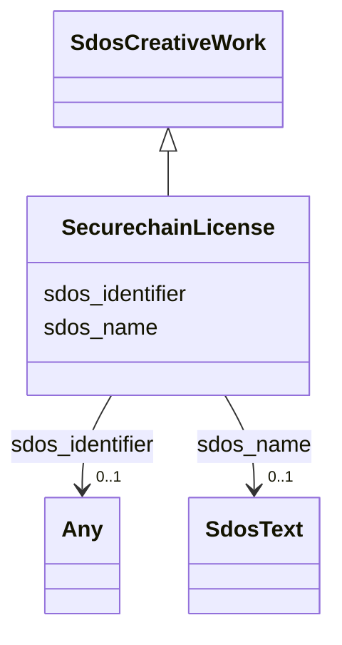

# Class: SecurechainLicense


This class occurs 294 times.


URI: [securechain:License](https://w3id.org/secure-chain/License)





## Inheritance
* [SdosThing](../classes/SdosThing.md)
    * [SdosCreativeWork](../classes/SdosCreativeWork.md)
        * **SecurechainLicense**


## Slots

| Name | Cardinality and Range | Description | Inheritance | Occurrences |
| ---  | --- | --- | --- | --- |
| [sdos_name](../slots/sdos_name.md) | 0..1 <br/> [SdosText](../classes/SdosText.md) | The name of the item <br/>  | direct | 20 |
| [sdos_identifier](../slots/sdos_identifier.md) | 0..1 <br/> [SdosURL](../classes/SdosURL.md)&nbsp;or&nbsp;<br />[SdosPropertyValue](../classes/SdosPropertyValue.md)&nbsp;or&nbsp;<br />[SdosText](../classes/SdosText.md) | The identifier property represents any kind of identifier for any kind of [[T... <br/>  | direct | 294 |


## LinkML Source

<!-- TODO: investigate https://stackoverflow.com/questions/37606292/how-to-create-tabbed-code-blocks-in-mkdocs-or-sphinx -->

### Direct

<details>

```yaml
name: securechain_License
from_schema: okns:secure-chain-kg
rank: 1000
is_a: sdos_CreativeWork
slots:
- sdos_name
- sdos_identifier
class_uri: securechain:License

```
</details>

### Induced

<details>

```yaml
name: securechain_License
from_schema: okns:secure-chain-kg
rank: 1000
is_a: sdos_CreativeWork
attributes:
  sdos_name:
    name: sdos_name
    description: The name of the item.
    title: name
    notes:
    - No occurrences of this slot in the graph.
    from_schema: okns:sdo
    exact_mappings:
    - http://purl.org/dc/terms/title
    domain: sdos_Thing
    slot_uri: sdos:name
    alias: sdos_name
    owner: securechain_License
    domain_of:
    - securechain_Hardware
    - securechain_License
    - securechain_Software
    subproperty_of: rdfs_label
    range: sdos_Text
  sdos_identifier:
    name: sdos_identifier
    description: The identifier property represents any kind of identifier for any
      kind of [[Thing]], such as ISBNs, GTIN codes, UUIDs etc. Schema.org provides
      dedicated properties for representing many of these, either as textual strings
      or as URL (URI) links. See [background notes](/docs/datamodel.html#identifierBg)
      for more details.
    title: identifier
    notes:
    - No occurrences of this slot in the graph.
    from_schema: okns:sdo
    exact_mappings:
    - http://purl.org/dc/terms/identifier
    domain: sdos_Thing
    slot_uri: sdos:identifier
    alias: sdos_identifier
    owner: securechain_License
    domain_of:
    - securechain_License
    - securechain_Software
    - securechain_Vulnerability
    - securechain_VulnerabilityType
    range: Any
    any_of:
    - range: sdos_URL
    - range: sdos_PropertyValue
    - range: sdos_Text
class_uri: securechain:License

```
</details>