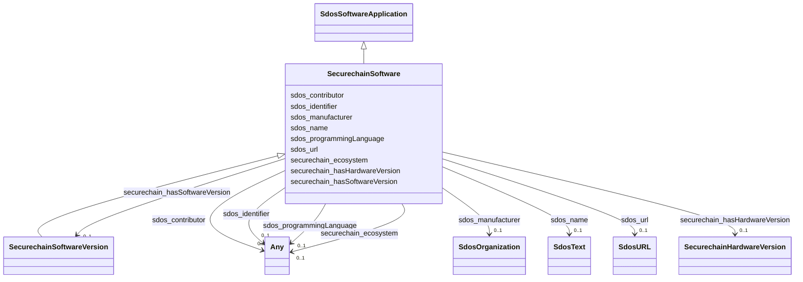

# Class: SecurechainSoftware


This class occurs 803769 times.


URI: [securechain:Software](https://w3id.org/secure-chain/Software)





## Inheritance
* [SdosThing](../classes/SdosThing.md)
    * [SdosCreativeWork](../classes/SdosCreativeWork.md)
        * [SdosSoftwareApplication](../classes/SdosSoftwareApplication.md)
            * **SecurechainSoftware**
                * [SecurechainSoftwareVersion](../classes/SecurechainSoftwareVersion.md)


## Slots

| Name | Cardinality and Range | Description | Inheritance | Occurrences |
| ---  | --- | --- | --- | --- |
| [securechain_hasSoftwareVersion](../slots/securechain_hasSoftwareVersion.md) | 0..1 <br/> [SecurechainSoftwareVersion](../classes/SecurechainSoftwareVersion.md) |  <br/>  | direct | 8593149 |
| [securechain_ecosystem](../slots/securechain_ecosystem.md) | 0..1 <br/> [SdosText](../classes/SdosText.md)&nbsp;or&nbsp;<br />[xsd:string](xsd:string) |  <br/>  | direct | 803769 |
| [sdos_url](../slots/sdos_url.md) | 0..1 <br/> [SdosURL](../classes/SdosURL.md) | URL of the item <br/>  | direct | 4 |
| [sdos_contributor](../slots/sdos_contributor.md) | 0..1 <br/> [SdosOrganization](../classes/SdosOrganization.md)&nbsp;or&nbsp;<br />[SdosPerson](../classes/SdosPerson.md)&nbsp;or&nbsp;<br />[xsd:anyURI](xsd:anyURI) | A secondary contributor to the CreativeWork or Event <br/>  | direct | 32408 |
| [sdos_name](../slots/sdos_name.md) | 0..1 <br/> [SdosText](../classes/SdosText.md) | The name of the item <br/>  | direct | 803766 |
| [sdos_programmingLanguage](../slots/sdos_programmingLanguage.md) | 0..1 <br/> [SdosComputerLanguage](../classes/SdosComputerLanguage.md)&nbsp;or&nbsp;<br />[SdosText](../classes/SdosText.md) | The computer programming language <br/>  | direct | 803769 |
| [sdos_identifier](../slots/sdos_identifier.md) | 0..1 <br/> [SdosURL](../classes/SdosURL.md)&nbsp;or&nbsp;<br />[SdosPropertyValue](../classes/SdosPropertyValue.md)&nbsp;or&nbsp;<br />[SdosText](../classes/SdosText.md) | The identifier property represents any kind of identifier for any kind of [[T... <br/>  | direct | 4 |
| [securechain_hasHardwareVersion](../slots/securechain_hasHardwareVersion.md) | 0..1 <br/> [SecurechainHardwareVersion](../classes/SecurechainHardwareVersion.md) |  <br/>  | direct | 24 |
| [sdos_manufacturer](../slots/sdos_manufacturer.md) | 0..1 <br/> [SdosOrganization](../classes/SdosOrganization.md) | The manufacturer of the product <br/>  | direct | 27 |


## Usages

| used by | used in | type | used |
| ---  | --- | --- | --- |
| [SecurechainHardware](../classes/SecurechainHardware.md) | [securechain_hasSoftwareVersion](../slots/securechain_hasSoftwareVersion.md) | domain | [SecurechainSoftware](../classes/SecurechainSoftware.md) |
| [SecurechainHardware](../classes/SecurechainHardware.md) | [securechain_ecosystem](../slots/securechain_ecosystem.md) | domain | [SecurechainSoftware](../classes/SecurechainSoftware.md) |
| [SecurechainHardwareVersion](../classes/SecurechainHardwareVersion.md) | [securechain_hasSoftwareVersion](../slots/securechain_hasSoftwareVersion.md) | domain | [SecurechainSoftware](../classes/SecurechainSoftware.md) |
| [SecurechainHardwareVersion](../classes/SecurechainHardwareVersion.md) | [securechain_ecosystem](../slots/securechain_ecosystem.md) | domain | [SecurechainSoftware](../classes/SecurechainSoftware.md) |
| [SecurechainSoftware](../classes/SecurechainSoftware.md) | [securechain_hasSoftwareVersion](../slots/securechain_hasSoftwareVersion.md) | domain | [SecurechainSoftware](../classes/SecurechainSoftware.md) |
| [SecurechainSoftware](../classes/SecurechainSoftware.md) | [securechain_ecosystem](../slots/securechain_ecosystem.md) | domain | [SecurechainSoftware](../classes/SecurechainSoftware.md) |
| [SecurechainSoftwareVersion](../classes/SecurechainSoftwareVersion.md) | [securechain_hasSoftwareVersion](../slots/securechain_hasSoftwareVersion.md) | domain | [SecurechainSoftware](../classes/SecurechainSoftware.md) |
| [SecurechainSoftwareVersion](../classes/SecurechainSoftwareVersion.md) | [securechain_ecosystem](../slots/securechain_ecosystem.md) | domain | [SecurechainSoftware](../classes/SecurechainSoftware.md) |


## LinkML Source

<!-- TODO: investigate https://stackoverflow.com/questions/37606292/how-to-create-tabbed-code-blocks-in-mkdocs-or-sphinx -->

### Direct

<details>

```yaml
name: securechain_Software
from_schema: okns:secure-chain-kg
rank: 1000
is_a: sdos_SoftwareApplication
slots:
- securechain_hasSoftwareVersion
- securechain_ecosystem
- sdos_url
- sdos_contributor
- sdos_name
- sdos_programmingLanguage
- sdos_identifier
- securechain_hasHardwareVersion
- sdos_manufacturer
class_uri: securechain:Software

```
</details>

### Induced

<details>

```yaml
name: securechain_Software
from_schema: okns:secure-chain-kg
rank: 1000
is_a: sdos_SoftwareApplication
attributes:
  securechain_hasSoftwareVersion:
    name: securechain_hasSoftwareVersion
    from_schema: okns:secure-chain-kg
    rank: 1000
    domain: securechain_Software
    slot_uri: securechain:hasSoftwareVersion
    alias: securechain_hasSoftwareVersion
    owner: securechain_Software
    domain_of:
    - securechain_Hardware
    - securechain_Software
    range: securechain_SoftwareVersion
  securechain_ecosystem:
    name: securechain_ecosystem
    from_schema: okns:secure-chain-kg
    rank: 1000
    domain: securechain_Software
    slot_uri: securechain:ecosystem
    alias: securechain_ecosystem
    owner: securechain_Software
    domain_of:
    - securechain_Hardware
    - securechain_Software
    range: Any
    any_of:
    - range: sdos_Text
    - range: string
  sdos_url:
    name: sdos_url
    description: URL of the item.
    title: url
    notes:
    - No occurrences of this slot in the graph.
    from_schema: okns:sdo
    domain: sdos_Thing
    slot_uri: sdos:url
    alias: sdos_url
    owner: securechain_Software
    domain_of:
    - securechain_Software
    - securechain_SoftwareVersion
    range: sdos_URL
  sdos_contributor:
    name: sdos_contributor
    description: A secondary contributor to the CreativeWork or Event.
    title: contributor
    from_schema: okns:sdo
    slot_uri: sdos:contributor
    alias: sdos_contributor
    owner: securechain_Software
    domain_of:
    - sdos_CarUsageType
    - sdos_DayOfWeek
    - sdos_DeliveryMethod
    - sdos_DriveWheelConfigurationValue
    - sdos_LegalForceStatus
    - sdos_LegalValueLevel
    - sdos_MusicAlbumProductionType
    - sdos_MusicAlbumReleaseType
    - sdos_MusicReleaseFormatType
    - sdos_SteeringPositionValue
    - securechain_Software
    union_of:
    - sdos_CreativeWork
    - sdos_Event
    range: Any
    any_of:
    - range: sdos_Organization
    - range: sdos_Person
    - range: uri
  sdos_name:
    name: sdos_name
    description: The name of the item.
    title: name
    notes:
    - No occurrences of this slot in the graph.
    from_schema: okns:sdo
    exact_mappings:
    - http://purl.org/dc/terms/title
    domain: sdos_Thing
    slot_uri: sdos:name
    alias: sdos_name
    owner: securechain_Software
    domain_of:
    - securechain_Hardware
    - securechain_License
    - securechain_Software
    subproperty_of: rdfs_label
    range: sdos_Text
  sdos_programmingLanguage:
    name: sdos_programmingLanguage
    description: The computer programming language.
    title: programmingLanguage
    notes:
    - No occurrences of this slot in the graph.
    from_schema: okns:sdo
    domain: sdos_SoftwareSourceCode
    slot_uri: sdos:programmingLanguage
    alias: sdos_programmingLanguage
    owner: securechain_Software
    domain_of:
    - securechain_Hardware
    - securechain_Software
    range: Any
    any_of:
    - range: sdos_ComputerLanguage
    - range: sdos_Text
  sdos_identifier:
    name: sdos_identifier
    description: The identifier property represents any kind of identifier for any
      kind of [[Thing]], such as ISBNs, GTIN codes, UUIDs etc. Schema.org provides
      dedicated properties for representing many of these, either as textual strings
      or as URL (URI) links. See [background notes](/docs/datamodel.html#identifierBg)
      for more details.
    title: identifier
    notes:
    - No occurrences of this slot in the graph.
    from_schema: okns:sdo
    exact_mappings:
    - http://purl.org/dc/terms/identifier
    domain: sdos_Thing
    slot_uri: sdos:identifier
    alias: sdos_identifier
    owner: securechain_Software
    domain_of:
    - securechain_License
    - securechain_Software
    - securechain_Vulnerability
    - securechain_VulnerabilityType
    range: Any
    any_of:
    - range: sdos_URL
    - range: sdos_PropertyValue
    - range: sdos_Text
  securechain_hasHardwareVersion:
    name: securechain_hasHardwareVersion
    from_schema: okns:secure-chain-kg
    rank: 1000
    domain: securechain_Hardware
    slot_uri: securechain:hasHardwareVersion
    alias: securechain_hasHardwareVersion
    owner: securechain_Software
    domain_of:
    - securechain_Hardware
    - securechain_Software
    range: securechain_HardwareVersion
  sdos_manufacturer:
    name: sdos_manufacturer
    description: The manufacturer of the product.
    title: manufacturer
    notes:
    - No occurrences of this slot in the graph.
    from_schema: okns:sdo
    domain: sdos_Product
    slot_uri: sdos:manufacturer
    alias: sdos_manufacturer
    owner: securechain_Software
    domain_of:
    - securechain_Hardware
    - securechain_Software
    range: sdos_Organization
class_uri: securechain:Software

```
</details>