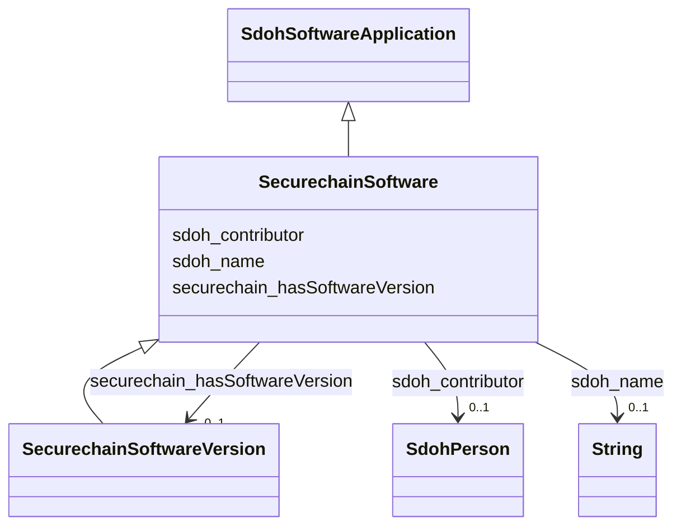

# Class: TODO -- what's a good name for this class (type)? (securechain_Software)


_No type description provided_


URI: [securechain:Software](https://w3id.org/secure-chain/Software)





## Inheritance
* [SdohSoftwareApplication](../classes/SdohSoftwareApplication.md)
    * **SecurechainSoftware**
        * [SecurechainSoftwareVersion](../classes/SecurechainSoftwareVersion.md)


## Slots

| Name | Cardinality and Range | Description | Inheritance |
| ---  | --- | --- | --- |
| [securechain_hasSoftwareVersion](../slots/securechain_hasSoftwareVersion.md) | 0..1 <br/> [SecurechainSoftwareVersion](../classes/SecurechainSoftwareVersion.md) | No slot description provided | direct |
| [sdoh_contributor](../slots/sdoh_contributor.md) | 0..1 <br/> [SdohPerson](../classes/SdohPerson.md) | No slot description provided | direct |
| [sdoh_name](../slots/sdoh_name.md) | 0..1 <br/> [xsd:string](xsd:string) | No slot description provided | direct |


## Examples

| Value |
| --- |
| securechain:Software/imlib1 |

## TODOs

* TODO -- Todos for this class go here
* or you can delete the todos
* if you think the class is perfect.

## Identifier and Mapping Information


### Schema Source


* from schema: secure-chain-kg


## Mappings

| Mapping Type | Mapped Value |
| ---  | ---  |
| self | securechain:Software |
| native | secure-chain-kg/:SecurechainSoftware |


## LinkML Source

<!-- TODO: investigate https://stackoverflow.com/questions/37606292/how-to-create-tabbed-code-blocks-in-mkdocs-or-sphinx -->

### Direct

<details>
```yaml
name: securechain_Software
description: No type description provided
title: TODO -- what's a good name for this class (type)?
todos:
- TODO -- Todos for this class go here
- or you can delete the todos
- if you think the class is perfect.
notes:
- Class with 34469 occurences.
examples:
- value: securechain:Software/imlib1
from_schema: secure-chain-kg
rank: 1000
is_a: sdoh_SoftwareApplication
slots:
- securechain_hasSoftwareVersion
- sdoh_contributor
- sdoh_name
class_uri: securechain:Software

```
</details>

### Induced

<details>
```yaml
name: securechain_Software
description: No type description provided
title: TODO -- what's a good name for this class (type)?
todos:
- TODO -- Todos for this class go here
- or you can delete the todos
- if you think the class is perfect.
notes:
- Class with 34469 occurences.
examples:
- value: securechain:Software/imlib1
from_schema: secure-chain-kg
rank: 1000
is_a: sdoh_SoftwareApplication
attributes:
  securechain_hasSoftwareVersion:
    name: securechain_hasSoftwareVersion
    description: No slot description provided
    todos:
    - TODO -- Todos for this slot go here
    - or you can delete the todos
    - if you think the class is perfect.
    comments:
    - 164001 occurrences with subject type securechain_Software and object type securechain_SoftwareVersion.
    examples:
    - value: securechain:Software/intel-vaapi-driver securechain:hasSoftwareVersion
        securechain:SoftwareVersion/intel-vaapi-driver#1.0.17-1
    from_schema: secure-chain-kg
    rank: 1000
    slot_uri: securechain:hasSoftwareVersion
    alias: securechain_hasSoftwareVersion
    owner: securechain_Software
    domain_of:
    - securechain_Software
    range: securechain_SoftwareVersion
  sdoh_contributor:
    name: sdoh_contributor
    description: No slot description provided
    todos:
    - TODO -- Todos for this slot go here
    - or you can delete the todos
    - if you think the class is perfect.
    comments:
    - 33048 occurrences with subject type securechain_Software and object type sdoh_Person.
    - 3668 occurrences with untyped subjects and object type http://schema.org/Person.
    examples:
    - value: securechain:Software/cuml sdoh:contributor schema:Person/minseokl
    - value: securechain:Software/velox sdoh:contributor schema:Person/DavidSGK
    from_schema: secure-chain-kg
    rank: 1000
    slot_uri: sdoh:contributor
    alias: sdoh_contributor
    owner: securechain_Software
    domain_of:
    - securechain_Software
    range: sdoh_Person
  sdoh_name:
    name: sdoh_name
    description: No slot description provided
    todos:
    - TODO -- Todos for this slot go here
    - or you can delete the todos
    - if you think the class is perfect.
    comments:
    - 53378 occurrences with subject type securechain_Hardware and object type string.
    - 22002 occurrences with subject type sdoh_Organization and object type string.
    - 34469 occurrences with subject type securechain_Software and object type string.
    - 20 occurrences with subject type sdoh_CreativeWork and object type string.
    examples:
    - value: securechain:Hardware/nvr1xxx sdoh:name nvr1xxx
    - value: schema:Organization/opencaching sdoh:name opencaching
    - value: securechain:Software/libdime sdoh:name libdime
    - value: securechain:License/mit sdoh:name MIT License
    from_schema: secure-chain-kg
    rank: 1000
    slot_uri: sdoh:name
    alias: sdoh_name
    owner: securechain_Software
    domain_of:
    - sdoh_CreativeWork
    - sdoh_Organization
    - securechain_Hardware
    - securechain_Software
    range: string
class_uri: securechain:Software

```
</details>