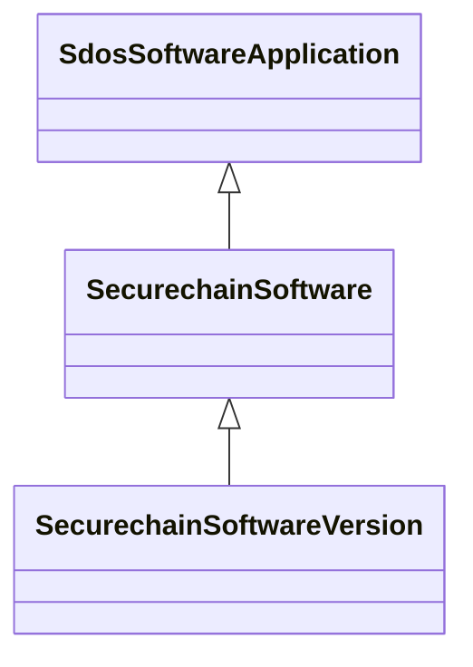

# Class: SecurechainSoftware


URI: [securechain:Software](https://w3id.org/secure-chain/Software)





## Inheritance
* [SdosThing](../classes/SdosThing.md)
    * [SdosCreativeWork](../classes/SdosCreativeWork.md)
        * [SdosSoftwareApplication](../classes/SdosSoftwareApplication.md)
            * **SecurechainSoftware**
                * [SecurechainSoftwareVersion](../classes/SecurechainSoftwareVersion.md)


## Slots

| Name | Cardinality and Range | Description | Inheritance | Occurrences |
| ---  | --- | --- | --- | --- |


## LinkML Source

<!-- TODO: investigate https://stackoverflow.com/questions/37606292/how-to-create-tabbed-code-blocks-in-mkdocs-or-sphinx -->

### Direct

<details>

```yaml
name: securechain_Software
from_schema: okns:secure-chain-kg
rank: 1000
is_a: sdos_SoftwareApplication
class_uri: securechain:Software

```
</details>

### Induced

<details>

```yaml
name: securechain_Software
from_schema: okns:secure-chain-kg
rank: 1000
is_a: sdos_SoftwareApplication
class_uri: securechain:Software

```
</details>