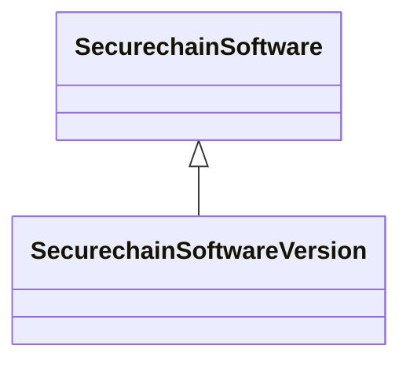

# Class: SecurechainSoftwareVersion


URI: [securechain:SoftwareVersion](https://w3id.org/secure-chain/SoftwareVersion)





## Inheritance
* [SdosThing](../classes/SdosThing.md)
    * [SdosCreativeWork](../classes/SdosCreativeWork.md)
        * [SdosSoftwareApplication](../classes/SdosSoftwareApplication.md)
            * [SecurechainSoftware](../classes/SecurechainSoftware.md)
                * **SecurechainSoftwareVersion**


## Slots

| Name | Cardinality and Range | Description | Inheritance | Occurrences |
| ---  | --- | --- | --- | --- |


## Usages

| used by | used in | type | used |
| ---  | --- | --- | --- |
| [SecurechainHardwareVersion](../classes/SecurechainHardwareVersion.md) | [securechain_vulnerableTo](../slots/securechain_vulnerableTo.md) | domain | [SecurechainSoftwareVersion](../classes/SecurechainSoftwareVersion.md) |


## LinkML Source

<!-- TODO: investigate https://stackoverflow.com/questions/37606292/how-to-create-tabbed-code-blocks-in-mkdocs-or-sphinx -->

### Direct

<details>

```yaml
name: securechain_SoftwareVersion
from_schema: okns:secure-chain-kg
rank: 1000
is_a: securechain_Software
class_uri: securechain:SoftwareVersion

```
</details>

### Induced

<details>

```yaml
name: securechain_SoftwareVersion
from_schema: okns:secure-chain-kg
rank: 1000
is_a: securechain_Software
class_uri: securechain:SoftwareVersion

```
</details>