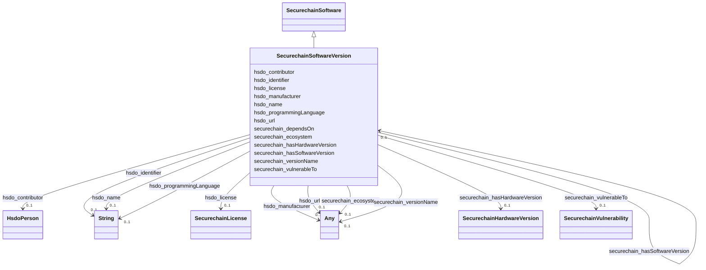

# Class: No class (entity type) name specified (securechain_SoftwareVersion)


_No class (type) description specified_


This class occurs 8593149 times.


URI: [securechain:SoftwareVersion](https://w3id.org/secure-chain/SoftwareVersion)





## Inheritance
* [HsdoSoftwareApplication](../classes/HsdoSoftwareApplication.md)
    * [SecurechainSoftware](../classes/SecurechainSoftware.md)
        * **SecurechainSoftwareVersion**


## Slots

| Name | Cardinality and Range | Description | Inheritance | Occurrences |
| ---  | --- | --- | --- | --- |
| [securechain_vulnerableTo](../slots/securechain_vulnerableTo.md) | 0..1 <br/> [SecurechainVulnerability](../classes/SecurechainVulnerability.md) | No slot (predicate) description specified <br/>  | direct | 383356 |
| [securechain_dependsOn](../slots/securechain_dependsOn.md) | 0..1 <br/> [SecurechainSoftwareVersion](../classes/SecurechainSoftwareVersion.md) | No slot (predicate) description specified <br/>  | direct | 29574574 |
| [securechain_versionName](../slots/securechain_versionName.md) | 0..1 <br/> [HsdoText](../classes/HsdoText.md)&nbsp;or&nbsp;<br />[xsd:string](http://www.w3.org/2001/XMLSchema#string) | No slot (predicate) description specified <br/>  | direct | 8593148 |
| [hsdo_url](../slots/hsdo_url.md) | 0..1 <br/> [xsd:string](http://www.w3.org/2001/XMLSchema#string)&nbsp;or&nbsp;<br />[xsd:anyURI](http://www.w3.org/2001/XMLSchema#anyURI) | No slot (predicate) description specified <br/>  | direct | 7733913 |
| [hsdo_license](../slots/hsdo_license.md) | 0..1 <br/> [SecurechainLicense](../classes/SecurechainLicense.md) | No slot (predicate) description specified <br/>  | direct | 5018025 |
| [hsdo_name](../slots/hsdo_name.md) | 0..1 <br/> [xsd:string](http://www.w3.org/2001/XMLSchema#string) | No slot (predicate) description specified | [SecurechainSoftware](../classes/SecurechainSoftware.md) |  |
| [hsdo_contributor](../slots/hsdo_contributor.md) | 0..1 <br/> [HsdoPerson](../classes/HsdoPerson.md) | No slot (predicate) description specified | [SecurechainSoftware](../classes/SecurechainSoftware.md) |  |
| [hsdo_identifier](../slots/hsdo_identifier.md) | 0..1 <br/> [xsd:string](http://www.w3.org/2001/XMLSchema#string) | No slot (predicate) description specified | [SecurechainSoftware](../classes/SecurechainSoftware.md) |  |
| [hsdo_programmingLanguage](../slots/hsdo_programmingLanguage.md) | 0..1 <br/> [xsd:string](http://www.w3.org/2001/XMLSchema#string) | No slot (predicate) description specified | [SecurechainSoftware](../classes/SecurechainSoftware.md) |  |
| [securechain_hasHardwareVersion](../slots/securechain_hasHardwareVersion.md) | 0..1 <br/> [SecurechainHardwareVersion](../classes/SecurechainHardwareVersion.md) | No slot (predicate) description specified | [SecurechainSoftware](../classes/SecurechainSoftware.md) |  |
| [securechain_ecosystem](../slots/securechain_ecosystem.md) | 0..1 <br/> [HsdoText](../classes/HsdoText.md)&nbsp;or&nbsp;<br />[xsd:string](http://www.w3.org/2001/XMLSchema#string) | No slot (predicate) description specified | [SecurechainSoftware](../classes/SecurechainSoftware.md) |  |
| [securechain_hasSoftwareVersion](../slots/securechain_hasSoftwareVersion.md) | 0..1 <br/> [SecurechainSoftwareVersion](../classes/SecurechainSoftwareVersion.md) | No slot (predicate) description specified | [SecurechainSoftware](../classes/SecurechainSoftware.md) |  |
| [hsdo_manufacturer](../slots/hsdo_manufacturer.md) | 0..1 <br/> [HsdoOrganization](../classes/HsdoOrganization.md)&nbsp;or&nbsp;<br />[SecurechainHardware](../classes/SecurechainHardware.md)&nbsp;or&nbsp;<br />[SecurechainSoftware](../classes/SecurechainSoftware.md) | No slot (predicate) description specified | [SecurechainSoftware](../classes/SecurechainSoftware.md) |  |


## Usages

| used by | used in | type | used |
| ---  | --- | --- | --- |
| [HsdoOrganization](../classes/HsdoOrganization.md) | [securechain_hasSoftwareVersion](../slots/securechain_hasSoftwareVersion.md) | range | [SecurechainSoftwareVersion](../classes/SecurechainSoftwareVersion.md) |
| [SecurechainHardware](../classes/SecurechainHardware.md) | [securechain_hasSoftwareVersion](../slots/securechain_hasSoftwareVersion.md) | range | [SecurechainSoftwareVersion](../classes/SecurechainSoftwareVersion.md) |
| [SecurechainHardwareVersion](../classes/SecurechainHardwareVersion.md) | [securechain_vulnerableTo](../slots/securechain_vulnerableTo.md) | domain | [SecurechainSoftwareVersion](../classes/SecurechainSoftwareVersion.md) |
| [SecurechainHardwareVersion](../classes/SecurechainHardwareVersion.md) | [securechain_hasSoftwareVersion](../slots/securechain_hasSoftwareVersion.md) | range | [SecurechainSoftwareVersion](../classes/SecurechainSoftwareVersion.md) |
| [SecurechainSoftware](../classes/SecurechainSoftware.md) | [securechain_hasSoftwareVersion](../slots/securechain_hasSoftwareVersion.md) | range | [SecurechainSoftwareVersion](../classes/SecurechainSoftwareVersion.md) |
| [SecurechainSoftwareVersion](../classes/SecurechainSoftwareVersion.md) | [securechain_vulnerableTo](../slots/securechain_vulnerableTo.md) | domain | [SecurechainSoftwareVersion](../classes/SecurechainSoftwareVersion.md) |
| [SecurechainSoftwareVersion](../classes/SecurechainSoftwareVersion.md) | [securechain_dependsOn](../slots/securechain_dependsOn.md) | domain | [SecurechainSoftwareVersion](../classes/SecurechainSoftwareVersion.md) |
| [SecurechainSoftwareVersion](../classes/SecurechainSoftwareVersion.md) | [securechain_dependsOn](../slots/securechain_dependsOn.md) | range | [SecurechainSoftwareVersion](../classes/SecurechainSoftwareVersion.md) |
| [SecurechainSoftwareVersion](../classes/SecurechainSoftwareVersion.md) | [securechain_hasSoftwareVersion](../slots/securechain_hasSoftwareVersion.md) | range | [SecurechainSoftwareVersion](../classes/SecurechainSoftwareVersion.md) |


## LinkML Source

<!-- TODO: investigate https://stackoverflow.com/questions/37606292/how-to-create-tabbed-code-blocks-in-mkdocs-or-sphinx -->

### Direct

<details>

```yaml
name: securechain_SoftwareVersion
conforms_to: No schema conformance document specified
annotations:
  count:
    tag: count
    value: 8593149
description: No class (type) description specified
title: No class (entity type) name specified
from_schema: secure-chain-kg
rank: 1000
is_a: securechain_Software
slots:
- securechain_vulnerableTo
- securechain_dependsOn
- securechain_versionName
- hsdo_url
- hsdo_license
slot_usage:
  hsdo_license:
    name: hsdo_license
    annotations:
      securechain_License:
        tag: securechain_License
        value: 5018025
  hsdo_url:
    name: hsdo_url
    annotations:
      string:
        tag: string
        value: 7733913
  securechain_dependsOn:
    name: securechain_dependsOn
    annotations:
      securechain_SoftwareVersion:
        tag: securechain_SoftwareVersion
        value: 29574574
  securechain_versionName:
    name: securechain_versionName
    annotations:
      string:
        tag: string
        value: 8593148
  securechain_vulnerableTo:
    name: securechain_vulnerableTo
    annotations:
      securechain_Vulnerability:
        tag: securechain_Vulnerability
        value: 383356
class_uri: securechain:SoftwareVersion

```
</details>

### Induced

<details>

```yaml
name: securechain_SoftwareVersion
conforms_to: No schema conformance document specified
annotations:
  count:
    tag: count
    value: 8593149
description: No class (type) description specified
title: No class (entity type) name specified
from_schema: secure-chain-kg
rank: 1000
is_a: securechain_Software
slot_usage:
  hsdo_license:
    name: hsdo_license
    annotations:
      securechain_License:
        tag: securechain_License
        value: 5018025
  hsdo_url:
    name: hsdo_url
    annotations:
      string:
        tag: string
        value: 7733913
  securechain_dependsOn:
    name: securechain_dependsOn
    annotations:
      securechain_SoftwareVersion:
        tag: securechain_SoftwareVersion
        value: 29574574
  securechain_versionName:
    name: securechain_versionName
    annotations:
      string:
        tag: string
        value: 8593148
  securechain_vulnerableTo:
    name: securechain_vulnerableTo
    annotations:
      securechain_Vulnerability:
        tag: securechain_Vulnerability
        value: 383356
attributes:
  securechain_vulnerableTo:
    name: securechain_vulnerableTo
    annotations:
      securechain_Vulnerability:
        tag: securechain_Vulnerability
        value: 383356
    description: No slot (predicate) description specified
    title: No slot (predicate) name specified
    examples:
    - object:
        example_object: https://nvd.nist.gov/vuln/detail/CVE-2017-12966
        example_object_type: securechain_Vulnerability
        example_predicate: securechain:vulnerableTo
        example_subject: https://conan.io/center/recipes/asn1c?version=0.9.28
        example_subject_type: securechain_SoftwareVersion
    - object:
        example_object: https://nvd.nist.gov/vuln/detail/CVE-2019-0162
        example_object_type: securechain_Vulnerability
        example_predicate: securechain:vulnerableTo
        example_subject: https://www.google.com/search?q=-+-
        example_subject_type: securechain_HardwareVersion
    from_schema: secure-chain-kg
    rank: 1000
    domain: securechain_SoftwareVersion
    slot_uri: securechain:vulnerableTo
    alias: securechain_vulnerableTo
    owner: securechain_SoftwareVersion
    domain_of:
    - securechain_HardwareVersion
    - securechain_SoftwareVersion
    range: securechain_Vulnerability
  securechain_dependsOn:
    name: securechain_dependsOn
    annotations:
      securechain_SoftwareVersion:
        tag: securechain_SoftwareVersion
        value: 29574574
    description: No slot (predicate) description specified
    title: No slot (predicate) name specified
    examples:
    - object:
        example_object: https://conan.io/center/recipes/taocpp-json?version=1.0.0-beta.14
        example_object_type: securechain_SoftwareVersion
        example_predicate: securechain:dependsOn
        example_subject: https://conan.io/center/recipes/7bitconf?version=1.0.0
        example_subject_type: securechain_SoftwareVersion
    - object:
        example_object: https://www.google.com/search?q=arduinojson+*
        example_object_type: securechain_SoftwareVersion
        example_predicate: securechain:dependsOn
        example_subject: https://github.com/ArduinoJson/releases/tag/v4.0
        example_subject_type: None
    from_schema: secure-chain-kg
    rank: 1000
    domain: securechain_SoftwareVersion
    slot_uri: securechain:dependsOn
    alias: securechain_dependsOn
    owner: securechain_SoftwareVersion
    domain_of:
    - securechain_SoftwareVersion
    range: securechain_SoftwareVersion
  securechain_versionName:
    name: securechain_versionName
    annotations:
      string:
        tag: string
        value: 8593148
    description: No slot (predicate) description specified
    title: No slot (predicate) name specified
    examples:
    - object:
        example_object: 1.0.0
        example_object_type: string
        example_predicate: securechain:versionName
        example_subject: https://conan.io/center/recipes/7bitconf?version=1.0.0
        example_subject_type: securechain_SoftwareVersion
    - object:
        example_object: '-'
        example_object_type: string
        example_predicate: securechain:versionName
        example_subject: https://www.google.com/search?q=-+-
        example_subject_type: securechain_HardwareVersion
    from_schema: secure-chain-kg
    rank: 1000
    domain: __Bcfd3c14c389f3c8ba32c30498a1d8b29
    slot_uri: securechain:versionName
    alias: securechain_versionName
    owner: securechain_SoftwareVersion
    domain_of:
    - securechain_HardwareVersion
    - securechain_SoftwareVersion
    range: Any
    any_of:
    - range: hsdo_Text
    - range: string
  hsdo_url:
    name: hsdo_url
    annotations:
      string:
        tag: string
        value: 7733913
    description: No slot (predicate) description specified
    examples:
    - object:
        example_object: https://github.com/ddddddeon/a
        example_object_type: string
        example_predicate: hsdo:url
        example_subject: https://crates.io/crates/a-gpt/0.1.0/
        example_subject_type: securechain_SoftwareVersion
    - object:
        example_object: '[''https://1password.com'', ''http://1passwd.com'', ''https://1password.com/zh-tw'',
          ''https://1password.com/zh-cn'']'
        example_object_type: uri
        example_predicate: hsdo:url
        example_subject: https://www.google.com/search?q=1Password
        example_subject_type: hsdo_Organization
    - object:
        example_object: '[]'
        example_object_type: uri
        example_predicate: hsdo:url
        example_subject: https://www.google.com/search?q=Kernel
        example_subject_type: securechain_Software
    from_schema: secure-chain-kg
    rank: 1000
    slot_uri: hsdo:url
    alias: hsdo_url
    owner: securechain_SoftwareVersion
    domain_of:
    - hsdo_Organization
    - securechain_Software
    - securechain_SoftwareVersion
    range: Any
    any_of:
    - range: string
    - range: uri
  hsdo_license:
    name: hsdo_license
    annotations:
      securechain_License:
        tag: securechain_License
        value: 5018025
    description: No slot (predicate) description specified
    examples:
    - object:
        example_object: https://spdx.org/licenses/BSD-3-Clause.html
        example_object_type: securechain_License
        example_predicate: hsdo:license
        example_subject: https://crates.io/crates/a-bot/0.0.1/
        example_subject_type: securechain_SoftwareVersion
    from_schema: secure-chain-kg
    rank: 1000
    slot_uri: hsdo:license
    alias: hsdo_license
    owner: securechain_SoftwareVersion
    domain_of:
    - securechain_SoftwareVersion
    range: securechain_License
  hsdo_name:
    name: hsdo_name
    annotations:
      string:
        tag: string
        value: 803744
    description: No slot (predicate) description specified
    examples:
    - object:
        example_object: 0----0
        example_object_type: string
        example_predicate: hsdo:name
        example_subject: https://github.com/0----0
        example_subject_type: hsdo_Person
    - object:
        example_object: Permission to use, copy, modify, and/or distribute this software
          for any
        example_object_type: string
        example_predicate: hsdo:name
        example_subject: https://spdx.org/licenses/0bsd.html
        example_subject_type: securechain_License
    - object:
        example_object: 2n
        example_object_type: string
        example_predicate: hsdo:name
        example_subject: https://www.google.com/search?q=2n
        example_subject_type: hsdo_Organization
    - object:
        example_object: '360'
        example_object_type: string
        example_predicate: hsdo:name
        example_subject: https://www.google.com/search?q=360
        example_subject_type: securechain_Hardware
    - object:
        example_object: amd
        example_object_type: string
        example_predicate: hsdo:name
        example_subject: https://www.google.com/search?q=amd
        example_subject_type: securechain_Software
    from_schema: secure-chain-kg
    rank: 1000
    slot_uri: hsdo:name
    alias: hsdo_name
    owner: securechain_SoftwareVersion
    domain_of:
    - hsdo_Organization
    - hsdo_Person
    - securechain_Hardware
    - securechain_License
    - securechain_Software
    range: string
  hsdo_contributor:
    name: hsdo_contributor
    annotations:
      hsdo_Person:
        tag: hsdo_Person
        value: 32408
    description: No slot (predicate) description specified
    examples:
    - object:
        example_object: https://github.com/0vercl0k
        example_object_type: hsdo_Person
        example_predicate: hsdo:contributor
        example_subject: https://github.com/0vercl0k/rp
        example_subject_type: securechain_Software
    from_schema: secure-chain-kg
    rank: 1000
    slot_uri: hsdo:contributor
    alias: hsdo_contributor
    owner: securechain_SoftwareVersion
    domain_of:
    - securechain_Software
    range: hsdo_Person
  hsdo_identifier:
    name: hsdo_identifier
    annotations:
      string:
        tag: string
        value: 4
    description: No slot (predicate) description specified
    examples:
    - object:
        example_object: CWE-1
        example_object_type: string
        example_predicate: hsdo:identifier
        example_subject: https://cwe.mitre.org/data/definitions/1.html
        example_subject_type: securechain_VulnerabilityType
    - object:
        example_object: CVE-1999-0060
        example_object_type: string
        example_predicate: hsdo:identifier
        example_subject: https://nvd.nist.gov/vuln/detail/CVE-1999-0060
        example_subject_type: securechain_Vulnerability
    - object:
        example_object: (Apache-2.0
        example_object_type: string
        example_predicate: hsdo:identifier
        example_subject: https://spdx.org/licenses/%28Apache-2.0.html
        example_subject_type: securechain_License
    - object:
        example_object: Q2150861
        example_object_type: string
        example_predicate: hsdo:identifier
        example_subject: https://www.google.com/search?q=1Password
        example_subject_type: hsdo_Organization
    - object:
        example_object: Q202400
        example_object_type: string
        example_predicate: hsdo:identifier
        example_subject: https://www.google.com/search?q=Kernel
        example_subject_type: securechain_Software
    from_schema: secure-chain-kg
    rank: 1000
    slot_uri: hsdo:identifier
    alias: hsdo_identifier
    owner: securechain_SoftwareVersion
    domain_of:
    - hsdo_Organization
    - securechain_License
    - securechain_Software
    - securechain_Vulnerability
    - securechain_VulnerabilityType
    range: string
  hsdo_programmingLanguage:
    name: hsdo_programmingLanguage
    annotations:
      string:
        tag: string
        value: 803747
    description: No slot (predicate) description specified
    examples:
    - object:
        example_object: C/C++
        example_object_type: string
        example_predicate: hsdo:programmingLanguage
        example_subject: https://www.google.com/search?q=amd
        example_subject_type: securechain_Software
    - object:
        example_object: C/C++
        example_object_type: string
        example_predicate: hsdo:programmingLanguage
        example_subject: https://www.google.com/search?q=st
        example_subject_type: securechain_Hardware
    from_schema: secure-chain-kg
    rank: 1000
    slot_uri: hsdo:programmingLanguage
    alias: hsdo_programmingLanguage
    owner: securechain_SoftwareVersion
    domain_of:
    - hsdo_Organization
    - securechain_Hardware
    - securechain_Software
    range: string
  securechain_hasHardwareVersion:
    name: securechain_hasHardwareVersion
    annotations:
      securechain_HardwareVersion:
        tag: securechain_HardwareVersion
        value: 24
    description: No slot (predicate) description specified
    title: No slot (predicate) name specified
    examples:
    - object:
        example_object: https://www.google.com/search?q=360+-
        example_object_type: securechain_HardwareVersion
        example_predicate: securechain:hasHardwareVersion
        example_subject: https://www.google.com/search?q=360
        example_subject_type: hsdo_Organization
    - object:
        example_object: https://www.google.com/search?q=360+-
        example_object_type: securechain_HardwareVersion
        example_predicate: securechain:hasHardwareVersion
        example_subject: https://www.google.com/search?q=360
        example_subject_type: securechain_Hardware
    - object:
        example_object: https://www.google.com/search?q=st+14.2
        example_object_type: securechain_HardwareVersion
        example_predicate: securechain:hasHardwareVersion
        example_subject: https://www.google.com/search?q=st
        example_subject_type: securechain_Software
    from_schema: secure-chain-kg
    rank: 1000
    domain: securechain_Hardware
    slot_uri: securechain:hasHardwareVersion
    alias: securechain_hasHardwareVersion
    owner: securechain_SoftwareVersion
    domain_of:
    - hsdo_Organization
    - securechain_Hardware
    - securechain_Software
    range: securechain_HardwareVersion
  securechain_ecosystem:
    name: securechain_ecosystem
    annotations:
      string:
        tag: string
        value: 803747
    description: No slot (predicate) description specified
    title: No slot (predicate) name specified
    examples:
    - object:
        example_object: Unknown
        example_object_type: string
        example_predicate: securechain:ecosystem
        example_subject: https://www.google.com/search?q=amd
        example_subject_type: securechain_Software
    - object:
        example_object: Unknown
        example_object_type: string
        example_predicate: securechain:ecosystem
        example_subject: https://www.google.com/search?q=st
        example_subject_type: securechain_Hardware
    from_schema: secure-chain-kg
    rank: 1000
    domain: securechain_Software
    slot_uri: securechain:ecosystem
    alias: securechain_ecosystem
    owner: securechain_SoftwareVersion
    domain_of:
    - hsdo_Organization
    - securechain_Hardware
    - securechain_Software
    range: Any
    any_of:
    - range: hsdo_Text
    - range: string
  securechain_hasSoftwareVersion:
    name: securechain_hasSoftwareVersion
    annotations:
      securechain_SoftwareVersion:
        tag: securechain_SoftwareVersion
        value: 8593149
    description: No slot (predicate) description specified
    title: No slot (predicate) name specified
    examples:
    - object:
        example_object: https://www.google.com/search?q=amd+64
        example_object_type: securechain_SoftwareVersion
        example_predicate: securechain:hasSoftwareVersion
        example_subject: https://www.google.com/search?q=amd
        example_subject_type: hsdo_Organization
    - object:
        example_object: https://www.google.com/search?q=amd+64
        example_object_type: securechain_SoftwareVersion
        example_predicate: securechain:hasSoftwareVersion
        example_subject: https://www.google.com/search?q=amd
        example_subject_type: securechain_Software
    - object:
        example_object: https://www.google.com/search?q=st+*
        example_object_type: securechain_SoftwareVersion
        example_predicate: securechain:hasSoftwareVersion
        example_subject: https://www.google.com/search?q=st
        example_subject_type: securechain_Hardware
    from_schema: secure-chain-kg
    rank: 1000
    domain: securechain_Software
    slot_uri: securechain:hasSoftwareVersion
    alias: securechain_hasSoftwareVersion
    owner: securechain_SoftwareVersion
    domain_of:
    - hsdo_Organization
    - securechain_Hardware
    - securechain_Software
    range: securechain_SoftwareVersion
  hsdo_manufacturer:
    name: hsdo_manufacturer
    annotations:
      hsdo_Organization:
        tag: hsdo_Organization
        value: 26
      securechain_Software:
        tag: securechain_Software
        value: 1
    description: No slot (predicate) description specified
    examples:
    - object:
        example_object: https://www.google.com/search?q=hp
        example_object_type: hsdo_Organization
        example_predicate: hsdo:manufacturer
        example_subject: https://www.google.com/search?q=360
        example_subject_type: hsdo_Organization
    - object:
        example_object: https://www.google.com/search?q=hp
        example_object_type: hsdo_Organization
        example_predicate: hsdo:manufacturer
        example_subject: https://www.google.com/search?q=360
        example_subject_type: securechain_Hardware
    - object:
        example_object: https://www.google.com/search?q=arduino
        example_object_type: securechain_Hardware
        example_predicate: hsdo:manufacturer
        example_subject: https://www.google.com/search?q=arduino
        example_subject_type: hsdo_Organization
    - object:
        example_object: https://www.google.com/search?q=arduino
        example_object_type: securechain_Hardware
        example_predicate: hsdo:manufacturer
        example_subject: https://www.google.com/search?q=arduino
        example_subject_type: securechain_Hardware
    - object:
        example_object: https://www.google.com/search?q=amd
        example_object_type: securechain_Software
        example_predicate: hsdo:manufacturer
        example_subject: https://www.google.com/search?q=milan
        example_subject_type: hsdo_Organization
    - object:
        example_object: https://www.google.com/search?q=amd
        example_object_type: securechain_Software
        example_predicate: hsdo:manufacturer
        example_subject: https://www.google.com/search?q=milan
        example_subject_type: securechain_Hardware
    - object:
        example_object: https://www.google.com/search?q=mitel
        example_object_type: hsdo_Organization
        example_predicate: hsdo:manufacturer
        example_subject: https://www.google.com/search?q=st
        example_subject_type: securechain_Software
    - object:
        example_object: https://www.google.com/search?q=oculus
        example_object_type: securechain_Software
        example_predicate: hsdo:manufacturer
        example_subject: https://www.google.com/search?q=rift
        example_subject_type: securechain_Software
    from_schema: secure-chain-kg
    rank: 1000
    slot_uri: hsdo:manufacturer
    alias: hsdo_manufacturer
    owner: securechain_SoftwareVersion
    domain_of:
    - hsdo_Organization
    - securechain_Hardware
    - securechain_Software
    range: Any
    any_of:
    - range: hsdo_Organization
    - range: securechain_Hardware
    - range: securechain_Software
class_uri: securechain:SoftwareVersion

```
</details>