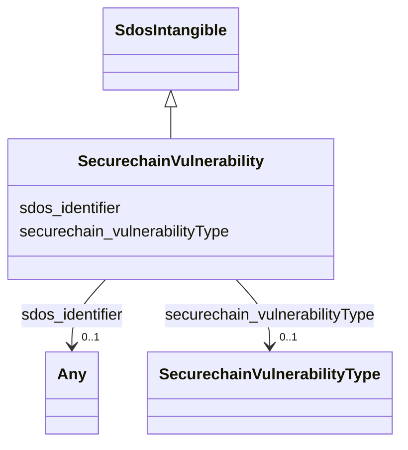

# Class: SecurechainVulnerability


This class occurs 259806 times.


URI: [securechain:Vulnerability](https://w3id.org/secure-chain/Vulnerability)





## Inheritance
* [SdosThing](../classes/SdosThing.md)
    * [SdosIntangible](../classes/SdosIntangible.md)
        * **SecurechainVulnerability**


## Slots

| Name | Cardinality and Range | Description | Inheritance | Occurrences |
| ---  | --- | --- | --- | --- |
| [sdos_identifier](../slots/sdos_identifier.md) | 0..1 <br/> [SdosURL](../classes/SdosURL.md)&nbsp;or&nbsp;<br />[SdosPropertyValue](../classes/SdosPropertyValue.md)&nbsp;or&nbsp;<br />[SdosText](../classes/SdosText.md) | The identifier property represents any kind of identifier for any kind of [[T... <br/>  | direct | 259806 |
| [securechain_vulnerabilityType](../slots/securechain_vulnerabilityType.md) | 0..1 <br/> [SecurechainVulnerabilityType](../classes/SecurechainVulnerabilityType.md) |  <br/>  | direct | 177404 |


## Usages

| used by | used in | type | used |
| ---  | --- | --- | --- |
| [SecurechainHardwareVersion](../classes/SecurechainHardwareVersion.md) | [securechain_vulnerableTo](../slots/securechain_vulnerableTo.md) | range | [SecurechainVulnerability](../classes/SecurechainVulnerability.md) |
| [SecurechainSoftwareVersion](../classes/SecurechainSoftwareVersion.md) | [securechain_vulnerableTo](../slots/securechain_vulnerableTo.md) | range | [SecurechainVulnerability](../classes/SecurechainVulnerability.md) |
| [SecurechainVulnerability](../classes/SecurechainVulnerability.md) | [securechain_vulnerabilityType](../slots/securechain_vulnerabilityType.md) | domain | [SecurechainVulnerability](../classes/SecurechainVulnerability.md) |


## LinkML Source

<!-- TODO: investigate https://stackoverflow.com/questions/37606292/how-to-create-tabbed-code-blocks-in-mkdocs-or-sphinx -->

### Direct

<details>

```yaml
name: securechain_Vulnerability
from_schema: okns:secure-chain-kg
rank: 1000
is_a: sdos_Intangible
slots:
- sdos_identifier
- securechain_vulnerabilityType
class_uri: securechain:Vulnerability

```
</details>

### Induced

<details>

```yaml
name: securechain_Vulnerability
from_schema: okns:secure-chain-kg
rank: 1000
is_a: sdos_Intangible
attributes:
  sdos_identifier:
    name: sdos_identifier
    description: The identifier property represents any kind of identifier for any
      kind of [[Thing]], such as ISBNs, GTIN codes, UUIDs etc. Schema.org provides
      dedicated properties for representing many of these, either as textual strings
      or as URL (URI) links. See [background notes](/docs/datamodel.html#identifierBg)
      for more details.
    title: identifier
    notes:
    - No occurrences of this slot in the graph.
    from_schema: okns:sdo
    exact_mappings:
    - http://purl.org/dc/terms/identifier
    domain: sdos_Thing
    slot_uri: sdos:identifier
    alias: sdos_identifier
    owner: securechain_Vulnerability
    domain_of:
    - securechain_License
    - securechain_Software
    - securechain_Vulnerability
    - securechain_VulnerabilityType
    range: Any
    any_of:
    - range: sdos_URL
    - range: sdos_PropertyValue
    - range: sdos_Text
  securechain_vulnerabilityType:
    name: securechain_vulnerabilityType
    from_schema: okns:secure-chain-kg
    rank: 1000
    domain: securechain_Vulnerability
    slot_uri: securechain:vulnerabilityType
    alias: securechain_vulnerabilityType
    owner: securechain_Vulnerability
    domain_of:
    - securechain_Vulnerability
    range: securechain_VulnerabilityType
class_uri: securechain:Vulnerability

```
</details>